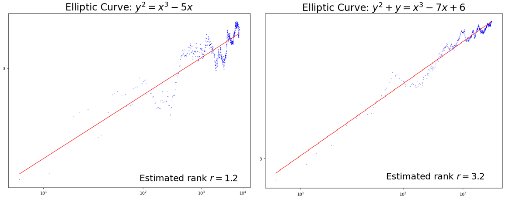

### **NOTES ON STATISTICS, PROBABILITY and MATHEMATICS**

<a href="http://rinterested.github.io/statistics/index.html">
</a>

---

### Birch Swinnerton Dyer Conjecture:

---


**1. The L-function and its Euler Product:**

* The L-function of an elliptic curve $E$ is defined as an Euler product:

     $$L(s, E) = \prod_{p} L_p(s, E)^{-1}$$
     This denotes the L-function of the elliptic curve $E$, evaluated at the complex variable $s$, where $p$ runs over all prime numbers, and $L_p(s, E)$ are local factors.
     
* The local factors $L_p(s, E)$ are related to the number of points on the elliptic curve $E$ over the finite field $\mathbb{F}_p$, denoted as $|E(\mathbb{F}_p)|$.

* Specifically, for primes $p$ where $E$ has good reduction, 

$$L_p(s, E) = 1 - \frac{a_p}{p^{s}} + p^{1-2s}$$ 

where 

$$a_p = p + 1 - |E(\mathbb{F}_p)|$$


We can express $|E(\mathbb{F}_p)|$ as:

$$|E(\mathbb{F}_p)| = p + 1 - a_p$$

Now, consider the fraction $\frac{|E(\mathbb{F}_p)|}{p}$:

$$\frac{|E(\mathbb{F}_p)|}{p} = \frac{p + 1 - a_p}{p} = 1 + \frac{1}{p} - \frac{a_p}{p}$$


**2. The Connection to Cardinalities:**

* The quantity $|E(\mathbb{F}_p)|/p$ is closely related to the local factor $L_p(s, E)$.

* When we consider the product $\prod_{p \le x} |E(\mathbb{F}_p)|/p$, we're essentially approximating a part of the Euler product representation of $L(s, E)$.

* The BSD conjecture, in its refined form, relates the behavior of $L(s, E)$ at $s=1$ to the arithmetic properties of the elliptic curve.

* The conjecture suggests that the growth rate of the product $\prod_{p \le x} |E(\mathbb{F}_p)|/p$ as $x$ increases is related to the rank of the elliptic curve.

**3. The Heuristic Approach:**

* If the rank of $E$ is $r$, the BSD conjecture suggests that the product $\prod_{p \le x} |E(\mathbb{F}_p)|/p$ should grow roughly like $C (\log x)^r$ for some constant $C$:

$$\prod_{p \le x} |E(\mathbb{F}_p)|/p \approx C (\log x)^r$$

* Therefore, by computing this product for increasing values of $x$ and observing its growth rate, we can get an estimate of the rank $r$.


$$\log\left(\Pi_{p \leq X}\; \frac {N_p}p \right)=\log C + r\; \log\left (\log X\right)$$




**4. Approximating $L_p(1, E)$:**

We are interested in the behavior of $L(s, E)$ at $s=1$. Let's evaluate $L_p(s, E)$ at $s=1$:

$$L_p(1, E) = 1 - \frac{a_p}{p^{s}} + p^{1-2} = 1 - \frac{a_p}{p} + \frac{1}{p}$$

Notice that:

$L_p(1, E) = \frac{|E(\mathbb{F}_p)|}{p}$

Therefore:

$$L(1, E) = \prod_{p} \frac{1}{\frac{|E(\mathbb{F}_p)|}{p}} = \prod_{p} \frac{p}{|E(\mathbb{F}_p)|}$$

Then, the inverse of that would be:

$1/L(1,E) = \prod_{p} \frac{|E(\mathbb{F}_p)|}{p}$

**5. The Partial Product:**

When we consider the product $\prod_{p \le x} \frac{|E(\mathbb{F}_p)|}{p}$, we are essentially taking a partial product of the Euler product representation of $1/L(1,E)$.

* As $x$ increases, this partial product gets closer to the actual value of $1/L(1, E)$.
* The BSD conjecture then relates the behavior of $L(1, E)$ (and hence its reciprocal) to the rank of the elliptic curve.
* Thus, the growth rate of this partial product gives us information about the behavior of $L(1, E)$ and consequently the rank.

**In summary:**

* The local factors $L_p(1, E)$ are directly related to the fraction $\frac{|E(\mathbb{F}_p)|}{p}$.
* The product $\prod_{p \le x} \frac{|E(\mathbb{F}_p)|}{p}$ is a partial product of the Euler product representation of $1/L(1, E)$.
* By studying the growth of this partial product, we can approximate the behavior of $L(1, E)$ and gain insight into the rank of the elliptic curve.

**6. Why $L_p(s, E) = 1 - a_p p^{-s} + p^{1-2s}$:**

* Consider the zeta function of the elliptic curve $E$ over $\mathbb{F}_p$:

$$Z(T, E/\mathbb{F}_p) = \exp\left(\sum_{n=1}^\infty \frac{|E(\mathbb{F}_{p^n})|}{n}T^n\right)$$

where $T$ is an auxiliary variable - a formal variable used to encode information about the number of points on the elliptic curve $E$ over finite field extensions of $E(\mathbb{F}_{p}$.

This zeta function encodes information about the number of points on $E$ over all finite extensions of $\mathbb{F}_p$.

It can be shown that the zeta function is a rational function of the form:

$$Z(T, E/\mathbb{F}_p) = \frac{1 - a_p T + pT^2}{(1-T)(1-pT)}$$

This is a key result from the theory of elliptic curves over finite fields.

The local factor $L_p(s, E)$ is related to the numerator of the zeta function:

$$L_p(s, E) = 1 - a_p p^{-s} + p^{1-2s}$$

To see this, make the substitution $T = p^{-s}$ in the numerator of the zeta function:


$$1 - a_p T + pT^2 = 1 - a_p p^{-s} + p (p^{-s})^2 = 1 - a_p p^{-s} + p^{1-2s}$$

* The term $1$ represents the contribution of the identity element (the point at infinity).
* The term $-a_p p^{-s}$ is related to the deviation of $|E(\mathbb{F}_p)|$ from the expected value of $p+1$.
* The term $p^{1-2s}$ arises from the properties of the zeta function and the fact that the elliptic curve is a one-dimensional object.

**6. The BSD conjecture:**

The Birch and Swinnerton-Dyer (BSD) conjecture, when focused on the first term of the L-function's Taylor series expansion around $s=1$ (i.e., $L(1)$), can be stated as follows:

**Simplified BSD Conjecture (Focusing on L(1)):**

"Let $E$ be an elliptic curve defined over the rational numbers $\mathbb{Q}$, and let $L(s, E)$ be its L-function. Then:

* If $L(1, E) \neq 0$, then the group of rational points $E(\mathbb{Q})$ is finite (i.e., the rank of $E$ is 0).
* If $L(1, E) = 0$, then the group of rational points $E(\mathbb{Q})$ is infinite (i.e., the rank of $E$ is greater than or equal to 1)."

**More Precise Statement:**

"Let $E$ be an elliptic curve defined over $\mathbb{Q}$, and let $r$ be the rank of the Mordell-Weil group $E(\mathbb{Q})$. Let $L(s, E)$ be the L-function of $E$. Then, the order of vanishing of $L(s, E)$ at $s=1$ is equal to $r$.

In particular:

* $L(1, E) = 0$ if and only if $r > 0$.
* $L(1, E) \neq 0$ if and only if $r = 0$."

**Key Points:**

* The BSD conjecture links the analytic behavior of the L-function at $s=1$ to the arithmetic properties of the elliptic curve, specifically its rank.
* The condition $L(1, E) = 0$ is a necessary and sufficient condition for the elliptic curve to have infinitely many rational points.
* The more general BSD conjecture goes further, relating the derivatives of $L(s, E)$ at $s=1$ to other arithmetic invariants of the elliptic curve, such as the Tate-Shafarevich group and the regulator.
* When we only consider wether L(1) is zero or not, we are only looking at the very first step of the full BSD conjecture.

**In simpler terms:**

* If the first term of the L-function (L(1)) is zero, it means the elliptic curve has infinitely many rational solutions.
* If the first term is not zero, the elliptic curve has only a finite number of rational solutions.

In sagemath the curves plotted above are [800.e1](https://www.lmfdb.org/EllipticCurve/Q/800/e/1):

```
# Define the elliptic curve over the rational numbers
E = EllipticCurve([-5, 0])

# Print the elliptic curve
print("Elliptic curve defined by y^2 = x^3 - 5x over Q:")
print(E)

# Find the rank of the elliptic curve
rank = E.rank()
print("The rank of the elliptic curve y^2 = x^3 - 5x over Q is:", rank)

# Find the points of finite order (torsion points)
torsion_points = E.torsion_points()
print("Torsion points on the elliptic curve:")
for point in torsion_points:
    print(point)

# Find the generators of the Mordell-Weil group
generators = E.gens()
print("Generators of the Mordell-Weil group:")
for gen in generators:
    print(gen)

E = EllipticCurve([-5, 0])
L = E.lseries()

L_at_1 = L(1)
print(L_at_1)

Lfunc = L.taylor_series(1,4)
print(Lfunc)

---

Elliptic curve defined by y^2 = x^3 - 5x over Q:
Elliptic Curve defined by y^2 = x^3 - 5*x over Rational Field
The rank of the elliptic curve y^2 = x^3 - 5x over Q is: 1
Torsion points on the elliptic curve:
(0 : 1 : 0)
(0 : 0 : 1)
Generators of the Mordell-Weil group:
(-1 : 2 : 1)
0.000000000000000
0.00 + 2.2*z - 2.0*z^2 + 0.56*z^3 + 1.0*z^4 - 1.6*z^5 + O(z^6)
```
* **L(1) = 0.0000000000000000.00:**
    * This value, obtained from `L(1)`, represents the value of the L-function of the elliptic curve at $s=1$.
    * The fact that it is essentially zero (within the numerical precision of SageMath) is a crucial piece of information.
* **BSD Conjecture and Rank:**
    * According to the Birch and Swinnerton-Dyer (BSD) conjecture, the order of vanishing of the L-function at $s=1$ is equal to the rank of the elliptic curve.
    * Since $L(1) = 0$, this implies that the L-function has a zero at $s=1$.
    * Therefore, the rank of the elliptic curve must be at least 1.
* **Taylor Series:**
    * The output `0.00 + 2.2*z - 2.0*z^2 + 0.56*z^3 + 1.0*z^4 - 1.6*z^5 + O(z^6)` is the taylor series expansion of the L-function around s=1.
    * SageMath is using the variable z to represent (s-1).
    * Because the first term is zero, it confirms that the L-function vanishes at s=1.
    * The next non-zero term is 2.2 * z, which is 2.2 * (s-1)^1, which confirms that the order of vanishing is 1, and therefore the rank is 1.
    
and [5077.a1](https://www.lmfdb.org/EllipticCurve/Q/5077/a/1):

```
# Define the elliptic curve over the rational numbers
E = EllipticCurve([0, 0, 1, -7, 6])

print(E)

# Find the rank of the elliptic curve
rank = E.rank()
print("The rank of the elliptic curve y^2 = x^3 - 5x over Q is:", rank)

# Find the points of finite order (torsion points)
torsion_points = E.torsion_points()
print("Torsion points on the elliptic curve:")
for point in torsion_points:
    print(point)

# Find the generators of the Mordell-Weil group
generators = E.gens()
print("Generators of the Mordell-Weil group:")
for gen in generators:
    print(gen)

E = EllipticCurve([-5, 0])
L = E.lseries()

L_at_1 = L(1)
print(L_at_1)

Lfunc = L.taylor_series(1,4)
print(Lfunc)

---

Elliptic Curve defined by y^2 + y = x^3 - 7*x + 6 over Rational Field
The rank of the elliptic curve y^2 = x^3 - 5x over Q is: 3
Torsion points on the elliptic curve:
(0 : 1 : 0)
Generators of the Mordell-Weil group:
(-2 : 3 : 1)
(-7/4 : 25/8 : 1)
(1 : -1 : 1)
0.000000000000000
0.00 + 2.2*z - 2.0*z^2 + 0.56*z^3 + 1.0*z^4 - 1.6*z^5 + O(z^6)
```


---
<a href="http://rinterested.github.io/statistics/index.html">Home Page</a>

**NOTE: These are tentative notes on different topics for personal use - expect mistakes and misunderstandings.**
