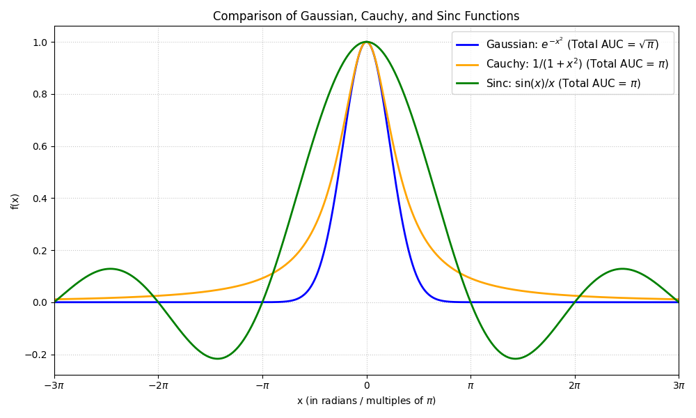
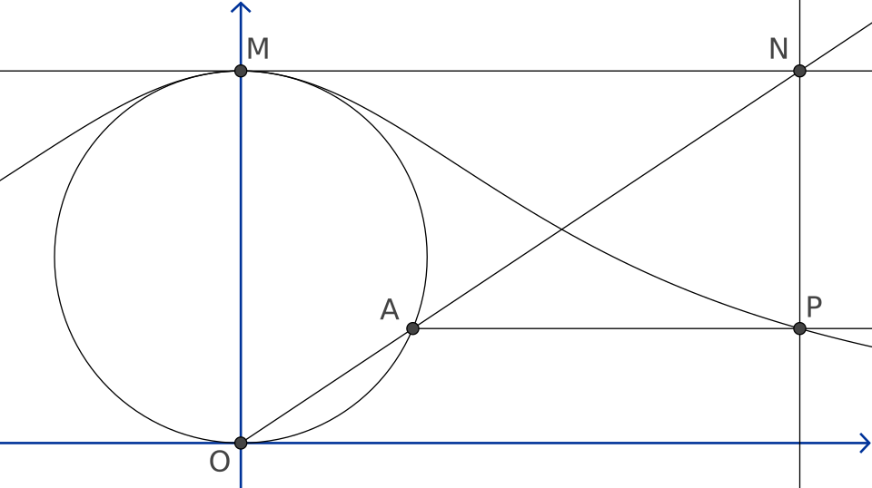

### **NOTES ON STATISTICS, PROBABILITY and MATHEMATICS**

---

### Cauchy distribution:

---

The function $f(x) = \frac{1}{1+x^2}$ is the fundamental building block of the Cauchy distribution.In probability theory, the Cauchy distribution is a continuous probability distribution that is often used as a "pathological" example because it lacks a defined mean or variance.

The function $f(x) = \frac{1}{1+x^2}$ is proportional to the density of the standard Cauchy distribution. However, for a function to be a valid probability density function, the total area under the curve must equal $1.$ If we integrate your function over all real numbers:

$$\int_{-\infty}^{\infty} \frac{1}{1+x^2} \, dx = [\arctan(x)]_{-\infty}^{\infty} = \frac{\pi}{2} - (-\frac{\pi}{2}) = \pi$$

Because the integral is $\pi$, we must multiply by a normalization constant of $\frac{1}{\pi}$ to get the Standard Cauchy Distribution:

$$f(x; 0, 1) = \frac{1}{\pi(1+x^2)}$$

---

---

Key Relationships and Properties:

* The "Witch of Agnesi": The curve $y = \frac{a^3}{x^2+a^2}$ is a famous geometric curve known as the Witch of Agnesi. The Cauchy PDF is essentially a scaled version of this curve.

* Student's t-distribution: The standard Cauchy distribution is a special case of the Student’s t-distribution with exactly one degree of freedom ($\nu = 1$).

* Heavy Tails: Unlike the normal (Gaussian) distribution, which decays exponentially ($e^{-x^2}$), the Cauchy distribution decays polynomially ($\frac{1}{x^2}$). This gives it "heavy tails," meaning extreme outliers are much more likely to occur.

* The Mean Paradox: If you try to calculate the expected value (mean) of a Cauchy random variable:

$$\int_{-\infty}^{\infty} \frac{x}{\pi(1+x^2)} \, dx$$

the integral is undefined because it results in $\infty - \infty$. Consequently, the Cauchy distribution has no mean, variance, or higher-order moments.

---

A common way to generate a Cauchy distribution is to imagine a person standing at the point $(0, 1)$ on a Cartesian plane, spinning around, and firing a laser beam at a random angle $\theta$ (uniformly distributed between $-90^\circ$ and $90^\circ$). The position $x$ where the laser hits the x-axis ($y=0$) follows a Cauchy distribution. This is because $x = \tan(\theta)$, and the derivative of the inverse tangent leads directly back to the function  $f(x) = \frac{1}{1+x^2}$:

$$\frac d{dx}\arctan(x)=\frac1{1+x^2}$$
It is the derivative precisely because a Probability Density Function (PDF) represents the rate of change of probability over an interval.

The Cauchy distribution $f(x;x_{0},\gamma )$ is the distribution of the $x$-intercept of a ray issuing from $(x_{0},\gamma )$ with a uniformly distributed angle. It is also the distribution of the ratio of two independent normally distributed random variables with mean zero.

---

<video src="witch_of_agnesi.mp4" controls width="70%">
</video>

---

##### The relationship with the Witch of Agnesi:

From [Wikipedia](https://en.wikipedia.org/wiki/Witch_of_Agnesi):

> To construct this curve, start with any two points O and M, and draw a circle with OM as diameter. For any other point A on the circle, let N be the point of intersection of the secant line OA and the tangent line at M. Let P be the point of intersection of a line perpendicular to OM through A, and a line parallel to OM through N. Then P lies on the witch of Agnesi. The witch consists of all the points P that can be constructed in this way from the same choice of O and M. It includes, as a limiting case, the point M itself.

If $M=(0,1)$ the curve has obeys the equation

$$f(x)=\frac1{1+x^2}$$

---
<a href="http://rinterested.github.io/statistics/index.html">Home Page</a>

**NOTE: These are tentative notes on different topics for personal use - expect mistakes and misunderstandings.**
