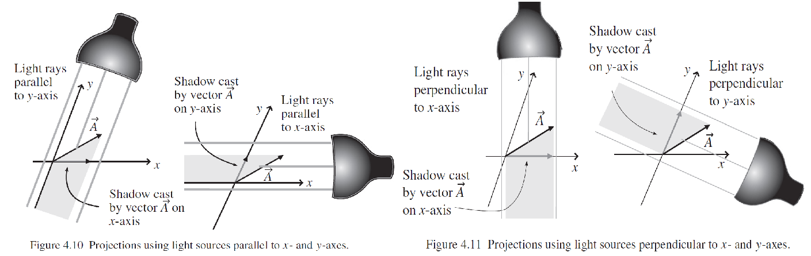
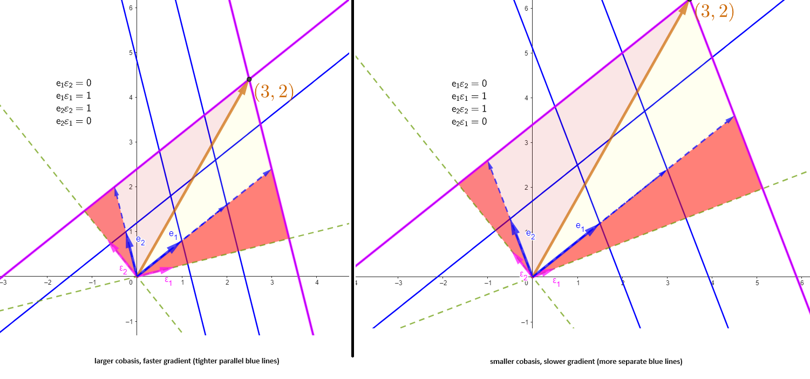

### **NOTES ON STATISTICS, PROBABILITY and MATHEMATICS**

---

### Covariant, Contravariant & the Metric Tensor:

---

#### Biorthogonal system in $\mathbb R^n$:

Given the matrix of dot products between basis vectors

$$A = \begin{bmatrix}\mathbf e_1 \cdot \mathbf e_1 & \mathbf e_1 \cdot \mathbf e_2 \\
\mathbf e_2 \cdot \mathbf e_1 & \mathbf e_2 \cdot \mathbf e_2\end{bmatrix}$$

the [biorthoganility system](https://en.wikipedia.org/wiki/Dual_basis) in $\mathbb R^n$:

$$\mathbf e^k \cdot \mathbf e_s = \delta^k_s = \sum_{q=1}^n e^{kq}e_{qs}= \begin{bmatrix}\mathbf e^1 \cdot \mathbf e^1 & \mathbf e^1 \cdot \mathbf e^2 \\
\mathbf e^2 \cdot \mathbf e^1 & \mathbf e^2 \cdot \mathbf e^2\end{bmatrix}\begin{bmatrix}\mathbf e_1 \cdot \mathbf e_1 & \mathbf e_1 \cdot \mathbf e_2 \\
\mathbf e_2 \cdot \mathbf e_1 & \mathbf e_2 \cdot \mathbf e_2\end{bmatrix}$$

the values of $e^{kq}$ correspond to the entries of the inverse matrix of $A.$ So that

$$\mathbf e^k = \sum_{q=1}^n e^{kq} \mathbf e_q$$

Example:

If the basis vectors are $\mathbf e_1 = [1,0.8]^\top$ and $\mathbf e_2 = [-0.25,1]^\top$, the matrix of dot products is

$$A = \begin{bmatrix}\mathbf e^1 \cdot \mathbf e^1 & \mathbf e^1 \cdot \mathbf e^2 \\
\mathbf e^2 \cdot \mathbf e^1 & \mathbf e^2 \cdot \mathbf e^2\end{bmatrix} =\begin{bmatrix} 1.64 & 0.55 \\ 0.55 & 1.06 \end{bmatrix}$$

with 

$$A^{-1} = \begin{bmatrix}\mathbf e_1 \cdot \mathbf e_1 & \mathbf e_1 \cdot \mathbf e_2 \\
\mathbf e_2 \cdot \mathbf e_1 & \mathbf e_2 \cdot \mathbf e_2\end{bmatrix} =\begin{bmatrix} 0.74 & -0.38 \\ -0.38 & 1.14 \end{bmatrix}$$

and

$$\mathbf e^1 = 0.74 \mathbf e_1 -0.38 \mathbf e_2$$

while

$$\mathbf e^2 = -0.38 \mathbf e_1 + 1.14 \mathbf e_2$$

This is reflected on the image below (to the left), in which the cobasis vectors are portrayed as arrow vectors, as well as a stack. Notice how a vector $[3,2]^\top = 3 \mathbf e_1 + 2 \mathbf e_2$ can be decomposed into its components in the basis vectors by projecting the actual vector onto the cobasis vectors as it would a flash light perpendicular to the cobasis vectors ("A Student's Guide to Vectors and Tensors" by Daniel A. Fleisch):

Notice how the cobasis vector change opposite to the basis vectors under a change of coordinates (right image), and the density of the stacks decreases when the cobasis vectors decrease in size (more spaced out):

---

---

#### Change to oblique coordinates:

From [this introductory differential geometry series online](https://youtu.be/AKPZkHvqTao?list=PLD1448E024E04C24D) ushering in the concepts of **contravariant** ($A^i$) and **covariant** ($A_i$) of a vector as a change of coordinates:

In the setting of oblique coordinates, the $y$ axis is tilted, but the $x$ axis stays unchanged:

The **contravariant** is calculated as:

$\tan(\alpha) =\large \frac{y}{*}$; and therefore, $\large * = \frac{y}{\tan(\alpha)}$

and 

$$\begin{align}c^u &= x - * \\[3ex]&= x - \frac{y}{\tan(\alpha)}\end{align}$$

while 

$$c^v = \frac{y}{\sin(\alpha)}$$

Therefore the original orthogonal coordinates will transform into the new oblique coordinates through the matrix

$$H = \begin{bmatrix} 1 & - \frac{1}{\text{tan}(\alpha)} \\
                  0 & \frac{1}{\text{sin}(\alpha)}
\end{bmatrix}$$

as follows:

$$\begin{bmatrix} 1 & - \frac{1}{\text{tan}(\alpha)} \\
                  0 & \frac{1}{\text{sin}(\alpha)}
\end{bmatrix}
\begin{bmatrix} x \\ y
\end{bmatrix}=
\begin{bmatrix} c^u \\ c^v
\end{bmatrix} = \begin{bmatrix} c^1 \\ c^2
\end{bmatrix}
$$

---

On the other hand, the **covariant** is calculated as:

where,

$$c_u = x$$ 
and

$$c_v = x\,\cos(\alpha) + y\, \sin(\alpha)\tag 1$$

---

This expression (1) is derived as follows:

The angles $\alpha$ and $\beta$ are complementary, and $\sin \alpha = \cos \beta$.

$\varphi= b \cos \beta = b \sin \alpha$

$\psi = a \cos \alpha$

$c_v = \psi + \varphi = a \cos \alpha + b \sin \alpha$

---

It follows that the covariant transformation will be through the matrix

$$M = \begin{bmatrix} 1 & 0 \\ \cos \alpha & \sin \alpha \end{bmatrix}$$

Therefore,

$$\begin{bmatrix} 1 & 0 \\
                  \cos\alpha & \sin \alpha
\end{bmatrix}
\begin{bmatrix} x \\ y
\end{bmatrix}=
\begin{bmatrix} c_u \\ c_v
\end{bmatrix} = \begin{bmatrix} c_1 \\ c_2
\end{bmatrix}
$$

---

From [this video](https://youtu.be/qDLmJE2bOy4),

$G$ is the **METRIC TENSOR**, and turns the covariate into the contravariate:

\begin{align}
\bf G &= H\,M^{-1}\\[3ex]
&= \frac{1}{\sin\alpha}\begin{bmatrix}1&-\frac{1}{\tan\alpha}\\0&\frac{1}{\sin\alpha}\end{bmatrix}
\begin{bmatrix} \sin\alpha & 0\\-\cos\alpha &1\end{bmatrix}\\[3ex]
&=\frac{1}{\sin\alpha} \begin{bmatrix}\sin\alpha+\frac{\cos\alpha}{\tan\alpha} & -\frac{1}{\tan \alpha}\\ -\frac{\cos\alpha}{\sin\alpha} & \sin\alpha \end{bmatrix}\\[3ex]
&=\frac{1}{\sin^2\alpha}\begin{bmatrix}1 & - \cos\alpha\\-\cos\alpha\end{bmatrix}
\end{align}

---

[See this post for metric tensor](http://www.mathpages.com/rr/s5-02/5-02.htm), and [this other one](http://web.mit.edu/edbert/GR/gr1.pdf).

---

#####METRIC TENSOR:

From [this presentation](https://youtu.be/C76lWSOTqnc):

To preserve the length of a vector $\vec v$ regardless of the whether referenced to coordinates with orthonormal basis vectors $\{\vec e_1,\vec e_2\},$ or the alternative oblique coordinates $\{\vec{ \tilde e_1}, \vec {\tilde e_2}\}$ we need to calculate norm as the dot product.

With respect to the orthonormal basis vectors,

$$\begin{align}
\Vert \vec v \Vert^2 &= \vec v \cdot \vec v \\[2ex]
&=(v^1\vec e_1 + v^2 \vec e_2) \cdot (v^1 \vec e_1 + v^2 \vec e_2)\\[2ex]
&=(v^1)^2 (\vec e_1 \cdot \vec e_2) + 2 v^1v^2(\vec e_1 \cdot e_2) + (v^2)^2(\vec e_2\cdot \vec e_2)\tag 1\\[2ex]
&=(v^1)^2 (\vec e_1 \cdot \vec e_2) + (v^2)^2(\vec e_2\cdot \vec e_2)\\[2ex]
&=(2)^2 + (1)^2
=5\end{align}$$

The last line is consequence of the orthogonality of the basis vectors. However, when using non-orthogonal coordinates we'll need to calculate the dot products of the basis vectors. Paralleling equation (1):

$$\begin{align}\Vert \vec v \Vert^2&=(\tilde v^1)^2 \left(\vec{\tilde e_1}\cdot \vec{\tilde e_1}\right)+ 2 \tilde v^1 \tilde v^2 \left(\vec{\tilde e_1}\cdot \vec{\tilde e_2}\right)+(\tilde v^2)^2\left(\vec{\tilde e_2 }\cdot\vec{\tilde e_2}\right)\end{align}\tag 2$$

Calculating the dot products, then,

$$\begin{align}
\vec{\tilde e_1}\cdot \vec{\tilde e_1}&= (2\vec e_1+1\vec e_2)\cdot (2\vec e_1 + 1\vec e_2)\\[2ex]
&=4 \vec e_1 \cdot \vec e_1 + 2\cdot 2 \vec e_1 \vec e_2 + 1 \vec e_2\vec e_2\\[2ex]
&= 4 + 1 \\[2ex]
&=5
\end{align}$$
$$\begin{align}
\vec{\tilde e_2}\cdot \vec{\tilde e_2}&= \left(-\frac{1}{2}\vec e_1+\frac{1}{4}\vec e_2\right)\cdot \left(-\frac{1}{2}\vec e_1+\frac{1}{4}\vec e_2\right)\\[2ex]
&=\frac{1}{4} \vec e_1 \cdot \vec e_1 - 2\cdot \frac{1}{8} \vec e_1 \vec e_2 + \frac{1}{16} \vec e_2\vec e_2\\[2ex]
&= \frac{1}{4} + \frac{1}{16} \\[2ex]
&=\frac{5}{16}
\end{align}$$

$$\begin{align}
\vec{\tilde e_1}\cdot \vec{\tilde e_2}&= (2\vec e_1+1\vec e_2)\cdot \left(-\frac{1}{2}\vec e_1+\frac{1}{4}\vec e_2\right)\\[2ex]
&=-1 \vec e_1 \cdot \vec e_1 + 2\cdot \frac{1}{2} \vec e_1 \vec e_2 + \frac{1}{4} \vec e_2\vec e_2\\[2ex]
&= -1 + \frac{1}{4} \\[2ex]
&=-\frac{3}{4}
\end{align}$$

Plugging these results in equation (2):

$$\begin{align}\Vert \vec v \Vert^2&=(\tilde v^1)^2 5+ 2 \tilde v^1 \tilde v^2 \left(-\frac{3}{4}\right)+(\tilde v^2)^2\left(\frac{5}{16}\right)\end{align}$$
Now, in the graph above we have as given that $\vec v = \frac{5}{4} \vec {\tilde e_1} + 3 \vec{\tilde e_2}.$ Therefore,

$$\begin{align}\Vert \vec v \Vert^2&=\left(\frac{5}{4}\right)^2 \left(5\right)+ 2 \left(\frac{5}{4}3\right) \left(-\frac{3}{4}\right)+\left(3\right)^2\left(\frac{5}{16}\right)=5\end{align}$$

This can be expressed as

$$\begin{bmatrix}\tilde v^1 & \tilde v^2\end{bmatrix}\;\color{blue}{\begin{bmatrix}5 & -\frac{3}{4}\\-\frac{3}{4}& \frac{5}{16}\end{bmatrix}}\;\begin{bmatrix}\tilde v^1 \\ \tilde v^2\end{bmatrix}=\begin{bmatrix}\frac{5}{4} & 3\end{bmatrix}\;\color{blue}{\begin{bmatrix}5 & -\frac{3}{4}\\-\frac{3}{4}& \frac{5}{16}\end{bmatrix}}\;\begin{bmatrix}\frac{5}{4} \\ 3\end{bmatrix}$$

The metric tensor is

$$g_{\vec{\tilde e_i}}=\color{blue}{\begin{bmatrix}5 & -\frac{3}{4}\\-\frac{3}{4}& \frac{5}{16}\end{bmatrix}}_{\vec{\tilde e_i}}$$

In the case of the orthogonal matrix, the metric tensor is

$$g_{\vec{ e_i}}=\color{blue}{\begin{bmatrix}1 & 0\\0& 1\end{bmatrix}}_{\vec{ e_i}}$$

So the metric tensor is the matrix of dot products, such in the case of

$$g_{\vec{\tilde e_i}}=\color{blue}{\begin{bmatrix}\vec{\tilde e_1}\cdot \vec{\tilde e_1}& \vec{\tilde e_1}\cdot \vec{\tilde e_2}\\\vec{\tilde e_2}\cdot \vec{\tilde e_1}& \vec{\tilde e_2}\cdot \vec{\tilde e_2}\end{bmatrix}}_{\vec{\tilde e_i}}$$

In Einstein's notation

$$\Vert \vec v\Vert^2=\tilde v^i\tilde v^j\left(\vec{\tilde e_i\cdot \tilde e_j}\right)=\tilde v^i\tilde v^j\,\color{blue}{g_{ij}}.$$
The metric tensor is a $(0,2)$-tensor, and it does eat two vectors (e.g. $\vec v$ and $\vec v$ in $\Vert \vec v \Vert$) to produce a scalar number.

---

#### [GEOMETRIC INTERPRETATION OF CURVILINEAR COORDINATES AND THE METRIC TENSOR:](https://youtu.be/NJzzbGcIYX0)

---

The position vector $\vec r$ of a point in the manifold $\mathcal M$ is given as functions of the basis vectors $\vec e_i,$ i.e. $\vec r(y^1,y^2,y^3)=x^1(y^1,y^2,y^3)\vec e_1 + x^2(y^1,y^2,y^3)\vec e_2 + x^3(y^1,y^2,y^3)\vec e_3.$  

The new **coordinate curves or axes** are generated by allowing only one of the $\vec y_i$ coordinates to vary, while holding the other two constant, i.e. $\left (\vec r(y^1,c_2,c_3),\vec r(c_1,y^2,c_3),\vec r(c_1,c_2,y^3) \right ).$ The derivative of the position vector along each of the coordinate curves (one of them highlighted in black on the diagram) is responsible for the **contravariant** basis vectors $\left\{\frac{\partial \vec r}{\partial y^1}, \frac{\partial \vec r}{\partial y^2}, \frac{\partial \vec r}{\partial y^3} \right \}.$ 

The covariant vectors are best represented by a stack (akin to a contour plot), and represent the gradient along each of the coordinates - the gradient will be realized as soon as a smooth function is provided. Notice that all of this construct happens at a particular point.

When a function $f$ is provided, the tangent vector $\vec v$ (in red) at point $P$ happens to "pierce" approximately $1.5$ layers of the covector denoting the gradient in the direction of $y_2.$ This makes sense in the diagram, because of the bend in the curve is progressing nearly perpendicular to the vector $\frac{\partial \vec R}{\partial y_2}$ around point $P.$ 

---

---

I think this comes to life when we consider how the parametrization of a curve (or a surface) over which to integrate introduces a function (or functions) nested within a function - the velocity at which we move through the curve (?) as opposed to the arc length of the curve being measured, or a vector field on the manifold being integrated along a line. This nested function controls the position vector. So, for example, in [this presentation](https://youtu.be/dhZgGIYzPUU?t=1m17s) the following example is given:

>Evaluate the integral $\displaystyle \int_C y\mathrm dx + z^2 \mathrm dy+x \mathrm dz$ along the curve $$\mathrm{\vec R}(t)= \langle 2t,t^2,\sqrt{t}\rangle$$ on the interval $0\leq t \leq4:$

The parametrization is $x(t)= 2t$ with differential $\mathrm dx =2\, \mathrm dt;$ $y(t) = t^2$ with $\mathrm dy=2t\mathrm dt;$ and $z(t)=\sqrt t$ with $\mathrm dz = 1/2 t^{-1/2}\mathrm dt.$

So we can consider this problem as integrating field force over a line:

$$\int_C \mathbf F \cdot \mathrm d\mathbf R$$
with 

$$\begin{align}\mathbf F &=\langle y,z^2,x\rangle\\[2ex]
&=\langle y(t),(z(t))^2, x(t) \rangle\\[2ex]
&=\Big\langle t^2,\left(t^{1/2}\right)^2, 2t \Big\rangle\\[2ex]
&=\Big\langle t^2,t, 2t \Big\rangle
\end{align}$$ 
 
$$\begin{align}
\mathbf R &=\langle x(t),y(t),z(t) \rangle\\
&=\langle 2t,t^2,\sqrt t \rangle
\end{align}$$

and $$\mathrm d\mathbf R =\langle x'(t),y'(t),z'(t) \rangle\mathrm dt$$

so that

$$\small\begin{align}
\int_C \mathbf F \cdot \mathrm d\mathbf R&=\int_a^b \mathbf F( \mathrm {\vec R}(t)) \cdot \mathrm d\mathbf R\\[2ex]
&=\int_a^b \langle P,Q,R \rangle \cdot \langle x'(t), y'(t),z'(t) \rangle \mathrm dt \\[2ex]
&=\int_0^4 \langle y,z^2,x\rangle \cdot \langle x'(t),y'(t),z'(t) \rangle\mathrm dt\\[2ex]
&=\int_0^4 \left (P\frac{dx}{dt}+Q\frac{dy}{dt}+R\frac{dz}{dt}\right){dt}\\[2ex]
&=\int_0^4 \langle t^2,t,2t\rangle \cdot \langle 2,2t,\frac{1}{2}t^{-1/2} \rangle\mathrm dt\\[2ex]
&=\int_0^4 2t^2 \mathrm dt\,+\,2t^2\mathrm dt \,+\, t^{1/2}\mathrm dt\\[2ex]
&=\int_0^4 \left ( 2t^2 \,+\,2t^2 \,+\, t^{1/2}\right)\mathrm dt\\[2ex]
&=\frac{4}{3} t^3+\frac{2}{3}t^{3/2}\Big\vert_0^4\\[2ex]
&=272/3
\end{align}
$$

In relation to [this question](https://math.stackexchange.com/q/2749672/152225), there is this interesting passage on [this presentation](https://youtu.be/qCE5bmNlpi8?t=14m38s):

>The "new version of the gradient":
>The expression corresponding to a vector field
>$$\small\nabla f =\left\langle \frac{\partial f}{\partial x},\frac{\partial f}{\partial y}, \frac{\partial f}{\partial z} \right\rangle $$
>gets replaced with the same partials of the vector field made into a differential form:
>$$\small\mathrm df=\frac{\partial f}{\partial x}dx+\frac{\partial f}{\partial y}dy+\frac{\partial f}{\partial z}dz$$

>For example,

>$$\mathrm d(x^2+y^2)=2x\,dx + 2y\, dy$$
>Here is the gradient (field) representation:

> where the stacks mesh into basically level curves of a function: "Chopping up" the level curves we get the picture of the $\mathrm df,$ which is the "real, honest to god, better version of the gradient." This graphical representation akin to the level curve cannot be done with the vector field expressed as $\nabla f =\left\langle \frac{\partial f}{\partial x},\frac{\partial f}{\partial y}, \frac{\partial f}{\partial z} \right\rangle$ - basically arrows.
> Further, if a function is parametrize it is immediate to get

>$$\frac{\mathrm df}{dt} =\frac{\partial f}{\partial x}\frac{dx}{dt}+\frac{\partial f}{\partial y}\frac{dy}{dt}+\frac{\partial f}{\partial z}\frac{dz}{dt}$$

---

This is beautifully explaine on [this answer in SE.Math](https://math.stackexchange.com/a/2749923/152225):

**First, some linear algebra.** Take any real $n$-dimensional vector space $V$ and pick a(n ordered) basis $(e_i)$. Then you may pair all vectors in $v$ with $n$-tuples of real numbers so that $v^1 e_1 + \cdots + v^n e_n \leftrightarrow (v^1, \cdots, v^n)$. For vectors, the convention is adopted that these $n$-tuples be written in a vertical fashion – i.e. a second isomorphism is established between $\mathbb R^n$ and the space of column vectors ($n\times 1$ matrices). 

Now define the *dual* of $V$ as the vector space of *linear functionals* on $V$, i.e., linear maps $\varphi : V \to \mathbb R$. Our choice of basis $(e_i)$ on $V$ induces a natural choice of basis on $V^*$, the *dual basis* $(\varepsilon^j)$ such that $\varepsilon^j(e_i) = \delta^j_i$ (the Kronecker delta: it corresponds to the value $1$ when $i=j$, $0$ otherwise). This, way, we may also pair every linear functional $\varphi \in V^*$ with an $n$-tuple of real numbers $(\varphi_1,\dots, \varphi_n)$, and the convention now is that they are written in a *horizontal fashion*, i.e. as $1 \times n$ matrices.

Why the row-column vector convention? Because now the action of $\varphi \in V^*$ on $v \in V$ can be written
$$\langle \varphi, v \rangle := \varphi(v) = \begin{pmatrix} \varphi_1 & \cdots & \varphi_n\end{pmatrix} \begin{pmatrix} v^1 \\ \vdots \\ v^n \end{pmatrix} = \varphi_1 v^1 + \cdots \varphi_n v^n $$
so that applying a linear functional to a vector is the same as matrix-multiplying the row vector on the left to the column vector and obtaining a scalar, as you would expect. (The map $\langle\cdot,\cdot\rangle : V^* \times V \to \mathbb R$ is called *duality product* and it is very close to the notion of dot product.) It is worthy of notice that sometimes linear functionals are called *$1$-covariant tensors* or *$(0,1)$-tensors over $V$* or *covectors* and vectors in $V$ are called *$1$-contravariant tensors* or *$(1,0)$-tensors over $V$*.

**Back to geometry/analysis.** Call $\Omega$ an open subset of $n$-dimensional Euclidean space [my words here: just replace omega for $\mathcal M$ - manifold]. Remember that the "partial derivative in the $k$-th direction evaluated at a point $p=(p^1, \dots, p^n) \in \Omega$" operation, $\frac{\partial}{\partial x^k}\Big|_{p=(p^1,\dots,p^n)}$, is linear, that is, if $a,b \in \mathbb R$ and $f,g : \Omega \to \mathbb R$ are smooth functions,
$$\begin{split}
\frac{\partial}{\partial x^k}\Big|_{p} (af + bg) &= \frac{\partial (af + bg)}{\partial x^k}(p) \\
&=a \frac{\partial f}{\partial x^k}(p) + b \frac{\partial g}{\partial x^k}(p) \\
&= a \frac{\partial}{\partial x^k}\Big|_{p} f + b \frac{\partial}{\partial x^k}\Big|_{p} g
\end{split}$$
so it makes sense to consider the vector space of derivations at $p$, that is, the vector space $T_p\Omega$ (also called "tangent space at $p$") of all linear combinations of partial differential operators
$$\sum_{k=1}^n a^k \frac{\partial}{\partial x^k}\Big|_{p} = a^1 \frac{\partial}{\partial x^1}\Big|_{p} + \cdots + a^n\frac{\partial}{\partial x^n}\Big|_{p} $$
It is obvious that $\left(\frac{\partial}{\partial x^k}\Big|_{p}\right)$ constitutes an ordered basis of $T_p\Omega$, which is then $n$-dimensional. Of course, you may apply the column-vector convention and identify the above linear combination with the vertical list $\begin{pmatrix} a^1 \\ \vdots \\ a^n \end{pmatrix}$. 

What is then its dual space? It's the "cotangent space at $p$", the space $T^*_p\Omega$ of all covectors on $T_p\Omega$. The natural choice of basis on $T^*_p\Omega$ is the dual basis of covectors that yield the Kronecker delta when applied to the pure partial differential operators at $p$. These are the maps
$$\mathrm{d}x^m|_p : T_p\Omega \to \mathbb R \qquad \text{s.t.} \qquad \mathrm{d} x^m|_p \left(\frac{\partial}{\partial x^k}\Big|_{p}\right) = \delta^m_k $$
so that any covector $\alpha|_p \in T_p^*\Omega$ can be written as
$$\alpha|_p = \alpha_1 \mathrm{d}x^1|_p + \cdots + \alpha_n \mathrm{d}x^n|_p. $$

Now, given a smooth function $f : \Omega \to \mathbb R$, the *differential operator at $p$ of $f$* is the covector in $T_p^*\Omega$ such that the coefficients $\alpha_m$ are exactly $ \alpha_m = \frac{\partial f}{\partial x^m}(p)$, so that
$$\mathrm{d}f|_p = \frac{\partial f}{\partial x^1}(p)\mathop{} \mathrm{d}x^1|_p + \cdots + \frac{\partial f}{\partial x^n}(p) \mathop{}\mathrm{d}x^n|_p$$
This also makes sense out of the notation $\mathrm{d}x^m|_p$: the basis elements are exactly the differentials of the coordinate functions $ x^m : p \mapsto p^m$. Of course, you may now apply the row-vector convention to get the *row-gradient of $f$*
$$\begin{pmatrix} \dfrac{\partial f}{\partial x^1}(p) & \cdots & \dfrac{\partial f}{\partial x^n}(p) \end{pmatrix}  $$
The *gradient of $f$* is *transpose* of this vector, i.e. the column vector $\nabla f(p)$ you get by turning this row vector $90$ degrees clockwise. Thus, applying the row-gradient to a vector is the same thing as dotting the gradient to that same vector.

**The directional derivative.** Now you can imagine how this plays out. Let $p \in \Omega$, $v|_p \in T_p\Omega$ and let $f$ be a smooth function over $\Omega$. Then the *directional derivative of $f$ at $p$ in the direction $v|_p$* is just the scalar
$$\begin{split}
\langle \mathrm d f|_p, v|_p \rangle = \mathrm{d}f|_p (v|_p) &= \begin{pmatrix} \dfrac{\partial f}{\partial x^1}(p) & \cdots & \dfrac{\partial f}{\partial x^n}(p) \end{pmatrix} \begin{pmatrix} v^1|_p \\ \vdots \\ v^n|_p \end{pmatrix} = \nabla f(p) \cdot \begin{pmatrix} v^1|_p \\ \vdots \\ v^n|_p \end{pmatrix} \\ &= v^1|_p \dfrac{\partial f}{\partial x^1}(p) + \cdots + v^n|_p \dfrac{\partial f}{\partial x^n}(p)
\end{split}$$
and we are done.

----------

**Addendum.** So far we've been working in the tangent space at a single point $p \in \Omega$. But nothing stops us from defining maps that assign, to each point $p \in \Omega$, a vector or a covector. These are called *fields* (although these should be, more sophisticatedly, sections of the tangent or cotangent bundle of $\Omega$). Covector fields are also called *$1$-forms*; for example, $\mathrm{d}f$ is a one form (to each $p$ we assign $\mathrm{d} f|_p$). One may extend the operation of applying a covector to a vector to fields: if $v$ is the vector field such that to each $p$ is associated a vector $v|_p \in T_p\Omega$, and $\alpha$ is a covector field defined similarly, then $\langle\alpha,v\rangle$ is the *scalar field* (i.e., real function) that associates to each $p$ the real number $\langle \alpha|_p,v|_p\rangle = \alpha|_p(v|_p)$. If $\alpha = \mathrm d f$, you get an extension of the definition of directional derivative we gave above: just picture a field of vectors distributed over $\Omega$ and a function $f$ with its gradient, and imagine dotting the gradient at a point with the specific vector assigned at that point, and doing so for all points in $\Omega$. In some way, this gives an idea of "how well" the gradient field conforms to the given vector field.

in introductory calculus courses, $\mathrm d f$ is thought as "a small change in the value of the function $f$", generally in correspondence with a small change in the input $x,$ $\mathrm d x.$ So in that sense $\mathrm d f$ is a scalar. But that view must be abandoned, in order to do higher mathematics, in favour of the one I propose in my answer.) 

---

This is explained on the [covariance and contravariance of vectors entry in Wikipedia](https://en.wikipedia.org/wiki/Covariance_and_contravariance_of_vectors).

  [1]: https://cloud.githubusercontent.com/assets/9312897/18643188/fa8b6c8a-7e71-11e6-99dd-969f835b03ce.png
  
  
The relation between covariant and contravariant basis is the relation between the tangent vector space and the dual.

---
<a href="http://rinterested.github.io/statistics/index.html">Home Page</a>

**NOTE: These are tentative notes on different topics for personal use - expect mistakes and misunderstandings.**
