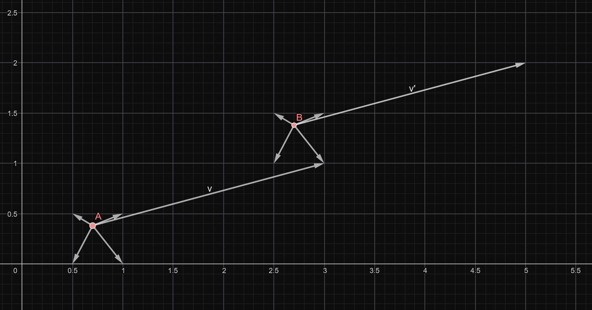

### **NOTES ON STATISTICS, PROBABILITY and MATHEMATICS**

<a href="http://rinterested.github.io/statistics/index.html">
</a>

---

### Modular Forms and Möbius transformation:

---

#### Möbius transformation:

A Möbius transformation is ([Wikipedia](https://en.wikipedia.org/wiki/M%C3%B6bius_transformation)):

In geometry and complex analysis, a Möbius transformation of the complex plane is a rational function of the form

$$f(z) = \frac{az + b}{cz + d}$$

of one complex variable $z$; here the coefficients $a, b, c, d$ are complex numbers satisfying $ad − bc ≠ 0.$

In order to plot this transformation using Cartesian coordinates on a computer platform the real and imaginary components will need to be separated.

Using [this post](https://math.stackexchange.com/q/1583277/152225):

If

* $Z$ is a point $(x, y)$, equivalent to the complex number $x+ yi$ 
* $A = a_r + a_i i$
* $B = b_r + b_i i$
* $C = c_r + c_i i$
* $D = d_r + d_i i$

(so $Z, A, B, C, D$ are complex numbers, while 
$x, y, a_r, a_i, b_r, b_i, c_r,  c_i, d_r, d_i$ are real numbers)


$$\begin{align}
f(Z)  &=   \frac{AZ+B}{CZ+D}\\[3ex]
=&\frac {(a_r x - a_i y ) + (a_i x + a_r y) i + b_r + b_i i}
{(c_r x - c_i y) + (c_i x + c_r y) i + d_r + d_i i} \\[3ex]
=
&\frac {(a_r x - a_i y ) + (a_i x + a_r y) i + b_r + b_i i}
{(c_r x - c_i y) + (c_i x + c_r y) i + d_r + d_i i} \\[3ex]
=&\frac {(a_r x - a_i y+ b_r ) + (a_i x + a_r y + b_i) i }
{(c_r x - c_i y+ d_r) + (c_i x + c_r y+ d_i) i} \\[3ex]
= & \left( \frac {(a_r x - a_i y+ b_r ) (c_r x - c_i y+ d_r) + (a_i x + a_r y + b_i) (c_i x + c_r y+ d_i) }
{(c_r x - c_i y+ d_r)^2 + (c_i x + c_r y+ d_i) ^2} \right) \\[3ex]
+ & \left( \frac {(a_i x + a_r y + b_i)(c_r x + c_i y+ d_r) -(a_r x - a_i y+ b_r )(c_i x + c_r y+ d_i ) }
{(c_r x - c_i y+ d_r)^2 + (c_i x + c_r y+ d_i)^2 } \right) i 
\end{align}$$

This is implemented [here](https://www.geogebra.org/m/DRF0L1X2).


#### Modular transformation:

A modular form $f$ is an analytic function defined with a weight $k$ and a modular group.

The transformation of the domain of the modular form is the action of the modular group.See [here](https://youtu.be/AxPwhJTHxSg?si=6kngqW3TkYn6dB8S).

Limiting the $\text{GL}_2(\mathbb Z)$ to the special linear group $\text{SL}_2(\mathbb Z)=\left\{\begin{bmatrix}a&b\\c&d\end{bmatrix}\in M_2(\mathbb Z): ad-cb=1\right\}$ acting on points on the upper-half of the complex plane:

$$\text{SL}_2(\mathbb Z)\require{HTML} \style{display: inline-block; transform: rotate(-270deg)}{\circlearrowright} \tau\in \mathcal H$$

with $\mathcal H=\{x+iy: y >0\}$.

This action is a **linear fractional transformation** (a **Möbius transformation**):

$$\begin{bmatrix}a&b\\c&d\end{bmatrix}\tau = \frac{a\tau + b}{c\tau+d}$$
Since $\tau \in \mathcal H,$ the result of the transformation will also be in the upper-half plane due to the result:

$$\Im\left( \frac{a\tau + b}{c\tau+d}\right)=\frac{(ad-bc)\,\Im(\tau)}{\vert c\tau +d\vert^2}$$

The Möbius transformations are applications such that $f(z) = \frac{az+b}{cz+d}$
are the projective transformations of the complex project line. They form a group called Möbius group, which is the projective linear $\mathbb{PGL}(2, C)$. Möbius transformations are generated by the two following matrices: $S=\begin{bmatrix}-1&0\\0&1\end{bmatrix}$ and $T=\begin{bmatrix}1&1\\0&1\end{bmatrix}$.

The complete definition of a modular form of weight $k$ for $\text{SL}_2(\mathbb Z)$ is a function in $\mathcal H$ satisfying:

1. $f$ is **holomorphic** (analytical, i.e. there is a local power series expansion in $\mathcal H$)

2. **Modularity condition**:

$$f\left( \frac{a\tau + b}{c\tau+d}\right)= (c\tau + d)^k\; f(\tau)\quad \forall \begin{bmatrix}a&b\\c&d\end{bmatrix}\in \text{SL}_2(\mathbb Z),\; \tau\in\mathcal H$$

Since this applies to all matrices in the group, it follows that it applies to $T=\begin{bmatrix}1&1\\0&1\end{bmatrix}$, and hence:

$$f\left(\frac{1\cdot \tau + 1}{0\cdot \tau + 1}\right)=f(\tau+1)=(0\cdot \tau +1)^k\,f(\tau)=f(\tau)$$
Therefore $f(\tau +1)=f(\tau),$ and the function is **periodic**.

From the matrix $S=\begin{bmatrix}0&-1\\1&0\end{bmatrix}$ we can conclude that

$$f\left(\frac{0\cdot \tau -1}{1\cdot \tau +0} \right)=f\left(-1/\tau\right)=\tau^k\,f(\tau)$$

A $\tau$ in the upper-half plane outside the unit semicircle will be transformed by $-1/\tau$ into a point within the unit semicircle (less than $1$ in modulus) and reflected through the origin (negative sign). Take a point $\tau = r\,e^{i\theta},$ its inverse is $1/\tau = 1/r\,e^{-i\theta}$ (reciprocal modulus, negative argument). The introduction of a negative sign is equivalent to multiplying by $-1 = e^{i\pi}$, yielding $-1/\tau = 1/\tau e^{i(\pi-\theta)}$ (no change in modulus, argument $\pi -\theta$).

Finally, considering the matrix $\begin{bmatrix}-1&0\\0&1\end{bmatrix}$ we get that

$$f\left(\frac{-1\cdot \tau +0}{0\cdot \tau +1} \right)=f\left(-\tau\right)=(-1)^k\,f(\tau)$$
which implies that if $k$ is odd the function has to be zero, i.e. modular forms have even weights.


3. As $\Im(\tau) \to\infty$, $f(\tau)$ is **bounded**.

This is explained in [here](https://youtu.be/LolxzYwN1TQ?si=aPsM8zy_NYDbEkPX).

---

In the LMFDB, [modular forms](https://www.lmfdb.org/ModularForm/GL2/Q/holomorphic/) are classified according to **weight** ($k$) and **level**, which is a positive integer $N$ such that $f$ is a modular form on a subgroup $\Gamma$ of $\operatorname{SL}_2(\mathbb{Z})$ that contains the principal congruence subgroup $\Gamma(N)$.

For instance, take the elliptic curve $y^2+y=x^3-x^2$ that Edward Frenkel presents in Numberphile in [here](https://youtu.be/4dyytPboqvE?si=Uhv4J6zy_Ojsj4vZ). It turns out that you can find the curve by plugging the equation in the field "Label or coefficients", and it returns `11.a3 (Cremona label 11a3)` with the corresponding modular form within the information about the elliptic curve:

$$q - 2\,q^2 - q^3 + 2\,q^4 + q^5 + 2\,q^6 - 2\,q^7 - 2\,q^9 - 2\,q^{10} + q^{11} - 2\,q^{12} + \cdots)\\[2ex]=q\,((1-q)^2\;(1-q^{11})^2\;(1-q^2)^2\;(1-q^{22})^2)\;(1-q^{3})^2\;(1-q^{33})^2\cdots$$

The plotting can be carried out in the unit disk (hyperbolic space with the **Poincaré disk model**) (see [here](https://math.uni.lu/eml/assets/reports/2016/visualizing_modular_forms.pdf)).

To understand what it represents we need to define the **fundamental domain**: The fundamental domain is a closed subset $D ⊂ X$ such that $X$ is the union of translates of $D$ under the group action $G$:

$$X = \cup_{g∈G} \;g\,D$$
Due to the fact that the Möbius transformations are generated by $T$ and $S$, the fundamental domain and its copies can be found as

$$A_{n+1} = \{A_n × T, A_n × S, A_n × T^{−1}, A_n × S^{−1}\}$$

with $A_0$ being equal to the original fundamental domain.

Let be $z ∈ H$. We call the order of $z$, and we denote $\text{ord}(z)$,
the smallest number of transformations (among $S,T,T^{−1}$) needed to transform $z$ into a complex number in the fundamental domain. Equivalently, $\text{ord}(z)$ is the minimal number of Möbius transformations needed to transform the fundamental domain into the copy of itself that includes $z$.

If the order of a complex number in the complex half-plane is even, it can be represented in black. This can already result in a nice black and white alternating image.

Using the code in this [Mathematics SE post](https://math.stackexchange.com/a/4309925/152225), the disk plot of the [modular form 11.2.a.a ](https://www.lmfdb.org/ModularForm/GL2/Q/holomorphic/11/2/a/a/) of level $11$ and weight $2$ can be created in SageMath, first confirming we have the right form:

```
lv = 11
wt = 2
ModularForms(11, 2).basis()[0]
q - 2*q^2 - q^3 + 2*q^4 + q^5 + O(q^6)
```
Here is the standard Cartesian plot:


And here is the Poincaré disk:


The patterns you see in the Poincaré disk plot are essentially visualizations of the equivalence classes of points under the modular group. The "fractal" patterns arise from the intricate way the fundamental domain tiles the upper half-plane and how these tiles map to the Poincaré disk. The FD tiles the upper half-plane. This tiling (tessellation) represents the equivalence classes of points under the modular group.

Symmetry in the Disk: Even though we're calculating in the FD, the symmetries of the modular form are reflected in the Poincaré disk plot.

The colors in the disk are based on the information that was calculated from the FD, but the placement of those colors are determined by the initial grid that was created in the Poincare disk.

The visual advantage of the distortion introduced by mapping the upper half-plane (H) to the Poincaré disk is primarily about compactness and global visualization. Here's a breakdown:

1. Compact Representation:

Infinity to Boundary: The upper half-plane extends infinitely in all directions. The Poincaré disk, on the other hand, is a finite, bounded region. This allows us to represent the entire upper half-plane (or at least a large portion of it) within a finite space. 

Complete View: This compact representation makes it possible to visualize the global structure of modular forms and their symmetries in a single, coherent image.

Visualizing Cusps: The "cusp" of the upper half-plane (infinity) is mapped to the boundary of the Poincaré disk. This allows us to visualize the behavior of modular forms near the cusp, which is often crucial for understanding their properties.

2. Visualizing Symmetries:

Conformal Mapping: The mapping from H to the Poincaré disk is a conformal mapping, which means it preserves angles. This is important because it preserves the local geometric properties of the modular forms. 

Global Symmetries: Even though the shapes of the tiles are distorted, the overall symmetries of the modular forms are still visible. The patterns in the Poincaré disk plot reflect the symmetries of the modular group and the modular form itself.

Whole Picture: The distortion allows the viewer to see the whole picture. If the image was created in the upper half plane, then the image would need to be infinitely large to display the same information.

3. Aesthetic Appeal:

Circular Boundary: The circular boundary of the Poincaré disk provides a visually appealing and natural frame for the plot.

Symmetry and Harmony: The circular symmetry of the disk often enhances the visual harmony of the patterns, making them more aesthetically pleasing.

4. Computational Advantages:

Finite Domain: Working within a finite domain (the Poincaré disk) can sometimes simplify numerical computations and plotting algorithms.

#### Code analysis of the Poincaré disk plot:

 * It starts with the points in a disk centered at the origin. This is where the output will be displayed with color mapping (hue representing phase, and brightness, absolute value). However, the calculations will be carried out in the upper half-plane $\mathbb H.$ To this effect, the points in the disk will undergo a Möbius transformation of the form:

$$h=\frac{1 - iz}{z - i}$$

 This formula is the inverse of the standard transformation from the upper half-plane to the Poincaré disk:

$$w = \frac{z - i}{z + i}$$

 As a result of this inverse transformation, the points will appear skewed and roughly circular, but distorted. This is the effect of a Möbius transformation.


 The specific form of `DtoH` used in the code, `DtoH(x) = (-I * x + 1) / (x - I)`, is a particular case of a more general class of transformations called Möbius transformations (or fractional linear transformations).

Here's the breakdown of why this works and the underlying principles:

Möbius Transformations: Möbius transformations are functions of the form:

$$f(z) = (az + b) / (cz + d)$$

where $a, b, c$, and $d$ are complex numbers, and $ad - bc ≠ 0$ (this condition ensures the transformation is invertible). Möbius transformations have several important properties: They map circles and lines to circles and lines.1 This is crucial because the boundary of the unit disk is a circle, and the boundary of the upper half-plane (the real axis) is a line. They are conformal and bijective. To map the unit disk to the upper half-plane, you need to find a Möbius transformation that takes the boundary of the unit disk ($|z| = 1$) to the real axis $Im(z) = 0$. There are infinitely many such transformations. The specific `DtoH` transformation used in the code is just one example. 

 * The second step will be to transform these points in the upper half-plane into points in the fundamental domain, which will be between $-1/2$ and $1/2$ in the real line, and will exclude a semi-circular area around the origin.
 
  The fundamental domain is designed to contain exactly one representative from each equivalence class under the action of a group.  Points are considered equivalent if they can be transformed into each other by a group action.  If multiple equivalent points fall within the fundamental domain, it violates this principle of unique representation. 

Let's consider a simplified example to illustrate the idea. Imagine a group that acts on the plane by rotations of multiples of $90$ degrees around the origin.  We want to define a fundamental domain for this group action. If we naively choose the entire plane as our "fundamental domain," then we clearly have multiple equivalent points. For example, a point at $(1,0)$, $(0,1)$, $(-1,0)$, and $(0,-1)$ are all equivalent under the rotation group, but they are all distinct points in the plane. A better choice for a fundamental domain would be, say, the region defined by $0 \leq \theta < 90$ degrees.

The region near the origin in the upper half-plane is a region where these group actions can "overlap" or "fold over" in a way that causes multiple equivalent points to fall within it. The transformations that define the group action (e.g., the modular group or related groups) often involve a combination of scaling, inversion, and translation in the complex plane.  Consider the transformation $z \to -1/z$, which is part of the modular group. This transformation inverts points and reflects them across the imaginary axis. Points close to the origin are mapped to points far away, and vice-versa. This kind of transformation can cause significant "folding" near the origin.

Here is the appearance of the final position of the dots in the FD:


This transformation is based on the group action $\circlearrowright$ on points $\tau \in \mathbb H.$ The matrix $\small \begin{bmatrix}1&-1/2\\0&1\end{bmatrix}$ will bring point along the positive axis towards the left via the action:

$$\begin{bmatrix}a&b\\c&d\end{bmatrix}\circlearrowright\tau = \frac{a\tau + b}{c\tau+d}=\frac{z -1/2}{z}$$

and if they are less than $1$ unit from the origin, they will reflect them outside the unit circle with the transformation $-1/z,$ corresponding to the action of the matrix $\small \begin{bmatrix}0&-1\\1&0\end{bmatrix}$:

$$\begin{bmatrix}a&b\\c&d\end{bmatrix}\circlearrowright\tau = \frac{a\tau + b}{c\tau+d}=\frac{ -1}{z}$$
 * Modular forms have a Fourier expansion, often called the $q$-expansion, where $q$ is related to $\tau$ (a complex number in the upper half-plane) by $q = \exp(2πi\tau)$. The polynomial (which is an approximation of the modular form) is being evaluated at this $q$ value. This is because the modular form is often expressed and computed in terms of its $q$-expansion.
 
 With the FD is comprised between $-1/2$ and $1/2$ in the real line, and between $0$ and $~ 2$ in the imaginary line (see plot above), the transformation $\exp(2\pi i \tau)$ of $\tau = a + bi$ will be $\exp(2\pi i (a+bi))= \exp(-2\pi b) \exp(2\pi\ i a)$, which can be very small for a value with an imaginary part slightly above $1$, say for example $b = 2$, $\exp(-2 \pi 2) ~ 3.5\times 10^{-6}$, leading to potential numerical instability, and the need for high-precision arithmetic libraries. On the other hand, small values of $q$ can make the infinite series decay fast, leading to more accurate calculations with fewer terms.
 
 Here is the clustering around small values that takes place when this transformation is carried out:
 
 
 
  * The `pullback` function's purpose it to find a matrix $\gamma = [[a, b], [c, d]]$ in $\text{SL}(2, \mathbb Z)$ such that $γ(z)$ (the action of $γ$ on $z$) lies within the fundamental domain. Crucially, the function returns both the transformation $γ$ and the transformed value $z$. However, it constructs the transformation matrix such that it represents the inverse of the transformation needed to bring $z$ to the fundamental domain. This is done so that when you apply $γ$ to the transformed $z$ (which is already in the fundamental domain), you can return to the original $z$.
  
  **Modularity Factor**: The modularity factor is $(cz + d)ᵏ$. But because the pullback function returns the inverse transformation, and because matrix multiplication is not commutative, the code needs to use the correct modularity factor.

Let's say the transformation that takes $z$ into the fundamental domain is represented by the matrix $[[A, B], [C, D]]$. Then the modularity factor when evaluating the modular form at the transformed point would be $(Cz + D)ᵏ$. The pullback function, however, returns the inverse transformation matrix, $[[D, -B], [-C, A]]$ (remember that the special group has determinant $1$). So, if we were to apply the inverse transformation to a point already in the fundamental domain to get the original point z, the modularity factor would be $(-Cz + A)^k$.

Here is the code:

```
# https://math.stackexchange.com/a/4309925/152225

import cmath

Htoq = lambda x: exp(2 * CDF.pi() * CDF.0 * x)
DtoH = lambda x: (-CDF.0 * x + 1) / (x - CDF.0)

C.<t> = CC[]

lv = 11
wt = 2
M4 = ModularForms(lv, wt)
f = M4.basis()[0]
coeffs = f.coefficients(list(range(20))) 
fpoly = C(coeffs)

def in_fund_domain(z):
    x = z.real()
    y = z.imag()
    if x < -0.51 or x > 0.51:
        return False
    if x*x + y*y < 0.99:
        return False
    return True

def act(gamma, z):
    a, b, c, d = gamma
    return (a*z + b) / (c*z + d)

def mult_matrices(mat1, mat2):
    a, b, c, d = mat1
    A, B, C, D = mat2
    return [a*A + b*C, a*B + b*D, c*A + d*C, c*B + d*D]

Id = [1, 0, 0, 1]

def pullback(z):
    """
    Returns gamma, w such that gamma(z) = w and w is
    (essentially) in the fundamental domain.
    """
    z = CDF(z)
    gamma = Id
    count = 1
    while not in_fund_domain(z):
        count += 1
        x, y = z.real(), z.imag()
        xshift = -floor(x + 0.5)
        shiftmatrix = [1, xshift, 0, 1]
        gamma = mult_matrices(shiftmatrix, gamma)
        z = act(shiftmatrix, z)
        if x*x + y*y < 0.99:
            z = -1/z
            gamma = mult_matrices([0, -1, 1, 0], gamma)
    return gamma, z

#def smart_compute(z):
#    gamma, z = pullback(DtoH(z))
#    a, b, c, d = gamma
#    scale = 1000
#    return (-c*z + a)**wt * fpoly(Htoq(z)) * scale

def smart_compute(z, scale=1e6, log_scale=100): #Added log_scale
    gamma, z = pullback(DtoH(z))
    a, b, c, d = gamma
    value = (-c*z + a)**wt * fpoly(Htoq(z)) * scale
    if abs(value) > 0:
        return cmath.log(abs(value) * log_scale) * cmath.exp(cmath.phase(value)*1j)
    else:
        return 0

pts = 300
P = complex_plot(
  lambda z: 0 if abs(z) >= 0.9
            else smart_compute(z) * exp(1.2 * CDF.pi() * CDF.0),
  (-1, 1), (-1, 1), aspect_ratio=1, figsize=[8, 8],
  plot_points=pts)

P.axes(show=False)
P
```

---

### From Weiestrass $\wp$-functions to elliptic curves, modular forms and L-functios:

#### Weiestrass $\wp$-functions 

**Weierstrass** wanted a function that was "inherently" periodic. If you want a function to repeat every time you move by a lattice vector $\lambda$, where $\lambda$ represents the entire set of linear combinations $m\omega_1 + n\omega_2$ of the basis vectors of the lattice, it can be built by taking a simple function $f(z)$ and manually summing it over the whole lattice: 

$$\sum_{\lambda \in \Lambda} f(z - \lambda)$$

If you shift $z$ by a lattice vector $(\omega_1 \text{ or }\omega_2),$ the infinite sum just shifts one position and remains identical. This is the "infinite mirror room" logic. We can think of the infinite sum as an endless row of identical buckets, each labeled with a lattice vector $\lambda$ (a complex number). Each bucket contains a "contribution" based on the distance from the point $z$ to that specific lattice point. In a 1D lattice where the points are integers $(\dots, -1, 0, 1, 2, \dots),$ the sum looks like this: 

$$\dots + f(z - (-1)) + f(z - 0) + f(z - 1) + f(z - 2) + \dots$$

Now, suppose we shift the position $z$ by exactly one lattice vector (let's say we move it to  $z \to z + 1$ - notice that in the formal language of modular forms, we usually normalize the lattice so that the basis vectors are $1$ and $\tau$. When we shift by $1$, we are moving "horizontally" across the fundamental domain). The sum becomes:

$$\dots + f(z + 1 - (-1)) + f(z + 1 - 0) + f(z + 1 - 1) + f(z + 1 - 2) + \dots$$

If we simplify the math inside the parentheses:

$$\dots + f(z + 2) + f(z + 1) + f(z - 0) + f(z - 1) + \dots$$
Every single term that was in the first sum is still in the second sum; they have just changed seats. The term that used to be calculated relative to $\lambda = 0$ is now being calculated relative to $\lambda = 1$. The term that used to be relative to $\lambda = 1$ is now relative to $\lambda = 2$. Because the sum is infinite in all directions, there is no end of the line. It’s like a hotel with infinite rooms: if every guest moves one door to the right, every room is still occupied by exactly one guest. The view from the point $z$ remains exactly the same because the entire forest of lattice points looks identical no matter which "tile" you are standing in. 

In the Weierstrass formula, the "stabilizer" term ($1/\lambda^2$) is what allows this seat-swapping to happen without the whole calculation collapsing into an undefined mess. If we use a common seed like $f(z) = 1/z^2$, this infinite sum explodes to infinity everywhere. Weierstrass realized he needed to tame the sum. He kept the $1/z^2$ for the origin, but for every other point in the lattice, he added a subtraction term. This "counter-weight" ensures that the contribution of far-away tiles gets smaller and smaller, allowing the total sum to settle on a finite value. This gives us the official **Weierstrass P-function**:

$$\bbox[20px, border: 3px solid
red]{\wp(z) = \frac{1}{z^2} + \sum_{\lambda \in \Lambda \setminus \{0\}} \left( \frac{1}{(z - \lambda)^2} - \frac{1}{\lambda^2} \right)}$$

The $-1/\lambda^2$ is this subtraction term that ensures that as you move further away from the center, the difference between the "naive" term and the stabilizer approaches zero fast enough for the sum to work. Notice that the term in front is effectively $\frac 1{(z - 0)^2},$ or the term corresponding to $\lambda =0,$ which had to be kept separate from the other terms because subtracting from it $\frac 1{0^2}$ is not defined.

For every single dot on that infinite grid, you measure the distance from the point $z$ to that dot $\lambda$. Then we square that distance. Take the reciprocal ($1/\text{distance}^2$). Add it to the bucket. As we "walk" further away to gather more terms, the distances get bigger, so the numbers you are adding ($1/\text{dist}^2$) get smaller. 

In a 1D line, these numbers get small fast enough that the total sum stays finite. But in 2D, the number of "dots" we encounter as we move outward grows at the same rate the distances grow. Imagine being at the center of a circular forest. The trees at distance $R$ have a brightness of $1/R^2$. But the number of trees at distance $R$ is proportional to the circumference $(2\pi R).$ So the total light from the trees at distance $R$ is roughly $R \times (1/R^2) = 1/R$. Since the sum of $1/R$ (the harmonic series) goes to infinity, the function would not converge.

Imagine two points, $A$ and $B$ separate by a linear combination of the basis vectors, and with $A$ in the **fundamental domain** (containing the origin), and $B$ in some other parallelogram. Picture the small vectors representing the distance to points on the lattice (corners) adjacent to each of these points as four short arrows going to the edges of the parallelogram framing each one of the points, ready to be squared and inverted as part of the sum. Symmetrical, isn't it? Now imagine the difference vector between point $A$ and one of the corners in the parallelogram around $B$. Can you see that that vector can be transported to $B,$ and the arrowhead will land on a point in the lattice? So summing and squaring the vectorial differences over all lattice points for each $A$ and $B$ will produce the same value.

---



---

To see how the Weiestrass $\wp$-function works, let’s use a simple square lattice where our steps are $1$ (right/left) and $i$ (up/down). So, our lattice points $\lambda$ are: $0, 1, -1, i, -i, 1+i, 1-i$, and so on. 

Let's pick a point, say $z = 0.5 + 0.5i$ (the dead center of the first tile). 

Step 1: The origin ($\lambda = 0$). 

We handle the first term, $1/z^2$. The distance is $(z - 0) = 0.5 + 0.5i$. Contribution: $\frac{1}{(0.5 + 0.5i)^2} \approx -2i$.

Step 2: The inner ring. Now we move to the surrounding points $\lambda \in \{1, i, 1+i\}$. For each, we calculate the "tamed" contribution: $\left( \frac{1}{(z - \lambda)^2} - \frac{1}{\lambda^2} \right)$.

For $\lambda = 1$: $\frac{1}{(z-1)^2} - \frac{1}{1^2}$

For $\lambda = i$: $\frac{1}{(z-i)^2} - \frac{1}{i^2}$

For $\lambda = 1+i$: $\frac{1}{(z-(1+i))^2} - \frac{1}{(1+i)^2}$ 

Step 3: We keep moving in concentric squares to $\lambda = 2, 2i, -2, -2i$. Because of that subtraction term, these far-away points contribute less and less to the total, eventually becoming negligible. We add these values to our running total every time.

For any point $z$ we choose in the complex plane, the calculation of $\wp(z)$ always begins with that $\lambda = 0$ term. We can think of $\lambda = 0$ as the "home base" pole. Here is how that process flows logically: 1. Identifying the "home" pole: No matter where your $z$ is located, the formula treats the origin ($0$) as a special reference point. The first part of the equation, $\frac{1}{z^2}$, is simply the "naive" contribution from the pole at the origin. Because we use this term alone, the summation symbol $\sum$ specifically excludes zero ($\lambda \in \Lambda \setminus \{0\}$) to avoid double-counting.

Whether our $z$ is $0.1 + 0.1i$ (very close to the origin) or $100 + 100i$ (deep in the lattice), we follow the same sequence. Again:

Calculate the origin term: $1/z^2$.

Calculate the lattice terms: 

Start summing $\left( \frac{1}{(z - \lambda)^2} - \frac{1}{\lambda^2} \right)$ for every other $\lambda$ in the infinite grid.

While we always start the math with $\lambda = 0$ (although the $z=0$ can't be expressed inside the sum due to the $1/z^2$ term as discussed above), the impact of that element changes based on where $z$ is: If $z$ is near $0$: The $1/z^2$ term is massive. It dominates the value of the function, creating a "spike" (pole) at the origin. If $z$ is near another lattice point (say, $\lambda = 1$): The term $1/(z - 1)^2$ inside the sum becomes the giant value, while $1/z^2$ becomes just a small, ordinary number.

Let’s look at what happens when we shift $z$ by a specific lattice vector, say $\gamma=\omega_1 - 3\omega_2$. If we evaluate $\wp(z + \gamma)$, the equation becomes:

$$\wp(z + \gamma) = \frac{1}{(z + \gamma)^2} + \sum_{\lambda \neq 0} \left( \frac{1}{(z + \gamma - \lambda)^2} - \frac{1}{\lambda^2} \right)$$

Now, look at that lone term out front: $\frac{1}{(z + \gamma)^2}$. When we shift, the old $1/z^2$ becomes $1/(z+\gamma)^2$ (moving into the territory of the sum), and one of the terms from the old sum — the one where $\lambda = \gamma$ — becomes $1/(z+\gamma-\gamma)^2 = 1/z^2$.

Because the function is periodic, $\wp(z)$ will have the exact same value regardless of which "tile" you are in. If you calculate $\wp(0.5)$ or $\wp(1.5)$ or $\wp(100.5)$, the infinite sum balances out to give you the same result. Starting at $\lambda = 0$ is just the mathematical convention to ensure the sum is defined consistently across the whole plane.

---

#### From Weierstrass $\wp$-functions to Elliptic Curves

We have seen how we can calculate $\wp(z)$ at any point by summing up contributions from the "home" pole and all the "stabilized" poles in the infinite mirror room. Because the function is periodic, $\wp(z)$ will have the exact same value regardless of which "tile" the point is in. If we calculate $\wp(0.5)$ or $\wp(1.5)$, the infinite sum balances out to give the same result. However, while the value of the function depends on $z$, the overall shape of this infinite landscape is determined entirely by the lattice $\Lambda$ itself.

If we take the derivative of our function, $\wp'(z)$, we'll find that $\wp$ and $\wp'$ are locked in a tight mathematical dance. If we plot them against each other as coordinates $(x, y) = (\wp(z), \wp'(z))$, they always stay on a specific path. This path is a cubic equation:

$$(\wp'(z))^2 = 4\wp(z)^3 - g_2\wp(z) - g_3$$

This is where the geometry of the the lattice turns into the coefficients of an equation (the curve). The numbers $g_2$ and $g_3$ aren't just random constants; they are "summaries" of the entire lattice. They are calculated by summing up the "stiffness" of the lattice points $\omega$ (where $\omega \in \Lambda \setminus \{0\}$):

$g_2$ (The fourth power sum): $60 \sum \omega^{-4}$

$g_3$ (The sixth power sum): $140 \sum \omega^{-6}$

We can think of $g_2$ and $g_3$ as the "DNA markers" of our lattice. If we stretch the lattice or tilt it, these sums change, which in turn change the coefficients of the cubic equation.

Because $g_2$ and $g_3$ depend entirely on the shape of the lattice, and lattices can be parameterized by the ratio of their two basis vectors $\tau = \omega_2 / \omega_1$, these coefficients are actually modular forms. They are functions that "live" on the space of all possible lattices. By mapping 

$$z \mapsto (\wp(z), \wp'(z))$$

we essentially wrap the complex plane (a flat sheet) onto a cubic curve in projective space (a donut-shaped torus). We have successfully turned topology (the lattice donut) into algebra (the elliptic curve equation). Weierstrass hadn't just built a function; he had found the "atoms" of the entire field. Any doubly periodic function can be expressed as a combination of his $\wp(z)$ and its derivative $\wp'(z)$.

#### Elliptic curves, lattices and tori:

When we say an elliptic curve $E(\mathbb{C})$ is defined by $y^2 = x^3 + Ax + B$, both $x$ and $y$ are complex numbers. Since one complex number requires $2$ real dimensions (real and imaginary), the pair $(x, y)$ technically lives in $\mathbb{C}^2$, which is $4$-dimensional real space ($\mathbb{R}^4$). However, the equation $y^2 = x^3 + Ax + B$ places a "constraint" on those $4$ dimensions. In mathematics, one complex equation removes one complex dimension (or two real dimensions). We start with $4$ real dimensions, but the equation "carves out" a $2$-dimensional surface. That surface is exactly the torus. While the donut "lives" inside a $4$-dimensional space, the donut itself is a $2$-dimensional manifold.

There is a one-to-one correspondence between the "shape" of the donut and the specific elliptic curve. This is where the lattice $\Lambda$ comes back in. Any donut can be made by taking a sheet of paper (the complex plane $\mathbb{C}/\Lambda$) and gluing the edges. The "shape" of the donut depends entirely on the shape of that original sheet of paper (the fundamental parallelogram of the lattice). A square lattice produces a "symmetric" donut. This corresponds to curves like $y^2 = x^3 - x$. A hexagonal lattice produces a donut with $120^\circ$ symmetry. This corresponds to curves like $y^2 = x^3 - 1$. A long, skinny parallelogram produces a "thin, stretched" donut.

We use a single complex number called the $j$-invariant to make the correspondence lattice to elliptic curve. If we have the equation $y^2 = x^3 + Ax + B$, we can plug $A$ and $B$ into a formula to get $j$. If we have a lattice $\Lambda$ with ratio $\tau = \omega_2 / \omega_1$, we can plug $\tau$ into the modular $j$-function to get the same $j$. Two elliptic curves are "the same" (isomorphic) if and only if they have the same $j$-invariant. If we change the shape of our lattice even a tiny bit, we change the $j$-invariant, which means we have moved to a fundamentally different elliptic curve equation.

In 3D, a donut has an inner radius and an outer radius. If we try to paint a grid of perfect squares on a rubber donut, the squares on the outer rim will be stretched large, and the squares near the "hole" will be crushed and wrinkled. In 4D, the donut is what we call a Clifford Torus. Every point on the surface is geometrically identical to every other point. There is no "inner" or "outer" part. If we lived on the surface of a 4D torus, we would never feel like we were turning a "tight corner" or a "wide curve." Every direction would feel perfectly straight and flat.

The reason 4D works is that it allows two circular motions to happen independently. Imagine two circles, $C_1$ and $C_2$. In 3D, if we want to put $C_2$ "around" $C_1$, $C_2$ has to physically move through the space inside and outside of $C_1$. This creates the "hole" and the "stretch." In 4D, we can have $C_1$ sitting in the $xy$-plane and $C_2$ sitting in the $zw$-plane. They share only one point (the origin), or none at all. We can "loop" around one without ever getting closer to or further from the other.

In abstract algebra, the Clifford Torus is formulated as the direct product of two circle groups: 

$$T^2 = S^1 \times S^1$$ 

Each $S^1$ (the unit circle) is a group under complex multiplication (if viewed as $e^{i\theta}$) or addition modulo $2\pi$. Because $T^2$ is a product of two identical groups, it inherits a homogeneous structure. In the 3D "rubber donut" (the embedded torus), the two circles are treated differently: one is the "generating" circle and the other is the "revolving" circle. In the algebraic formulation $S^1 \times S^1$, the two circles are algebraically indistinguishable. This is why every point is identical; the group action of $T^2$ on itself is transitive and an isometry.

There is a perfect, one-to-one mapping between the points on the complex torus $\mathbb{C}/\Lambda$ and the points on the elliptic curve $E(\mathbb{C})$. Every single point we can identify on that "flat" donut corresponds to exactly one $(x, y)$ solution to the equation (plus one special "point at infinity").

In [here](https://crypto.stackexchange.com/a/70526/32826) the sphere is used as a simplification to visualize $\mathcal O$ shown a 2D $x-y$ plane being "closed" into a 3D shape. However, an elliptic curve isn't topologically a sphere; it's a torus. If you could do a "stereographic projection" of a 4D torus onto a 3D space, we would see something similar. The "point at infinity" $[0:1:0]$ would be the point where the "ends" of the curve meet to close the loop.

---


---


We Imagine a sphere resting on that plane at its South Pole, although the illustration above (adding a point $P$ to $\mathcal O$ to land on $Q,$ which reflects back to $P$), shows the sphere centered at $(0,0,0).$

For every point on the flat plane, we draw a line to the North Pole of the sphere. Where that line pierces the sphere is the "image" of the point. Points very far away on the plane map to points very close to the North Pole. The North Pole is $[0:1:0].$ As the $y$-coordinate on the plane goes to $+\infty$ or $-\infty$, the corresponding points on the sphere all converge at the exact same spot: the North Pole. In the context of the projective plane $\mathbb{P}^2$, we use homogeneous coordinates $[X:Y:Z]$. Any point on the flat plane is $[x:y:1]$. To see what happens at "infinity," we look at the points where $Z=0$. $[0:1:0]$ "violates" the $[x:y:1]$ structure. For points in the plane $[X:Y:Z]$ where $Z \neq 0$ we usually set $Z=1$ for convenience. For points at infinity, $[X:Y:Z]$ where $Z = 0,$ looking at the equation for the elliptic curve in projective form:

$$Y^2 Z = X^3 + aXZ^2 + bZ^3$$

If we plug in $Z=0$ to see which "infinite" points sit on the curve:

$$Y^2(0) = X^3 + aX(0)^2 + b(0)^3$$$$0 = X^3$$

This forces $X = 0$. Since we are in projective space, the coordinates $[0:0:0]$ are forbidden (they don't represent a direction), so the only value left for $Y$ is anything non-zero. We pick $1$ as the representative. Thus: $[0:1:0]$.

When we work over the complex numbers $\mathbb{C}$, the points are "dense." If we pick any coordinate $z$ on the lattice, the Weierstrass function $(\wp(z), \wp'(z))$ will give us a valid $(x, y)$ pair. Conversely, any $(x, y)$ that satisfies $y^2 = x^3 - x$ can be traced back to exactly one $z$ on the lattice. In this case, the "curve" and the "torus" are identical.

If we only look for real solutions $(x, y \in \mathbb{R})$ or rational solutions $(x, y \in \mathbb{Q})$, we only see a tiny fraction of the donut. Real points $E(\mathbb{R})$ look like one or two disconnected loops in 2D space; $O(.$ Geometrically, these are just "slices" of the 4D donut where the imaginary parts happen to be zero. Rational points $E(\mathbb{Q})$ are isolated "dots" on the donut. Imagine taking a physical donut and dipping it into a bucket of colorful sprinkles. The donut is the complex curve, but the sprinkles are the rational points. They sit on the donut, but they don't cover it.

To a topologist, every elliptic curve over $\mathbb{C}$ is just a 1-holed torus. From a "rubber sheet" perspective, they are all the same. We can stretch a square donut into a rectangular one or a skinny one without tearing it. Analytically, they are fundamentally different. In complex analysis, we aren't allowed to "stretch" the rubber. We have to preserve angles (conformal mapping). If we have a "square" donut (a square sticky note), there is no way to map it to a "skinny rectangle" donut using a smooth, complex function without distorting the math. These donuts have different "flavors" defined by that single number called the $j$-invariant. If two curves have different $j$-invariants, they are not the same. They are different "species" of donuts that cannot be transformed into one another algebraically.

#### Elliptic functions and modular forms:

In the context of the Modularity Theorem, every elliptic curve over $\mathbb{Q}$ is associated with a specific kind of modular form called a cusp form of weight $2.$ 

While all modular forms are holomorphic at the "cusps" (the points at infinity), a cusp form must specifically vanish there. As we move up the imaginary axis ($y \to \infty$), the variable 

$$q = e^{2\pi i (x + iy)} = \quad \underset{\text{Re decaying exp}}{e^{-2\pi y}} \quad \underset{\text{purely Im, abs = 1 }}{e^{2\pi i x}}$$ 

rapidly approaches $0$. 

In the final equation the rotation ($e^{2\pi i x}$ part has a constant magnitude of $1.$ It just determines the angle (the phase) of $q$ on the complex plane. The magnitude ($e^{-2\pi y}$) part determines the distance from the origin (the radius). As the imaginary part $y$ (the height in the upper half-plane) gets larger and larger ($y \to \infty$) the exponent $-2\pi y$ becomes a very large negative number. We know that $e^{-\infty} = 0$. In the world of modular forms, the "top" of the upper half-plane (where $y$ is infinite) is called a cusp. By using the $q$-expansion, we effectively "pinch" that infinite height into a single point: the origin ($q=0$). This is why we say a cusp form must have $a_0 = 0$. If $a_0$ were not zero, the function would have a value at the center of the disk. Since $a_0 = 0$ for elliptic curves, the function "vanishes" (equals zero) at the cusp as you go infinitely high. For the function to "decay to zero" as $y \to \infty$, the constant term $a_0$ in the Fourier expansion must be zero:

$$f(z) = \sum_{n=1}^{\infty} a_n q^n$$
The weight (in this case, $k = 2$) describes how the function $f(z)$ "scales" when we apply a Möbius transformation $z \mapsto \frac{az + b}{cz + d}$. For a modular form of weight $2,$ the rule is:

$$f\left( \frac{az + b}{cz + d} \right) = (cz + d)^2 f(z)$$

Think of the weight as a measure of the function's "internal symmetry." Because an elliptic curve is essentially a torus (a donut shape), it has two independent periods. When moving from the geometry of the curve to the geometry of the upper half-plane, that $(cz + d)^k$ factor is what ensures the two worlds stay mathematically glued together. If the weight weren't exactly $2$, the differential forms on the elliptic curve wouldn't match the modular form.

That modular form, $f(z)$ is expressed as a Fourier series (often called a $q$-expansion), where the "harmonics" are powers of $q = e^{2\pi i z}$. The coefficients $a_n$ of this decaying cusp form are precisely the same values that appear in the $L$-function of the elliptic curve $E/\mathbb{Q}$. Because the form decays exponentially as $y \to \infty$, the integral used to define the $L$-function converges (Mellin transform). If it didn't decay (i.e., if it were an Eisenstein series with a non-zero $a_0$), the arithmetic relationship to the elliptic curve's point-counting properties ($a_p = p + 1 - \#E(\mathbb{F}_p)$) would break down.

In the Fourier series $f(z) = \sum a_n q^n$, the constant term $a_0$ represents the value of the function at the cusp ($q = 0$). For a cusp form, $a_0 = 0$. This is vital because if $a_0$ were not zero, the $L$-function associated with the form wouldn't "behave" correctly to match the counting of points on an elliptic curve.

A modular form $f(z)$ is periodic with respect to the transformation $z \to z + 1.$ 

A function $f: \mathbb{H} \to \mathbb{C}$ (where $\mathbb{H}$ is the upper half-plane) is a modular form of weight $k$ if it satisfies three conditions:

1. It is holomorphic on $\mathbb{H}$. It is holomorphic at the cusp ($i\infty$).

2. It satisfies the transformation law for all matrices $$\begin{pmatrix} a & b \\ c & d \end{pmatrix} \in SL(2, \mathbb{Z})$$:

$$f\left( \frac{az + b}{cz + d} \right) = (cz + d)^k f(z)$$

___

A lattice $\Lambda$ in the complex plane is generated by two complex numbers, $\omega_1$ and $\omega_2$ (the basis). Any point in the lattice is $n\omega_1 + m\omega_2$. We usually care about the shape of the lattice, so we look at the ratio: $$z = \frac{\omega_1}{\omega_2}$$ This $z$ (often called $\tau$) is a single complex number that captures the tilt and relative length of the two vectors:

When we represent your basis vectors as $w_1 = r_1 e^{i\theta_1}$ and $w_2 = r_2 e^{i\theta_2}$, the division becomes a simple subtraction of the exponents:

$$\tau = \frac{r_1 e^{i\theta_1}}{r_2 e^{i\theta_2}} = \left( \frac{r_1}{r_2} \right) e^{i(\theta_1 - \theta_2)}$$

If we want to pick a "different set of coordinates" for the same lattice, we need to pick two new vectors $\omega_1'$ and $\omega_2'$ that generate the exact same grid. This happens if we multiply the original basis by an integer matrix with determinant $1$ $(SL(2, \mathbb{Z}))$:

$$\begin{pmatrix} \omega_1' \\ \omega_2' \end{pmatrix} = \begin{pmatrix} a & b \\ c & d \end{pmatrix} \begin{pmatrix} \omega_1 \\ \omega_2 \end{pmatrix}$$

Performing the matrix multiplication gives us the new basis vectors:

$\omega_1' = a\omega_1 + b\omega_2$

$\omega_2' = c\omega_1 + d\omega_2$

Now, what is the "shape" ($z'$) of our new description? We divide the new vectors just like we did the old ones:

$$z' = \frac{\omega_1'}{\omega_2'} = \frac{a\omega_1 + b\omega_2}{c\omega_1 + d\omega_2}$$
To express this in terms of our original $z = \frac{\omega_1}{\omega_2}$, we divide both the numerator and denominator by $\omega_2$:

$$z' = \frac{a(\frac{\omega_1}{\omega_2}) + b}{c(\frac{\omega_1}{\omega_2}) + d} = \frac{az + b}{cz + d}$$
This is called a Linear Fractional Transformation (or Möbius transformation). Matrix Multiplication is what happens to the vectors $(\omega_1, \omega_2)$ in $\mathbb{C}^2$. The Transformation Law is what happens to the ratio $z$ in the upper half-plane $\mathbb{H}$. In the map $z \to \frac{az+b}{cz+d}$, the physical points of the lattice haven't moved; you've just renamed which vectors you call "the generators." If $f(z)$ is a modular form, it must be "smart" enough to realize that $z$ and $\frac{az+b}{cz+d}$ are just two different names for the same physical torus. The factor $(cz+d)^k$ in the transformation law is the "compensation" for the fact that the denominator $\omega_2$ changed to $\omega_2' = (cz+d)\omega_2$ during the shuffle.

When we change the basis of a lattice, the "zoom level" or the "orientation" of the representation usually changes. Imagine we are measuring the area of a square. If we suddenly decide to measure in centimeters instead of inches, your "output" number changes, but the physical reality doesn't. The term $(cz+d)^k$ is a correction factor. It accounts for how much we stretch or rotate our view of the lattice when we switch coordinates. The exponent $k$ tells us what kind of thing we are measuring.

Weight $k=0$ (Invariants): $f(\frac{az+b}{cz+d}) = f(z)$. This is like measuring the ratio of two sides. If we zoom in or out, the ratio stays exactly the same. The j-invariant is weight $0$ because it identifies the curve regardless of its scale. 

Weight $k=2$ (Differentials): This is the "Newform" case for elliptic curves. Computationally, this behaves like a density. If we stretch the lattice, the value of $f(z)$ must change by exactly $(cz+d)^2$ to ensure that the total "mass" (the integral) stays the same.

In the theory of elliptic curves, the period integral, often denoted as $\Omega$ is the most fundamental "measurement" you can take. If you think of an elliptic curve as a torus, it has two distinct "loops" you can wrap a string around: one through the center hole (the $\alpha$-cycle) and one around the body (the $\beta$-cycle). The period is the value you get when you integrate the differential form over one of these loops: 

$$\Omega = \int_{\gamma} \omega$$ 


where $\omega$ is the differential form (*) (like $f(z)dz$ or $\frac{dx}{y}$) and $\gamma$ is the loop.

To see why the integral stays the same under this change of basis vectors, we have to look at how the differential $dz$ transforms. This is the "missing link" that explains why the weight must be exactly $k=2$ for Newforms associated with elliptic curves. Let $z' = \frac{az+b}{cz+d}$. If we want to know how the "width" of a small piece of our coordinate space changes, we take the derivative (using the quotient rule):

$$dz' = \frac{d}{dz} \left( \frac{az+b}{cz+d} \right) dz$$

$$\frac{d}{dz} \left( \frac{az+b}{cz+d} \right) = \frac{a(cz+d) - c(az+b)}{(cz+d)^2} = \frac{adz + ab - caz - cb}{(cz+d)^2}$$

Since the matrix has determinant $ad - bc = 1$, the numerator simplifies to $1$:

$$dz' = \frac{1}{(cz+d)^2} dz$$
Now, look at what happens when we multiply the modular form $f(z)$ by the differential $dz$. We want to see if the "total amount" (the differential form) changes when we switch coordinates:

$$f(z') dz' = \left[ (cz+d)^2 f(z) \right] \cdot \left[ \frac{1}{(cz+d)^2} dz \right]$$

The terms $(cz+d)^2$ and $\frac{1}{(cz+d)^2}$ cancel each other out perfectly:

$$f(z') dz' = f(z) dz$$

Computationally, this means the object $\omega = f(z)dz$ is invariant. When we "stretch" the lattice basis (changing $z$ to $z'$), the space itself ($dz$) shrinks or expands by the inverse square factor, $f(z') = (cz+d)^2 f(z)$. The function $f(z)$ must "counter-stretch" by $(cz+d)^2$ so that the product — the "mass" or "density" we are measuring — remains an absolute truth about the elliptic curve, independent of your coordinate choice. In an elliptic curve $E$, there is a unique (up to scaling) holomorphic differential $\omega$. When we say an elliptic curve is a modular form, we are saying that the differential $\omega$ on the elliptic curve is actually the same thing as the differential $f(z)dz$ on the modular curve. If $f(z)$ didn't follow the $k=2$ law, the integral $\int f(z)dz$ would change values depending on which lattice basis was used. We wouldn't be measuring a property of the curve; we'd just be measuring a property of our perspective.

To see this differential form arise naturally, let's look at the Weierstrass parametrization. This is the bridge that turns a flat complex plane (with a lattice) into a curved algebraic equation $y^2 = 4x^3 - g_2x - g_3.$. Imagine a lattice $\Lambda$ generated by $\{1, \tau\}$. For any point $u$ in the complex plane, we define two functions: 

$x = \wp(u; \tau)$ (The Weierstrass P-function) 

$y = \wp'(u; \tau)$ (Its derivative). 

These functions satisfy the differential equation: 

$$(\wp')^2 = 4\wp^3 - g_2\wp - g_3$$ 

Which we rewrite as the elliptic curve equation: $y^2 = 4x^3 - g_2x - g_3$.

Now, look at the differential form of this curve. From the equation $y^2 = 4x^3 - g_2x - g_3$, we can define the differential: 

$$\omega = \frac{dx}{y}$$

If we substitute our P-functions back in: $dx = \wp'(u) du = y \, du.$ Therefore: $\frac{dx}{y} = \frac{y \, du}{y} = du.$ This is a profound result. It means the "messy" algebraic differential $\frac{dx}{y}$ on the curve is actually just the flat, constant differential $du$ on the complex plane. Now, let's change our lattice basis. Suppose we switch from $\tau$ to $\tau' = \tau + 1.$ The lattice $\Lambda$ is physically identical. However, the functions $\wp(u)$ and $g_2, g_3$ are defined relative to the basis. If we perform a more complex transformation, like $S: \tau \to -1/\tau$, the "size" of our fundamental parallelogram changes. To keep the relationship $y^2 = 4x^3 - \dots$ valid, the variables must scale: $x$ scales by $(cz+d)^2$ and $y$ scales by $(cz+d)^3.$ Why? Look at the differential $\omega = \frac{dx}{y}$. If $x \to \tilde{x} = \lambda^2 x$ and $y \to \tilde{y} = \lambda^3 y$, then: 

$$\frac{d\tilde{x}}{\tilde{y}} = \frac{\lambda^2 dx}{\lambda^3 y} = \lambda^{-1} \frac{dx}{y}$$

For the weight $k=2$ modular form $f(\tau)$ that lives inside these coefficients, it must provide exactly the right "counter-scaling" to ensure that the period of the curve (the integral $\oint \frac{dx}{y}$) remains a consistent physical measurement of the lattice loops.

If you take the specific curve $y^2 = 4x^3 - 4x$ (where $g_2=4, g_3=0$), this corresponds to the "Gaussian" lattice (a square grid, $\tau = i$). If you integrate the differential form $\frac{dx}{y}$ along a path from one lattice point to another, you get a Period:

$$\Omega = \int_{e_1}^{e_2} \frac{dx}{\sqrt{4x^3 - 4x}}$$

For this specific curve, $\Omega \approx 2.622$. If you transform the lattice by $z \to z+1$, the value of $g_2$ and $g_3$ must not change (because $k=4$ and $k=6$ forms have $f(z+1)=f(z)$). Thus, the integral remains exactly $2.622$. The "density" $f(z)$ is periodic, ensuring the "mass" of the curve's loops is invariant. The differential form $\frac{dx}{y}$ is where the "Newform" lives. In the plane, it is $du$. On the curve, it is $\frac{dx}{y}$. In the modular world, it is $f(z)dz$. The transformation law $f(z') = (cz+d)^2 f(z)$ is the only way to ensure that these three different ways of looking at the same "donut" all agree on how big the hole is.

This differential form is the most natural way to measure movement along a curve defined by an equation. To understand where $\frac{dx}{y}$ comes from, we can look at it through the lens of level sets and implicit differentiation. Imagine the surface $F(x, y) = y^2 - (4x^3 - g_2x - g_3) = 0$. This is a "level set" (specifically, the zero-contour) of a function in 3D space. If you are a point moving along this curve, your coordinates $(x, y)$ must always satisfy $F(x, y) = 0$. Therefore, the total derivative must be zero: 

$$dF = \frac{\partial F}{\partial x}dx + \frac{\partial F}{\partial y}dy = 0$$

Calculating the partial derivatives for $y^2 = 4x^3 - g_2x - g_3$: 

$\frac{\partial F}{\partial x} = -(12x^2 - g_2)$

$\frac{\partial F}{\partial y} = 2y$

So, $2y \, dy - (12x^2 - g_2) \, dx = 0$, which gives us the ratio of movement:

$$\frac{dx}{2y} = \frac{dy}{12x^2 - g_2}$$

This shows that $dx/y$ is the "natural" unit of movement along the curve. If $y$ is very small (near the x-axis), a tiny move in $x$ corresponds to a huge jump in $y$. Dividing by $y$ "normalizes" this speed, so you move at a constant rate. On a smooth manifold, we look for a holomorphic differential—one that never becomes "infinity" or "zero" anywhere on the curve. Look at $\omega = \frac{dx}{y}$: Where $y \neq 0$: The form is clearly well-defined and smooth. Where $y = 0$: (These are the "turning points" on the x-axis). It looks like the form might blow up. However, at those points, the curve is vertical, so $dx = 0$. You can swap $\frac{dx}{2y}$ for $\frac{dy}{12x^2 - g_2}$. Since the curve is smooth, $12x^2 - g_2$ cannot be zero when $y=0$, so the form is actually perfectly finite there too. 

If you treat the elliptic curve as a physical system (like a pendulum), $y$ is the velocity and $x$ is the position. The expression $dt = \frac{dx}{v} = \frac{dx}{y}$ is simply the formula for time. Integrating $\frac{dx}{y}$ is literally "summing up the time" it takes to travel around the loop of the elliptic curve. This is why the result is called a Period. How this connects to your Newform $f(z)$? When we say $f(z)dz = \frac{dx}{y}$, we are saying: "The 'time' it takes to move around the lattice in the flat complex plane ($dz$) is exactly the same as the 'time' it takes to move around the algebraic curve ($\frac{dx}{y}$), provided we scale the curve using the modular form $f(z)$." If you didn't have $f(z)$, the "clock" on the complex plane and the "clock" on the elliptic curve would run at different speeds. The Transformation Law for $f(z)$ is what keeps these two clocks synchronized regardless of how you rotate or stretch your lattice basis.

___

In the context of elliptic curves, this law ensures that the function $f(z)$ - the modular form, which for elliptic curves it is denoted $f(\tau)$ - doesn't just care about a specific coordinate $z$, but rather about the underlying "shape" of the elliptic curve itself. In the context of the Modularity Theorem and the famous connection to Fermat’s Last Theorem, the "function $f(z)$" is a Weight $2$ Cusp Form (specifically a Newform). While the Eisenstein series $g_2$ and $g_3$ describe the algebraic coefficients of a curve, these Newforms describe the curve's arithmetic DNA. $f(z)$ as an arithmetic counter: for every elliptic curve $E$, there is a corresponding Newform $f(z).$ This $f(z)$ is an infinite series (a $q$-expansion):

$$f(z) = q + a_2q^2 + a_3q^3 + a_4q^4 + \dots \quad \text{where } q = e^{2\pi iz}$$
The "point" of this function is that the coefficients $a_p$ (for prime $p$) tell you exactly how many points the elliptic curve has when you look at it over a finite field $\mathbb{F}_p$. $f(z)$ acts as a "generating function" that bundles all the information about the elliptic curve's behavior across all prime numbers into a single analytic object. The transformation law $f(\frac{az+b}{cz+d}) = (cz+d)^2 f(z)$ is the reason this "counter" is so powerful. If $f(z)$ were just a random list of numbers, it would be useless. But because it satisfies this law for a specific group $\Gamma_0(N)$, it is extremely rigid. This symmetry means analytic continuity: The behavior of the curve at small primes (small $n$ in $a_n$) dictates the behavior at large primes. The transformation law allows us to define an $L$-function for the modular form that satisfies a functional equation. Because the modular form and the elliptic curve share the same law, their $L$-functions match. 

In the specific case of weight $k=2$, the transformation law has a very special geometric meaning. If you define a differential form $\omega = f(z)dz$, the law ensures that $\omega$ is invariant under the coordinate changes of the modular group.

$$f\left(\frac{az+b}{cz+d}\right) d\left(\frac{az+b}{cz+d}\right) = f(z)dz$$
This means $f(z)$ isn't just a function; it is a physical "stencils" that fits perfectly onto a Riemann surface (the modular curve $X_0(N)$). The "shape" of the elliptic curve is essentially a projection of the "shape" of the modular curve defined by $f(z)$. The term "Newform" refers to the fact that $f(z)$ is the "purest" version of this signal. Some modular forms at a high level (like $N=100$) are just "recycled" forms from lower levels (like $N=10$). A Newform is a modular form that appears for the first time at level $N$. It corresponds uniquely to an "isogeny class" of elliptic curves.

Every elliptic curve over $\mathbb{C}$ can be thought of as a quotient $E = \mathbb{C} / \Lambda$, where $\Lambda$ is a 2D lattice generated by two basis vectors, $\omega_1$ and $\omega_2$. We can normalize this lattice by setting $\tau = \omega_1 / \omega_2$ (where $\tau \in \mathbb{H}$). However, many different bases $(\omega_1, \omega_2)$ can generate the exact same lattice. The matrices in $SL(2, \mathbb{Z})$ represent all possible ways to change the basis of a lattice without changing the lattice itself. If we want a function to describe a property of the curve (like its j-invariant or its discriminant), that function must stay "the same" (up to a scaling factor) regardless of which basis we picked.2. The term $(cz + d)^k$ is a scaling factor. If you scale the entire lattice $\Lambda$ by a factor $\lambda$, a modular form of weight $k$ scales by $\lambda^{-k}$. These are "modular functions" (like the $j$-invariant). They are truly invariant: $f(\gamma z) = f(z)$. They describe properties that only depend on the isomorphism class of the elliptic curve. A modular form of weight $2$ corresponds to a holomorphic differential $f(z)dz$ on the curve, which is essential for defining group laws and integrals. The most direct application is in the Weierstrass equation of an elliptic curve:

$$y^2 = 4x^3 - g_2(\tau)x - g_3(\tau)$$

The coefficients $g_2$ and $g_3$ are actually modular forms of weight $4$ and $6,$ respectively. Because they satisfy the transformation law, the equation defines the same elliptic curve even if you perform a change of basis on the underlying lattice. Without this law, the "description" of the curve would fall apart every time you rotated or skewed your perspective of the lattice.


The modular group $SL(2, \mathbb{Z})$ is generated by two specific matrices, $S$ and $T$. The matrix $T$ represents the translation transformation:

$$T = \begin{pmatrix} 1 & 1 \\ 0 & 1 \end{pmatrix}$$

Applying the transformation law to this specific matrix: $a = 1$, $b = 1$, $c = 0$, $d = 1$. Substituting these values into the transformation law:

$$f\left( \frac{1z + 1}{0z + 1} \right) = (0z + 1)^k f(z)$$

This simplifies directly to:

$$f(z + 1) = 1^k f(z) = f(z)$$

Because $f(z + 1) = f(z)$, the modular form is periodic with period $1$.

Any time a complex function repeats itself every $1$ unit along the real axis, we can "roll it up" into a circle. We define a new variable $q = e^{2\pi i z}$. As $z$ moves across one period ($x$ from $0$ to $1$), $q$ travels once around a circle. This transformation turns a function on the infinite upper half-plane into a function on a disk. The Fourier series is simply the Taylor series of the function inside that disk. The "harmonics" ($q, q^2, q^3...$) represent the different frequencies of the symmetry inherent in the elliptic curve.

This periodicity, thus, allows us to write it as:

$$f(z) = \sum_{n=1}^{\infty} a_n e^{2\pi i n z} = \sum_{n=1}^{\infty} a_n q^n$$

The index $n$ ranges over all natural numbers $n = 1, 2, 3, \dots$. Because we are specifically talking about cusp forms (the type associated with elliptic curves), the series starts at $n=1$. If it were a more general modular form (like an Eisenstein series), it would include the $n=0$ term, which acts as a constant offset.

The magic is in what the coefficients ($a_n$) represent. For an elliptic curve $E$, these coefficients are directly tied to the number of points on the curve when viewed over finite fields. For a prime $p$ the coefficient $a_p$ is defined by $a_p = p + 1 - N_p$, where $N_p$ is the number of points on the curve modulo $p$. For composite $n$ the coefficients $a_n$ are determined by the $a_p$ values through specific recurrence relations.

Essentially, the Modularity Theorem says that the "counting data" ($N_p$) of an algebraic object (the elliptic curve) is perfectly captured by the "harmonic data" ($a_n$) of an analytic object (the modular form).

If we multiply your basis vectors $(\omega_1, \omega_2)$ by a non-zero complex number $\lambda$, we are essentially zooming in/out and rotating the entire lattice. An elliptic curve is defined by a lattice $L = \mathbb{Z}\omega_1 + \mathbb{Z}\omega_2$. The modular form doesn't actually care about the absolute "lengths" of $\omega_1$ and $\omega_2$ individually; it cares about their ratio. We define $z = \frac{\omega_2}{\omega_1}$. If we scale both vectors by $\lambda$: 

$$\frac{\lambda\omega_2}{\lambda\omega_1} = \frac{\omega_2}{\omega_1} = z$$

The ratio $z$ remains invariant. This is why the Fourier series $f(z) = \sum a_n e^{2\pi i n z}$ stays the same even if the "physical" size of the lattice changes. However, the modular form itself does react to scaling, but it does so in a very predictable, "homogenous" way. This is where the weight $k$ comes in. For the modular forms associated with elliptic curves, the weight is $k=2$. If you scale the lattice by $\lambda$, the function transforms like this:

$$f(\lambda L) = \lambda^{-k} f(L)$$

This ensures that the "shape" of the periodicity (defined by $z$) is preserved, while the "amplitude" of the function scales by a specific power. This is exactly like saying a function $g(x) = x^2$ is homogeneous; if you double $x$, the output changes by a factor of $2^2$, but the "rule" of the function remains the same. The setup ensures that even if we pick a different basis for the same lattice (like rotating or shearing the grid), the periodicity holds. This is the condition:

$$f\left(\frac{az+b}{cz+d}\right) = (cz+d)^k f(z)$$

The $(cz+d)^k$ part handles the "scaling" of the basis. The $f(z)$ part handles the "periodicity." Because $z$ is always in the upper half-plane, and $q = e^{2\pi i z}$ only depends on that ratio, the internal "harmonics" of the Fourier series are locked into the geometry of the curve regardless of how you orient your basis vectors.

The ratio $z = \omega_2/\omega_1$ is scale-invariant. If we scale the lattice, $z$ doesn't budge. So, if the Fourier series $f(z) = \sum a_n e^{2\pi i n z}$ only depends on $z$, why does it scale? The answer is that a modular form is not just a function of the ratio $z$; it is technically a function of the entire lattice $L$.

In rigorous terms, there are two ways to write a modular form: 

- The Lattice Function $F(L)$: This takes the two basis vectors $(\omega_1, \omega_2)$ as inputs.

- The Upper Half-Plane Function $f(z)$: This is where we've "fixed" one of the vectors to be $1$ (by dividing by $\omega_1$).

The relationship between them is defined as:

$$f(z) = F(1, z)$$ 

When we scale a lattice $L = (\omega_1, \omega_2)$ by $\lambda$, the new lattice is $\lambda L = (\lambda \omega_1, \lambda \omega_2)$. The ratio is still $z = \frac{\lambda \omega_2}{\lambda \omega_1}$. However, because a modular form of weight $k$ is homogeneous of degree $-k$, we have: 

$$F(\lambda \omega_1, \lambda \omega_2) = \lambda^{-k} F(\omega_1, \omega_2)$$

Now, let's look at what happens if we try to pull $\omega_1$ out of the function to get to our Fourier series $f(z)$:

$$F(\omega_1, \omega_2) = F\left(\omega_1 \cdot 1, \omega_1 \cdot \frac{\omega_2}{\omega_1}\right) = \omega_1^{-k} F(1, z) = \omega_1^{-k} f(z)$$3. The "Aha!" MomentThe Fourier series $\sum a_n e^{2\pi i n z}$ is indeed scale-invariant in terms of $z$. But the modular form as a geometric object is attached to the "size" of the lattice via that $\omega_1^{-k}$ factor.

This is why, when we change the basis of the lattice using a matrix $\begin{pmatrix} a & b \\ c & d \end{pmatrix}$, the new basis vectors are:

$\omega_2' = a\omega_2 + b\omega_1$

$\omega_1' = c\omega_2 + d\omega_1$

The new ratio is $z' = \frac{az+b}{cz+d}$. But because the "first" vector $\omega_1$ changed to $(cz+d)\omega_1$, that change in "scale" gets pulled out as the factor $(cz+d)^k$.

When we say "the modular form of an elliptic curve," we are usually looking at the version where we've already normalized the scale (setting $\omega_1 = 1$), but the transformation law $(cz+d)^k$ exists specifically to remind us that the original lattice had a physical scale that we've "hidden" inside $z$.

In the Fourier expansion of a modular form, the index $n$ ranges over all natural numbers $n = 1, 2, 3, \dots$. Because we are specifically talking about cusp forms (the type associated with elliptic curves), the series starts at $n=1$. If it were a more general modular form (like an Eisenstein series), it would include the $n=0$ term, which acts as a constant offset. Think of the modular form as a function $f(z)$ that is periodic with period $1$ ($f(z+1) = f(z)$). This periodicity allows us to represent it as a sum of these exponential "harmonics": 

1. The Fundamental ($n=1$): $e^{2\pi i z}$ (often written as $q$) 

2. The Harmonics ($n > 1$): $e^{2\pi i n z}$ (or $q^n$). 

Each $n$ corresponds to a coefficient $a_n$. While in a standard Fourier series (like a square wave) the coefficients might represent the "strength" of a sound frequency, here the $a_n$ coefficients are arithmetic fingerprints.

#### The L-function: $L(s, E)$

The L-function is a Dirichlet series. It is constructed by taking the Fourier coefficients $a_n$ of the modular form and using them as weights for a series. The variable $s$ is the standard complex variable used in analytic number theory (think of the Riemann Zeta function, $\zeta(s)$). It usually represents a "frequency" or a scaling factor in a Mellin transform.

To get from $f(z)$ to $L(s, E)$, we apply the Mellin Transform:

$$L(s, f) = \int_0^\infty f(iy) y^{s-1} dy \approx \sum_{n=1}^\infty \frac{a_n}{n^s}$$


We write modular forms as a power series (a Fourier expansion):

$$f(z) = \sum_{n=1}^{\infty} a_n q^n$$

Here, the coefficients $a_n$ are the "magic numbers." For a prime $p$, the coefficient $a_p$ is precisely the difference between the expected and actual number of points on the curve over the finite field $\mathbb{F}_p$.

The L-function ($L(s)$) is a Dirichlet series, looking much like the Riemann Zeta function. We build it using those same coefficients $a_n$:

$$L(E, s) = \sum_{n=1}^{\infty} \frac{a_n}{n^s}$$

Why Have Both? If they contain the same data, why do mathematicians swap between them? Because each "view" makes different problems easier to solve:

Modular Forms give us Symmetry. Because they are "modular," they satisfy incredibly rigid functional equations. This rigidity proved Fermat’s Last Theorem. We knew that if a counterexample to Fermat existed, its curve would be so "weird" it couldn't be modular. Andrew Wiles proved all such curves must be modular, thus the counterexample cannot exist.

L-functions give us Analytic Continuation. They allow us to use the tools of calculus (like limits and derivatives) to study integers. The Birch and Swinnerton-Dyer Conjecture is stated entirely in terms of the L-function: it says that the behavior of $L(s)$ at the specific point $s=1$ tells you the "rank" (the number of infinite directions) of the rational points.

The fact that these two things are "the same" for every elliptic curve over $\mathbb{Q}$ was the massive breakthrough of the late 20th century (the Taniyama-Shimura-Weil conjecture).It means that every "arithmetic" problem (counting points in finite fields) has a "geometric/analytic" twin (a modular form). When you find the deviation for $p=2, 3, 5...$ and plug them into that series, the resulting function behaves with a level of symmetry that seems almost "too perfect" to be a coincidence.

While they aren't exactly a standard Fourier transform of one another (modular forms v. L-functions), they are linked by a closely related operation called the Mellin Transform. If you think of the Fourier transform as shifting between "time" and "frequency," the Mellin transform is the version used for shifting between "space" (the modular form) and "number theory" (the L-function). Mathematically, if you have a modular form $f(z)$, you can produce the L-function $L(s)$ by integrating it against a power of $y$:

$$L(s) \approx \int_{0}^{\infty} f(iy) y^s \frac{dy}{y}$$

This integral is the Mellin Transform.Why this is essentially a "Fourier-style" relationship. The Coefficients are Identical: the Fourier coefficients $a_n$ of the modular form are the exact same numbers that appear in the Dirichlet series of the L-function.

Modular Form: $f(z) = \sum a_n e^{2\pi inz}$ (This is a Fourier series!)

L-function: $L(s) = \sum a_n n^{-s}$

Symmetry Translation: The most powerful part of this relationship is how symmetry moves between them. The "modular" symmetry of $f(z)$ (how it behaves when you swap $z$ for $-1/z$) translates via the Mellin transform into the Functional Equation of the L-function.

If they share the same DNA ($a_n$), why do we need two different functions? The Modular Form ($f$) lives on the Upper Half Plane. It’s a geometric object. Its Fourier series allows us to see how it repeats and curves in complex space. The L-function ($L$) lives on the Complex Plane ($s$). It’s an analytic tool. By looking at $L(s)$, we can do things like check where the function equals zero or find its value at $s=1$ (which leads to the Birch and Swinnerton-Dyer conjecture). In short: The Modular Form organizes the data $a_n$ into a "shape" that highlights symmetry, while the L-function organizes that same data into a "series" that highlights arithmetic 

---

#### Concrete example:

Let’s use a simple Square Lattice $\Lambda = \mathbb{Z} + i\mathbb{Z}$ (where $\omega_1 = 1$ and $\omega_2 = i$).

We will compare the value of the "naive" sum (just the $1/(z-\lambda)^2$ parts) at two different points: Point $A$: $z = 0.5$ (The midpoint of the first tile). Point $B$: $z = 1.5$ (The midpoint of the next tile over). Since $1.5 = 0.5 + 1$, Point $B$ is exactly one lattice vector ($\lambda = 1$) away from Point $A$.

1. The View from $z = 0.5$

We look at the contributions from the lattice points closest to us:

From $\lambda = 0$: $\frac{1}{(0.5 - 0)^2} = \frac{1}{0.25} = \mathbf{4}$

From $\lambda = 1$: $\frac{1}{(0.5 - 1)^2} = \frac{1}{(-0.5)^2} = \mathbf{4}$

From $\lambda = 2$: $\frac{1}{(0.5 - 2)^2} = \frac{1}{(-1.5)^2} = \mathbf{0.44}$

From $\lambda = -1$: $\frac{1}{(0.5 - (-1))^2} = \frac{1}{1.5^2} = \mathbf{0.44}$

Partial Sum at $A \approx 4 + 4 + 0.44 + 0.44 = 8.88$

2. The View from $z = 1.5$

Now we move to $z = 1.5$. Notice how the exact same numbers appear, but they are "linked" to different lattice points:

From $\lambda = 0$: $\frac{1}{(1.5 - 0)^2} = \frac{1}{1.5^2} = \mathbf{0.44}$ 

(This was the $\lambda = -1$ value for Point $A$)

From $\lambda = 1$: $\frac{1}{(1.5 - 1)^2} = \frac{1}{0.5^2} = \mathbf{4}$ 

(This was the $\lambda = 0$ value for Point $A$)

From $\lambda = 2$: $\frac{1}{(1.5 - 2)^2} = \frac{1}{(-0.5)^2} = \mathbf{4}$ 

(This was the $\lambda = 1$ value for Point $A$)

From $\lambda = 3$: $\frac{1}{(1.5 - 3)^2} = \frac{1}{(-1.5)^2} = \mathbf{0.44}$ 

(This was the $\lambda = 2$ value for Point $A$)

Partial Sum at $B \approx 0.44 + 4 + 4 + 0.44 = 8.88$3. 

When we moved $z$ from $0.5$ to $1.5$ the "Home Base" pole ($\lambda = 0$) at $z=0.5$ provided a contribution of 4. When we moved to $z=1.5$, that same contribution of 4 didn't disappear; it was now provided by the $\lambda = 1$ pole. Every term "handed off" its value to its neighbor. In this tiny example with $4$ terms, the sum is fine. But if you tried to sum all the $1/(z-\lambda)^2$ terms across the entire infinite 2D plane, the sum wouldn't "settle" on a single number — it would keep growing as you added more rings. By adding the $-1/\lambda^2$ stabilizer, Weierstrass ensured that for a point like $\lambda = 100$, the contribution isn't just a raw number, but the difference between the view from $z$ and the view from the origin. As $\lambda$ gets huge, $1/(z-\lambda)^2$ and $1/\lambda^2$ become almost identical, so their difference is nearly zero. This makes the "hand-off" between neighbors mathematically legal and finite.

Derivation of the elliptic function:

To derive $g_2$ and $g_3$, we look at how the Weierstrass $\wp$-function behaves near the origin ($z \approx 0$). We do this by expanding the terms of the function into a power series (specifically a Laurent series) and comparing it to the differential equation of the elliptic curve.

Recall the definition of the $\wp$-function:

$$\wp(z) = \frac{1}{z^2} + \sum_{\lambda \neq 0} \left( \frac{1}{(z - \lambda)^2} - \frac{1}{\lambda^2} \right)$$

For small $z$, we can expand the term $1/(z-\lambda)^2$ using the geometric series logic (specifically the binomial expansion):

$$\frac{1}{(z-\lambda)^2} = \frac{1}{\lambda^2(1 - z/\lambda)^2} = \frac{1}{\lambda^2} \left( 1 + 2\frac{z}{\lambda} + 3\frac{z^2}{\lambda^2} + 4\frac{z^3}{\lambda^3} + 5\frac{z^4}{\lambda^4} + \dots \right)$$

Now, subtract the stabilizer $1/\lambda^2$:

$$\left( \frac{1}{(z-\lambda)^2} - \frac{1}{\lambda^2} \right) = \frac{2z}{\lambda^3} + \frac{3z^2}{\lambda^4} + \frac{4z^3}{\lambda^5} + \frac{5z^4}{\lambda^6} + \dots$$

When we sum these terms over the entire lattice $\Lambda \setminus \{0\}$, something helpful happens: the odd powers cancel out. Because the lattice is symmetric (for every vector $\lambda$, there is a $-\lambda$), the terms like $2z/\lambda^3$ and $2z/(-\lambda)^3$ add up to zero. We are left only with the even powers of $z$:

$$\wp(z) = \frac{1}{z^2} + \sum_{\lambda \neq 0} \left( \frac{3z^2}{\lambda^4} + \frac{5z^4}{\lambda^6} + \dots \right)$$

Factoring out the powers of $z$:

$$\wp(z) = \frac{1}{z^2} + 3z^2 \left( \sum_{\lambda \neq 0} \frac{1}{\lambda^4} \right) + 5z^4 \left( \sum_{\lambda \neq 0} \frac{1}{\lambda^6} \right) + \dots$$

In number theory, these lattice sums are called Eisenstein series, denoted as $G_{2k}(\Lambda)$:

$$G_4 = \sum_{\lambda \neq 0} \frac{1}{\lambda^4}, \quad G_6 = \sum_{\lambda \neq 0} \frac{1}{\lambda^6}$$

So, the expansion of the $\wp$-function near the origin is:

$$\wp(z) = \frac{1}{z^2} + 3G_4 z^2 + 5G_6 z^4 + O(z^6)$$

To find the exact values of $g_2$ and $g_3$, we plug this expansion into the target elliptic curve equation:

$$(\wp'(z))^2 = 4\wp(z)^3 - g_2\wp(z) - g_3$$

First, we differentiate $\wp(z)$:

$$\wp'(z) = -\frac{2}{z^3} + 6G_4 z + 20G_6 z^3 + \dots$$

If you square $\wp'(z)$ and cube $\wp(z)$, and then compare the coefficients of the terms $z^0$ and $z^2$ on both sides of the equation, the math forces the constants to be:

$g_2 = 60G_4$

$g_3 = 140G_6$

The "magic" numbers $60$ and $140$ aren't arbitrary; they are the specific scaling factors required to make the geometry of the lattice (the Eisenstein sums) perfectly satisfy the algebraic equation of the curve.

To get the actual numerical values, we have to look at the specific "shape" of the lattice. The values of $g_2$ and $g_3$ are not universal constants; they change depending on whether your "sticky note" is square, hexagonal, or a thin rectangle.

Let's look at the two most famous "special" cases: the Square Lattice and the Hexagonal Lattice.

1. The Square Lattice ($\tau = i$). For a square lattice, where the basis vectors are $1$ and $i$, the symmetry is so high that the sums simplify beautifully.

$g_3 = 0$: Because the lattice is invariant under a $90^\circ$ rotation (multiplying by $i$), every term in the sum $\sum \lambda^{-6}$ has a corresponding term $(i\lambda)^{-6} = -\lambda^{-6}$ that cancels it out.

$g_2 \approx 18.962$: This is related to the Gamma function. Specifically:

$$g_2 = 60 \sum_{(m,n) \neq (0,0)} \frac{1}{(m+ni)^4} = \frac{\Gamma(1/4)^8}{16\pi^2}$$

The elliptic curve for a square lattice is always:

$$y^2 = 4x^3 - g_2x$$

2. The Hexagonal Lattice ($\tau = e^{i\pi/3}$). This is the "equilateral triangle" lattice. It has even more symmetry ($60^\circ$ rotations). $g_2 = 0$: In this case, the $60^\circ$ rotation causes the $\sum \lambda^{-4}$ terms to cancel each other out perfectly. $g_3 \approx 5.991$: This is the dominant "DNA marker" for the hexagonal shape. It is also related to the Gamma function:

$$g_3 = 140 \sum \lambda^{-6} = \frac{\Gamma(1/3)^{18}}{2^8\pi^6}$$

The elliptic curve for a hexagonal lattice is:

$$y^2 = 4x^3 - g_3$$

3. General Numerical Calculation. If you have a random lattice (say $\omega_1 = 1, \omega_2 = 0.5 + 1.2i$), we calculate them using the Eisenstein Series formulas.

Generating the Modular Form ($f$)

The modular form associated with an elliptic curve $E$ isn't just a single sum; it is a function $f(z)$ that "counts" how the lattice behaves under every possible transformation.

Step A: The $q$-expansionWe translate the lattice information into a power series using $q = e^{2\pi i z}$. For an elliptic curve defined by the equation we derived ($y^2 = 4x^3 - g_2x - g_3$), we can calculate its discriminant:

$$\Delta = g_2^3 - 27g_3^2$$

The simplest modular form, the Modular Discriminant $\Delta(z)$, is actually a product of the $q$-terms:

$$\Delta(z) = (2\pi)^{12} q \prod_{n=1}^{\infty} (1 - q^n)^{24}$$
Step B: The "Counting" Coefficients ($a_n$). For a specific elliptic curve $E$ (like $y^2 = x^3 - x$), we look at the curve over finite fields $\mathbb{F}_p$. We count how many points $(x,y)$ satisfy the equation modulo $p$. Let $N_p$ be the number of solutions modulo $p$. The Fourier coefficient is $a_p = p + 1 - N_p$. The Modular Form is then the series built from these counts:

$$f(z) = a_1q + a_2q^2 + a_3q^3 + \dots$$

Generating the L-function ($L$):

Once you have the modular form $f(z) = \sum a_n q^n$, you "unroll" it into the L-function using the Mellin Transform. The TransformationThink of the modular form as living in "exponential space" ($q^n$). To turn it into a "Dirichlet space" ($n^{-s}$), we integrate it:

$$L(E, s) = \frac{(2\pi)^s}{\Gamma(s)} \int_{0}^{\infty} f(iy) y^{s-1} dy$$

When you compute this integral, the $e^{2\pi i n z}$ terms in the modular form transform directly into the $n^{-s}$ terms of the L-function. The result is:

$$L(E, s) = \sum_{n=1}^{\infty} \frac{a_n}{n^s}$$

---

(*) We start with two different worlds: A flat complex plane where we have a lattice $\Lambda$ (a grid). This is the "easy" world. The curve: An algebraic equation $y^2 = 4x^3 - g_2x - g_3$. We want a way to move back and forth between these two worlds without losing track of where we are. We want to take a point $u$ on our flat on the complex plane and find its "address" $(x, y)$ on the curve, and vice versa.

We start with the relationship between a point $u$ and the coordinates $x, y$:

$x = \wp(u)$ (The Weierstrass P-function)

$y = \wp'(u)$ (Its derivative)

By the definition of these functions, they are "locked" together by this identity:

$$y^2 = 4x^3 - g_2x - g_3$$

$g_2$ and $g_3$ are calculated by summing up all the points in the lattice $\Lambda$. They effectively "summarize" the shape of the lattice into two numbers.

$g_2 = 60 \sum_{\omega \in \Lambda \setminus \{0\}} \omega^{-4}$

$g_3 = 140 \sum_{\omega \in \Lambda \setminus \{0\}} \omega^{-6}$

Imagine we are moving a pen across the fundamental domain at a constant speed. This means the change in $u$ (let's call it $du$) is always the same. If we are moving in the $u$-world, how fast are $x$ and $y$ moving in the curve-world? We use the chain rule: Since $x = \wp(u)$, then the change in $x$ is $dx = \wp'(u) du$. But $\wp'(u)$ is just $y.$ So:$dx = y \, du$ In this context, $y$ acts as the velocity. If $y$ is large, a tiny step in $u$ (on the fundamental domain) causes a massive jump in $x$ (on the curve). If $y$ is zero, $x$ stops moving entirely for a moment. $y$ is the conversion factor between the flat coordinate and the curved coordinate. Suppose someone gives us an algebraic curve $y^2 = 4x^3 - 4x$ and a point on it, say $(2, \sqrt{24})$. They ask: "Where does this point sit on the original fundamental domain?" To find the original $u$, we have to "sum up" all the tiny steps $du$ it took to get there. But we only have the map of the curve ($dx$ and $y$). From our speed equation $dx = y \, du$, we see that: $du = \frac{dx}{y}.$ To find the total distance $u$, you integrate: $u = \int \frac{dx}{y}.$ Without this integral, we would be trapped in the algebraic world of $x$ and $y$. We would have no way to "unwrap" the curve back into the flat, symmetric world of the lattice.

If we didn't know about $\wp(u)$ and we only had the equation $F(x,y) = y^2 - 4x^3 + g_2x + g_3 = 0$, we could still find this "speed" relationship. The total differential of the curve must be zero (to stay on the curve): The equation $F(x, y) = 0$ is a level set. It is the set of all points where the altitude is exactly zero. This effectively carves out a path (the "curve") on the map. If we move to a point where $F(x, y) = 5$, we have "jumped" off the curve. To stay on the curve, your altitude must not change. The "change in altitude" ($dF$) must be exactly zero.

$$dF = \frac{\partial F}{\partial x}dx + \frac{\partial F}{\partial y}dy = 0$$

$$-(12x^2 - g_2)dx + 2y \, dy = 0$$

Rearranging gives the "ratio of movement":

$$\frac{dx}{2y} = \frac{dy}{12x^2 - g_2}$$

This ratio is the "DNA" of the curve's movement. By choosing $\frac{dx}{y}$ as our standard, we are picking the measurement that perfectly matches the "speed" of the $u \to (x,y)$ mapping.


---
<a href="http://rinterested.github.io/statistics/index.html">Home Page</a>

**NOTE: These are tentative notes on different topics for personal use - expect mistakes and misunderstandings.**
