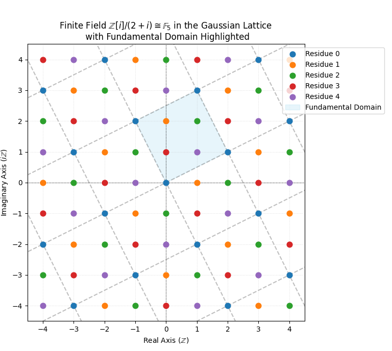
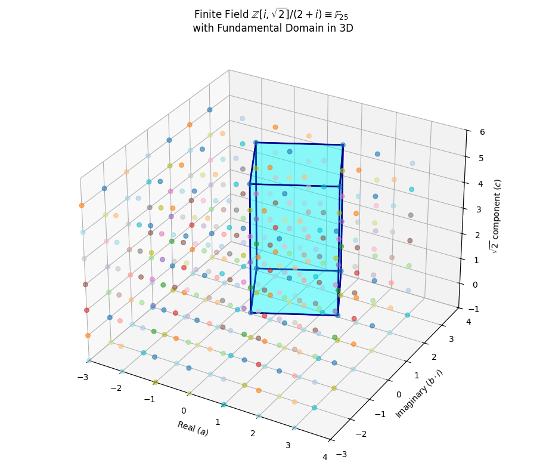

### **NOTES ON STATISTICS, PROBABILITY and MATHEMATICS**

---

t### Rings of integers in field extensions, integer prime ideals, finite fields and Frobenius automorphism:

---

<h3 style="text-align: left; color: #2c3e50; font-family: Inter, system-ui, sans-serif; font-weight: 300; border-bottom: 2px solid #2c3e50; padding-bottom: 0.2em;">
Motivation & Terminology:
</h3>

<h4 style="text-align: left; color: #2c3e50; font-family: Inter, system-ui, sans-serif; font-weight: 300; border-bottom: 2px solid #2c3e50; padding-bottom: 0.2em;">
The Ring of Integers $\mathcal{O}_K$
</h4>

When we solve polynomial equations over $\mathbb{Q}$, we often need to adjoin new elements—like $\sqrt{2}$, $\sqrt{-2}$, or $i = \sqrt{-1}$. Adjoining these elements creates a number field $K$, which is a finite-dimensional vector space over $\mathbb{Q}$. To do arithmetic, we need a subring of $K$ that generalizes the ordinary integers $\mathbb{Z}$.

Algebraic Integers: An element $\alpha \in K$ is called an algebraic integer if it is a root of a monic polynomial (leading coefficient $1)$ with coefficients in $\mathbb{Z}$:

$$x^n + a_{n-1}x^{n-1} + \dots + a_1 x + a_0 = 0 \quad (a_i \in \mathbb{Z})$$

The Ring of Integers $\mathcal{O}_K$:

The set of all algebraic integers in a number field $K$ forms a ring, denoted $\mathcal{O}_K$ (read as "O-K" or "the ring of integers of $K$"):

$$\mathcal{O}_K :=\{\alpha \in K \mid \alpha \text{ is integer over } \mathbb{Z}\}$$

$\mathcal{O}_K$ plays the exact same role in $K$ that $\mathbb{Z}$ plays in $\mathbb{Q}$.

Concrete Examples of $\mathcal{O}_K$

<h5 style="text-align: left; color: #2c3e50; font-family: Inter, system-ui, sans-serif; font-weight: 300; border-bottom: 2px solid #2c3e50; padding-bottom: 0.2em;">
Gaussian Integers
</h5>

$K = \mathbb{Q}(i)$ Here, the degree of $K/\mathbb{Q}$ is $[K : \mathbb{Q}] = 2$, with basis $\{1, i\}$. An element $a + bi \in \mathbb{Q}(i)$ has minimal polynomial $x^2 - 2ax + (a^2 + b^2)$. For the coefficients of this polynomial to be in $\mathbb{Z}$, both $a$ and $b$ must be integers. Thus:

$$\mathcal{O}_{\mathbb{Q}(i)} = \mathbb{Z}[i] = \{a + bi \mid a, b \in \mathbb{Z}\}$$

<h5 style="text-align: left; color: #2c3e50; font-family: Inter, system-ui, sans-serif; font-weight: 300; border-bottom: 2px solid #2c3e50; padding-bottom: 0.2em;">
Other Quadratic Fields:
</h5>

$K = \mathbb{Q}(\sqrt{-2})$: Here $\mathcal{O}_K = \mathbb{Z}[\sqrt{-2}] = \{a + b\sqrt{-2} \mid a, b \in \mathbb{Z}\}$.

$K = \mathbb{Q}(\sqrt{2})$: Here $\mathcal{O}_K = \mathbb{Z}[\sqrt{2}] = \{a + b\sqrt{2} \mid a, b \in \mathbb{Z}\}$.

<h5 style="text-align: left; color: #2c3e50; font-family: Inter, system-ui, sans-serif; font-weight: 300; border-bottom: 2px solid #2c3e50; padding-bottom: 0.2em;">
Higher Degree / Composite Fields:
</h5>

$K = \mathbb{Q}(i, \sqrt{2})$: This is a degree 4 field over $\mathbb{Q}$, generated by adjoining both $i$ and $\sqrt{2}$. Its ring of integers is:$$\mathcal{O}_K = \mathbb{Z}[i, \sqrt{2}] = \{a + bi + c\sqrt{2} + d(i\sqrt{2}) \mid a, b, c, d \in \mathbb{Z}\}$$Notice that as a $\mathbb{Z}$-module, $\mathcal{O}_K$ is free of rank $[K:\mathbb{Q}] = 4$, with $\mathbb{Z}$-basis $\{1, i, \sqrt{2}, i\sqrt{2}\}$.

<h3 style="text-align: left; color: #2c3e50; font-family: Inter, system-ui, sans-serif; font-weight: 300; border-bottom: 2px solid #2c3e50; padding-bottom: 0.2em;">
Prime Ideals in $\mathcal{O}_K$
</h3>

In ordinary integers $\mathbb{Z}$, numbers factor into prime numbers. In general rings of integers $\mathcal{O}_K$, unique element factorization can fail (e.g., in $\mathbb{Z}[\sqrt{-5}]$, $6 = 2 \cdot 3 = (1+\sqrt{-5})(1-\sqrt{-5})$). Similarly, $5$ is not a prime in the Gaussian integers, since it can be decomposed as $5=(2+i)(2-i)$ To restore unique factorization, Richard Dedekind shifted focus from elements to ideals. In a ring of integers $\mathcal{O}_K$, every nonzero proper ideal factors uniquely into a product of prime ideals.

When we view a rational prime $p$ as generating an ideal $(p) = p\mathcal{O}_K$ in $\mathcal{O}_K$, it may no longer remain prime. It can break apart into prime ideals of $\mathcal{O}_K$:

$$p\mathcal{O}_K = \mathfrak{p}_1^{e_1} \mathfrak{p}_2^{e_2} \cdots \mathfrak{p}_g^{e_g}$$

The Gaussian Example ($p = 5$). In $K = \mathbb{Q}(i)$ and $\mathcal{O}_K = \mathbb{Z}[i]$:

Consider the rational prime $p = 5$. In $\mathbb{Z}[i]$, $5$ factors as $(2+i)(2-i)$. The ideal generated by $5$ splits into two distinct prime ideals:

$$5\mathbb{Z}[i] = (2+i)(2-i) = \mathfrak{p}_1 \cdot \mathfrak{p}_2$$

Here $\mathfrak{p}_1 = (2+i)$ is a prime ideal of $\mathbb{Z}[i]$. It consists of all multiples:

$$\mathfrak{p}_1 = \{(a+bi)(2+i) \mid a,b \in \mathbb{Z}\}$$

<h3 style="text-align: left; color: #2c3e50; font-family: Inter, system-ui, sans-serif; font-weight: 300; border-bottom: 2px solid #2c3e50; padding-bottom: 0.2em;">
Modulo a Prime Ideal: Constructing Finite Residue Fields
</h3>

In $\mathbb{Z}$, taking the quotient by the ideal $(p) = p\mathbb{Z}$ yields the finite field $\mathbb{Z}/p\mathbb{Z} = \mathbb{F}_p$. Similarly, taking the quotient of a ring of integers $\mathcal{O}_K$ by a maximal prime ideal $\mathfrak{p}$ produces a residue class field:

$$\mathbb{F}_q := \mathcal{O}_K / \mathfrak{p}$$

Because $\mathfrak{p}$ sits above some rational prime $p$ (meaning $p \in \mathfrak{p}$), the field $\mathcal{O}_K/\mathfrak{p}$ contains $\mathbb{Z}/p\mathbb{Z} \cong \mathbb{F}_p$ as its base subfield.

This is the quotient of $\mathbb Z[i]/(2+i)$ with the fundamental domain:

---

And this is the quotient of $\mathbb Z[i,\sqrt2]/(2+i)\cong \mathbb F_{25}:$

---

Inertia degree ($f$) and "horizontal extension": The quotient field $\mathcal{O}_K/\mathfrak{p}$ is a vector space over $\mathbb{F}_p$. Its dimension $f = [\mathcal{O}_K/\mathfrak{p} : \mathbb{F}_p]$ is called the inertia degree (or residue degree) of $\mathfrak{p}$. The number of elements in the finite field is:

$$q = N(\mathfrak{p}) = p^f$$

This process expands the finite field horizontally from $\mathbb{F}_p$ to its degree-$f$ field extension $\mathbb{F}_{p^f}$:

$$\mathbb{F}_p \xrightarrow{\quad \text{degree } f \quad} \mathbb{F}_{p^f} \cong \mathcal{O}_K / \mathfrak{p}$$

Concrete Examples of Residue Field Constructions:

Example A: $\mathbb{F}_{25}$ from $\mathbb{Z}[i]$ modulo an Inert Prime ($p = 3$). In $\mathbb{Z}[i]$, $p=3$ remains prime (it is inert), so $\mathfrak{p} = (3) = 3\mathbb{Z}[i]$. The quotient is:

$$\mathbb{F}_q = \mathbb{Z}[i] / (3)$$

Every element in $\mathbb{Z}[i]$ can be written as $a + bi$. Modulo $3,$ $a, b \in \{0, 1, 2\} = \mathbb{F}_3$.

The basis vectors for $\mathbb{Z}[i]/(3)$ over $\mathbb{F}_3$ are $\{1, i\}$. Any element in this field takes the form:

$$a + bi \quad \text{with } a, b \in \mathbb{F}_3$$

Total size: $3^2 = 9$ elements ($\mathbb{F}_9$).

Example B: Higher Dimensional Extension $\mathbb{F}_{p^f}$. Consider a composite extension like $K = \mathbb{Q}(i, \sqrt{2})$ with $\mathcal{O}_K = \mathbb{Z}[i, \sqrt{2}]$. Suppose $\mathfrak{p}$ is a prime ideal in $\mathcal{O}_K$ lying over $p$. The elements of $\mathcal{O}_K / \mathfrak{p}$ are represented by linear combinations of the ring generators modulo $\mathfrak{p}$:

$$a + bi + c\sqrt{2} + d(i\sqrt{2}) \pmod{\mathfrak{p}}$$
where the coefficients $a, b, c, d$ are restricted to the base field choices $\{0, 1, \dots, p-1\} \cong \mathbb{F}_p$.As an $\mathbb{F}_p$-vector space, the field has basis $\{1, i, \sqrt{2}, i\sqrt{2}\}$ (or a subset depending on how $p$ splits/decomposes), yielding a finite field $\mathbb{F}_{p^f}$ of size $p^f$ ($f \le 4$).

<h3 style="text-align: left; color: #2c3e50; font-family: Inter, system-ui, sans-serif; font-weight: 300; border-bottom: 2px solid #2c3e50; padding-bottom: 0.2em;">
The Frobenius Automorphism:
</h3>

Now we bring all these pieces together: finite fields, prime decomposition, and Galois groups.

The motivation is constructing a canonical symmetry in characteristic $p$. In a finite field $\mathbb{F}_q = \mathbb{F}_{p^f}$, consider the map that raises every element to the $p$-th power:

$$\sigma_p : \mathbb{F}_q \to \mathbb{F}_q, \quad x \mapsto x^p$$

By freshman's dream, $(x + y)^p = x^p + y^p$ in characteristic $p$, because in a finite field of characteristic $p,$ which means that $\underset{p}{\underbrace{1+1+\cdots+1}}=0,$ the binomial expansion contains multiples of $p$ in every mixed $x^ky^{p-k}$ term.

The binomial expansion in a ring gives:

$$(x + y)^p = \sum_{k=0}^{p} \binom{p}{k} x^k y^{p-k} = x^p + y^p + \sum_{k=1}^{p-1} \binom{p}{k} x^k y^{p-k}$$

For any prime $p$ and index $1 \le k \le p-1$, the binomial coefficient is:

$$\binom{p}{k} = \frac{p!}{k!(p-k)!}$$

Since $p$ is prime, it divides $p!$ but does not divide $k!$ or $(p-k)!$. Thus, $p \mid \binom{p}{k}$. In a field of characteristic $p$, $p \cdot 1 = 0$, so every intermediate term vanishes mod $p$. This proves $(x + y)^p = x^p + y^p$.

In addition $(xy)^p = x^p y^p$. 

These two properties the guaranteed that the Frobenius endomorphism $\sigma_p(x) = x^p$ is a field automorphism over a commutative ring or field of characteristic $p$. Given a field $R=\mathbb F_q,$ (while the proof specifically establishes that the Frobenius map is an automorphism when applied to a field (often denoted $F$ or $K$), the core identity $(x + y)^p = x^p + y^p$ actually holds true in any commutative ring of characteristic $p$—not just in fields) define the map $\sigma_p : R \to R$ by $\sigma_p(x) = x^p$.

Homomorphism: Because 

$$\sigma_p(x + y) = \sigma_p(x) + \sigma_p(y)$$ and 

$$\sigma_p(xy) = \sigma_p(x)\sigma_p(y)$$, 

$\sigma_p$ is a ring/field homomorphism.

Injectivity: If $R = \mathbb{F}_q$ is a finite field, $\ker(\sigma_p) = \{0\}$ (since $x^p = 0 \implies x = 0$ in a field), making $\sigma_p$ injective.

Automorphism: Since any injective map from a finite set to itself is surjective, $\sigma_p$ is a bijective field homomorphism, and therefore a field automorphism.

To conclude that $\sigma_p$ is an automorphism (a bijective homomorphism from a field to itself) we observe:

1. Any field homomorphism $\phi : F \to F$ is automatically injective (since the kernel is an ideal, and fields have no non-trivial ideals). 

2. Because $\mathbb{F}_q$ is a finite set, an injective map from $\mathbb{F}_q$ to itself is automatically surjective.

Moreover, by Fermat's Little Theorem, $\sigma_p(a) = a^p \equiv a \pmod p$ for all $a \in \mathbb{F}_p$, meaning $\sigma_p$ keeps the base field $\mathbb{F}_p$ fixed.

$\sigma_p$ is called the Frobenius Automorphism. 

The Galois Group of Finite Fields: The Galois group of a finite field extension $\mathrm{Gal}(\mathbb{F}_{p^f} / \mathbb{F}_p)$ is cyclic of order $f$, and it is canonically generated by the Frobenius automorphism:

$$\mathrm{Gal}(\mathbb{F}_{p^f} / \mathbb{F}_p) = \langle \sigma_p \rangle = \{ \mathrm{id}, \sigma_p, \sigma_p^2, \dots, \sigma_p^{f-1} \}$$

Connecting Local Frobenius to Global Number Fields Now let's link this back to number fields $K/\mathbb{Q}$ and $\mathcal{O}_K$:

Global Unramified Extension: Let $K/\mathbb{Q}$ be a Galois extension with Galois group $G = \mathrm{Gal}(K/\mathbb{Q})$. 

Local Quotients: Pick a prime ideal $\mathfrak{P} \subset \mathcal{O}_K$ lying over $p \in \mathbb{Z}$. The quotient gives the residue field extension $\mathbb{F}_{p^f} / \mathbb{F}_p$.

Lifting Frobenius: There exists a unique element in the global Galois group $G$, called the Frobenius element $\mathrm{Frob}_{\mathfrak{P}}$, that acts on the ring of integers $\mathcal{O}_K$ in a way that matches the local Frobenius map on the residue field:

$$\mathrm{Frob}_{\mathfrak{P}}(x) \equiv x^p \pmod{\mathfrak{P}} \quad \text{for all } x \in \mathcal{O}_K$$

Why is Frobenius the central engine of number theory? The order of the element $\mathrm{Frob}_{\mathfrak{P}}$ in the Galois group $G$ is precisely $f$, the inertia degree of $\mathfrak{P}$!

Predicts Prime Decomposition: If $\mathrm{Frob}_{\mathfrak{P}} = \mathrm{id}$ (order $1),$ then $f = 1$, which means $p$ splits completely in $K$. If $\mathrm{Frob}_{\mathfrak{P}}$ generates a large cyclic subgroup, $p$ is inert or stays in large degrees. 

Taking the inverse limit over all finite extensions yields the absolute Galois group $\mathrm{Gal}(\bar{\mathbb{F}}_p/\mathbb{F}_p) \cong \widehat{\mathbb{Z}}$, where the global Frobenius element acts as the fundamental unit $1 \in \widehat{\mathbb{Z}}$.

<h3 style="text-align: left; color: #2c3e50; font-family: Inter, system-ui, sans-serif; font-weight: 300; border-bottom: 2px solid #2c3e50; padding-bottom: 0.2em;">
The Absolute Galois Group and the Profinite Completion $\widehat{\mathbb{Z}}$
</h3>

The profinite completion of the integers, denoted as $\widehat{\mathbb{Z}}$, is the algebraic structure obtained by taking the inverse limit of all finite quotients of $\mathbb{Z}$. It serves as a foundational object in algebraic number theory, modern Galois theory, and arithmetic geometry.

The primary occurrence of $\widehat{\mathbb{Z}}$ in field theory is as the absolute Galois group of a finite field $\mathbb{F}_q$:$$\mathrm{Gal}(\bar{\mathbb{F}}_q / \mathbb{F}_q) \cong \widehat{\mathbb{Z}}$$The canonical topological generator of this group corresponds to $1 \in \widehat{\mathbb{Z}}$, which maps to the Frobenius endomorphism $x \mapsto x^q$.

Every element of $\widehat{\mathbb{Z}}$ is an infinite list or vector of remainders $(a_1, a_2, a_3, a_4, \dots)$, where the $n$-th entry $a_n$ is a remainder modulo $n$. This is directly tied to the Chinese Remainder Theorem (CRT). But there is one crucial twist that separates the regular integers $\mathbb{Z}$ from the full completion $\widehat{\mathbb{Z}}$. If you pick a regular integer like $x = 7$, its infinite vector looks like:

$$x = (\overbrace{0 \bmod 1}^{a_1}, \; \overbrace{1 \bmod 2}^{a_2}, \; \overbrace{1 \bmod 3}^{a_3}, \; \overbrace{3 \bmod 4}^{a_4}, \; \overbrace{2 \bmod 5}^{a_5}, \; \overbrace{1 \bmod 6}^{a_6}, \; \dots)$$

If you stop at any finite point—say, looking only at $a_2, a_3,$ and $a_5$: 

$x \equiv 1 \pmod 2$

$x \equiv 1 \pmod 3$

$x \equiv 2 \pmod 5$

The Chinese Remainder Theorem guarantees there is a unique integer modulo $2 \times 3 \times 5 = 30$ that solves this system (here, $7 \bmod 30$). Every regular integer $x \in \mathbb{Z}$ generates a valid infinite vector where every single finite truncation is solved by $x$ itself.

However, you can't just throw any random numbers into this infinite vector. For the vector $(a_1, a_2, a_3, \dots)$ to be a valid element of $\widehat{\mathbb{Z}}$, the entries must agree with each other whenever one modulus divides another. If $n$ divides $m$, then $a_m \bmod n$ must equal $a_n$.

$a_6 = 5 \implies a_2 = 1$ and $a_3 = 2$ (because $5 \equiv 1 \bmod 2$ and $5 \equiv 2 \bmod 3$).

$a_6 = 5$ and $a_2 = 0$ would be invalid. (This breaks down because $5 \not\equiv 0 \pmod 2$).

Imagine a sequence where we pick remainders that fit together perfectly:

Mod $2:$ $1$

Mod $6:$ $3$ (notice $3 \bmod 2 = 1$, so it agrees with Mod $2)$

Mod $24:$ $23$ (notice $23 \bmod 6 = 3$, so it agrees with Mod $6)$

Every step agrees with the previous steps. But if you keep going forever, the sequence of remainders doesn't belong to any standard integer like $5$ or $-12$. It belongs to an infinite limit of integers — a point in $\widehat{\mathbb{Z}}$.

For any finite number of entries, CRT guarantees you can find a regular integer $x$ that matches those entries. But as you look further and further down the infinite vector, that matching integer $x$ might keep changing and growing without bound! In this way, $\hat {\mathbb Z}$ is larger than $\mathbb Z.$

---

So far, for a fixed degree-$f$ extension, the Galois group $\mathrm{Gal}(\mathbb{F}_{p^f}/\mathbb{F}_p)$ is a finite cyclic group of order $f$, isomorphic to $\mathbb{Z}/f\mathbb{Z}$.

What happens if we take <em>all</em> finite extensions $\mathbb{F}_{p^f}$ inside the algebraic closure $\overline{\mathbb{F}}_p$ simultaneously?

Any automorphism $\sigma$ of the algebraic closure $\overline{\mathbb{F}}_p$ must act consistently on every finite subfield $\mathbb{F}_{p^f}$. If $f \mid m$, the restriction of $\sigma$ to $\mathbb{F}_{p^m}$ must reduce to its action on $\mathbb{F}_{p^f}$. 

In terms of exponents of the Frobenius map $\sigma_p$, this requires a sequence of compatible exponents $(a_1, a_2, a_3, \dots)$ satisfying:

$$a_m \equiv a_f \pmod f \quad \text{whenever } f \mid m$$

This system forms the <strong>profinite completion of the integers</strong>, denoted $\widehat{\mathbb{Z}}$:

$$\widehat{\mathbb{Z}} := \varprojlim_{f} \mathbb{Z}/f\mathbb{Z} \cong \prod_{p \text{ prime}} \mathbb{Z}_p$$

This yields the fundamental isomorphism for the absolute Galois group of finite fields:

$$\mathrm{Gal}(\overline{\mathbb{F}}_p / \mathbb{F}_p) \cong \widehat{\mathbb{Z}}$$

Under this identification:

* The topological generator $1 \in \widehat{\mathbb{Z}}$ corresponds to the <strong>absolute Frobenius automorphism</strong> $x \mapsto x^p$ (🪁)

* The ordinary integers $\mathbb{Z} \subset \widehat{\mathbb{Z}}$ correspond to standard integer powers of Frobenius ($\sigma_p^k$).

* Elements in $\widehat{\mathbb{Z}} \setminus \mathbb{Z}$ represent generalized "limit" automorphisms that act consistently across all finite subfields, completing $\mathrm{Gal}(\overline{\mathbb{F}}_p / \mathbb{F}_p)$ into a compact topological group.

---

🪁 We are interested in fields of $p^n$ elements because they are the only finite fields that can possibly exist. Every finite field contains a copy of prime integers modulo $p$, which is $\mathbb{F}_p = \{0, 1, \dots, p-1\}.$

If $F$ is a finite field, since $\mathbb{F}_p \subseteq F$, we can multiply elements of $F$ by scalars in $\mathbb{F}_p$. Because $F$ is finite, it must be a finite-dimensional vector space over $\mathbb{F}_p$. Every vector space of dimension $n$ over a base field of size $p$ looks like $\mathbb{F}_p^n$. Choosing a basis $\{v_1, v_2, \dots, v_n\}$, every element in $F$ can be written uniquely as:

$$c_1 v_1 + c_2 v_2 + \dots + c_n v_n \quad \text{where each } c_i \in \mathbb{F}_p$$

Since there are $p$ choices for each of the $n$ coefficients $c_i$, the total number of elements in $F$ is:

$$\underbrace{p \times p \times \dots \times p}_{n \text{ times}} = p^n$$

Every single element of a field with $q = p^n$ elements MUST be a root of the polynomial $x^{p^n} - x$. Why?

Suppose $K$ is a finite field with $q$ elements (where $q = p^n$).

If you take away $0$, the remaining set of non-zero elements—written $K^\times$—forms a multiplicative group of size $q - 1$. The order of the group $K^\times$ is $q - 1$.

Lagrange's Theorem states that for any finite group $G$ and any element $x \in G$ the order of $x$ (let's call it $d = \vert{}x\vert{}$) is the smallest positive integer such that $x^d = 1$. The order $d$ must divide the order of the group $\vert{}G\vert{}$. Since $d$ divides $\vert{}G\vert{}$, we can write $\vert{}G\vert{} = d \cdot k$ for some integer $k$. Now, raising $x$ to the power of the group's order $\vert{}G\vert{}$:

$$x^{\vert{}G\vert{}} = x^{d \cdot k} = (x^d)^k = 1^k = 1$$

Plugging in our group $G = K^\times$, whose order is $\vert{}G\vert{} = q - 1$:

$$x^{q-1} = 1 \quad \text{for every } x \in K^\times$$

Now multiply both sides of this equation by $x$:

$$x \cdot x^{q-1} = x \cdot 1 \implies x^q = x$$

Subtract $x$ from both sides:

$$x^q - x= x^{p^n} - x = 0$$

The finite field $\mathbb{F}_{p^n}$ is the unique splitting field of $x^{p^n} - x$ over $\mathbb{F}_p$. Its Galois group $\mathrm{Gal}(\mathbb{F}_{p^n} / \mathbb{F}_p)$ consists of field automorphisms fixing $\mathbb{F}_p$. This group is cyclic of order $n$, generated by the local Frobenius map $\sigma_p(x) = x^p$:

$$\mathrm{Gal}(\mathbb{F}_{p^n} / \mathbb{F}_p) = \langle \sigma_p \rangle \cong \mathbb{Z}/n\mathbb{Z}$$

The Galois group $\mathrm{Gal}(\mathbb{F}_{p^n} / \mathbb{F}_p)$ is the group of all field automorphisms of $\mathbb{F}_{p^n}$ that keep every element of $\mathbb{F}_p$ fixed. The local Frobenius map $\sigma_p : \mathbb{F}_{p^n} \to \mathbb{F}_{p^n}$ is defined by $\sigma_p(x) = x^p$. If you compose $\sigma_p$ with itself $k$ times, you get:

$$\sigma_p^k(x) = x^{p^k}$$

What happens when you apply it $n$ times?

$$\sigma_p^n(x) = x^{p^n}$$

As we established earlier, every element $x \in \mathbb{F}_{p^n}$ satisfies $x^{p^n} = x$. Therefore, $\sigma_p^n$ is the identity map ($\mathrm{id}$).

By fundamental Galois theory for finite fields, the size (order) of the Galois group of a field extension matches the degree of the extension:$$\vert{}\mathrm{Gal}(\mathbb{F}_{p^n} / \mathbb{F}_p)\vert{} = [\mathbb{F}_{p^n} : \mathbb{F}_p] = n$$Since we found an element $\sigma_p$ inside a group of size $n$, and $\sigma_p$ has order $n$, $\sigma_p$ must generate the entire group:

$$\mathrm{Gal}(\mathbb{F}_{p^n} / \mathbb{F}_p) = \{\mathrm{id}, \sigma_p, \sigma_p^2, \dots, \sigma_p^{n-1}\} = \langle \sigma_p \rangle$$

Any finite group of order $n$ generated by a single element is, by definition, a cyclic group of order $n$.We can write down an explicit group isomorphism $\phi$:

$$\phi : \mathbb{Z}/n\mathbb{Z} \longrightarrow \mathrm{Gal}(\mathbb{F}_{p^n} / \mathbb{F}_p)$$

$$k \pmod n \longmapsto \sigma_p^k$$

Applying $\sigma_p$ $n$ times yields $x^{p^n} = x$, which is the identity map on $\mathbb{F}_{p^n}$.

The algebraic closure $\overline{\mathbb{F}}_p$ is the union (or direct limit) of all finite extensions $\mathbb{F}_{p^n}$ for $n \ge 1$, ordered by divisibility:

$$\overline{\mathbb{F}}_p = \bigcup_{n \ge 1} \mathbb{F}_{p^n}$$

By Infinite Galois Theory (Krull's theorem), the absolute Galois group of an infinite extension is the inverse limit (projective limit) of the Galois groups of its finite subextensions:

$$\mathrm{Gal}(\overline{\mathbb{F}}_p / \mathbb{F}_p) \cong \varprojlim_{n} \mathrm{Gal}(\mathbb{F}_{p^n} / \mathbb{F}_p) \cong \varprojlim_{n} (\mathbb{Z} / n\mathbb{Z})$$

The inverse limit $\varprojlim_n (\mathbb{Z}/n\mathbb{Z})$ is by definition $\widehat{\mathbb{Z}}$, the profinite completion of the integers.

By the Chinese Remainder Theorem, $\widehat{\mathbb{Z}}$ decomposes into a product over all prime numbers $l$:

$$\widehat{\mathbb{Z}} \cong \prod_{l \text{ prime}} \mathbb{Z}_l$$

where $\mathbb{Z}_l$ is the ring of $l$-adic integers.Because $\widehat{\mathbb{Z}}$ is uncountable while $\mathbb{Z}$ is countable, the ordinary integers $\mathbb{Z}$ do not fill out all of $\widehat{\mathbb{Z}}$. However, under the Krull topology (the inverse limit topology), the canonical image of $\mathbb{Z}$ inside $\widehat{\mathbb{Z}}$ is dense.

The absolute Frobenius automorphism $\Phi_p \in \mathrm{Gal}(\overline{\mathbb{F}}_p / \mathbb{F}_p)$ is defined globally as:

$$\Phi_p(x) = x^p \quad \text{for all } x \in \overline{\mathbb{F}}_p$$

Under the projection map to each finite subextension $\mathbb{F}_{p^n}$, $\Phi_p$ acts as the generator $1 \pmod n \in \mathbb{Z}/n\mathbb{Z}$.

The algebraic closure $\overline{\mathbb{F}}_p$ contains every finite field $\mathbb{F}_{p^n}$ for all $n \ge 1$. If $a$ divides $b$, then $\mathbb{F}_{p^a}$ is a subfield of $\mathbb{F}_{p^b}$. For instance:

$\mathbb{F}_p \subset \mathbb{F}_{p^2} \subset \mathbb{F}_{p^4} \subset \dots$

$\mathbb{F}_p \subset \mathbb{F}_{p^3} \subset \mathbb{F}_{p^6} \subset \dots$

An element $x \in \overline{\mathbb{F}}_p$ doesn't float around in an abstract void—it lives in some finite extension $\mathbb{F}_{p^n}$.

The map $\Phi_p$ (the absolute Frobenius $\Phi_p$) is defined globally across the entire infinite field $\overline{\mathbb{F}}_p$ by the exact same rule everywhere:

$$\Phi_p(x) = x^p$$

Now, what happens if you take an element $x$ that happens to sit inside a specific subfield $\mathbb{F}_{p^n}$?

When you apply $\Phi_p$ once, $x \mapsto x^p$.

When you apply it twice ($\Phi_p^2$), $x \mapsto x^{p^2}$.

When you apply it $k$ times ($\Phi_p^k$), $x \mapsto x^{p^k}$.

The Galois group of that specific subfield is cyclic of order $n$:

$$\mathrm{Gal}(\mathbb{F}_{p^n} / \mathbb{F}_p) = \{\mathrm{id}, \sigma_p, \sigma_p^2, \dots, \sigma_p^{n-1}\} \cong \mathbb{Z}/n\mathbb{Z}$$

Under the isomorphism $\mathrm{Gal}(\mathbb{F}_{p^n} / \mathbb{F}_p) \cong \mathbb{Z}/n\mathbb{Z}$:

The identity map $\mathrm{id} = \Phi_p^0$ corresponds to $0 \pmod n$.

The map $\Phi_p^1 = (x \mapsto x^p)$ corresponds to $1 \pmod n$.

The map $\Phi_p^2 = (x \mapsto x^{p^2})$ corresponds to $2 \pmod n$.

The map $\Phi_p^k = (x \mapsto x^{p^k})$ corresponds to $k \pmod n$.

Concrete Example: 

Suppose $p = 2$. The absolute Frobenius is $\Phi_2(x) = x^2$.

Let's "project" (restrict) $\Phi_2$ to three different subfields embedded in $\overline{\mathbb{F}}_2$:

In $\mathbb{F}_{2^2}$ (order $2$):

$\mathrm{Gal}(\mathbb{F}_4 / \mathbb{F}_2) \cong \mathbb{Z}/2\mathbb{Z} = \{0, 1\}$.

$\Phi_2$ acts as $x \mapsto x^2$, which is the element $1 \pmod 2$. (Note: $\Phi_2^2(x) = x^4 = x$, which brings you back to $0 \pmod 2$.)

In $\mathbb{F}_{2^3}$ (order $3$):

$\mathrm{Gal}(\mathbb{F}_8 / \mathbb{F}_2) \cong \mathbb{Z}/3\mathbb{Z} = \{0, 1, 2\}$.

$\Phi_2$ acts as $x \mapsto x^2$, which is the element $1 \pmod 3$.

In $\mathbb{F}_{2^{12}}$ (order $12$):

$\mathrm{Gal}(\mathbb{F}_{2^{12}} / \mathbb{F}_2) \cong \mathbb{Z}/12\mathbb{Z} = \{0, 1, 2, \dots, 11\}$.

$\Phi_2$ acts as $x \mapsto x^2$, which is the element $1 \pmod{12}$.

When we represent an element of the global Galois group $\mathrm{Gal}(\overline{\mathbb{F}}_p / \mathbb{F}_p)$ as an infinite sequence of its local actions on $(\mathbb{F}_p, \mathbb{F}_{p^2}, \mathbb{F}_{p^3}, \mathbb{F}_{p^4}, \dots)$, the single map $\Phi_p$ turns into:

$$\Phi_p \longmapsto (1 \pmod 1, \; 1 \pmod 2, \; 1 \pmod 3, \; 1 \pmod 4, \; \dots)$$

In the profinite completion $\widehat{\mathbb{Z}} = \varprojlim (\mathbb{Z}/n\mathbb{Z})$, the sequence $(1, 1, 1, 1, \dots)$ is the canonical generator $1 \in \widehat{\mathbb{Z}}$.

Test:

Let's test the Frobenius map on the elements of $\mathbb{F}_4$ (where $p=2$) to see exactly what it does. The Frobenius map here is $\Phi_2(x) = x^2$. 

The elements of $\mathbb{F}_4$ are $\{0, 1, \alpha, \alpha+1\}$, where $\alpha^2 + \alpha + 1 = 0$.

Why? To build a bigger field, we need a polynomial over $\mathbb{F}_2$ that doesn't have any roots in $\mathbb{F}_2$ (an irreducible polynomial). Let's test $f(x) = x^2 + x + 1$ using the elements of $\mathbb{F}_2$: 

Plug in $0$: $0^2 + 0 + 1 = 1 \neq 0$

Plug in $1$: $1^2 + 1 + 1 = 3 \equiv 1 \pmod 2 \neq 0$

Since neither $0$ nor $1$ works, $x^2 + x + 1$ has no roots in $\mathbb{F}_2$. So you invent a root $\alpha$: Just like we invent $i = \sqrt{-1}$ to extend the real numbers $\mathbb{R}$ to the complex numbers $\mathbb{C}$, we invent a new element—let's call it $\alpha$—and declare that it satisfies:

$$\alpha^2 + \alpha + 1 = 0$$

If we apply $x \mapsto x^2$ to each element:

$0^2 = 0$

$1^2 = 1$

$\alpha^2 = \alpha + 1$ (using our rule $\alpha^2 + \alpha + 1 = 0$, which means $\alpha^2 = -\alpha - 1$, and since $p=2$, minus is the same as plus) $(\alpha+1)^2 = \alpha^2 + 1 = (\alpha + 1) + 1 = \alpha + 2 = \alpha$

The elements $\alpha$ and $\alpha+1$ just swapped places. 

Therefore, **the Frobenius map does not leave all elements unchanged. It actively shuffles elements around, and only leaves the base field $\mathbb{F}_p$ (in this case, $0$ and $1$) completely untouched.** 
It is easy to mix up the two equations at play here: $x^p = x$: This only works for the $p$ elements in the base field $\mathbb{F}_p$. For anything in a larger extension, $x^p$ moves the element somewhere else. 

$x^{p^n} = x$: This works for all elements in $\mathbb{F}_{p^n}$, but it represents applying the Frobenius map $n$ times in a row. Think of the Frobenius map like a 90-degree rotation of a square. One turn (applying $x^p$) doesn't leave the square unchanged — it moves all the corners to new positions. But if you do it exactly $4$ times (applying $x^{p^4}$), every corner lands exactly back where it started.Because one application of Frobenius systematically shuffles the roots of polynomials into each other, it acts as the basic "generator" or "single click" from which all other symmetries in the Galois group are built.

---
<a href="http://rinterested.github.io/statistics/index.html">Home Page</a>

**NOTE: These are tentative notes on different topics for personal use - expect mistakes and misunderstandings.**
