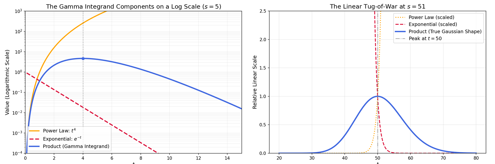

### **NOTES ON STATISTICS, PROBABILITY and MATHEMATICS**

---

Loosely speaking, gamma function is the inner product from $0$ to $\infty$ of a **power law** $t^{s-1}$ and an **exponential** $e^{-t}.$ The term power law implies that the exponent $s$ is not a whole number as it would be in a polynomial function - instead, $s$ can be a fraction or a complex number (provided its real part is positive for the integral to converge), with the function extended to negative values via analytic continuation.

$$\small\text{Gamma Function:} \quad \Gamma(s) = \int_0^\infty t^{s-1} \; e^{-t} \, dt$$

This structure repeats itself in math. Comparing to a **Laplace transform**:

$$\small\text{Laplace Transform:} \quad \mathcal{L}\{f(t)\}(s) = \int_0^\infty f(t) \; e^{-st} \, dt$$

The Gamma function is explicitly the Laplace transform of a basic power law, evaluated at a specific scaling factor.

It is also the **Mellin transform** of the basic exponential function $f(t) = e^{-t}$.

$$\small\text{Mellin Transform:} \quad \mathcal{M}\{f(t)\}(s) = \int_0^\infty t^{s-1} \;f(t) \, dt$$

Originally, Euler formulated it to turn the factorial function into a continued function. 

Notice that the function is eventually brought to zero by the exponential component as $t\to \infty,$ guaranteeing integrability. To understand how the integrand of the gamma function, $t^n e^{-t}$, manages to grow so colossally as to reproduce the factorials, we have to look at a classic mathematical tug-of-war. At first glance, it feels counterintuitive. We are taught early on that "exponential decay always beats a power law as $x \to \infty$." That is absolutely true in the limit. If we pick a fixed $n$ and let $t$ run to infinity, $e^{-t}$ completely crushes $t^n$, dragging the product down to zero. But the magic of the gamma function,

$$\Gamma(n+1) = \int_0^\infty t^n e^{-t} \, dt = n!$$

isn't about what happens at $t \to \infty$. It is about the massive, temporary spike that occurs before the exponential take-over happens. As $n$ grows, this spike becomes a towering, concentrated mountain of area.

The product $t^n e^{-t}$ starts at $0$ (for $t=0$) and ends at $0$ (as $t \to \infty$). Somewhere in the middle, it must hit a maximum.If we take the derivative with respect to $t$ and set it to zero we'll find that the peak occurs exactly at $t = n$. As $n$ grows, the location of this peak gets pushed further and further out to the right. Because the peak moves out, the power law $t^n$ is given a massive runway to grow to astronomical heights before the exponential decay can clamp down on it.

The actual value of the function at this peak ($x = n$) is

$$\text{Peak Height} = n^n e^{-n} = \left(\frac{n}{e}\right)^n$$

This height itself grows at a staggering, supra-exponential rate. 

The total area under the curve is the factorial. To see how this concentrated peak accounts for the entire integral, we can look at the behavior near $x = n$ by rewriting the integrand using logs:

$$x^n e^{-x} = e^{n \ln x - x}$$

If we do a Taylor expansion of the exponent $f(x) = n \ln x - x$ around its peak at $x = n$, we get: 

$$f(n) = n \ln n - n$$

$$f'(n) = 0$$
$$f''(n) = -\frac{n}{n^2} = -\frac{1}{n}$$

So, near the peak, the function behaves like a localized Gaussian bell curve:

$$t^n e^{-t} \approx e^{n \ln n - n} \cdot e^{-\frac{(t-n)^2}{2n}} = \left(\frac{n}{e}\right)^n e^{-\frac{(t-n)^2}{2n}}$$

$\left(\frac{n}{e}\right)^n$ is the sheer altitude the power law achieves at $t=n$. The Gaussian term $e^{-\frac{(t-n)^2}{2n}}$ has a standard deviation of $\sqrt{n}$. This means the "width" of the mountain where the area is concentrated scales like $\sqrt{n}$. When we integrate this approximating Gaussian curve from $-\infty$ to $\infty$, the area is $\small \text{Height} \times \sqrt{2\pi n}$:

$$\int_0^\infty t^n e^{-t} \, dx \approx \sqrt{2\pi n} \left(\frac{n}{e}\right)^n$$

This is exactly Stirling's approximation for $n!$

---

---

<h4 style="text-align: left; color: #2c3e50; font-family: Inter, system-ui, sans-serif; font-weight: 300; border-bottom: 2px solid #2c3e50; padding-bottom: 0.2em;">
Turning the gamma function into a probability distribution:
</h4>

If we want to model the waiting time for exactly $n$ events to occur we can turn the gamma function into a pdf. Let's call the total waiting time $T_n$. For the total waiting time $T_n$ to be greater than some time $t$, it means that in the span from $0$ to $t$, we must have seen fewer than $n$ events. It could be $0$ events, $1$ event, $2$ events, all the way up to $n-1$ events. Because these scenarios are mutually exclusive, we add their probabilities together using the standard Poisson formula:

$$P(T_n > t) = \sum_{k=0}^{n-1} \frac{(\lambda t)^k e^{-\lambda t}}{k!}$$

This sum is where the factorials first enter the room. They are there because they are counting the discrete combinations of how $k$ independent events can distribute themselves across time. To turn this into a proper PDF ($f_n(t)$) for the exact moment the $n$-th event hits, we find the CDF:

$$P(T_n \le t) = 1 - P(T_n > t)$$ 
and differentiate it:

$$f_n(t) = \frac{d}{dt} \left( 1 - \sum_{k=0}^{n-1} \frac{(\lambda t)^k e^{-\lambda t}}{k!} \right) = -\sum_{k=0}^{n-1} \frac{d}{dt} \left( \frac{\lambda^k t^k e^{-\lambda t}}{k!} \right)$$

When we apply the product rule to each term in that sum, a beautiful telescoping cancellation happens. The derivative of the $k$-th term produces a positive part (from differentiating $t^k$) and a negative part (from differentiating $e^{-\lambda t}$). The positive part of the $(k+1)$-th term perfectly cancels out the negative part of the $k$-th term. After the dust settles and all intermediate terms cancel out, the only piece left standing from the entire derivative is the very last boundary term ($k = n-1$): 

$$f_n(t) = \frac{\lambda^n t^{n-1} e^{-\lambda t}}{(n-1)!}$$

This is the PDF of the gamma distribution (specifically the Erlang distribution for integer $n$).

Because $f_n(t)$ is a total probability density function for a continuous timeline spanning from $0$ to $\infty$, the total area underneath it must equal $1.$

$$\int_0^\infty \frac{\lambda^n t^{n-1} e^{-\lambda t}}{(n-1)!} \, dt = 1$$

we pull the constants out of the integral:

$$\frac{\lambda^n}{(n-1)!} \int_0^\infty t^{n-1} e^{-\lambda t} \, dt = 1$$

If we make a change of variables $(x = \lambda t$, so $dx = \lambda \, dt)$, the $\lambda$ terms completely vanish, leaving us with:

$$\int_0^\infty x^{n-1} e^{-x} \, dx = (n-1)!$$

The factorial $(n-1)!$ sits in the denominator of the Gamma PDF as a normalizing constant. It is there because the power law $t^{n-1}$ represents the compounding probability of accumulated time intervals as you wait for successive events, while $e^{-\lambda t}$ represents the probability that the final event hasn't happened yet. Because that localized peak grows so massive as $n$ increases, we need to divide by exactly $(n-1)!$ to scale the total volume of that probability mountain back down to exactly $1$.

Kasper Müller has a great paper on the gamma function on Medium. Unfortunately, the mathematical equations are images, rather than text or LaTeX. To play with them, I ended up typing a bunch, so I carried on with the rest.

The Gamma Function

> In 1738, Euler came up with a generalization of the factorial in the form of a function defined by a certain integral, namely
>
> $$n! = \int_0^1 (-\log s)^n\,ds$$
for all $n \in \mathbb N_0.$
>
> Where log is the natural logarithm.
> 
> By the substitution $s = \exp(-t)$, 
>
> $$\int_0^1 (-\log s)^n\,ds =\int_0^\infty t^n\,e^{-t}dt$$
>
> Thus we arrive at the amazing fact that
>
> $$n! = \int_0^\infty t^n\,e^{-t}dt$$
>
> for all $n \in \mathbb N_0$
>
> which is equivalent to Euler’s definition. To prove that this integral is in fact the factorial, let’s call the integral on the right-hand side $\Pi(n)$ and let’s do some partial integration:
>
>
$$\begin{align}
\Pi(n) &= \int_0^\infty t^n\,e^{-t}dt\\
&=[-t^n\, e^{-t}]_0^\infty - \int_0^\infty -nt^{n-1}\,e^{-t}dt\\
&= n\int_0^\infty t^{n-1}\,e^{-t}dt\\
&=n\Pi(n-1)
\end{align}$$
>
> That is a nice functional equation that makes us capable of proving the formula by induction.
>
> We want to prove that $\Pi(n) = n!$ for all natural numbers $n$.
>
> First of all, note that
>
> $$\Pi(1)=\int_0^\infty t\,e^{-t}dt=[-t\,e^{-t}]_0^\infty+\int_0^\infty e^{-t}dt=1$$
>
> That is, $\Pi(1) = 1 = 1!$.
>
> Next, assume that $\Pi(n - 1) = (n - 1)!$. Then we have
>
> $$\Pi(n) = n \Pi(n - 1) = n (n - 1)! = n!$$
>
> where we have used the functional equation above.
>
> By induction, the proof is done.
>
> Note that in the definition of $\Pi(n)$ above, $n$ doesn’t actually have to be a natural number. The expression makes sense for all complex numbers with non-negative real part.
> 
> The modern way of working with these generalized factorials is through the gamma function. The gamma function is very similar to the function that we called Π and it is defined by the following.
>
> $$\Gamma(z)=\int_0^\infty t^{z-1}\,e^{-t}dt$$
>
> $\text{Re}(z)>0$
>
> Note that $Γ(n) = \Pi(n - 1) = (n - 1)!$ for all natural numbers $n$.
>
> Thus, the gamma function also satisfies a similar functional equation i.e.
>
> $$Γ(z+1) = z Γ(z)$$
>
> So the gamma function is a generalized factorial function in the sense that $Γ(n+1) = n!$ for all non-negative whole numbers $n$.
> 
> But is it a unique generalization? Unfortunately, the answer is no. However, if we give it a certain constraint, then it turns out that it is. The constraint has to do with a concept called logarithmic convexity, but I will not write about it in detail here, since it is a bit off-topic in terms of what I want to show you. The specific requirement is that the function $\log Γ$ is convex. A twice-differentiable function f is logarithmically convex if and only if
>
> $$f´´(x) f(x) ≥ f´(x)²$$
>
> The important thing is that the gamma function is in a specific mathematical sense the natural choice if you want to generalize the factorial.

#### The Weierstrass Product

> Countless definitions and forms of the gamma function have been found. A particularly nice one is a certain infinite product. Before getting there, let’s try to derive some interesting results from our definition. The first thing we will do might look weird at first but sometimes in mathematics, you should just try stuff out and follow the logical consequences while using your intuition. We will write the exponential function as a limit and plug it into our definition of the gamma function.
>
> First, recall that
>
> $$e^{-t}=\lim_{n \to \infty}\left (1 - \frac t n \right )^n$$
>
> This can be proved in many ways. The obvious way is to set it up so we can use L’Hôpital’s rule, we will however take another approach. Recall that the geometric series has a closed-form:
>
> $$\frac{1}{1-x}=1+x+x^2+x^3+\cdots$$
>
> which holds if |x| < 1. Note that by substituting $x$ by $-x$, we get:
>
> $$\frac{1}{1+x}=1-x+x^2-x^3+\cdots$$
>
> Now we can do some further manipulations of the two sides.
>
> $$\begin{align}
\int_0^z \frac{1}{1+x}dx&= \int_0^z \sum_{k=0}^\infty(-x)^k dx\\
\log(1 + z) &= \sum_{k=1}^\infty \frac{(-1)^{k-1}}{k}z^k
\end{align}$$
>
> Assume $n > x$, then we can substitute $z = x/n$.
>
> $$\begin{align}
\log\left(1 + \frac x n\right) &=\sum_{k=1}^\infty \frac{(-1)^{k-1}}{k}\left(\frac x n\right)^k\\
n\log\left(1 + \frac x n\right) &=\sum_{k=1}^\infty \frac{(-1)^{k-1}}{k}\frac{x^k}{n^{k-1}}\\
&= x -\frac{x^2}{2n}+ \frac{x^3}{3n^2}-\cdots
\end{align}$$
>
> Now, if we take the limit as $n$ goes to infinity, it is pretty clear that
>
> $$\lim_{n\to \infty}n \log\left(1 + \frac x n \right)=x$$
> With this result in the toolbox, it is now a matter of straightforward calculations to derive the wanted result.
>
> $$\begin{align}
\lim_{x\to \infty}\left(1 + \frac xn \right) &= \lim_{n\to \infty}e^{n\log\left(1+\frac xn\right)}\\
&= e^x
\end{align}$$
>
> By a substitution, this is equivalent to the statement
>
> $$\lim_{x\to \infty}\left(1 + \frac xn \right)^n=e^{-x}$$
>
> Let us now use this result in the definition of $Γ(z)$.
>
$$\begin{align}
\Gamma(z) &= \int_0^\infty t^{z-1}\, e^{-t}\, dt\\
&=\int_0^\infty t^{z-1}\,\lim_{n\to\infty}\left(1 -\frac{t}{n}\right)^n\,dt\\
&=\lim_{n\to\infty}\int_0^n t^{z-1}\left(1 - \frac t n\right)^n\,dt
\end{align}$$
>
> Let’s agree to call the integral inside the limit $I(n, z)$. Using partial integration a couple of times:
>
> We first choose $u=\left(1 - \frac t n\right)^n$ and $dv = t^{z-1}dt$, which means that $du= -\left(1 - \frac t n\right)^{n-1}dt$ and $v = \frac 1 z t^{z}$
>
> $$\begin{align}
I(n,z) &= \left[\left(\frac{1-t}{n}\right)^n\frac 1 z t^z\right]_0^n -\int \frac 1 z t^z \left(-\left(1 -\frac t n \right)^{n-1}\right)dt
\end{align}$$
>
> evaluating the first term:
>
> $$\left[\left(\frac{1-t}{n}\right)^n\frac 1 z t^z\right]_0^n =0$$
and simplifying the integral:
>
>$$I(n,z) = \frac n{zn}\int t^z \left(1 -\frac tn \right)^{n-1}dt$$
>
>and we repeat the process with $u = \left(1 - \frac tn \right)^{n-1}$ and $dv = t^z dt,$ arriving at the second result:
>
> $$\begin{align}
I(n,z) &= \int_0^n t^{z-1}\left(1 - \frac t n\right)^n\,dt\\
&= \frac{n}{zn}\int_0^n t^z\left(1 - \frac t n\right)^{n-1}\,dt\\
&=\frac{n}{zn}\frac{n-1}{(z+1)n}\int_0^n t^{z+1}\left(1 - \frac t n\right)^{n-2}\,dt\\
\end{align}$$
>
> This pattern continues, and when we finally get rid of the exponent of the 1 - t/n term, which will happen after $n$ iterations, at which time the integral will look like:
>
> $$\int_0^n t^{(z+n-1)}dt$$
>
> and we'll be able to evaluate the integral:
>
> $$\int_0^n t^{(z+n-1)}dt =\left[\frac{t^{z+n}}{z+n}\right]_0^n = \frac{n^{z+n}}{z+n}$$
and substituting back into the expression:
>
> $$I(n,z) = \frac{n}{zn}\frac{n-1}{(z+1)n}\cdots \frac{n^{z+n}}{z+n}$$
>
> the $n^n$ will cancel in the num/den and
> 
> $$I(n,z)=n!n^z \prod_{k=0}^n(z+k)^{-1}$$
>
> Now we can evaluate the limit
> 
> $$\begin{align}
\Gamma(z) &=\lim_{n\to\infty} I(n,z)\\
&=\lim_{n\to\infty}n!n^z \prod_{k=0}^n(z+k)^{-1}\\
&=\lim_{n\to\infty}\frac{n^z}z \prod_{k=1}^n\frac k{z+k}
\end{align}$$
>
> which is a nice result in its own right and is also a very famous result, but we don’t want to stop here.
>
> Let’s proceed with some simple manipulations of this limit.
>
> $$\begin{align}
\Gamma(z) &=\lim_{n\to\infty}\frac{n^z}z \prod_{k=1}^n\frac k{z+k}\\
&=\lim_{n\to\infty}\frac{n^z}z \prod_{k=1}^n\left(1+\frac zk\right)^{-1}\\
&=\lim_{n\to\infty}\frac{e^{z\log n}}z \prod_{k=1}^n\left(1+\frac zk\right)^{-1}\\
&=\lim_{n\to\infty}\frac{e^{\sum_{i=1}^n z/i-\sum_{i=1}^n z/i+z\log n}}z \prod_{k=1}^n\left(1+\frac zk\right)^{-1}\\
\end{align}$$
>
> Here we have added and subtracted by $∑ z/i$ in the exponent of $e$.
>
> We can now split the exponent and use the fact that a sum in the exponent is a product.
>
> $$\Gamma(z)=\lim_{n\to\infty}\frac1z{e^{-z\left(\sum_{i=1}^n 1/i-\log n\right)}} \prod_{k=1}^ne^{z/k}\left(1+\frac zk\right)^{-1}$$
>
> Recall that the Euler constant is defined by
>
> $$\gamma = \lim_{n\to\infty}\left(\sum_{k=1}^n \frac 1k -\log n\right)\approx 0.5772$$
>
> If we now take the limit in the expression above for the gamma function, we get a beautiful result known as the **Weierstrass product** of the gamma function.
>
> $$\bbox[20px, border: 2px solid red]{\Gamma(z)=\frac{e^{-\gamma z}}{z} \prod_{n=1}^ne^{z/n}\left(1+\frac zn\right)^{-1}}$$
>
> This is a mathematical pearl! Look at that…
>
> In some ways, this is a better representation of $Γ$, but we will get back to that a little later.
>
> Euler’s Reflection Formula:
>
> One of the most beautiful relations in mathematics is due to Leonhard Euler. I am not talking about his famous identity this time, but rather the formula known as the reflection formula.
>
> Euler discovered the following amazing result, linking the gamma function to the trigonometric functions.
>
> $$\bbox[20px, border: 2px solid red]{\Gamma(z)\Gamma(1-z)=\frac{\pi}{\sin \pi z}}$$
>
> for all $z\notin \mathbb Z$
>
> The proof of this fact is as follows.
>
> Recall the sine function’s infinite product also discovered by Euler!
>
> $$\sin \pi z =\pi z \prod_{n=1}^\infty \left(1 - \frac {z^2}{n^2} \right)$$
>
> If you want to know how Euler derived this product, you can take a look at the article: Infinity in Numbers linked at the bottom of this article.
>
> Recall the Weierstrass product for Γ that can be written
>
> $$\frac{1}{\Gamma(z)}=ze^{\gamma z}\prod_{n=1}^\infty \left( 1 + \frac z n\right)\, e^{-z/n}$$
>
> Now it is pretty straightforward to calculate the following by comparing the products of Γ(z) and Γ(-z).
>
> $$\frac 1{-z\Gamma(z)\Gamma(-z)}=z\prod_{n=1}^\infty\left(1 - \frac{z^2}{n^2}\right)=\frac{\sin \pi z}{\pi}$$
>
> Now we can use the functional equation for the gamma function
>
> $$Γ(1 - z) = - z Γ(-z)$$
>
> to derive
>
> $$\Gamma(z)\Gamma(1-z)=-z\Gamma(z)\Gamma(-z)=\frac{\pi}{\sin(\pi z)}$$
>
> It is clear that $z$ cannot be an integer, because the denominator above would then be $0$.

#### Applications of the Gamma Function:

> The gamma function pops up all over the place throughout mathematics.
>
> From statistics, number theory, and complex analysis in mathematics, to string theory in physics. It seems to be a mathematical glue that ties different fields together and there’s a good reason why as we will see a little later.
>
> One of the reasons it is important for number theory is that it has a special relationship with the Riemann zeta function.
>
> Let’s take a look at the definition once again, but this time playing around with a substitution. Let $n$ be a natural number. Then by the substitution $t = nx$, we get
>
> $$\begin{align}
\Gamma(s) &= \int_0^\infty t^{s-1}e^{-t}dt\\
&=\int_0^\infty (nx)^{s-1}e^{-nx}n \,dx\\
\frac{1}{n^s}\Gamma(s) &= \int_0^\infty x^{s-1}e^{-nx}dx
\end{align}$$
>
> and since this holds for all natural numbers $n$, we can sum on both sides to get
>
> $$\begin{align}
\sum_{n=1}^\infty \frac{1}{n^s}\Gamma(s) &=\sum_{n=1}^\infty \int_0^\infty x^{s-1}e^{-nx}dx\\
\zeta(s)\Gamma(s) &= \int_0^\infty x^{s-1}\left(\sum_{n=1}^\infty e^{-nx}\right)dx\\
&= \int^\infty_0\frac{x^{s-1}}{e^x-1}dx
\end{align}$$
>
> Thus we have arrived at a beautiful relation between the zeta function and the gamma function:
>
> $$\bbox[20px, border: 2px solid red]{\zeta(s)\;\Gamma(s) =\int^\infty_0\frac{x^{s-1}}{e^x-1}dx}$$
>
> This however, is only valid for $\text{Re}(s) > 1$.
> 
> This is the first hint that the two functions share an intimate relationship.
> 
> A deeper and more interesting result, which I consider to be one of the most beautiful functional equations in the world, is the following, which I will state without proof:
>
> $$\bbox[20px, border: 2px solid red]{\pi^{-s/2}\;\Gamma(s/2)\;\zeta(s)=\pi^{-\frac{1-s}{2}}\left(\frac{1-s}2\right)\zeta(1-s)}$$
>
> Bernhard Riemann found this bad boy in 1859 and it gives a lot of knowledge of the zeta function via the gamma function.
>
> For instance, one can clearly see the trivial zeros of $ζ$ at the negative even integers. This is because, by analytically continuing $Γ(s)$ to the whole complex plane, we see that it has poles at the non-positive integers. And since the gamma factor on the left-hand side blows up at the negative even integers but the right-hand side is finite, then $ζ(s)$ has to be zero at those points.
>
> In theoretical physics, the beta function that Euler (also) discovered, was used by Italian theoretical physicist Gabriele Veneziano in 1968 to describe strongly interacting mesons.
>
> The Euler beta function can be defined by $Β(x, y) = Γ(x)Γ(y) / Γ(x + y)$.
>
> The reason for this is that it turns out to describe the first known scattering amplitude in string theory, and is in a sense a unique solution to this problem. It also has to do with the poles at the negative integers of $Γ$.
>
> Another strikingly beautiful result concerns the growth of the gamma function. This is called Stirling’s formula and it states
>
> $$\Gamma(z+1) \sim \sqrt{2\pi z}\left(\frac z e\right)^z$$
>
> This says that the order of growth of the two sides above is the same i.e. the limit of their ratio tends to $1$ as $z$ tends to infinity.
>
> Euler’s Amazing Integral Formula
>
> In the derivation of the integral formula for $Γ(s) ζ(s)$ we summed on both sides and created some series.
> 
> Instead of doing that, Euler did something brilliant. He made a more general substitution and then his mind exploded with creativity, ending up with an amazing formula that holds all kinds of interesting stuff.
>
> Let’s see how he did it and what these formulas are.
>
> $$\begin{align}
\Gamma(z) &= \int_0^\infty t^{z-1}e^{-t}dt\\
&=\int_0^\infty (wx)^{z-1}e^{-wx}w\,dx\\
\frac{\Gamma(z)}{w^z} &= \int_0^\infty x^{z-1}e^{-wx}dx
\end{align}$$
>
> At Euler’s time, not much was known about complex analysis, but he had a fantastic intuition and since he knew that this relation holds when w is a positive real number, he considered what happens when w is a complex number with $Re(w) > 0$.
>
> Let $w ∈ ℂ$ with $Re(w) > 0$. Then by complex conjugating $w$ on both sides of the equation above, we get
>
> $$\frac{\Gamma(z)}{\bar w^z}=\int_0^\infty x^{z-1}e^{-\bar w x}dx$$
>
> Now comes a brilliant thought!
>
> Euler says let $w = a + bi$, let the argument of $w$ be $θ$ and let $|w| = r$ such that $w = r ⋅ \exp(θi)$. Then we can write the above in an interesting way.
>
> $$\frac{\Gamma(z)}{r^z}e^{\theta i z}=\int_0^\infty x^{z-1}e^{-\bar w x}dx$$
>
> This is the super formula that contains so many beautiful relations as we will soon realize.
>
> The final step is to write this out into its corresponding real and imaginary parts (using Euler’s world-famous identity) and consider both formulas hiding in the notation.
>
> $$\begin{align}
\frac{\Gamma(z)}{r^z}\cos(\theta z)&=\int_0^\infty x^{z-1}e^{-ax}\cos(bx) dx\\
\frac{\Gamma(z)}{r^z}\sin(\theta z)&=\int_0^\infty x^{z-1}e^{-ax}\sin(bx) dx
\end{align}$$
>
> These formulas are indescribably beautiful!
>
> Notice that they are a generalization of the gamma function, since if we let $w=1$, then we get the definition of the gamma function back from the cosine integral equation.
>
> In the following section, we will use Euler’s integrals to solve the Dirichlet Integral.
>
> A Generalization of the Dirichlet Integral
>
> This is a fun problem.
>
> Find the value:
>
> $$I=\int_0^\infty \frac{\sin x}{x}dx$$
>
> This is a very famous problem and there are many ways to solve it. Most of them revolve around the Laplace transform, double integrals, or even the Feynman trick!
>
> We will try to derive it from Euler’s beautiful formulas above. Actually, we will generalize this problem into a more general result that has this integral as a special case.
>
> To do that, we will start by using Euler’s reflection formula to rewrite the left-hand side of the sine equation. However, before we do that recall from calculus that we can use L’Hôpital’s rule to show that
>
> $$\lim_{x\to 0}\frac{\sin(ax)}{\sin(bx)}=\lim_{x\to0}\frac{a\cos(ax)}{b\cos(bx)}=a/b$$
>
> Let’s take the left-hand side of Euler’s sine integral formula and transform it a bit.
>
> $$\frac{\Gamma(z)}{r^z}\sin{(\theta z)}=\frac{\pi\sin(\theta z)}{r^z\Gamma(1-z)\sin(\pi z)}$$
>
> By our above calculation, we get
>
> $$\lim_{z\to 0}\frac{\pi\sin(\theta z)}{r^z\Gamma(1-z)\sin(\pi z)}=\theta$$
>
> Since $-π < θ < π$, we have
>
> $$\theta=\arctan(b/a)$$
>
> Thus, by taking the limit on the right-hand side, we get
> 
> $$\arctan(b/a)=\lim_{z\to 0}\int_0^\infty x^{z-1}e^{ax}\sin(bx) dx = \int_0^\infty \frac{e^{-ax}\sin(bx)}{x}dx$$
>
> This is a quite nice formula.
>
> Note that if we take the limit as a goes to $0$ then the left-hand side will tend towards $π/2$ for all real $b ≠ 0$.
>
> That is, the following holds:
>
> $$\frac \pi 2=\int_0^\infty\frac{\sin(bx)}{x}dx\quad \forall b\in \mathbb R  $$
>
> except zero.
>
> The specific case w=i will solve the Dirichlet integral since then a=0 and b=1.
>
> So the Dirichlet integral $I = π/2$.
>
> Analytic Continuation of the Gamma Function
>
> There is one quite important thing that we haven’t discussed yet.
>
> Recall the definition of the gamma function:
>
> $$\Gamma(z)=\int_0^\infty x^(z-1)e^{-x}dx$$
>
> One can prove that this integral only converges for Re(z) > 0.
>
> However, in complex analysis holomorphic and meromorphic functions have a nice property that given a function $f$ with domain $D$, if there is another meromorphic function $g$ with a domain containing $D$ as a subset, and if $f = g$ on an open subset of $D$ (if you don’t know what this is, then you can think of a small disk in the complex plane), then $f = g$ on all of $D$. Moreover, $g$ is the unique function extending $f$ such that $f = g$ on $D$.
>
> That is, the function $f$ can be extended to a larger domain in only one way. It simply has different representations.
>
> So even though the definition above is fine when the real part of z is a positive real number, we need to remember that this is just one representation of the gamma function.
> 
> We look at the function from only one angle so to speak.
>
> If we take a look at the Weierstrass product
>
> $$\Gamma(z)=\frac{e^{-\gamma z}}{z}\prod_{n=1}^\infty \left( 1 + \frac z n\right)^{-1}e^{z/n}$$
>
> one can show that this converges for all complex numbers $z$ except for the non-positive integers. So this representation is in a sense a better one. A global one!
>
> This also shows that the gamma function doesn’t have any zeros and it has poles at the negative integers and at $0$.
>
> There is another way of analytically continue the gamma function. Recall that
>
> $Γ(z+1) = z Γ(z)$
>
> Rearranging this, reveals
>
> $Γ(z) = Γ(z+1)/z$
>
> In the same way we get
>
> $$\Gamma(z) =\frac{\Gamma(z+1)}{z}=\frac{\Gamma(z+2)}{z(z+1)}=\frac{\Gamma(z+3)}{z(z+1)(z+2)}$$
>
> Showing that we can make an analytic continuation displaying meromorphic representations of Γ where we also see the poles at the non-positive integers.
>
> What is $1/2!$?
>
> Since $Γ(n+1) = n!$ for all non-negative whole numbers n, we can give meaning to $1/2!$ by calculating $Γ(1/2 + 1) = Γ(3/2)$.
>
> But how do we do that?
>
> Well, first note that by the functional equation $Γ(z+1) = z Γ(z)$, we can simplify the problem a bit.
>
> $Γ(3/2) = 1/2 Γ(1/2).$
>
> Thus, it suffices to find $Γ(1/2)$.
>
> To do that, we use Euler’s reflection formula once again on the special case $z = 1/2$:
>
> $$\begin{align}
\Gamma(z)\Gamma(1-z)&=\frac{\pi}{\sin(\pi z)}\implies\\
\Gamma(1/2)^2 &=\frac{\pi}{\sin(\pi/2)}\implies\\
\Gamma(1/2)&=\sqrt\pi
\end{align}$$
>
> Therefore we can now interpret
>
> $$\frac 1 2! =\frac 1 2 \Gamma(1/2)=\sqrt \pi/2$$

---

References:

<a href="https://www.cantorsparadise.com/the-beautiful-gamma-function-and-the-genius-who-discovered-it-8778437565dc">The Beautiful Gamma Function and the Genius Who Discovered It by Kasper Müller</a>

---
<a href="http://rinterested.github.io/statistics/index.html">Home Page</a>

**NOTE: These are tentative notes on different topics for personal use - expect mistakes and misunderstandings.**
