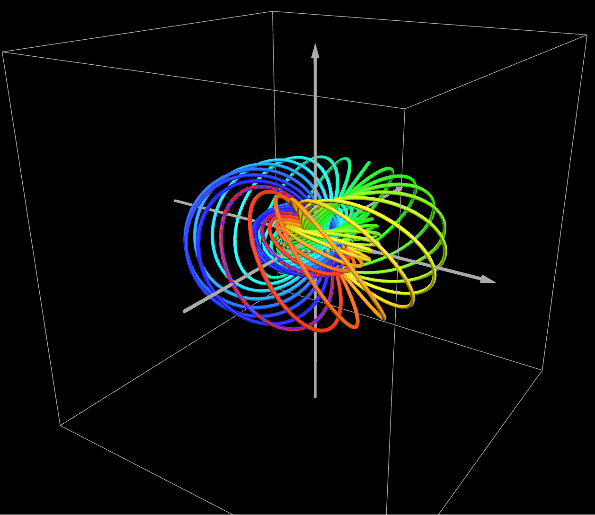
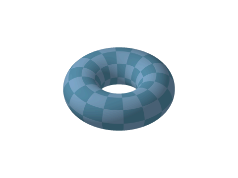
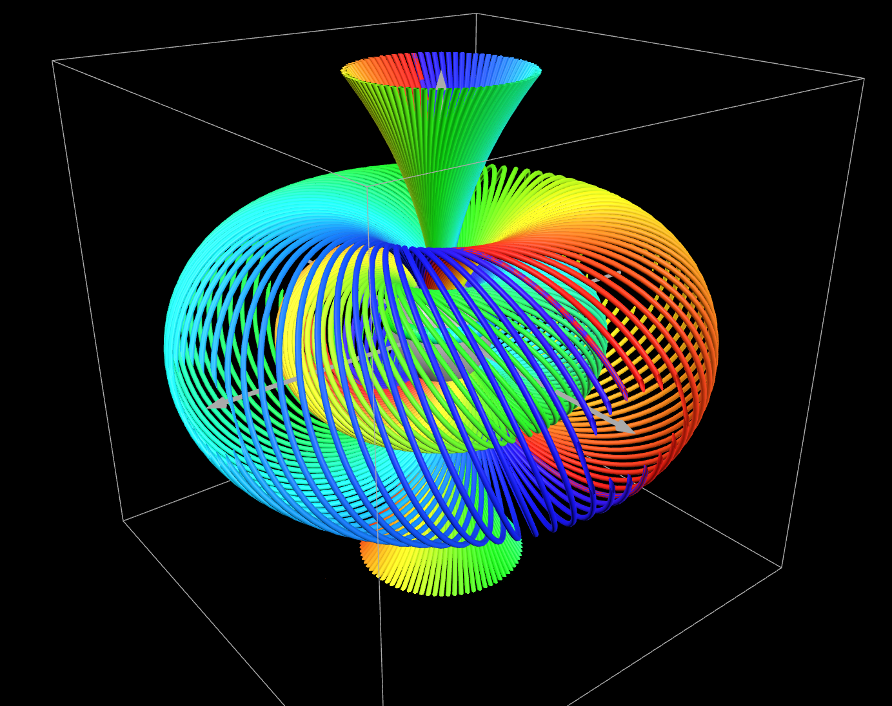
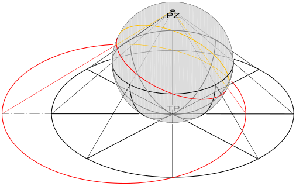

### **NOTES ON STATISTICS, PROBABILITY and MATHEMATICS**

---

### The Hopf Fibration:

---

source: [Desmos](https://www.desmos.com/3d/r5sc3zmil1)

---

#### Introduction:

The Hopf fibration, denoted as $p: S^3 \to S^2$, is a famous example of a fiber bundle:

>Total Space ($E$): The 3-sphere, $S^3$, which is the unit sphere in $\mathbb{R}^4$.
>
> Base Space ($B$): The 2-sphere, $S^2$, which is the ordinary sphere in $\mathbb{R}^3$.
>
>Fiber ($F$): The 1-sphere, $S^1$ (a circle).

The map $p$ projects the $S^3$ onto $S^2$ such that the preimage of every point on the base space $S^2$ is a circle, $S^1$.The base manifold $S^2$ is an ordinary sphere in 3-dimensional space $\mathbb{R}^3$. The structure is often written as: $$S^1 \hookrightarrow S^3 \to S^2$$

The $S^1$ Fiber in $\mathbb{R}^4$ (the preimage): In the 4-dimensional space, the $S^1$ fiber is a great circle on the 3-sphere ($S^3$). Topologically, it is the orbit of a $U(1)$ (circle group) acting on $S^3$. Geometrically, it is the intersection of the 3-sphere ($S^3$) with a 2-dimensional complex plane (or $\mathbb{R}^2$ plane) passing through the origin of $\mathbb{C}^2 \cong \mathbb{R}^4$.

The stereographic projection is a map that takes the 3-sphere ($S^3$) (minus a single point) to all of 3-dimensional Euclidean space ($\mathbb{R}^3$). When this projection is applied to the $S^1$ fibers of the Hopf fibration, a remarkable result occurs: The image of every single $S^1$ fiber in $S^3$ is either a circle or a straight line in $\mathbb{R}^3$ (the straight line is considered a circle passing through the point at infinity). The collection of these projected circles fills all of $\mathbb{R}^3$ and possesses the unique property that any two distinct circles are linked exactly once (the Hopf link).

The entire $\mathbb{R}^3$ space (except for the central line) is structured by these circles. The preimage of any circle of latitude on the base sphere $S^2$ is a $2$-torus in $S^3$. When this torus is stereographically projected to $\mathbb{R}^3$, it forms a nested torus which is filled by the projected $S^1$ fibers.The projected fibers sitting on one of these tori are known as **Villarceau circles**. 

From [Wikipedia](https://en.wikipedia.org/wiki/Villarceau_circles):

In $S^3$, the fibers are perfect "Great Circles." When you project these circles into 3D space via stereographic projection, they don't map to the simple "vertical" or "horizontal" circles of the doughnut. They map specifically to the Villarceau circles.This is significant because it proves that the Hopf Fibration isn't just a collection of circles near a torus; the fibers tile the surface of the torus perfectly. Every single point on a torus in the Hopf Fibration belongs to exactly one Villarceau circle.

A fascinating (and significant) property of Villarceau circles is that there are actually two sets of them—one set that twists "left-handed" and one set that twists "right-handed." The standard Hopf Fibration uses one set (e.g., the right-handed ones). If you chose the other set, you would create the Conjugate Hopf Fibration. This is significant in physics (specifically in electromagnetism and liquid crystals) because it shows that the vacuum has a choice of "chirality" or handedness.

The pre-image of a circle on the base sphere $S^2$ in the Hopf fibration is a torus in the total space $S^3$. Since stereographic projection is a continuous map (a homeomorphism from $S^3$ minus a point to $\mathbb{R}^3$), the projected image of that torus in $\mathbb{R}^3$ is also a torus (or a topological torus, which is homeomorphic to $S^1 \times S^1$).

The $\mathbb{R}^3$ space is completely foliated (filled) by these nested tori and the central line. This structure is what makes the Hopf fibration such a profound example of how a higher-dimensional space can be perfectly decomposed into linked, lower-dimensional objects.

The entire space $\mathbb{R}^3$ (minus the central line/axis) can be thought of as being foliated by an infinite family of these nested tori. A circle of latitude on $S^2$ near the South Pole corresponds to a small, skinny torus near the origin in $\mathbb{R}^3$. The equator of $S^2$ corresponds to a special torus called the Clifford torus in $S^3$, which projects to a torus in $\mathbb{R}^3$ that can be visualized as a standard torus centered on the $z$-axis. A circle of latitude on $S^2$ near the North Pole corresponds to a very large, inflated torus in $\mathbb{R}^3$.

If you try to map the great circles of $S^2$ onto a plane using stereographic projection, the geometry behaves very differently than the Hopf Fibration. There are two main reasons—one topological and one dimensional—why this doesn't work. In the Hopf Fibration of 1$S^3$, the fibers are "Great Circles," and the magic is that they never touch each other. This is what allows them to form smooth, nested tori. However, on a 2-sphere ($S^2$), any two great circles must intersect at exactly two points (antipodal points).Think of lines of longitude on a globe: they are all great circles, and they all crash into each other at the North and South Poles. Because they intersect, they cannot "foliate" the space. A foliation requires that the curves are disjoint (non-touching).

[source](https://anhngq.wordpress.com/2010/07/11/stereographic-projection/)

---

Notice the linked fibers in a torus:

---

The $S^1$ fiber is the intersection of the $S^3$ (the unit sphere in $\mathbb{R}^4$) with a 2-dimensional real subspace of $\mathbb{R}^4$ that is also a 1-dimensional complex subspace of $\mathbb{C}^2$. 

> Space: $\mathbb{C}^2$ (4 real dimensions).
>
> Subspace: A complex line (1 complex dimension $\times$ 2 real dimensions/complex dimension) $\to$ a 2-dimensional plane in $\mathbb{R}^4$.
>
> Intersection: $S^3 \cap (\text{2D Plane}) = S^1$ (A circle). 

The key is that a complex line in $\mathbb{C}^2$ is geometrically a 2-dimensional real plane in $\mathbb{R}^4$.

Here is the analytical breakdown of the $2D$ plane in $\mathbb{R}^4$ that defines the $S^1$ fiber.

1. Identify $\mathbb{R}^4$ with $\mathbb{C}^2$: We define the coordinates of $\mathbb{R}^4$ as $(x_1, x_2, x_3, x_4)$. We define the coordinates of $\mathbb{C}^2$ as a pair of complex numbers $(z_0, z_1)$. We connect the two spaces by defining: $z_0 = x_1 + i x_2$ and $z_1 = x_3 + i x_4$. So, a point $(z_0, z_1)$ in $\mathbb{C}^2$ corresponds to the point $(x_1, x_2, x_3, x_4)$ in $\mathbb{R}^4$.The $3$-sphere, $S^3$, is the set of points in $\mathbb{R}^4$ where $x_1^2 + x_2^2 + x_3^2 + x_4^2 = 1$.In $\mathbb{C}^2$, this is simply the set of points where:$$|z_0|^2 + |z_1|^2 = 1$$

2. Define the $2D$ Plane (The Complex Line): The $S^1$ fibers of the Hopf fibration are defined as the intersection of $S^3$ with a Complex Line passing through the origin in $\mathbb{C}^2$. A complex line $L$ through the origin in $\mathbb{C}^2$ is a set of all multiples of a fixed, non-zero vector $W = (w_0, w_1) \in \mathbb{C}^2$.

$$L = \{ \lambda W \mid \lambda \in \mathbb{C} \}$$

$L$ is a $1$-dimensional complex vector space, which means it is a $2$-dimensional real vector space (a plane) in $\mathbb{R}^4$.

3. The $S^1$ Fiber Analytically: The fiber $F$ over a specific point on the base sphere $S^2$ is the set of points that fall on the unit circle within this complex line $L$.

$$F = L \cap S^3 = \{ (z_0, z_1) \in \mathbb{C}^2 \mid (z_0, z_1) = \lambda (w_0, w_1) \text{ and } |z_0|^2 + |z_1|^2 = 1 \}$$

Substituting $(z_0, z_1) = \lambda (w_0, w_1)$ into the unit sphere equation:

$$|\lambda w_0|^2 + |\lambda w_1|^2 = 1$$ 

$$|\lambda|^2 |w_0|^2 + |\lambda|^2 |w_1|^2 = 1$$
$$|\lambda|^2 (|w_0|^2 + |w_1|^2) = 1$$
Since $W=(w_0, w_1)$ is fixed, $(|w_0|^2 + |w_1|^2)$ is a fixed, positive real number. Let $K = \sqrt{|w_0|^2 + |w_1|^2}$.The equation for $\lambda$ becomes: $|\lambda|^2 K^2 = 1$, or $|\lambda| = 1/K$. The set of all complex numbers $\lambda$ that satisfy $|\lambda| = 1/K$ is a circle in the complex plane. As $\lambda$ traces this circle, the point $(\lambda w_0, \lambda w_1)$ traces a circle (the fiber $S^1$) on the $S^3$.

4. The Explicit $\mathbb{R}^4$ Plane Equation: To see this $2D$ plane in $\mathbb{R}^4$ more explicitly, you need to find the two linear equations whose intersection defines the $2D$ plane: If the complex line is defined by a vector $W=(w_0, w_1)$, it means $z_0$ and $z_1$ are always proportional: $$\frac{z_0}{w_0} = \frac{z_1}{w_1}$$ or, cross-multiplying: $$z_0 w_1 = z_1 w_0$$ Let $w_0 = a+ib$, $w_1 = c+id$, and use the $\mathbb{R}^4$ coordinates $z_0 = x_1+ix_2$, $z_1 = x_3+ix_4$. Substituting these into $z_0 w_1 = z_1 w_0$ and separating the real and imaginary parts will yield two independent linear equations in $(x_1, x_2, x_3, x_4)$, which analytically define the $2D$ plane in $\mathbb{R}^4$.

---

#### Mathematical development:

$$S^3 =\{(z_0,z_1) \mid |z_0|^2 + |z_1|^2 =1\}$$

We represent a point in $S^3$ using two complex numbers $(z_0, z_1)$ such that $|z_0|^2 + |z_1|^2 = 1$. Each point on the base sphere $S^2$ corresponds to a ratio $q = z_0 / z_1$ (this is the Riemann sphere projection).For a fixed point $q$ on the base sphere, the fiber is the set of points:

$$(z_0, z_1) = e^{i\theta} \cdot \frac{1}{\sqrt{1+|q|^2}}(q, 1)$$
 
As $\theta$ ranges from $0$ to $2\pi$, you trace out the $S^1$ circle in $4D$.

We defined $q$ as the ratio of the two complex coordinates in $S^3$: $q = \frac{z_0}{z_1}$. If we want to work backward to find $(z_0, z_1)$ using only $q$, we can factor out $z_1$ from the vector: $(z_0, z_1) = z_1 \cdot \left( \frac{z_0}{z_1}, \frac{z_1}{z_1} \right) = z_1 \cdot (q, 1)$. The "1" is simply the result of dividing $z_1$ by itself. It acts as the reference unit for the ratio. The vector $(q, 1)$ points in the correct "direction" in complex space, but it isn't on the 3-sphere yet. To be on $S^3$, the total magnitude squared must be exactly 1: $|z_0|^2 + |z_1|^2 = 1$. If we check the magnitude of our raw vector $(q, 1)$, we get: $\sqrt{|q|^2 + |1|^2} = \sqrt{|q|^2 + 1}$. To force this vector to land exactly on the surface of the sphere, we must divide by that magnitude. That is where the normalization factor comes from:$\text{Unit Vector} = \frac{1}{\sqrt{|q|^2 + 1}}(q, 1)$.

Every complex number can be written in polar form as $z = R e^{i\theta}$, where $R$ is the magnitude and $e^{i\theta}$ is the phase. So: $z_1 = |z_1| e^{i\theta}$. When we substitute this into the vector $(q, 1)$, we get $(z_0, z_1) = |z_1| e^{i\theta} (q, 1)$. Solving for the Magnitude $|z_1|$, we know that for any point in $S^3$, the sum of the squares of the magnitudes must be 1:$|z_0|^2 + |z_1|^2 = 1.$ Since $z_0 = q z_1$, we can substitute that in: $|q z_1|^2 + |z_1|^2 = 1$, and $|q|^2 |z_1|^2 + |z_1|^2 = 1$. Now, factor out the $|z_1|^2$: $|z_1|^2 ( |q|^2 + 1 ) = 1$, and $|z_1|^2 = \frac{1}{1 + |q|^2}$. Taking the square root gives us the magnitude of $z_1$: $|z_1| = \frac{1}{\sqrt{1 + |q|^2}}$. Now we substitute that magnitude back into our polar form of $z_1$: 

$$z_1 = \underbrace{\frac{1}{\sqrt{1 + |q|^2}}}_{\text{Magnitude}} \cdot \underbrace{e^{i\theta}}_{\text{Phase}}$$ 

So the equation:$(z_0, z_1) = z_1 (q, 1)$ becomes: 

$$(z_0, z_1) = \left( \frac{1}{\sqrt{1 + |q|^2}} e^{i\theta} \right) (q, 1)$$

The idea of $q$ being a ratio of two complex numbers comes from the Riemann Sphere and the concept of Complex Projective Space, specifically $\mathbb{C}P^1$.

From [Wikipedia](https://en.wikipedia.org/wiki/Riemann_sphere#As_the_complex_projective_line):

> The Riemann sphere can also be defined as the complex projective line. The points of the complex projective line can be defined as equivalence classes of non-null vectors in the complex vector space 
$ \mathbf {C} ^{2}$: two non-null vectors $ (w,z)$ and $(u,v)$ are equivalent iff $(w,z)=(\lambda u,\lambda v)$ for some non-zero coefficient $\lambda \in \mathbf {C}$. 

To understand how we get from a 3-sphere $(S^3)$ to a ratio $q$, we have to look at the coordinates of the space.

1. Coordinates in $S^3$:

We represent a point in $S^3$ using two complex numbers $(z_0, z_1)$. Because this point is on a sphere, it must satisfy the normalization condition: $|z_0|^2 + |z_1|^2 = 1$. This gives us a 3-dimensional surface embedded in a 4-dimensional real space ($\mathbb{C}^2 \cong \mathbb{R}^4$).

2. The Equivalence Relation:

The core of the Hopf Fibration is the idea that we can "ignore" the global phase. We say that two points $(z_0, z_1)$ and $(w_0, w_1)$ are "equivalent" if one is just the other multiplied by a complex number of magnitude 1 ($e^{i\theta}$).

$$(z_0, z_1) \sim (e^{i\theta}z_0, e^{i\theta}z_1)$$
This set of equivalence classes defines the Complex Projective Line, $\mathbb{C}P^1$.

3. Turning the Ratio into a Coordinate:

To find a single coordinate that represents an entire "fiber" (all points that are equivalevint under that phase rotation), we simply divide one coordinate by the other:

$$q = \frac{z_0}{z_1}$$
Why does this work? Because if you multiply both by $e^{i\psi}$, the phase cancels out:

$$\frac{e^{i\psi}z_0}{e^{i\psi}z_1} = \frac{z_0}{z_1} = q$$
Thus, the single complex number $q$ acts as a "name" or "address" for the entire circle fiber.

4. Mapping to the Sphere ($S^2$):

Now, $q$ is a complex number, so it lives on the Complex Plane. But the complex plane isn't a sphere. To turn the plane into a sphere, we add a "point at infinity" (the case where $z_1 = 0$). This construction is the Riemann Sphere.

5. From $q$ to Cartesian $(x, y, z)$:

To get the actual $S^2$ coordinates $(x, y, z)$ on the base sphere from the ratio $q$, we use the inverse of the stereographic projection. If $q = u + iv$, the mapping is:

$$x = \frac{2u}{1+|q|^2}, \quad y = \frac{2v}{1+|q|^2}, \quad z = \frac{1-|q|^2}{1+|q|^2}$$

This is the Hopf Map $\pi: S^3 \to S^2$.

Let's consider the stereographic projection of a point in $S^3$, $(x,y,z,w)$, onto $\mathbb R^3$

$$X = \frac{x}{1-w},\quad Y = \frac y{1-w},\quad Z=\frac z {1-w}$$

#### Coordinates in $\mathbb R^4$

Regarding the Hopf fibration:

$$\begin{align*} (z_0,z_1) &= e^{i\psi}\frac 1{\sqrt{1 + |q|^2}}(q,1) \\\\ 
&= e^{i\psi}\frac 1{\sqrt{1 + \tan^2(\theta/2)}}\,(\tan(\theta/2)\,e^{i\phi},1) \\\\ 
&= e^{i\psi}\cos(\theta/2)\,(\tan(\theta/2)\,e^{i\phi},1) \end{align*}$$

The $\tan(\theta/2)$ comes from the stereographic projection of a point on $S^2$ onto the complex plane, $q = \tan(\theta/2)\,e^{i\phi}$. The angle $\theta$ denotes the colatitude (angle from the North pole towards the South): $\theta \in [0,\pi]$. When $\theta=0$ at the North pole, the norm of the projection in the complex plane is $0,$ assuming a norm of $1$ at $\theta = \pi/2,$ and $\infty$ at $\theta = \pi.$ This angle determines which nested torus you are on in $\mathbb{R}^3$. 

---

---

On the other hand, the angle $\phi$ is the longitude around the equator, $\phi \in [0,2\pi]$. It determines which specific fiber (circle) on that torus you are on. 

Summary of the "3D" Coordinates of $S^3$:

> $\theta$ (Latitude): Picks the "Doughnut" (Torus).
>
>  $\phi$ (Longitude): Picks the "Circle" on that doughnut.
>
>  $\psi$ (The Fiber Angle): Picks the "Point" on that circle.

Distributing the terms:

$$\begin{align*} (z_0,z_1) &= e^{i\psi}\cos(\theta/2)\,(\tan(\theta/2)\,e^{i\phi},1)\\\\ 
&= \left(\sin(\theta/2)e^{i(\phi+\psi)}, \cos(\theta/2)e^{i\psi} \right) \end{align*}$$ 

The angle $\psi$ constitutes the gauge symmetry. It is the coordinate along the fiber itself (the longitude within the fiber). 

The angle $\psi$ is a symmetry because changing its value moves you to a different point in $S^3$, but completely disappears when you look at the resulting point on the base sphere $S^2$. The 3-sphere $S^3$ has a natural "action" by the group $U(1)$ (the group of complex numbers with magnitude 1).This action is exactly the rotation $e^{i\psi}$. When you rotate a point by $\psi$, you are spinning around the fiber circle.Because $S^3$ is a Principal Bundle, this rotation is "smooth" and "global" — you can spin the entire sphere along its fibers simultaneously without any tearing or overlapping. In geometry, if a space can be "partitioned" into orbits of a group action where each orbit behaves the same way, we call that group action a symmetry of the bundle.

$S^3 \subset \mathbb R^4$ can be expressed as $(x_1,y_1, x_2,y_2):$

$$z_0 = x_1 + i\,y_1 = \sin(\theta/2)\,e^{i(\phi + \psi)}$$

$$z_1 = x_2 + i\, y_2 = \cos(\theta/2) \, e^{i\psi}$$ 

We expand the exponentials using Euler's equation and stereographically project into $\mathbb{R}^3$. To project a point $(x_1, y_1, x_2, y_2)$ from the 3-sphere into 3D space ($X, Y, Z$), we use the standard projection from the "North Pole" of $S^3$ (where $x_2 = 1$). 

The formula is:$$X = \frac{x_1}{1 - x_2}, \quad Y = \frac{y_1}{1 - x_2}, \quad Z = \frac{y_2}{1 - x_2}$$

Parenthetically, the fundamental property of stereographic projection that simplifies the visualization of the Hopf fibration is called the **circline property**: Stereographic projection always maps circles on the $n$-sphere ($S^n$) to either a circle or a straight line in $n$-dimensional Euclidean space ($\mathbb{R}^n$).

For the 2-sphere ($S^2$) to the plane ($\mathbb{R}^2$): Circles on the surface of an ordinary sphere project to circles or lines in the plane. 

For the 3-sphere ($S^3$) to 3D space ($\mathbb{R}^3$): The fibers of the Hopf fibration, which are circles ($S^1$) on the $S^3$, project to circles or lines in $\mathbb{R}^3$.

Great Circles and the Hopf Fibers: Since the $S^1$ fibers of the Hopf fibration are defined by the intersection of the $S^3$ with a $2D$ plane through the origin, they are a specific type of circle on $S^3$ called great circles.Therefore, the $S^1$ fibers, which are great circles on $S^3$, are a set of circles in $4D$ space.When stereographically projected to $3D$ space, these circles remain circles (or straight lines).

Going back to the actual calculations, we get that for a point on the base sphere represented by spherical coordinates $(\theta, \phi)$, the circle in $\mathbb{R}^3$ is parameterized by $\psi$ as follows:

$$X = \frac{\sin(\theta/2) \cos(\phi + \psi)}{1 - \cos(\theta/2) \sin(\psi)}$$

$$Y = \frac{\sin(\theta/2) \sin(\phi + \psi)}{1 - \cos(\theta/2) \sin(\psi)}$$

$$Z = \frac{\cos(\theta/2) \cos(\psi)}{1 - \cos(\theta/2) \sin(\psi)}$$

---
<a href="http://rinterested.github.io/statistics/index.html">Home Page</a>

**NOTE: These are tentative notes on different topics for personal use - expect mistakes and misunderstandings.**
