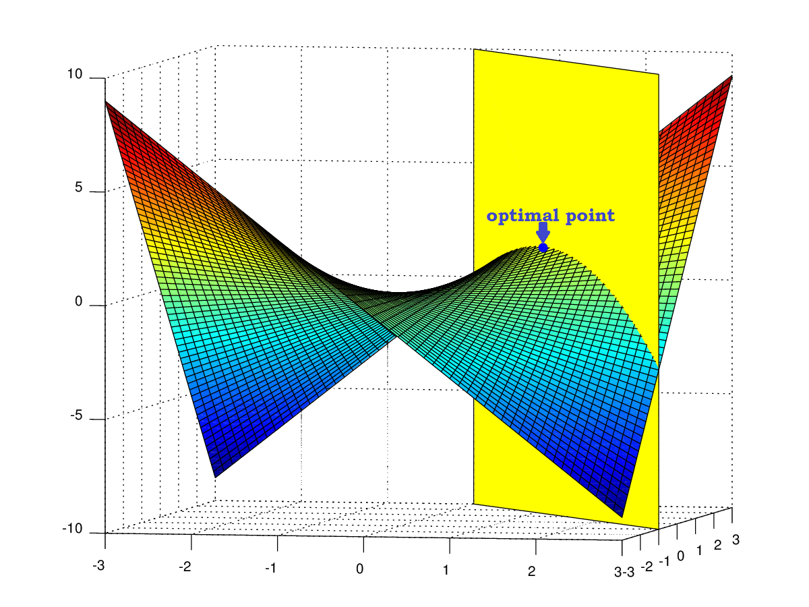
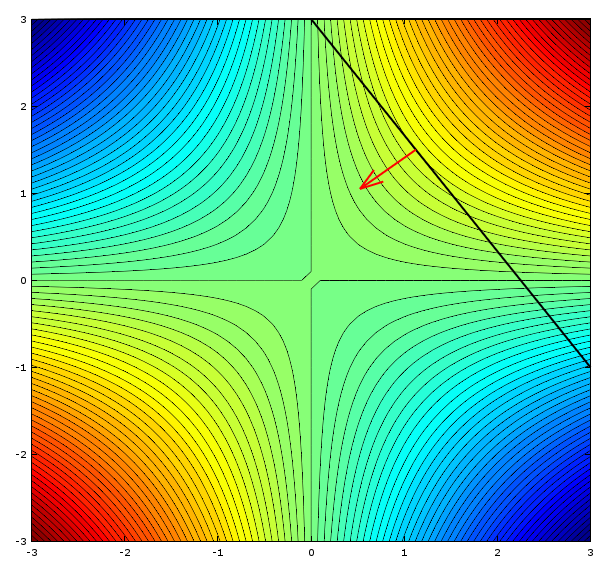

### **NOTES ON STATISTICS, PROBABILITY and MATHEMATICS**

---

### Lagrange Multiplier:

---

We want to optimize the value of the surface $f(x,y) = x \times y$ with the constraint that $y = 3 - \frac{4}{3}x$:

---

The **objective function** is the main formula we are trying to maximize or minimize. The objective function is $f(x,y) = x \times y$. It represents the quantity you want to optimize, such as maximizing profit, minimizing cost, or maximizing total utility.

The **indifference curve (or contour line or level curve)** is a slice of the objective function where the output value remains completely constant. If we set the objective function equal to a fixed number (e.g., $x \times y = 5$ or $x \times y = 10$), we get a curve. Every single coordinate $(x, y)$ along that specific curve yields the exact same $z$-value. The term comes from consumer theory. If the objective function represents a consumer's **satisfaction or utility**, an indifference curve shows all the different combinations of two goods ($x$ and $y$) that give the consumer the exact **same level of satisfaction**. The consumer is completely indifferent to which specific point on that line they land on, because they all feel equally good.

---

---

At the point of contact, the indifference curve and the constraint line share the exact same tangent line.Because their tangents are identical at this single point, their perpendicular directions (the gradients) must align. This implies that the gradient of our objective function ($\nabla f$) and the gradient of our constraint ($\nabla g$) point along the same directional vector line. In other words, they are collinear, meaning one is simply a scalar multiple of the other:$$\nabla f = \lambda \nabla g$$

---

---

To turn this geometric alignment into something we can actually compute, we break this vector equation down into its individual spatial components ($x$ and $y$). Together with our requirement that we must stay on the constraint line ($g(x,y) = 0$), this creates a system of three simultaneous equations that we need to solve:

$$\begin{align}
\frac{\partial f}{\partial x} &= \lambda \frac{\partial g}{\partial x} \\[2ex]
\frac{\partial f}{\partial y} &= \lambda \frac{\partial g}{\partial y} \\[2ex]
g(x,y) &= 0
\end{align}$$

By moving all the terms to one side, we can combine these conditions into a single, elegant function called the Lagrangian ($\mathscr{L}$)

The goal is to find a single, master function $\mathscr{L}(x, y, \lambda)$ whose standard partial derivatives automatically recreate those three separate equations we want to solve.

Here is exactly how we move the terms to one side and construct it:

First, we take our three conditions and rearrange them so that everything sits on the left side, leaving a clean $= 0$ on the right side.

For the $x$-component:

$$\frac{\partial f}{\partial x} = \lambda \frac{\partial g}{\partial x} \implies \frac{\partial f}{\partial x} - \lambda \frac{\partial g}{\partial x} = 0$$

For the $y$-component:

$$\frac{\partial f}{\partial y} = \lambda \frac{\partial g}{\partial y} \implies \frac{\partial f}{\partial y} - \lambda \frac{\partial g}{\partial y} = 0$$

For the constraint: This one is already set to zero, and we will leave it exactly as it is:

$$g(x,y) = 0$$

Now, we want to build a function $\mathscr{L}$ such that when we take its partial derivative with respect to $x$, it gives us the first equation, and with respect to $y$, it gives us the second equation.

Let's look at the first target equation:

$$\frac{\partial f}{\partial x} - \lambda \frac{\partial g}{\partial x}$$

If we integrate this back with respect to $x$, the $\frac{\partial f}{\partial x}$ points back to $f(x,y)$, and the $\lambda \frac{\partial g}{\partial x}$ points back to $\lambda g(x,y)$.

This points directly to a combined function:

$$\mathscr{L} = f(x,y) - \lambda g(x,y)$$

The sign doesn't actually matter (the "$+$" vs "$-$"). You might notice that doing it this way gives a minus sign: $\mathscr{L} = f - \lambda g$. Yet, the standard textbook definition uses a plus sign: $\mathscr{L} = f + \lambda g$. Because $\lambda$ is an unknown constant (a multiplier) that we have to solve for anyway, if we define the function with a plus sign, $\lambda$ will just naturally absorb the negative sign when we solve the system.

Let's test the plus-sign version, $\mathscr{L}(x,y,\lambda) = f(x,y) + \lambda g(x,y)$, by taking its partial derivatives to see if it successfully bundles everything:

Derivative with respect to $x$:

$$\frac{\partial \mathscr{L}}{\partial x} = \frac{\partial f}{\partial x} + \lambda \frac{\partial g}{\partial x} = 0 \implies \frac{\partial f}{\partial x} = -\lambda \frac{\partial g}{\partial x}$$
Derivative with respect to $y$:

$$\frac{\partial \mathscr{L}}{\partial y} = \frac{\partial f}{\partial y} + \lambda \frac{\partial g}{\partial y} = 0 \implies \frac{\partial f}{\partial y} = -\lambda \frac{\partial g}{\partial y}$$

Derivative with respect to $\lambda$ (Treating $x$ and $y$ as constants)"

$$\frac{\partial \mathscr{L}}{\partial \lambda} = 0 + 1 \cdot g(x,y) = 0 \implies g(x,y) = 0$$

Treating $\lambda$ as an independent variable and taking $\frac{\partial \mathscr{L}}{\partial \lambda}$ perfectly forces the constraint $g(x,y) = 0$ to hold true.

By bundling them into $\mathscr{L} = f + \lambda g$, we turn a constrained geometry problem into a standard calculus problem: just find where the gradient of $\mathscr{L}$ equals zero.

---

Now let's apply this explicit formula to our specific problem. Our objective function (the indifference curves) is:

$$f(x,y) = x \times y$$

And by moving all terms to one side, our constraint line equation becomes:

$$g(x,y) = y + \frac{4}{3}x - 3 = 0$$

Plugging these specific components into our Lagrangian definition gives us:

$$\mathscr{L} = x \times y + \lambda \left(y + \frac{4}{3}x - 3\right)$$

And we optimize by taking the partial derivatives:

$$\frac{\partial\mathscr{L}}{\partial x}=y+\frac{4}{3}\lambda=0$$

$$\frac{\partial\mathscr{L}}{\partial y}=x+\lambda=0$$

$$\frac{\partial\mathscr{L}}{\partial \lambda}=y+\frac{4}{3}x-3=0$$

To find the optimal point, we can solve this system by expressing both $x$ and $y$ in terms of $\lambda$ using the first two equations:

From $\frac{\partial\mathscr{L}}{\partial y} = 0$, we get:

$$x = -\lambda$$

From $\frac{\partial\mathscr{L}}{\partial x} = 0$, we get:

$$y = -\frac{4}{3}\lambda$$

Now, we substitute these expressions for $x$ and $y$ into our third equation (the constraint):

$$\left(-\frac{4}{3}\lambda\right) + \frac{4}{3}(-\lambda) - 3 = 0$$

Combine the $\lambda$ terms:

$$-\frac{8}{3}\lambda = 3$$
$$\lambda = -\frac{9}{8}$$

Now that we have the value for the multiplier $\lambda$, we plug it back into our expressions for $x$ and $y$:

$$x = - \left(-\frac{9}{8}\right) = \frac{9}{8}$$

$$y = -\frac{4}{3}\left(-\frac{9}{8}\right) = \frac{36}{24} = \frac{3}{2}$$

This results in the optimal point: $\left(\frac{9}{8},\frac{3}{2}\right)$.

---
<a href="http://rinterested.github.io/statistics/index.html">Home Page</a>

**NOTE: These are tentative notes on different topics for personal use - expect mistakes and misunderstandings.**
