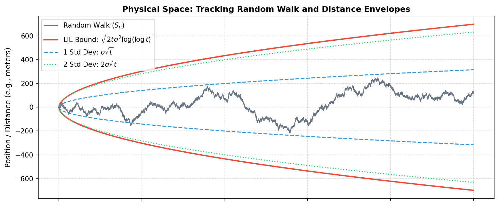

### **NOTES ON STATISTICS, PROBABILITY and MATHEMATICS**

<a href="http://rinterested.github.io/statistics/index.html">
</a>

---

### Law of Iterated Logarithm:

---

<div style="background-color: #f3f4f6; border-left: 4px solid #3b82f6; padding: 16px; border-radius: 8px;">

If we flip a fair coin $n$ times (where heads = $+1$ and tails = $-1$), our position after $n$ steps is $S_n$. What happens as $n$ grows massive?

The **Law of Large Numbers (LLN)**: Tells you the average behavior. It says the average step $\frac{S_n}{n} \to 0$ with probability $1.$ The fluctuations get crushed by $n$.

The **Central Limit Theorem (CLT)**: Tells you the distributional behavior. It says that $S_n$ grows roughly on the scale of $\sqrt{n}$, and if we divide $S_n$ by $\sqrt{n}$, we get a standard normal distribution.

The **Law of the Iterated Logarithm (LIL)**: Tells you the extreme behavior of a single, unfolding path. It answers the question: If I watch this random walk forever, what is the absolute tightest envelope that will bound its peaks?

</div>


---



---

Let $X_1, X_2, \dots$ be independent, identically distributed random variables with mean $E[X_i] = 0$ and variance $Var(X_i) = \sigma^2$. Let $S_n = \sum_{i=1}^n X_i$. The Law of the Iterated Logarithm states that:

$$\limsup_{n \to \infty} \frac{S_n}{\sqrt{2\sigma^2 n \log(\log n)}} = 1 \quad \text{with probability 1}$$
And by symmetry:

$$\liminf_{n \to \infty} \frac{S_n}{\sqrt{2\sigma^2 n \log(\log n)}} = -1 \quad \text{with probability 1}$$

The superior limit ($\small\limsup$) means that if we draw the curve $f(n) = \sqrt{2\sigma^2 n \log(\log n)}$, the random walk $S_n$ will cross infinitely close to this boundary infinitely many times, but as $n \to \infty$, it will almost never cross above it by any significant margin. It is a strict, asymptotic ceiling. 

From the CLT, we know the standard deviation of $S_n$ is $\sqrt{n}$. If we only bounded the walk by a multiple of $\sqrt{n}$, the walk would actually escape that bound infinitely many times because a normal distribution always has a chance of producing extreme outliers. $\log(\log n)$ is the correction for infinity: To prevent the random walk from escaping our bound forever, we need to pull the ceiling up just a tiny bit higher than $\sqrt{n}$. The iterated logarithm $\log(\log n)$ grows exceptionally slowly, but it provides exactly enough extra headroom to account for the rare, extreme statistical runs that occur over infinite time. If we used a single log, like $\sqrt{n \log n}$, the bound would be too loose — the random walk would eventually get trapped far below it and stop visiting. The double log is the precise mathematical Goldilocks zone. 

The LIL applies beautifully to standard Brownian motion $B(t)$. Because Brownian motion has self-similarity (scaling properties), the law actually holds in two fascinating places: At infinity ($t \to \infty$):

$$\limsup_{t \to \infty} \frac{B(t)}{\sqrt{2t \log(\log t)}} = 1$$

At the Origin ($t \to 0$):

$$\limsup_{t \to 0} \frac{B(t)}{\sqrt{2t \log(\log(1/t))}} = 1$$

This second result means that if we look at a Brownian path right at the starting needle-point of $t=0$, it is oscillating up and down with infinite frequency, perfectly bounded by an local envelope scaled by $\sqrt{2t \log(\log(1/t))}$.


### RANDOM WALK VARIANCE:

If we flip a fair coin at every step in time, our steps are independent. Because of that independence, variance adds up linearly. At time step $t$, the variance of our position is exactly:

$$\text{Var}(S_t) = t\sigma^2$$


This is proven in [here](https://stats.stackexchange.com/a/159653/67822):


$\text{Var}(Y_{t}) = \text{Var}(e_1+ e_2+ ... +e_t)$  
$\qquad\quad\;\;= \text{Var}(e_1) + \text{Var}(e_2) +... +\text{Var}(e_t)$  (independence)  
$\qquad\quad\;\;= \sigma^2 + \sigma^2 + ... + \sigma^2=t\sigma^2\,,$

As time moves forward, the system is constantly injecting new randomness into the environment. The "space" of where we could possibly be is expanding continuously. To turn this variance into a physical distance or a spatial boundary (with units), we take its square root to get the standard deviation: $\sigma\sqrt{t}.$ This is the standard scale of a random walk. At any single snapshot in time, our path has a standard width proportional to $\sqrt{t}$.

Now, suppose we track one single path over a timeline that stretches to infinity ($t \to \infty$). Because the variance grows linearly forever, this single path has an infinite amount of time to wander. More importantly, it has infinite opportunities to experience rare, highly improbable streaks — like flipping heads $20$ times in a row. Because of these infinite attempts, a single path will routinely break right out of its standard $\sqrt{t}$ boundary. If we try to contain a random walk using only its standard deviation, the walk will escape our bound infinitely many times as $t \to \infty$. A simple square root cannot hold it. 

To build a strict, absolute ceiling that this single path can never permanently escape, we have to look at the linear variance engine ($t\sigma^2$) and multiply it by a corrective factor that accounts for the infinite passage of time. That modifier is the iterated logarithm, $\log(\log t)$. 

The Law of the Iterated Logarithm states that the absolute maximum ceiling of a random walk is:

$$\text{Ceiling} = \sqrt{2 \cdot \underbrace{t\sigma^2}_{\text{Linear Variance}} \cdot \log(\log t)}$$

Look at how beautifully those pieces interact: The $t\sigma^2$ term represents the raw, linear expansion of variance. It is trying to push the random walk out to infinity as fast as possible. The square root tames that variance, pulling it down to the standard physical scale of $\sqrt{t}$. The $\log(\log t)$ term acts as a microscopic, slow-varying brake inside the radical. It provides just a tiny bit of extra headroom — growing so slowly that it takes astronomical scales of time to tick upward, but it is mathematically heavy enough to perfectly contain the rare, extreme statistical runs generated by that linear variance engine.'

The variance of a random walk increases linearly because each step adds a new, independent shock of noise to the system. The Law of the Iterated Logarithm is simply the precise mathematical envelope that takes that linear variance, scales it to physical space, and applies a double-log filter to tame the infinite opportunities of time.


```{r,echo=FALSE}
no.steps = 1e4
frac = 0.5 * no.steps
var = 1^2  # FIX: The variance of a step choosing between -1 and 1 is exactly 1

# 1. Plot the initial canvas
first.walk = cumsum(sample(c(-1,1), no.steps, replace=T))
plot(first.walk, type="l",
     ylim = c(-300,300), col=gray(0.5,0.4),  # Widen ylim to fit the corrected bounds
     lwd=.5,
     main="Random Walks - Corrected Bounds (Var = 1)", ylab="Cumulative sum", xlab="Iteration")

# 2. Draw the remaining ensemble paths
for (i in 1:55){
  c = cumsum(sample(c(-1,1), no.steps, replace=T))
  lines(c, col=gray(0.5,0.4), lwd=.5)
}

abline(h=0)

# 3. Corrected standard deviation funnel (CLT Scale)
curve(sqrt(x * var), xlim = c(0,no.steps), n = no.steps, lwd=3, 
      col='red', add = TRUE)
curve(-sqrt(x * var), xlim = c(0,no.steps), n = no.steps, lwd=3,
      col='red', add = TRUE)

# 4. Corrected Law of the Iterated Logarithm Boundaries
curve(sqrt(2 * x * var * log(log(pmax(3, x)))), xlim = c(0,no.steps), n = no.steps, lwd=3,
      col='blue', add = TRUE)
curve(-sqrt(2 * x * var * log(log(pmax(3, x)))), xlim = c(0,no.steps), n = no.steps, lwd=3,
      col='blue', add = TRUE)
```


The Law of the Iterated Logarithm is written using a limit superior ($\limsup$), not a standard maximum ceiling.

$$\limsup_{t \to \infty} \frac{S_t}{\sqrt{2t \log(\log t)}} = 1$$

Mathematically, a $\limsup = 1$ means that if we run a single path out to infinity, the ratio of our path to the blue line will hit or get infinitely close to $1$ infinitely many times. By definition, for a path to approach $1$ infinitely many times from an oscillating random walk, it means the path must routinely cross over and under the blue boundary forever. The blue line isn't a hard wall that reflects the walk downward; it is the asymptotic track line that the peak fluctuations use as a spine. If a path never crossed or touched the blue line, the $\limsup$ would be strictly less than $1.$


---
<a href="http://rinterested.github.io/statistics/index.html">Home Page</a>

**NOTE: These are tentative notes on different topics for personal use - expect mistakes and misunderstandings.**
