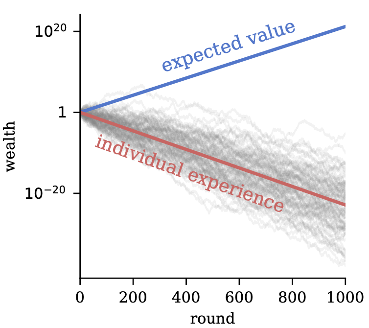

### **NOTES ON STATISTICS, PROBABILITY and MATHEMATICS**

<a href="http://rinterested.github.io/statistics/index.html">
</a>

---

### Money, Power laws, Compounding and Distributions

---

#### The distribution of returns: Geometric mean and the log-normal distribution:

##### Introduction:

In non-ergotic processes the current step is completely constrained by the previous step. If one's wealth drops to zero on step $4,$ steps $5$ through $100$ are completely locked out. It impossible to average one's way out of a total loss because the path has hit an absorbing barrier.

Additive processes (like rolling a die to win or lose a flat $\$5)$ tend to be ergodic because the shocks don't change the baseline leverage. Non-ergodic processes almost always involve multiplication or percentage scaling. The hallmark is that the system scales based on its current size ($W_{t+1} = W_t \times (1 + r)$). Because a $-40\%$ drop on a large base requires a $+66.7\%$ gain just to break even, the structural asymmetry of multiplication tears the individual time-path away from the linear group average.

A system over time in which the average outcome looks incredibly wealthy, but the typical individual experience is complete stagnation or decay, is non-ergodic. Over time, the probability distribution develops a massive, highly skewed right tail. The ensemble mean is pulled skyward by a tiny handful of extreme outliers, while the median trajectory continuously sinks toward zero. The group gets richer while the individual goes broke.

Particles in a gas chamber, they can bounce around and eventually visit every single possible state in the room given enough time. In a non-ergodic process, certain states are one-way doors. The existence of ruin, bankruptcy, death, or structural failure. Once a trajectory hits an absorbing barrier (a state one cannot leave), it is permanently removed from the system. Because time moves in only one direction, we cannot pool the survival metrics of an entire room of people today to predict our own survival probability over the next 40 years.

---

This post is a riff on money / portfolio-based mathematical issues inspired by [this post by Ole Peters](https://x.com/ole_b_peters/status/2046599240588107897?s=20). A [blog entry](https://ergodicityeconomics.com/2023/07/28/the-infamous-coin-toss/) touches on what he calls the **infamous coin toss**. The idea is as presented in the chart:

---



---


> I toss a fair coin, and if it comes up heads I’ll add 50% to your current wealth; if it comes up tails I will take away 40% of your current wealth. A fun thing to do in a lecture on the topic is to pause at this point and ask the audience if they’d like to take the gamble. Some will say yes, other no, and usually an interesting discussion of people’s motivations emerges. Often, the question comes up whether we’re allowed to repeat the gamble, and we will see that this leads naturally to the ergodicity problem.
>
> The ergodicity problem, at least the part of it that is important to us, boils down to asking whether we get the same number when we average a fluctuating quantity over many different systems and when we average it over time. If we try this for the fluctuating wealth in the Peters coin toss the answer is no, and this has far-reaching consequences for economic theory.


A fair bet ($+50\%$ on heads, $-40\%$ on tails) has positive expected value, causing collective ensemble wealth to grow at $5\%$ per round while individual time-average trajectories decay toward ruin almost surely due to **multiplicative effects**: a lone individual faces self-destructive outcomes from repeated play, but a small group cooperating via risk pooling can access the beneficial collective growth that single trajectories cannot achieve. This ergodicity-breaking example, shown in the attached plot of diverging expected value versus individual experiences, underscores how non-ergodic processes create misalignments between personal incentives and group-level benefits in economics.

In the coin toss experiment,the arithmetic (ensemble) mean is $+5\%$ per round, leading to collective wealth growth. Yet, the geometric (time-average) mean is $\sqrt{1.5 \times 0.6} \approx 0.9487$ leading to $\sim 5.1\%$ decay per round. As a result, individual paths will almost surely tend to ruin, while the ensemble looks great.

In the meantime, the stock market works long-term for many individuals (especially passive index investors) precisely because its parameters are fundamentally different from the coin-toss example — even though both are multiplicative random walks with a trend. 

The stock market returns, modeled as geometric brownian motion, are multiplicative and noisy. The positive drift from real economic growth (corporate earnings, dividends, productivity, innovation) is strong enough to overcome volatility: The arithmetic mean of the return is $\approx 10 - 12\%$ per year (historical S&P 500 nominal). The volatility is $\approx 15-20\%$ per year. The geometric (time-average) mean return is $\small \approx \text{arithmetic mean} - (\sigma^2/2) \approx 7-10\%$ per year (still strongly positive!).


Let's check what is happening mathematically:

The wealth after several years is a product of multipliers:

$$\small W_{\text{final}} = W_0 \times (1+r_1) \times (1+r_2) \times \dots \times (1+r_n)$$

Calculating the average of a long string of multiplications is computationally messy. However, the logarithm has a unique property: $\log(A \times B) = \log(A) + \log(B)$. Taking the log of the wealth turns that chain of multiplication into simple additions:

$$\small \log(W_{\text{final}}) = \log(W_0) + \log(1+r_1) + \log(1+r_2) + \dots + \log(1+r_n)$$ 

To turn this addition into a dollar amount, we plug it into the exponential function:

$$W_{\text{final}} = W_0 \cdot e^{\text{Sum of logs}}$$

The function $f(r) = 1 + r$ is a perfectly straight line. It has no memory of risk. But the function $f(r) = \log(1 + r)$ is concave (it curves downward). This curve is the mathematical representation of the fact that losses hurt more than gains help. If we gain $50\%$ and then lose $50\%,$ our arithmetic average is $0\%$ $(1 + 0.5 - 0.5 = 1).$ But our actual wealth is down $25\%$ $(1.5 \times 0.5 = 0.75)$.

To obtain the Taylor expansion we start at 

$$\log(W_{\text{final}}) = \log(W_0) + \sum_{i=1}^{n} \log(1+r_i)$$

by the law of large numbers as $n\to \infty$

$$\text{Long-run growth rate } (r_g) = \mathbb{E}[\log(1+r)]=\frac{1}{n} \log\left(\frac{W_{\text{final}}}{W_0}\right) = \frac{1}{n} \sum_{i=1}^{n} \log(1+r_i)$$

We don't know $\mathbb{E}[\log(1+r)]$ off the top of our heads. We only know the average return ($r_a$) and the volatility ($\sigma$). We use the [Taylor expansion](https://math.stackexchange.com/a/878376/152225) to translate the log back into numbers we actually have:

$$\log(1+r) \approx r - \frac{r^2}{2}$$

Taking the expectation of that expansion:

$$\mathbb{E}[\log(1+r)] \approx \mathbb{E}[r] - \frac{\mathbb{E}[r^2]}{2}$$

Since $\mathbb{E}[r^2] \approx \sigma^2$ (for small $r_a$), we get the growth rate:

$$r_g \approx r_a - \frac{\sigma^2}{2}$$

The value we just found, $r_g$, is the continuous growth rate. To see what our actual bank account looks like, you have to undo the log we took: We raise $e$ to the power of our growth rate multiplied by time ($n$):

$$W_{\text{final}} = W_0 \cdot e^{(r_a - \frac{\sigma^2}{2})n}$$


$$\log(1 + r) \approx r - \frac{r^2}{2}$$ 

captures the volatility penalty. The $r$ is our gain, but the $-\frac{r^2}{2}$ is the cost of the curve: the specific amount our portfolio growth is dragged down by the volatility of the path.

We use the log because of the strong law of large numbers. It states that for a sum of random variables, the average will eventually settle on the expected value. Because we turned our wealth into a sum using logs, we can say that in the long run:

$$\small \text{Growth Rate} = \frac{1}{n} \sum \log(1+r_i) \xrightarrow{n \to \infty} \mathbb{E}[\log(1+r)]$$
The actual realized growth rate over $n$ years, which we know is the sum of all those individual logs divided by time:

$$\text{Realized Growth Rate} = \frac{1}{n} \left[ \log(1+r_1) + \log(1+r_2) + \dots + \log(1+r_n) \right]$$
Because a Taylor expansion works for any small return, we can apply the expansion $r - \frac{r^2}{2}$ to every single year in that list:

Year 1: $\log(1+r_1) \approx r_1 - \frac{r_1^2}{2}$

Year 2: $\log(1+r_2) \approx r_2 - \frac{r_2^2}{2}$$\dots$

Year $n$: $\log(1+r_n) \approx r_n - \frac{r_n^2}{2}$

Putting these yearly calculations together:

$$\small\text{Realized Growth Rate} \approx \underbrace{\frac{r_1 + r_2 + \dots + r_n}{n}}_{\text{Pile 1: Average of Returns}} - \frac{1}{2} \left( \underbrace{\frac{r_1^2 + r_2^2 + \dots + r_n^2}{n}}_{\text{Pile 2: Average of Squares}} \right)$$

As we invest over a long horizon ($n \to \infty$), the LLNs kicks in. Those two sample piles naturally tend to their statistical expected values:

Pile 1 becomes the true arithmetic mean: 

$$\frac{r_1 + r_2 + \dots + r_n}{n} \longrightarrow \mathbb{E}[r] = r_a$$

Pile 2 becomes the expected value of the squared returns:

$$\frac{r_1^2 + r_2^2 + \dots + r_n^2}{n} \longrightarrow \mathbb{E}[r^2] = \sigma^2 + r_a^2$$


If we didn't use the log, we would be calculating $\mathbb{E}[1+r]$, which is the ensemble average. That tells us what happens to a collective or ensemble of people in one year. But the individual lives through a sequence of years. The log is what translates the collective's luck into your personal reality.

We start with the second-order Taylor expansion for a single realization of a return $r$:

$$\log(1 + r) \approx r - \frac{r^2}{2}$$

To find the long-run average, we take the expected value ($\mathbb{E}$) of both sides. Because expectation is a linear operator, we can apply it to each term individually:

$$\mathbb{E}[\log(1 + r)] \approx \mathbb{E}[r] - \mathbb{E}\left[\frac{r^2}{2}\right]$$

$$\mathbb{E}[\log(1 + r)] \approx \mathbb{E}[r] - \frac{1}{2}\mathbb{E}[r^2]$$

The fundamental definition of variance says

$$\sigma^2 = \mathbb{E}[r^2] - (\mathbb{E}[r])^2$$

If we rearrange this to solve for $\mathbb{E}[r^2]$, we get:

$$\mathbb{E}[r^2] = \sigma^2 + (\mathbb{E}[r])^2$$

Now, substituting this back into our approximation:

$$\mathbb{E}[\log(1 + r)] \approx \mathbb{E}[r] - \frac{1}{2}(\sigma^2 + (\mathbb{E}[r])^2)$$

In the context of the stock market, the expected return $\mathbb{E}[r]$ (let's call it $r_a$) is usually a small decimal like $0.10.$ This means its square $(r_a)^2$ is tiny $(0.01).$ Compared to the variance $\sigma^2$ (which for a $20\%$ volatility market is $0.20^2 = 0.04$), the squared mean is often small enough to ignore for a clean rule of thumb. Dropping the $(r_a)^2$ term gives us the famous result:

$$\mathbb{E}[\log(1 + r)] \approx r_a - \frac{\sigma^2}{2}$$

The second term is the volatility; a tax on our compounding. $r_a$ is the engine (the arithmetic mean), while $-\frac{\sigma^2}{2}$ is the friction (the volatility drag). $r_a$ it is not simple interest, though it looks deceptively like it. In this context, $r_a$ (the arithmetic mean) is the expected value of the single-period return. If we look at the stock market for exactly one year, $r_a$ is the average of all possible outcomes for that year. If the media says "The S&P 500 has an average annual return of 12%," they are usually summing up the annual returns of the last $90$ years and dividing by $90.$ That $12\%$ is our $r_a$. The trap is that $r_a$ is an ensemble measure. It tells us "If $1,000 people$ invest for $1$ year, the average person will have $1 + r_a$." However, it does not tell us, "If $1$ person invests for $1,000$ years, he will have $(1 + r_a)^{1000}$. $r_a$ (arithmetic) is the average of the outcomes. In the coin toss $r_a$ is $+5\%.$ It looks profitable... This is the ensemble average. The $r_g$ (geometric) is the average of the growth (the geometric mean - see below). In that same coin toss, $r_g$ is $-5.1\%.$ You are actually going broke. This is the time average.


In Ole Peters' classic "infamous coin toss" model, the game has two equally likely outcomes ($p = 0.5$ each):

Heads: $+50\%$ return ($r_H = +0.50$)

Tails: $-40\%$ return ($r_T = -0.40$)

To calculate the variance ($\sigma^2$) for this specific coin toss, we follow the exact statistical steps we just walked through, using discrete probabilities:

First, we find the arithmetic mean ($r_a$): First, we find the simple average return of a single flip by multiplying each outcome by its probability:

$$r_a = \mathbb{E}[r] = (0.5 \times 0.50) + (0.5 \times -0.40)$$

$$r_a = 0.25 - 0.20 = 0.05$$

The arithmetic expectation is positive. If $1,000$ people play this once, the group's total pool of money grows by $5\%.$

Now we find the expected value of the squared returns ($\mathbb{E}[r^2]$):

We square each individual outcome and find the average of those squares:

$$\mathbb{E}[r^2] = (0.5 \times (0.50)^2) + (0.5 \times (-0.40)^2)$$

$$\mathbb{E}[r^2] = (0.5 \times 0.25) + (0.5 \times 0.16)$$

$$\mathbb{E}[r^2] = 0.125 + 0.080 = 0.205$$

Finally, we compute the variance ($\sigma^2$): we plug these into the variance formula, $\sigma^2 = \mathbb{E}[r^2] - (r_a)^2$:

$$\sigma^2 = 0.205 - (0.05)^2$$

$$\sigma^2 = 0.205 - 0.0025 = 0.2025$$

Now that we have computed our parameters for the coin toss ($r_a = 0.05$ and $\sigma^2 = 0.2025$), let's watch the Taylor expansion reveal the individual's long-run fate. If we use the exact expansion formula before dropping the tiny term:

$$\mathbb{E}[\log(1+r)] \approx r_a - \frac{\sigma^2}{2} - \frac{r_a^2}{2}$$

$$\mathbb{E}[\log(1+r)] \approx 0.05 - \frac{0.2025}{2} - \frac{0.0025}{2}$$

$$\mathbb{E}[\log(1+r)] \approx 0.05 - 0.10125 - 0.00125 = -0.0525$$

If we use the simplified rule-of-thumb formula (dropping the $r_a^2/2$ term):

$$\mathbb{E}[\log(1+r)] \approx r_a - \frac{\sigma^2}{2}$$

$$\mathbb{E}[\log(1+r)] \approx 0.05 - \frac{0.2025}{2}$$

$$\mathbb{E}[\log(1+r)] \approx 0.05 - 0.10125 = -0.05125$$


Whether we use the exact calculation or the quick approximation, the result is deeply negative (around $5.2\%$ per flip). Because the variance ($\sigma^2 = 0.2025$) is so massive, the volatility drag ($\approx 10.1\%$) completely overwhelms the arithmetic engine ($5\%$). The volatility physically bends our time-average growth rate below zero, guarantees that an individual player's wealth will decay toward absolute ruin with every flip, and neatly unmasks the ergodicity paradox.

Note that the true discrete geometric rate is $\ln(0.9487) \approx -0.0527$. The second-order Taylor expansion gives a close approximation, but because the coin toss features massive, discrete jumps ($+50\% / -40\%$), higher-order terms in the Taylor series expansion retain a small amount of residual weight. In continuous-time financial modeling where variations occur over infinitesimal steps ($dt$), these higher-order terms vanish completely, making the bridge formula exact.

The sum of logs ($\frac{1}{n} \sum \log(1+r_i)$) is simply the log-geometric mean. If we take the arithmetic mean of the logarithms, we get the exact same result as taking the geometric mean of the original numbers.

$$\small \text{Geometric Mean} = \exp\left( \text{Arithmetic Mean of Logs} \right)=\sqrt[n]{(1+r_1)(1+r_2)\dots(1+r_n)} - 1$$

The Taylor expansion and the $\mathbb{E}[\log(1+r)]$ are useful because the arithmetic Mean ($r_a$) and variance ($\sigma^2$) are what we actually see in the world. Banks quote arithmetic interest rates; news outlets quote arithmetic market returns; analysts quote volatility (standard deviation). The formula $r_g \approx r_a - \frac{\sigma^2}{2}$ is the bridge. 


A process is ergodic if its Arithmetic Mean (ensemble) is equal to its Geometric Mean (time).

Addition is ergodic: If 100 people each get $1,$ the average is $1.$ If 1 person gets $1$ every day for $100$ days, the average is $1.$

**Compounding is not ergodic**: As soon as you have a multiplicative process with randomness, the geometric mean must be lower than the arithmetic mean.

---

### Connection to the log-normal distribution:


When we multiply a long string of random returns together (like in the coin toss or the stock market), the central limit theorem doesn't produce a normal distribution of wealth. Instead, it produces a log-normal distribution. The log-normal is heavily skewed to the right. It has a long "tail" of extremely lucky outcomes (the few people who get very rich) and a huge "bulge" near zero (the many people who lose money). In a log-normal distribution, the three measures of "average" actually physically separate from each other: The mean (arithmetic) is pulled way to the right by a few lottery winners. This represents the ensemble average. The median (50th percentile) is significantly lower than the mean. This is what the typical individual experiences. The mode (the peak) is even lower than the median. It’s the most likely single outcome (often near zero in the coin toss).

The "Infamous Coin Toss" is essentially a process where the mean stays high (5% growth), but the median and mode drift toward zero. Because we usually define "success" as the mean, we think the game is good. But because we actually live as the median individual, we experience ruin. This is why the Taylor expansion result ($r_g \approx r_a - \sigma^2/2$) is so powerful: it calculates exactly how far the median (your reality) has fallen below the mean (the group's average) due to the variance. There are other related distributions, such as the Cauchy, where the variance is so high that the arithmetic mean doesn't even exist mathematically.

If wetake a sample of $n$ individual, independent annual returns ($r_1, r_2, \dots, r_n$) and calculate their standard arithmetic mean:

$$\bar{r} = \frac{r_1 + r_2 + \dots + r_n}{n}$$

the Central Limit Theorem (CLT) dictates that as our sample size $n$ grows, the distribution of that arithmetic mean $\bar{r}$ will converge to a Normal distribution. This is true regardless of the underlying distribution of the individual returns. If instead of adding the returns, we are looking at the average compound growth rate over time (the geometric mean), we are multiplying them:

$$\small \text{Geometric Mean} = \left( \prod_{i=1}^n (1 + r_i) \right)^{1/n}$$

If we take the natural log of this geometric mean, it transforms into an arithmetic average of log-returns:

$$\log(\text{Geometric Mean}) = \frac{1}{n} \sum_{i=1}^n \log(1 + r_i)$$

By applying the Central Limit Theorem to this sum, the distribution of the average log-return becomes Normal. Because the log of the geometric mean is normally distributed, if you exponentiate it to look at the actual growth factor, the distribution of that geometric mean is Log-Normal.

The log-normal distribution is seen when looking at $(1 + r)$, not $r$. Specifically, it is the total compounded multiplier of our wealth over time—which is built by multiplying a long string of these $(1+r)$ terms together — that forms a log-normal distribution.

This is illustrated in the following plot. Notice the effect of the volatility drag: sliding the selection towards zero, turns the distribution of the results into a Gaussian.

---

```{r, echo=FALSE, message=FALSE, warning=FALSE, fig.width=10, fig.height=5.5, fig.align='center'}
library(plotly)
library(dplyr)

set.seed(42)
num_paths  <- 300
num_years  <- 30
mu         <- 0.10
vol_options <- seq(0.05, 0.50, by = 0.05)

# Initialize a base plot object
p <- plot_ly()

# Track visibility states for the JavaScript slider
# Each volatility option creates 2 traces (one for Left plot, one for Right plot)
total_vols <- length(vol_options)

for(i in seq_along(vol_options)) {
  sig <- vol_options[i]
  
  # Run simulations for this specific volatility layer
  r_samples <- rnorm(num_paths, mean = mu, sd = sig)
  wealth_multipliers <- numeric(num_paths)
  for(j in 1:num_paths) {
    wealth_multipliers[j] <- prod(1 + rnorm(num_years, mean = mu, sd = sig))
  }
  
  # Default display target: σ = 0.20 (the 4th element in our sequence)
  is_visible <- (abs(sig - 0.20) < 1e-5)
  
  # Add Left Histogram (Symmetric Returns)
  p <- p %>% add_trace(
    x = r_samples, type = "histogram", nbinsx = 25,
    marker = list(color = 'rgba(135, 206, 235, 0.7)', line = list(color = 'white', width = 1)),
    name = paste0("Returns σ=", sig),
    xaxis = "x1", yaxis = "y1",
    visible = is_visible
  )
  
  # Add Right Histogram (Skewed Multipliers)
  p <- p %>% add_trace(
    x = wealth_multipliers, type = "histogram", nbinsx = 30,
    marker = list(color = 'rgba(250, 128, 114, 0.7)', line = list(color = 'white', width = 1)),
    name = paste0("Multipliers σ=", sig),
    xaxis = "x2", yaxis = "y2",
    visible = is_visible
  )
}

# Construct the single-knob JS slider steps
slider_steps <- list()
for(i in 1:total_vols) {
  # Create a visibility vector of FALSEs for all traces
  visibility_vector <- rep(FALSE, total_vols * 2)
  
  # Turn on the two specific traces (Left and Right plot) for the active step
  visibility_vector[(i * 2 - 1):(i * 2)] <- TRUE
  
  slider_steps[[i]] <- list(
    method = "restyle",
    label = sprintf("%.2f", vol_options[i]),
    args = list("visible", visibility_vector)
  )
}

# Render the layout and pin the native JS slider below the plots
p %>% layout(
  title = "Market Volatility vs. Compounded Wealth Distributions",
  showlegend = FALSE,
  xaxis = list(domain = c(0, 0.47), title = "Return Rate"),
  yaxis = list(title = "Frequency"),
  xaxis2 = list(domain = c(0.53, 1), title = "Final Wealth Factor"),
  yaxis2 = list(title = ""),
  sliders = list(
    list(
      active = which(abs(vol_options - 0.20) < 1e-5) - 1, # Set initial knob pointer to 0.20
      currentvalue = list(prefix = "Select Annual Volatility (σ): "),
      steps = slider_steps,
      pad = list(t = 50)
    )
  )
)
```


### Multiplicative processes, power-laws the gamma function and the Mellin transform:

The Mellin transform is often described as the natural transform for scale-invariant problems. While the Fourier transform deals with shifts (additions), the Mellin transform deals with scaling (multiplications).

When we look at asset returns or growth, we don't add them; we multiply them. If a portfolio grows by a factor of $1.5$ and then drops by a factor of $0.8$, the total change is $1.5 \times 0.8$.To find the average return, we use the geometric mean (multiplying the values and taking the root). But if we map those returns into "log-space" by taking $\ln(x)$, those multiplications become additions ($\ln(a \cdot b) = \ln(a) + \ln(b)$). The geometric mean in the original space becomes the familiar arithmetic mean in log-space.

The Mellin Transform is a Fourier Transform in Log-Space. The exact same mapping happens under the hood of the Mellin transform. If we take the definition of the Mellin transform of a function $f(x)$ (see below for the $\color{red}x$ (*) in the denominator):

$$\mathcal{M}\{f(x)\}(s) = \int_0^\infty f(x) x^{s} \frac{dx}{\color{red}x}$$
and we make a logarithmic change of variables by letting $x = e^{-t}$ (which means $t = -\ln(x)$), the entire integral transforms into a standard Fourier (or bilateral Laplace) transform:

$$\int_{-\infty}^\infty f(e^{-t}) e^{-st} dt$$

By moving to log-space, multiplication ($x$) becomes addition ($t$), and the scale-invariant Mellin transform becomes the shift-invariant Fourier transform.

The Fourier transform as operating on a standard linear ruler. On this ruler, the distance between $1$ and $2$ is the same as the distance between $100$ and $101$. It is a world governed by addition and translation (shifts). If we shift a function by adding a constant ($x \to x + a$), the Fourier transform handles this beautifully because its basis functions ($e^{i\omega x}$) turn shifts into simple phase rotations. The Mellin transform, however, lives on a logarithmic ruler. On this ruler, the distance between $1$ and $2$ is the same as the distance between $100$ and $200$. This is a world governed by multiplication and scaling. If we scale a variable by multiplying it ($x \to ax$), the Mellin transform handles it seamlessly because its basis functions ($x^{s-1}$) transform scaling into a simple shift in the frequency domain.

Power laws are the ultimate expression of scale invariance, and the Mellin transform is the natural mathematical tool used to analyze them. A power law is any relationship that fits the form:

$$f(x) = C x^{-\alpha}$$

The defining feature of a power law is that if you scale the input $x$ by a constant factor $a$, the function's output changes only by a constant proportional factor. It doesn't change its fundamental shape or behavior. Mathematically, if we replace $x$ with $ax$:

$$f(ax) = C (ax)^{-\alpha} = a^{-\alpha} \cdot (C x^{-\alpha}) = a^{-\alpha} f(x)$$

Scaling the argument by $a$ just multiplied the entire function by the constant $a^{-\alpha}$. The relative structure remains completely identical. If you look at a power law on a log-log plot, it forms a perfectly straight line. Whether you zoom in on the range from $1$ to $10,$ or zoom out to look at $10,000$ to $100,000,$ the slope ($-\alpha$) never changes. There is no characteristic scale or baseline unit that dictates the behavior of the system.

The Mellin Transform is a power law detector. Just as the Fourier transform uses sines and cosines ($e^{i\omega x}$) as probes to find periodic cycles in a signal, the Mellin transform uses power laws ($x^{s-1}$) as its probes. When we take the Mellin transform of a function, we are taking the inner product of that function against a spectrum of power laws:

$$\mathcal{M}\{f(x)\}(s) = \int_0^\infty f(x) x^{s-1} dx$$

If the function $f(x)$ contains a pure power law or behaves like one over a certain range, the Mellin transform will manifest a pole at that specific exponent. For example, if we have a system whose behavior transitions from one power law to another as it grows, the Mellin transform will reveal distinct poles that correspond exactly to those different exponents. It maps the complex, multi-scale physical behavior into a static map of singular points in the complex plane.

When we multiply independent random variables together (like daily financial returns or sequential growth phases), the Central Limit Theorem in log-space dictates that the distribution becomes Log-Normal. However, if we introduce certain types of feedback loops, drops, or phase transitions into that multiplicative growth, the distribution shifts from log-normal to a heavy-tailed power law (like a Pareto distribution).

In both cases, the underlying engine is purely multiplicative. Because the Mellin transform natively tracks multiplicative scaling via power-law probes, it serves as the exact tool needed to calculate the moments, expected values, and asymptotic behaviors of these complex, heavy-tailed systems.


---


(*) The Haar measure $\frac{dx}x:$ On a standard ruler, the distance between $1$ inch and $2$ inches is exactly the same as the distance between $10$ inches and $11$ inches. That absolute step size is $dx$. If we add $\$1$ to a $\$10$ portfolio, our absolute step is $dx = 1$. If we add $\$1$ to a $\$1,000,000$ portfolio, our absolute step is still $dx = 1$. The flat ruler treats an absolute increment of $1$ unit identically, no matter where we are standing on the line.

$\frac{dx}{x}$ is a ruler that measures proportions instead of absolute increments. It is the absolute step size ($dx$) divided by your current location $x$. Let’s look at the exact same $\$1$ steps from above through the lens of this new metric:

We are standing at $x = 10$. We take a step of $dx = 1$. Your proportional distance is:

$$\frac{dx}{x} = \frac{1}{10} = 10\%$$

If instead we are standing at $x = 1,000,000$ and take a step of $dx = 1$ the proportional distance is:

$$\frac{dx}{x} = \frac{1}{1,000,000} = 0.0001\%$$

On the percentage ruler, the exact same physical step ($dx = 1$) shrunk drastically because we were standing further up the scale. To make a step at $\$1,000,000$ feel exactly the same size as the step at $\$10$, we can't just add $\$1$. We have to scale your step size up proportionally. We would need to add $\$100,000$, because $\frac{100,000}{1,000,000} = 10\%$.


---
<a href="http://rinterested.github.io/statistics/index.html">Home Page</a>

**NOTE: These are tentative notes on different topics for personal use - expect mistakes and misunderstandings.**
