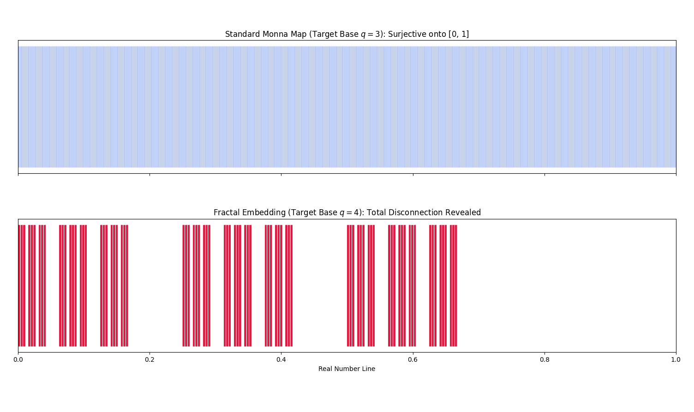
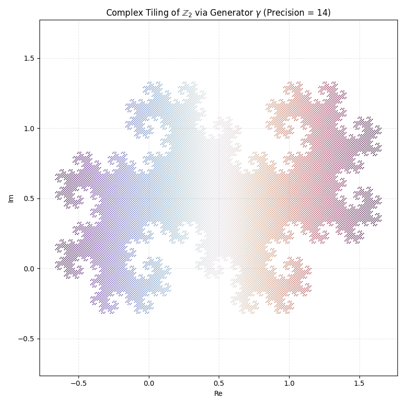
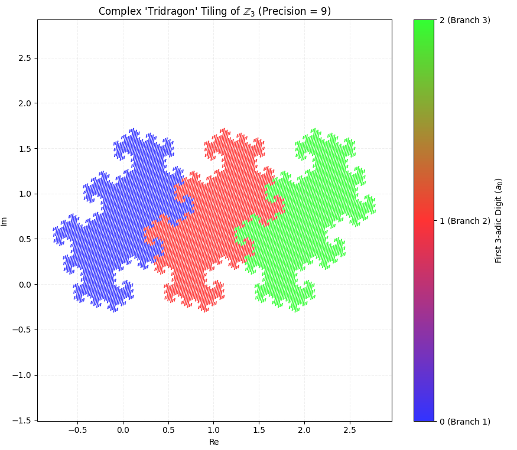
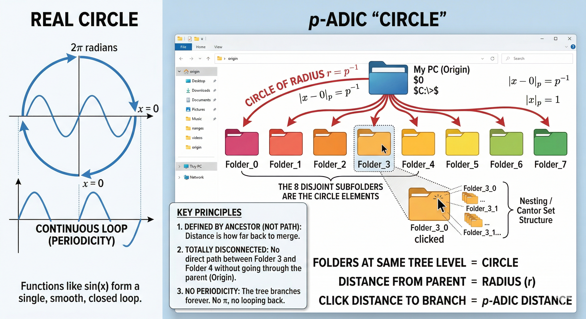

### **NOTES ON STATISTICS, PROBABILITY and MATHEMATICS**

<a href="http://rinterested.github.io/statistics/index.html">
</a>

---

<div style="background-color: #f3f4f6; border-left: 4px solid #3b82f6; padding: 16px; border-radius: 8px;">

Big division:

$$\cases{\text{p-adic integers} \in \mathbb Z_p \\\\
\text{p-adic rationals} \in \mathbb Q_p} \\\\\mathbb Z_p\subset\mathbb Q_p$$


</div>


<h3 style="text-align: left; color: #2c3e50; font-family: Inter, system-ui, sans-serif; font-weight: 300; border-bottom: 2px solid #2c3e50; padding-bottom: 0.2em;">
Integers:
</h3>


$\mathbb Z_p$ contains numbers whose expansions only go to the left (powers $p^0, p^1, p^2, \dots$):

---

$\dots d_3 d_2 d_1 d_0 = d_0\, p^0 + d_1 \, p^1 + d_2\, p^2 + \cdots$

---

Example: A $3$-adic integer looks like $\dots0002101_3$, corresponding to $2101_3$ in base $3,$ and $64=2\cdot 3^3 + 1 \cdot 3^2 + 0 \cdot 3^1 + 1 \cdot 3^0$ in base $10.$ 

These p-adic integers also include fractions (provided there is no power of $p$ in their denominators):

Example: 

$\dots 01210122_3$ is $1/5$ in $3$-adics. Here we have a fraction in $\mathbb Q$ that turns into an integer in $\mathbb Z_p.$

In addition, p-adic integers include negative numbers:

Example:

$\cdots 1100110011001022_3$ is $-1.45 = -\frac{29}{20}.$

Transcendental numbers also turn into p-adic integers... Well, sometimes! Here is a mind-boggling realization: To move a number from $\mathbb{R}$ to $\mathbb{Q}_p$, we need a bridge: usually a sequence of rational numbers. For instance in $\mathbb{R}$, $e = \displaystyle \sum_{n=0}^\infty \frac1 {n!}$. In $\mathbb{Q}_p$, the terms $1/n!$ have $p$ in the denominator more and more often as $n$ grows. This means the terms get larger p-adically $(|1/n!|_p \to \infty)$. Therefore the series explodes. Similarly $\pi$ is defined by the geometry of Euclidean space. Since p-adic space is non-Euclidean and ultra-metric (every triangle is isosceles), the physical definition of $\pi$ has no meaning there.

In the realm of $p$-adic analysis, the ring of p-adic integers $\mathbb{Z}_p$ is exactly the closed unit ball centered at the origin. To see why this algebraic object doubles as a geometric ball, we have to look at how we measure distance in the p-adic world. For any prime $p$, the p-adic valuation $v_p(x)$ of an integer $x$ is the highest power of $p$ that divides $x$. This gives rise to the p-adic absolute value: $|x|_p = p^{-v_p(x)}.$ Because a higher power of $p$ dividing a number makes its absolute value smaller, multiples of large powers of $p$ are actually incredibly close to zero. By definition, the p-adic integers $\mathbb{Z}_p$ consist of all elements in the $p$-adic completion $\mathbb{Q}_p$ that have a metric size less than or equal to $1:$ $\mathbb{Z}_p = \{ x \in \mathbb{Q}_p : |x|_p \le 1 \}.$ This is the exact definition of a closed unit ball $B_1(0)$ in a metric space.

The p-adic integers (often denoted as \(\mathbb{Z}_{p}\)) form a fractal because they are totally disconnected and self-similar. When mapped geometrically onto the real number line or complex plane, their topological structure takes the form of a classic fractal like a Cantor set or a Sierpiński gasket. 

Here is the Monna map of $\mathbb Z_3:$

---



---

A single $3$-adic integer looks something like $\dots 21012_3,$ infinitely extending to the left. Because Python code can't calculate infinitely many digits, the code to generate the plot above is truncated at a precision of $7$ digits. A typical number looks like: $x = [2, 0, 1, 1, 2, 0, 2]$ (Which translates to the number: $2 + 0(3) + 1(3)^2 + 1(3)^3 + 2(3)^4 + 0(3)^5 + 2(3)^6$). Our code systematically generates every single possible $7$-digit combination using the digits $0, 1,$ and $2.$ Since there are $3$ choices for each of the $7$ slots, the code generates exactly $3^7 = 2,187$ distinct numbers. Every single vertical line on the plot represents exactly one of these $2,187$ numbers. The Monna map is a rule that takes those digits, flips them backwards across a decimal point, and reads them as a fraction. The $3$-adic number: $[1, 2, 0, 0, 0, 0, 0] = 1 + 2(3)^1 + 0(3)^2 + 0(3)^3 + 0(3)^4 + 0(3)^5 + 0(3)^6$ results under the Monna map into the decimal point $0.1200000...$ In base $10$ this is

$$\text{Position} = \frac{1}{10^1} + \frac{2}{10^2} = \frac{1}{10} + \frac{2}{100}$$

In the top plot (base $3$ reals) we read $0.12$ as a standard base-$3$ fraction:

$$\small\text{Position} = \frac{1}{3^1} + \frac{2}{3^2} = \frac{1}{3} + \frac{2}{9} = \frac{5}{9} \approx 0.555$$

So, the computer draws a blue line at $0.555$. In the bottom plot (base $4$ reals), we take those exact same digits $1$ and $2,$ but we force them into a base-$4$ fraction instead:

$$\text{Position} = \frac{1}{4^1} + \frac{2}{4^2} = \frac{1}{4} + \frac{2}{16} = \frac{3}{8} = 0.375$$

So, the computer draws a red line at $0.375$.

The darker blue lines in the top plot are the manifestation of the structural instability of the real, Archimedean metric. In the real numbers, we have this quirky glitch where a single point can be written in two completely different ways. These are akin to the standard base-$10$ equality $0.9999\dots = 1.0.$ Because we are using base-$3$ for the top plot, that exact same glitch happens at every single major boundary. For example: $0.02222\dots_3 = 0.10000\dots_3 = \frac{1}{3}.$ In the world of p-adics, the number that is all twos ($\dots2222_3$) and the number that is a "one followed by all zeros" ($\dots0001_3$) are completely distinct, separate entities. They live on entirely different branches of the p-adic tree. When the Monna map flips them across the decimal point to turn them into real numbers, they become $0.02222\dots_3$ and $0.10000\dots_3$. Because those two distinct real expressions equal the exact same value ($\frac{1}{3}$), the computer is forced to draw both lines on the exact same pixel. Because our code generates every possible combination of digits, this collision doesn't just happen once. It happens at $\frac{1}{3}$, $\frac{2}{3}$, $\frac{1}{9}$, $\frac{2}{9}$, $\frac{4}{9}$, $\frac{5}{9}$, and so on. Wherever these branches accidentally touch and glue together in the real numbers, we get a pixel collision. Multiple distinct p-adic numbers land on top of one another, and matplotlib renders that overlapping density as a noticeably darker vertical line. In the bottom red plot, by shifting to base-$4,$ we physically pull those boundaries apart. $0.0222\dots_4$ equals $\frac{2}{3}$, while $0.1000\dots_4$ equals $\frac{1}{4}$. Because $\frac{2}{3}$ and $\frac{1}{4}$ are different positions on the screen, the collision is broken, the lines separate, and the "instability" vanishes, exposing the true, clean gaps of the p-adic topology.

P-adics can also be plotted to the complex plane as in the image below: one half of the twin dragon fractal (sometimes called the Davis-Knuth Dragon), representing the $2$-adic integers ($\mathbb{Z}_2$), but this time, we allowed the numbers to unfold into the complex plane. In the $1$D Monna map, we used a prime base $p=3$ and flipped the digits to the right of the decimal point to make fractions. In this complex version, we are using the prime base $p=2$ (so our only available digits are $0$ and $1).$ But instead of using a standard fraction, we replace the base $2$ with a specific complex number, $\gamma$ (gamma): $\gamma = \frac{1 + i}{2}.$ Our Python code systematically generates all $2^{14} = 16,384$ possible $14$-digit combinations of zeros and ones. For every single sequence, it calculates a complex coordinate using this exact recipe:

$$\small \text{Position} = a_0 + a_1\gamma^1 + a_2\gamma^2 + a_3\gamma^3 + \dots + a_{13}\gamma^{13}$$

The computer evaluates this sum for all $16,384$ numbers, turns the resulting complex numbers into standard $(X, Y)$ coordinates, and drops a tiny colored dot on your screen. In complex arithmetic, multiplying by a number does two things simultaneously: it scales the distance from the origin, and it rotates the position around the origin. For our base $\gamma = \frac{1+i}{2}$ the absolute value (length) of $\gamma$ is $\frac{1}{\sqrt{2}} \approx 0.707$. This means every higher power of $\gamma$ shrinks the step size by about $30\%.$ The angle of $\gamma$ is exactly $45^\circ$. Every single step rotates the next digit's contribution by $45^\circ$ counterclockwise. Because the digits are constantly twisting by $45^\circ$ and shrinking by $\frac{1}{\sqrt{2}}$ as we move down the sequence, the linear chain of numbers is forced to curl up into this tightly wound, interlocking spiral cloud. The image perfectly visualizes the core topological properties of the $2$-adic integers: Self-Similarity (two interlocking halves). In the $2$-adics, the entire space $\mathbb{Z}_2$ can be cleanly split into two halves based entirely on the very first digit ($a_0$): Numbers that start with $0$ (even numbers) and numbers that start with $1$ (odd numbers). The entire dragon is built out of two smaller, identical twin dragons smashed together. The even dragon (where $a_0 = 0$) starts exactly at the center $(0,0)$. The odd dragon (where $a_0 = 1$) is shifted to the right because its sum starts with $+1$. If we were to isolate just one of those halves, we would find it is an exact scaled-down, rotated copy of the entire global dragon. If you zoom into that half, it splits into two even smaller identical dragons. This nesting continues infinitely.

---



---

The mesmerizing plots don't end at $\mathbb Z_2.$ Here is tridragon for $\mathbb Z_3$ with three interlocking sectors. Because of added color-coding based on the very first digit ($a_0 = 0, 1, 2$), the entire cloud splits cleanly into three distinct colored regions (blue, red, green). These are the three main branches of the $\mathbb{Z}_3$ tree.

---



---

In the real number line, zooming in on a number just reveals a smoother line. In the p-adic world, the metric measures distance based on the highest power of the prime $p$ that divides two numbers. When we zoom in on a p-adic number, we don't find a line; we find the space splitting into $p$ distinct, disconnected discs. Each of these disks, when zoomed in on further, splits into $p$ more disks, perfectly mirroring the global shape at every scale. This property is the definition of self-similarity, the core feature of fractals. Because of the ultrametric inequality — which states that $\vert{}x+y\vert{}_p \le \max(\vert{}x\vert{}_p, \vert{}y\vert{}_p)$ — there are no lines connecting points in the p-adic space. Instead, the space is a totally disconnected topological space. If you visualize the p-adic integers geometrically on a two-dimensional plot, the numbers form a dense, dusty structure that behaves mathematically like a Cantor set.


<div style="background-color: #f3f4f6; border-left: 4px solid #3b82f6; padding: 16px; border-radius: 8px;">

* In the reals, the intermediate value theorem guarantees that to get from A to B, we must cross every single point in between. This is the foundation of classical physics, smooth motion, and fluid dynamics. In the $p$-adics, the space is totally disconnected. If we want to move from point A to point B in a $p$-adic landscape, we don't glide smoothly across a line. We instantaneously hop. It is a universe composed entirely of isolated points grouped into fractal clusters (cliques). In $\mathbb{Q}_p$, the world is Non-Archimedean. Adding a number to itself over and over never makes it physically larger in the p-adic metric. In fact, in $\mathbb{Q}_p$, if we add $1+1+1...$ a total of $p$ times, we get $p$, which has a $p$-adic absolute value of $1/p$. Adding things together makes them smaller.  In $\mathbb{Q}_p$, the topology is totally disconnected. Geometrically, $\mathbb{Q}_p$ looks like a Cantor dust — a fractal cloud of points. Every single triangle in $\mathbb{Q}_p$ is isosceles, and the center of every ball is any point inside it. While beautiful for coding data structures or studying number theory, it is an impossible geometry for modeling smooth spacetime, fluid dynamics, or planetary orbits.

* The real numbers are an ordered field. You can say $2 < 3$, meaning $3$ is to the right of $2$ on a line. This allows us to have concepts like "greater than," "less than," positive, and negative. $\mathbb{Q}_p$ cannot be ordered in a way that plays nice with arithmetic. We cannot say one p-adic number is larger than another in a linear sense. Without an order, we lose calculus as we know it. We can't define a velocity vector pointing forward or backward.

* Most $p$-adic numbers are transcendental, meaning they can only be reached via infinite series, not polynomial roots. For instance, $e^x = 1 + x + \frac{x^2}{2!} + \frac{x^3}{3!} + \dots$ As long as $x$ is sufficiently small (highly divisible by $p$), this series converges perfectly inside $\mathbb{Q}_p$ to a transcendental $p$-adic number. The p-adic fields are the completion of the rational numbers $\mathbb{Q}$ with respect to the $p$-adic metric. When we complete a space, we throw in the limits of all possible Cauchy sequences. Because $\mathbb{Q}_p$ is uncountably infinite, and the set of algebraic numbers is only countably infinite, almost every $p$-adic number is transcendental.

* To use Hensel’s lemma to lift a solution from modular arithmetic up into the $p$-adics (explained below), we need a polynomial equation $f(x) = 0$ and its derivative $f'(x)$. Because polynomials only involve addition and multiplication, Hensel’s lemma is a fundamentally algebraic tool used to find algebraic numbers (like $\sqrt{7}$ or $\sqrt{-1}$). Hensel's lemma doesn't generate all p-adic numbers. It only detects the algebraic ones. The vast majority of the p-adic universe cannot be reached by it.

* The real $\pi$ is transcendental in $\mathbb{R}$, but its structure relies on things getting smaller in the standard geometric sense. In traditional geometry, $\pi$ is the ratio of a circle's circumference to its diameter. However, in p-adic fields $\mathbb{Q}_{p},$ circles and geometry do not exist in the traditional sense because the metric is ultrametric (the distance function forms a disconnected). Because of this, the number $\pi$ does not naturally exist or arise as a constant in standard p-adic number systems. In complex analysis, $\pi$ is inextricably linked to $e$ and $i$ via Euler's identity. In the p-adic setting, mathematicians like John Tate introduced the notion of Tate curves, which require a p-adic analogue of $2\pi i.$ While $2\pi i$ itself does not sit inside the standard p-adic complex numbers, a p-adic analogue can be rigorously defined. Another way mathematicians define an equivalent of $\pi$ is through the p-adic gamma function $\Gamma _{p}.$ The classical gamma function obeys reflection formulas involving $\pi$: $\Gamma (z)\Gamma (1-z)=\frac{\pi }{\sin (\pi z)}.$ Because the p-adic gamma function shares similar properties, mathematicians often define a canonical p-adic equivalent of $\pi$ by setting $\sqrt{\pi} = \Gamma_p(\frac{1}{2}).$


</div>


---

<h3 style="text-align: left; color: #2c3e50; font-family: Inter, system-ui, sans-serif; font-weight: 300; border-bottom: 2px solid #2c3e50; padding-bottom: 0.2em;">
Ostrowski's theorem, completion of $\mathbb Q,$ ultrametric metric, pi, e and the p-adic circle
</h3>
---

In mathematics, a completion is a process that fills the gaps in a number system by including the limits of all Cauchy sequences. Both the real numbers (\(\mathbb{R}\)) and the \(p\)-adic numbers (\(\mathbb{Q}_{p}\)) are constructed as completions of the rational numbers (\(\mathbb{Q}\)), but they use entirely different definitions of distance.

Cauchy sequences exist in the p-adic numbers, and they behave under an even simpler convergence rule than in the real numbers. Just like in the real numbers, a sequence is Cauchy if its terms get infinitely close to one another However, because the p-adic distance metric satisfies a special geometric property called the ultrametric inequality, testing for convergence becomes significantly easier. In any metric space, a sequence $a_n$ is a Cauchy sequence if, for every $\epsilon > 0,$ there exists an integer $N$ such that for all $m, n > N:$ $|a_{m}-a_{n}|_{p}<\epsilon.$ In the p-adic metric $\lvert \cdot \rvert_p,$ two numbers are close if their difference is divisible by a large power of $p.$ The p-adic metric is an "ultrametric," meaning it obeys a stronger version of the triangle inequality: $|x+y|_{p}\le \max (|x|_{p},|y|_{p}).$ 

In regular space, the direct shortcut, for instance walking $3$ units along a street, and $4$ units along a perpendicular street, and then cutting across at a diagonal in a middle park for $5$ units, can easily be longer than either individual leg ($3$ or $4$). If we try to apply the ultrametric rule ($d(x, z) \leq \max\{d(x, y), d(y, z)\}$) to a scalene triangle, it will fail. The rule will stand only if the triangle is perfectly isosceles with a short base. In an ultrametric space, shortcuts don't exist. We can never create a distance longer than the highest single branch we climbed - see Windows Explorer examples below, showing isosceles or equilateral triangles.

Because of this property, a sequence in $\mathbb{Q}_{p}$ is Cauchy if and only if the difference between consecutive terms goes to zero. $\lim _{n\rightarrow \infty }|a_{n+1}-a_{n}|_{p}=0.$ In the real numbers, this shortcut is false (for example, the harmonic series $1 + \frac{1}{2} + \frac{1}{3} + \dots$ has consecutive terms going to zero, but it does not converge). In the \(p\)-adics, it is always true. 

Consider the 5-adic integers $\mathbb{Q}_{5}$ and the sequence of partial sums for this infinite series: $a_{n}=5+5^{2}+5^{3}+5^{4}+\dots +5^{n}.$ Let us look at the distance between consecutive terms: $|a_{n+1}-a_{n}|_{5}=|5^{n+1}|_{5}=\frac{1}{5^{n+1}}$. As $n$ goes to infinity, $\frac{1}{5^{n+1}}$ goes to $0.$ Because consecutive terms get closer together, this sequence is guaranteed to be a Cauchy sequence, and it converges to the $5$-adic integer $-\frac{5}{4}.$ 

Factor out a $5$:

$a_{n}=5(1+5+5^{2}+\dots +5^{n-1})$

Using the standard formula

$1 + r + r^2 + \dots + r^{n-1} = \frac{1-r^n}{1-r}$ 

where $r=5$:

$a_{n}=5\cdot \left(\frac{1-5^{n}}{1-5}\right)$

$a_{n}=5\cdot \left(\frac{1-5^{n}}{-4}\right)=\frac{5^{n}-1}{4}\cdot 5$

$a_{n}=\frac{5^{n+1}-5}{4}=\frac{5^{n+1}}{4}-\frac{5}{4}$

Even though Ostrowski's theorem states that the only ways to fill in the gaps of the rational numbers $\mathbb{Q}$ are through the familiar real numbers $\mathbb{R}$ or the p-adic numbers $\mathbb{Q}_p$ for some prime $p,$ we can't express $\pi$ as p-adics. Completion isn't about collecting every possible number that exists; it's about filling in the holes for a specific way of measuring distance. In the reals we use the distance $|x - y|:$ We see that the sequence $3, 3.1, 3.14, 3.141...$ is getting closer and closer together. Since the "limit" isn't a rational number, we call that hole $\pi$ and add it to the set. In the p-adics, we use the distance $|x - y|_p$. In this metric, the sequence $3, 3.1, 3.14...$ doesn't get closer together at all. In fact, the terms stay far apart. Therefore, there is no "hole" at $\pi$ in the p-adic world because the sequence never tries to go there. The p-adics are complete because every sequence that should converge (according to p-adic distance) does converge to a p-adic number.

Just as in the real world, many Cauchy sequences of rational numbers do not converge to a rational number. The set of p-adic numbers $\mathbb{Q}_p$ is defined as the completion of $\mathbb{Q}$ with respect to the p-adic metric. 

The "geometry" of a p-adic circle is nothing like the one we draw on a piece of paper. Here is a Gemini depiction of a circle as the folders at the same depth inside a Windows Explorer system (explained later on):

---



---

In the p-adic world, trigonometry exists through power series, but the lack of $\pi$ means the functions behave in ways that would baffle a high school geometry student. Here is how we compute "circular" things in $\mathbb{Q}_p$ without $\pi$:

In the reals, you can define $\sin(x)$ and $\cos(x)$ using the unit circle, or you can use their Taylor series. Since there are no "visual" circles in $\mathbb{Q}_p$, we use the series:

$$\sin(x) = \sum_{n=0}^{\infty} \frac{(-1)^n x^{2n+1}}{(2n+1)!} \quad \text{and} \quad \cos(x) = \sum_{n=0}^{\infty} \frac{(-1)^n x^{2n}}{(2n)!}$$

These series converge in $\mathbb{Q}_p$ as long as $|x|_p$ is small enough (specifically $|x|_p < p^{-1/(p-1)}$). Inside this "disk of convergence," these functions work perfectly. You can even prove the p-adic version of the Pythagorean identity $\sin^2(x) + \cos^2(x) = 1$.

In the real numbers, $\sin(x)$ is periodic because of $\pi$. You go around the circle $2\pi$ radians and end up back where you started. In the p-adics, there is no $\pi$ because there is no periodicity. In $\mathbb{R}$, $\sin(x) = 0$ at $0, \pi, 2\pi, \dots.$ In $\mathbb{Q}_p$, the only solution to $\sin(x) = 0$ is $x = 0$. Because the functions aren't periodic, they don't "wrap around." A p-adic "line" doesn't form a closed loop in the way a real line wraps into a circle. If you define a circle as the set of points where $|x|_p = r$, the shape is strange: a set of disjoint disks. Because of the ultrametric inequality, if two p-adic "circles" overlap at all, one is contained entirely within the other. A p-adic circle isn't a smooth continuous line; it's more like a fractal dust (a Cantor set).

Since we don't have $\pi$ to measure angles, we use roots of unity. In the complex numbers, the roots of $x^n - 1 = 0$ are points on the unit circle separated by angles of $2\pi/n$. In $\mathbb{Q}_p$, we can solve $x^n - 1 = 0$ for certain values of $n$ (specifically where $n$ divides $p-1$ using Hensel's Lemma). These roots of unity are the p-adic way of "dividing the circle." You aren't moving a distance of $\pi/4$ along an arc; you are jumping between discrete algebraic points that satisfy a circular equation.

However, there are transcendental and complex numbers that can be expressed as p-adic integers. For example, in the $5$-adics, $\sqrt{-1}$ is a "natural" member of the field. 

While the imaginary number $i = \sqrt{-1}$ cannot exist in the real number system because a positive times a positive is positive and a negative times a negative is also positive, it does exist in the $5$-adic number system. The reason it only exists for some $p$ is based on modular arithmetic. A square root of $-1$ (a number $x$ such that $x^2 = -1$) exists in the p-adic integers $\mathbb{Z}_p$ if and only if the equation $x^2 \equiv -1 \pmod p$ has a solution. This condition is only met when $p$ is a prime number that is congruent to $1$ modulo $4$. For $p=5$ the equation $x^2 \equiv -1 \pmod 5$ is equivalent to $x^2 \equiv 4 \pmod 5$. This has two solutions: $x=2$ and $x=3$, as $2^2 = 4 \equiv 4 \pmod 5$ and $3^2 = 9 \equiv 4 \pmod 5$. Because these solutions exist, they can be lifted to form two unique $5$-adic integers that are the square roots of $-1$.

The constant $e$ can be calculated in p-adics. In calculus, we define $e^x$ using its infinite Taylor series:

$$e^x = 1 + x + \frac{x^2}{2!} + \frac{x^3}{3!} + \frac{x^4}{4!} + \dots$$

If we want the base constant $e$, you plug in $x = 1$: $e^1 = 1 + 1 + \frac{1}{2} + \frac{1}{6} + \frac{1}{24} + \dots.$ In the real numbers, this series converges beautifully. But in the $5$-adics, for example, a series converges if and only if the individual terms shrink to zero ($|\text{term}|_5 \to 0$). Let's look at what happens to the terms of $e^1$ in $5$-adics:  denominators are factorials $(1!, 2!, 3!, 4!, 5! \dots).$ Every time a factorial crosses a multiple of $5,$ it accumulates a factor of $5$ in the denominator. For example, $5! = 120 = 5 \times 24$. Because $5$ is in the denominator, the $5$-adic absolute value actually explodes. For instance, $|\frac{1}{5!}|_5 = 5$. As we go further down the series, the factorials accumulate more and more powers of $5,$ causing the terms to blow up to infinity. Because the terms don't shrink to zero, the series for $e^1$ strictly diverges in $\mathbb{Q}_5$. To make the series converge, we have to feed the exponential function an input $x$ that shrinks faster than the factorials can blow it up. In $\mathbb{Q}_5$, if we pick an input $x$ that is highly divisible by $5$ (meaning $|x|_5 \le 1/5$), the $x^n$ in the numerator will overpower the factorials in the denominator. So, instead of calculating $e^1$, mathematicians calculate $e^5$ (or more generally, $e^p$ for any prime $p > 2$). Let's look at the series for $e^5$ in $\mathbb{Q}_5$:

$$e^5 = 1 + 5 + \frac{5^2}{2!} + \frac{5^3}{3!} + \frac{5^4}{4!} + \frac{5^5}{5!} + \dots$$

Now let's check the $5$-adic size of the terms to make sure they shrink: 

Term $2:$ $5 \implies$ divisible by $5^1 \implies$ size is $1/5$ 

Term $3:$ $\frac{25}{2} \implies$ divisible by $5^2 \implies$ size is $1/25$

Term $6:$ $\frac{5^5}{5!} = \frac{3125}{120} = \frac{625}{24} \implies$ divisible by $5^4 \implies$ size is $1/625$

Because the powers of $5$ in the numerator grow much faster than the factorials can absorb them, the terms rapidly shrink to zero in the $5$-adic metric. This series is guaranteed to converge to a perfectly precise, single, transcendental $5$-adic number.

To find the actual $5$-adic digits of this number, we calculate the partial sums of the series modulo increasing powers of $5.$ A $5$-adic number is written with digits moving to the left: $\dots a_3a_2a_1a_0$. Let's compute the first few terms of the series to find the initial digits:

$$\small \text{Partial Sum} = 1 + 5 + \frac{25}{2} + \frac{125}{6} + \frac{625}{24} + \frac{625}{24} + \dots$$

To do arithmetic with the fractions, we have to convert them to integers using modular arithmetic (finding the modular inverse of the denominators mod powers of 5).

Step $1:$ Find the last digit $a_0$ (modulo 5) If we look at the sum modulo $5,$ every term with a $5$ or higher vanishes:

$$e^5 \equiv 1 \pmod 5$$

So, the last digit is $1$. (Our number ends in $\dots1_5$).

Step $2:$ Find the next digit $a_1$ (modulo $25):$ Let's look at the sum modulo $25.$ The terms with $5^2$ or higher vanish:

$$e^5 \equiv 1 + 5 \equiv 6 \pmod{25}$$

Written in base 5, $6 = 1\cdot5^1 + 1\cdot5^0$, which is written as $11_5$. So the next digit is $1$. (Our number ends in $\dots11_5$).

Step $3:$ Find the next digit $a_2$ (modulo $125).$ Now we include the next term, $25/2$. We need to find the value of $1/2 \pmod{125}$. Since $2 \times 63 = 126 \equiv 1 \pmod{125}$, the fraction $1/2$ is equivalent to the integer $63$.

$$e^5 \equiv 1 + 5 + 25(63) \equiv 1 + 5 + 1575 \equiv 1581 \pmod{125}$$

We reduce $1581 \pmod{125}$:

$$1581 = 12 \times 125 + 81 \implies 81 \pmod{125}$$

Now, we convert the integer $81$ to base $5$ digits:

$$81 = 3\cdot(25) + 1\cdot(5) + 1\cdot(1) \implies 311_5$$

So the next digit is $3$. (Our number ends in $\dots311_5$).

The Final $5$-adic representation of this exponential constant:

$$e^5 = \dots 41413230111_5$$

This infinite string of digits is the true "5-adic $e$". It functions as the foundational base for 5-adic trigonometry, exponential growth models, and calculus within $\mathbb{Q}_5$.


<h3 style="text-align: left; color: #2c3e50; font-family: Inter, system-ui, sans-serif; font-weight: 300; border-bottom: 2px solid #2c3e50; padding-bottom: 0.2em;">
Rationals:
</h3>

$\mathbb Q_p$ contains those same numbers, plus a finite fractional part to the right of the radix point (negative powers like $p^{-1}, p^{-2}, \dots$):

---

$$\dots d_3 d_2 d_1 d_0\; \color{red}.\; d_{-1}d_{-2}\dots d_{-k}\; = \;d_{-k}\, p^{-k} + \dots + d_{-1}\, p^{-1} + d_0\, p^0 + d_1 \, p^1 + \dots$$

---

Example: In $2$-adics the fraction $3/4$ is written $\dots 000110.11$ (equivalent to $2^{-2}+2^{-1}+2^1 + 2^2 +\dots$)

When a p-adic number has digits to the right of the point, it is formally treated as a formal Laurent series in $p$. A p-adic integer is just a power series (no negative powers), while a "non-integer" is a Laurent series because it includes those negative powers of $p.$
 
$\mathbb Q_p$ is the field of fractions of $\mathbb Z_p$, created simply by taking $\mathbb Z_p$ and allowing division by $p.$ 

While the p-adic integers $\mathbb{Z}_p$ consist of power series starting at $i=0$, the full field of p-adic numbers, denoted by $\mathbb{Q}_p$, allows for a finitary fractional part: the "fractional" part (the negative powers) must be finite. If we allowed an infinite number of negative powers, the series would not converge under the p-adic metric. In p-adic analysis, $p^n$ gets smaller as $n$ gets larger. Therefore, $p^{-n}$ gets larger as $n$ gets larger. An infinite sum of increasingly huge terms cannot converge.

A general element $\gamma \in \mathbb{Q}_p$ is expressed as a formal Laurent series in $p$:

$$\gamma = \underbrace{\frac{a_{-k}}{p^k} + \dots + \frac{a_{-1}}{p^1}}_{\substack{\text{Fractional Part} \\ \text{(Finite Terms)}}} + \underbrace{a_0 + a_1 p^1 + a_2 p^2 + \dots}_{\substack{\text{Integer Part } (\mathbb{Z}_p) \\ \text{(Infinite Series)}}}$$

$\mathbb{Q}_p$ can be viewed as the field of fractions of $\mathbb{Z}_p$. There is resemblance to Laurent series, in which the variable is $x$ or $(z - z_0)$, while in p-adics, the prime $p$ plays the role of the variable. In both cases, the coefficients $a_i$ come from a specific set (a field or $\{0, \dots, p-1\}$). Just as a Laurent series converges when the variable is small, p-adic series converge because, under the p-adic metric, higher powers of $p$ are "smaller" (closer to zero). 

In standard base-$p$ arithmetic, digits to the right of the point represent $p^{-1}, p^{-2}, \dots$ and get smaller as you move right. In p-adics, these negative powers are actually the large components. If $k \to \infty$ in the denominator as in the sequence: 

$$\frac{1}{p}, \frac{1}{p^2}, \frac{1}{p^3}, \dots, \frac{1}{p^n}$$

the sequence diverges to infinity. Just as in the real numbers the sequence $10^1, 10^2, 10^3 \dots$ "blows up" and cannot be represented as a single real number.


<h3 style="text-align: left; color: #2c3e50; font-family: Inter, system-ui, sans-serif; font-weight: 300; border-bottom: 2px solid #2c3e50; padding-bottom: 0.2em;">
Positive integers:
</h3>

For **positive integers** the digits expressed in p-adics or in base $p$ are identical, but the direction in which you read or sum them is different.

Writing a positive integer $n$ in base $p$ is expressing it as a finite sum of powers of $p$:

$$n = a_k p^k + a_{k-1} p^{k-1} + \dots + a_1 p^1 + a_0 p^0$$

where each digit $a_i \in \{0, 1, \dots, p-1\}$. We usually write this as $(a_k a_{k-1} \dots a_1 a_0)_p.$ The sequence of digits terminates to the left (it is finite), and the powers of $p$ increase as you move to the left. The "size" of the number is determined by the highest power of $p$.

An element of the p-adic integers $\mathbb{Z}_p$ is an infinite formal power series:

$$\alpha = \sum_{i=0}^{\infty} a_i p^i = a_0 + a_1 p^1 + a_2 p^2 + \dots$$

For a standard positive integer $n$, the p-adic expansion is simply the base-$p$ expansion where all digits beyond the highest power $p^k$ are zero.

$$n = a_0 + a_1 p + \dots + a_k p^k + 0 \cdot p^{k+1} + 0 \cdot p^{k+2} + \dots$$

Example: $128$ in $5$-adics:

Divide $128$ by $5:$

$128 \div 5 = 25 \small\text{ (quotient)}$ with a remainder of $\text{Re }=3.$ Keep the remainder.

Divide the quotient $(25)$ by $5:$

$25 \div 5 = 5 \small \text{ (quotient)}$ with a remainder of $\text{Re }=0.$ keep the remainder.

Divide the quotient $(5)$ by $5:$

$5 \div 5 = 1 \small\text{ (quotient)}$ with a remainder of $\text{Re }=0.$ Keep the remainder.

Divide the quotient $(1)$ by $5:$

$1 \div 5 = 0 \small \text{ (quotient)}$ with a remainder of $\text{Re }=1.$

The remainders we found $(3, 0, 0, 1)$ are the coefficients for the powers of $5.$ In $5$-adic notation, $128$ is expressed as:

$$128 = 3 \cdot 5^0 + 0 \cdot 5^1 + 0 \cdot 5^2 + 1 \cdot 5^3$$

In standard base-$5$ notation, we write this as 

$$1003_5$$

In the p-adic system $\mathbb{Z}_p$, we view numbers as infinite series of powers of $p$:

$$\dots + a_3 5^3 + a_2 5^2 + a_1 5^1 + a_0 5^0$$

For a positive integer like $128,$ all the higher digits ($a_4, a_5$, etc.) are simply $0.$ So, the $5$-adic expansion of $128$ is: 

$$\dots 00001003_5$$
<h3 style="text-align: left; color: #2c3e50; font-family: Inter, system-ui, sans-serif; font-weight: 300; border-bottom: 2px solid #2c3e50; padding-bottom: 0.2em;">
Negative integers:
</h3>

For **negative integers**, in p-adics, we don't use minus signs; we use the geometric series. For example, in $2$-adics, what is the representation of $-1$? Since $\frac{1}{1-r} = 1 + r + r^2 + \dots$, we set $r=2$:

$$-1 = \frac{1}{1-2} = 1 + 2^1 + 2^2 + 2^3 + \dots$$

In p-adic notation, $-1$ is written as an infinite string of the highest possible digit: $(\dots 11111)_2$ or $(\dots (p-1)(p-1)(p-1))_p$. 

Another example: $-1$ in base $3$ ($p=3$): In standard base $3$: $-1_3$. But in $3$-adic expansion: $\dots 22222_3$. Because if you add $1$ to $\dots 22222_3$, you trigger an infinite carry:

$$(2+1) \to 0 \text{ carry } 1 \to (2+1) \to 0 \dots$$

The result is $\dots 00000$, which is $0$. Therefore, $\dots 22222_3$ must be $-1$. 


<h3 style="text-align: left; color: #2c3e50; font-family: Inter, system-ui, sans-serif; font-weight: 300; border-bottom: 2px solid #2c3e50; padding-bottom: 0.2em;">
Fractions in base p:
</h3>

To calculate the base-$3$ expansion of $1/2$ (a "ternary" fraction), we use the same method we'd use to find the decimal expansion of $1/2$ in base $10,$ i.e. long division.

Since we are working in base $3,$ the only digits we can use are $0, 1,$ and $2$.

First Step: 

How many times does $2$ go into $1$? It goes in $0$ times. We write down $0.$ and add a "ternary" zero to the $1$, making it $10_3$. Note: In base $3,$ the number $10_3$ is equal to $3$ in decimal. 

Second Step: 

How many times does $2$ go into $10_3$ (decimal $3$)? $2$ goes into $3$ $1$ time with a remainder of $1$. Write down $1$ Our expansion is now $0.1.$

Third Step: 

Bring down another $0$, making the remainder $10_3$ again. How many times does $2$ go into $10_3$? Again, it goes in $1$ time with a remainder of $1$. Write down $1$. Our expansion is now $0.11.$

Repeat: Since the remainder is always $1$, the process repeats infinitely. Result: $1/2 = 0.1111\dots_3$

You can double-check this using the sum of a geometric series. In base $3,$ the place values to the right of the point are $3^{-1}, 3^{-2}, 3^{-3}$, and so on. The expansion $0.111\dots_3$ represents:

$$\frac{1}{3^1} + \frac{1}{3^2} + \frac{1}{3^3} + \dots$$
This is a geometric series with first term $a = 1/3$ and common ratio $r = 1/3$. The formula for the sum is:

$$S = \frac{a}{1 - r}$$

Substituting our values:

$$S = \frac{1/3}{1 - 1/3} = \frac{1/3}{2/3} = \frac{1}{2}$$
<h3 style="text-align: left; color: #2c3e50; font-family: Inter, system-ui, sans-serif; font-weight: 300; border-bottom: 2px solid #2c3e50; padding-bottom: 0.2em;">
Fractions in p-adics:
</h3>

$$\color{red}{1/2 \text{ in } 3\text{-adics}}:$$

We solve $2x = 1$:

We need 

$$2\;\cdot \underset{\text{geometric series}}{\underbrace{ (a_0 + a_1 \cdot 3 + a_2 \cdot 9 + \dots)}} = 1$$ 

Since we are operating mod $3$ the expression simplifies to:

$$2a_0 \equiv 1 \pmod 3 \implies a_0 = \color{red}2$$ 

(because $2 \cdot 2 = 4 \equiv 1$).

Now we have a carry. 

$$2 \cdot \color{red}2 + 2(a_1 \cdot 3 + a_2 \cdot 9 + \dots) = 1$$

Subtracting $2 \cdot 2 = 4$ from $1$ gives $-3$

$$2(a_1 \cdot 3 + a_2 \cdot 9 + \dots) = 1 - 4=-3$$

Dividing by $3$: 

$$2(a_1 + a_2 \cdot 3 + \dots) = \frac{1 - 4}3=-1$$

and mod $3$:

$2a_1=-1\pmod 3$


we now need:

$$2a_1 \equiv -1 \pmod 3 \implies 2a_1 \equiv 2 \pmod 3 \implies a_1 = 1$$

Continuing this, we get a unique, infinite string of digits extending to the left: $\dots 11112_3$.

It’s a perfect symmetry: the digits for $1/2$ are all $1$s in both systems, except for that very first digit in the p-adic version.

This is not surprising, looking at it from the perspective of a geometric series. It stems from the fact that both systems are trying to represent the same algebraic relationship — the inverse of $2$ — using the same building blocks: the powers of $3.$

<div style="background-color: #f3f4f6; border-left: 4px solid #3b82f6; padding: 16px; border-radius: 8px;">

The **first digit** of a fraction's standard fractional expansion in base $p$ is determined by an approximation toward zero in the Archimedean (real) metric, whereas the **first digit** of its canonical p-adic expansion is determined by modular arithmetic ($\pmod p$) optimizing for closeness to zero in the non-Archimedean $p$-adic metric.

For a simplified rational fraction $x = \frac{a}{b}$ where $p$ does not divide $a$ or $b$, the relationship between these two initial digits is governed by the following mathematical structures:

##### Determining the base $p$ real digit

In the standard real number system, the fractional part of $x$ (assuming $0 < x < 1$) is expanded into a right-facing series:


$$x = d_{-1}p^{-1} + d_{-2}p^{-2} + d_{-3}p^{-3} + \dots$$
The first fractional digit $d_{-1}$ isolates the macro-magnitude of the number on the real line. It is computed using the floor function:

$$d_{-1} = \lfloor p \cdot x \rfloor = \left\lfloor \frac{pa}{b} \right\rfloor$$

##### Determining the p-adic digit

In the p-adic number system $\mathbb{Q}_p$, because $p$ does not divide the denominator $b$, the fraction $x$ behaves as a p-adic integer $x \in \mathbb{Z}_p.$ It expands into a left-facing series:

$$x = a_0 + a_1p + a_2p^2 + a_3p^3 + \dots$$

The first canonical p-adic digit $a_0$ captures the local algebraic remainder. It is computed by solving the linear congruence equation for the multiplicative inverse of the denominator modulo $p$:

$$a_0 \equiv a \cdot b^{-1} \pmod p \quad \text{where } a_0 \in \{0, 1, \dots, p-1\}$$

##### Direct mathematical relationship

To directly link $d_{-1}$ and $a_0$, we use the algebraic division identity $p\,a = b \cdot d_{-1} + r$, where $r = (pa \bmod b)$ is the integer remainder. 

By evaluating this identity under the p-adic modular constraint:

$$b \cdot d_{-1} + r \equiv 0 \pmod p$$

$$b \cdot d_{-1} \equiv -r \pmod p$$

$$d_{-1} \equiv -r \cdot b^{-1} \pmod p$$

We established two separate congruences for the digits:

**For the $p$-adic digit ($a_0$):**

$$a_0 \equiv a \cdot b^{-1} \pmod p$$
   
**For the real base-$p$ digit ($d_{-1}$):**

$$d_{-1} \equiv -r \cdot b^{-1} \pmod p$$

Since both equations are valid congruences modulo $p$, we can multiply their left-hand sides together and their right-hand sides together:

$$a_0 \cdot d_{-1} \equiv (a \cdot b^{-1}) \cdot (-r \cdot b^{-1}) \pmod p$$

$$a_0 \cdot d_{-1} \equiv a \cdot (-r) \cdot (b^{-1} \cdot b^{-1}) \pmod p$$
$$a_0 \cdot d_{-1} \equiv a \cdot (-r) \cdot (b^{-1})^2 \pmod p$$


The direct relationship between the first $p$-adic digit $a_0$ and the real base-$p$ digit $d_{-1}$ can be expressed explicitly as 


$$a_0 \equiv -a \cdot r^{-1} \cdot d_{-1} \pmod p$$

or 

$$d_{-1} \equiv -r \cdot a^{-1} \cdot a_0 \pmod p$$

(assuming $r \not\equiv 0 \pmod p$).

From our established system of modular congruences, we have:

$$a_0 \equiv a \cdot b^{-1} \pmod p$$
$$d_{-1} \equiv -r \cdot b^{-1} \pmod p$$

We can eliminate $b^{-1}$ entirely to express $a_0$ and $d_{-1}$ directly in relation to each other.

From the first equation, we solve for the modular inverse of the denominator:

$$b^{-1} \equiv a^{-1} \cdot a_0 \pmod p$$

Substitute this representation of $b^{-1}$ directly into the second equation:

$$d_{-1} \equiv -r \cdot (a^{-1} \cdot a_0) \pmod p$$

Depending on which digit we want to isolate on the left-hand side of the equation, we can rewrite the final relation in two distinct structural forms:

**Expressing $d_{-1}$ in relation to $a_0$:**

$$d_{-1} \equiv (-r \cdot a^{-1}) \cdot a_0 \pmod p$$

**Expressing $a_0$ in relation to $d_{-1}$:**
  
Multiply both sides by the modular inverse of the coefficients (provided $r \not\equiv 0 \pmod p$):

$$a_0 \equiv (-a \cdot r^{-1}) \cdot d_{-1} \pmod p$$

$$a_0 \equiv -a \cdot r^{-1} \cdot d_{-1} \pmod p$$

---


Let's plug in the numbers from the earlier example ($x = \frac{1}{3}$ in base $p = 5$) where:

* $a = 1, \quad b = 3, \quad p = 5, \quad r = 2$
* $d_{-1} = 1, \quad a_0 = 2$
* $b^{-1} \equiv 3^{-1} \equiv 2 \pmod 5$

into $a_0 \cdot d_{-1} \equiv a \cdot (-r) \cdot (b^{-1})^2 \pmod p:$


Left-Hand Side (LHS):

$$a_0 \cdot d_{-1} = 2 \cdot 1 = 2$$

Right-Hand Side (RHS):

$$a \cdot (-r) \cdot (b^{-1})^2 = 1 \cdot (-2) \cdot (2)^2$$
$$= -2 \cdot 4 = -8$$

Evaluate Modulo $5:$

$$-8 \equiv 2 \pmod 5$$

Both sides equal $2$, confirming the algebraic shortcut works.

Relationship Verification:

The division identity for the real digit is $5 \cdot 1 = 3(1) + 2$, giving a remainder $r = 2$. 

Checking our modular relationship link:

$$d_{-1} \equiv -r \cdot b^{-1} \pmod p \implies 1 \equiv -2 \cdot (3^{-1}) \pmod 5$$
$$1 \equiv 3 \cdot 2 \pmod 5 \implies 1 \equiv 1 \pmod 5$$
The identity holds perfectly.

---

##### Summary of the Relationship:
The first digit of a real base $p$ fractional expansion identifies the integer **quotient** of $\frac{pa}{b}$, whereas the first digit of a canonical p-adic expansion identifies the modular **multiplicative inverse** of the denominator scaled by the numerator ($\pmod p$).

</div>

---

If this expansion were finite, it would simply be a standard integer $(\mathbb Z)$ (a polynomial in $3$). But $1/2$ is not an integer. Therefore, the error or remainder after any finite number of steps will never be zero. To neutralize this remainder, the series must be infinite. In p-adics, an infinite sum of increasing powers doesn't explode to infinity; it wraps around the number line to hit fractional targets.

In standard analysis, a geometric series $\sum r^n$ only converges if $|r| < 1$. But the p-adics redefine distance: by declaring that a number is small if it is divisible by a high power of $p$ we force the geometric series to converge for ratios like $r=3$, $r=5$, or $r=p$. 

In the integers, you cannot solve the equation $2x = 1$. To fix this, we usually invent the rational number $1/2$. But p-adics offer a different fix. We know the geometric series for $\frac{1}{1-r}$ is $1 + r + r^2 + \dots$ If we simply declare that $3^n \to 0$, then $1 + 3 + 3^2 + \dots$ is a perfectly valid number. We can think of p-adics as a form of arithmetic analytic continuation. In complex analysis, if a power series doesn't converge in one region, you can sometimes reach that value by moving to a different domain. p-adics do this for the number line itself. They allow us to evaluate expressions like $\sum p^n$ that are illegal in the real numbers. If it were just a trick to sum divergent series, it might be a curiosity. But the p-adic system is essential because many problems in number theory (like finding integer solutions to equations) are impossible to solve globally (with rational solutions). However, if we check them locally (in the real numbers and in every p-adic field $\mathbb{Q}_p$), and they work in all of them, they often work in the original problem. Just as $\mathbb{R}$ completes the rationals by filling in the gaps between points, $\mathbb{Q}_p$ completes the rationals by filling in the gaps in divisibility. 

It is a massive, logically consistent framework built entirely on the premise that multiples of $p$ are the new small.

To guarantee that any fraction $a/b$ can be forced into this geometric shape **Fermat’s Little Theorem** comes into play: for any denominator $b$ (co-prime to $p$), there is a power $p^n$ that is $1$ more than a multiple of $b$.

$$p^n \equiv 1 \pmod{b} \implies p^n - 1 = b \cdot k$$

This allows us to rewrite any denominator $b$ into the form $p^n - 1$. 

[Fermat's Little Theorem (FLT)](https://en.wikipedia.org/wiki/Fermat%27s_little_theorem) specifically states $p^{b-1} \equiv 1 \pmod{b}$ when $b$ is prime. However, in the case of any denominator $b$ (even composite ones like $b=10$), we use the **Euler-Fermat Theorem** (a generalization of FLT). It says that as long as $p$ and $b$ share no common factors $(\gcd(p, b) = 1),$ then: 

$$p^{\phi(b)} \equiv 1 \pmod{b}$$
Where $\phi(b)$ is the count of numbers less than $b$ that are coprime to it. Whether $b$ is prime or composite, there is always some power $n$ that lands you at $1 \pmod{b}$. This ensures $b \cdot k = p^n - 1$ always has an integer solution for $k$.

Because we must use the form $1 - r$ for our series to work, and Fermat gives us $p^n - 1$, we are forced to introduce a negative sign to flip the denominator:

$$\frac{1}{b} = \frac{k}{p^n - 1} = \frac{k}{-(1 - p^n)} = -k \left( \frac{1}{1 - p^n} \right)$$

Therefore we really start in the negatives. To represent a positive fraction as an infinite string, i.e. a p-adic integer, we are actually expanding a negative integer and shifting it across the origin. This creates the symmetry. In base $p,$ we approach the fraction by adding smaller and smaller pieces ($p^{-n}$) starting from zero. In p-adics, we approach the fraction by adding p-adically smaller pieces ($p^n$). 

The negative first term matches perfectly the idea that $\dots (p-1)(p-1)(p-1)=-1$ for any p-adic system, and this is in fact also the "end of the odometer" given that we are operating with $\{0,1, \dots,p-1\}$. In the real numbers, $0.999\dots$ reaches up to $1$. In p-adics, $\dots(p-1)$ it reaches up to $-1$. It is effectively the largest possible representation (using all available digits) that, through the mechanics of p-adic carries, lands on the additive inverse of the multiplicative identity.

Because both systems use the same geometric ratio ($p$) to close the same gap, they generate the same digits. The p-adic version is simply the arithmetic shadow or complement of the real-world expansion. The first digit differs because the p-adic tree has to make one final carry to jump from the negative side of the origin to the positive side where $1/2$ actually lives: The "final carry" is the single click that happens when adding $1$ to $...999.$ It triggers a chain reaction of carries that travels infinitely to the left, turning every digit into a $0.$ 

If we want to represent $1/2$ in $3$-adics ($p=3, b=2$), we find the Fermat power ($n$): We need 

$$3^n \equiv 1 \pmod{2}$$

$3^1 = 3 \equiv 1 \pmod{2}$. So, $n = 1$. Next, we find the multiple ($k$) 

$$3^1 - 1 = 2 \cdot k \implies 2 = 2 \cdot 1$$ 

So, $k = 1$. Therefore, the geometric series setup is

$$\frac{1}{2} = \frac{1}{3-1}$$

To get our p-adic series, we need the denominator to be $(1-3)$, so we factor out a $-1$:

$$\frac{1}{2} = \frac{1}{-(1-3)} = -1 \cdot \left( \frac{1}{1-3} \right)$$

Now we replace the fraction with the geometric series $1 + r + r^2 \dots$:

$$\frac{1}{2} = -1 \cdot (1 + 3^1 + 3^2 + 3^3 + \dots)$$


Since $-1 = \dots 2222_3$, 

$$(\dots 2222_3) \times (1 + 3 + 9 + 27 + \dots)$$

$$ \dots 2222_3 \times (1 + 3^1 + 3^2 + 3^3 + \dots)= \dots 2222_3 \times 1 +\dots 2222_3 \times 3^1 + \dots 2222_3 \times 3^2 + \dots 2222_3 \times 3^3 + \dots$$

we'll show a pattern if we find the first few digits of the result, we multiply the "infinite" $-1$:

Term $1$: $(\dots 2222) \times 1 = \dots 2222$

Term $2$: $(\dots 2222) \times 3 = \dots 2220$

Why? The mechanics are just multiplication base $3$:

In the case of $\dots 2222_3 \times 3$:

Rightmost Digit ($3^0$ slot):

$2 \times 3 = 6$.

$6 \pmod 3 = \mathbf{0}$.

Carry = $6 \div 3 = \mathbf{2}$.

Next Digit ($3^1$ slot):

$2 \times 3 = 6$.

Add the carry: $6 + \mathbf{2} = 8$.

$8 \pmod 3 = \mathbf{2}$.

Carry = $8 \div 3 = \mathbf{2}$. (Integer division, since $8 = 2 \times 3 + 2$).

Next Digit ($3^2$ slot):

$2 \times 3 = 6$.

Add the carry: $6 + \mathbf{2} = 8$.

$8 \pmod 3 = \mathbf{2}$.

Carry = $\mathbf{2}$.

Term $3$: $(\dots 2222) \times 9 = \dots 2200$

Term $4$: $(\dots 2222) \times 27 = \dots 2000$


The digits collapse into a repeating pattern of $1$s, and the final result is

$$\dots 11112_3$$

Notice that the p-adic representation of $-1/2$ is

$$-1/2 = \dots 11111_3$$

and adding $1/2 + (-1/2) = 0.$

In the real numbers, we reach $1/2$ by adding smaller and smaller pieces to zero $(0.111\dots).$ In the p-adics, we reach $1/2$ by starting from the negative universe of the geometric series and shifting it by exactly one unit. Because both systems rely on the same ratio dictated by Euler’s generalization of Fermat’s Theorem they produce the same digits. The only difference is the direction of the expansion and that single first-digit adjustment ($1 \to 2$) required to jump the gap from the negative infinite representation back into the positive world.

---

#### [Two's Complement representation](https://en.wikipedia.org/wiki/Two%27s_complement) in computer science and the Radix:

In the $3$-adic representation of $1/2$ above we run into $-1 = \dots 2222_3$, which can immediately be generalized as $-1 = \dots (p-1)(p-1)(p-1)(p-1)_p.$ This is effectively the mile $999999$ in an odometer: a natural barrier in itself. 

In this system, one more negative click would land us at

$$-2 =\dots 2222_3-1= \dots2221_3$$
followed by 

$$-3 = \dots2220_3$$
While adding $+1$ lands us at

$$0=\cdots 0000_3$$

and one more

$$1 = \dots 0001_3$$
This is wrap around between $0$ and $-1$ without using the minus sign is only possible in the setting of an infinite series and a new metric that allows convergence. But given these premises, there is an effective inversion at the end of the odometer. 

So what would be the p-adic equivalent of an odometer at $999991$? In base $10$, it would have to be assigned to $-9:$ counting backward looks like $-1 = \dots 999999_{10}$, $-2 = \dots 999998_{10}$, $-3 = \dots 999997_{10}$ and so on until $-9 = \dots 999991_{10}$.

In a standard car odometer with only $6$ digits, `999991` is both the positive number $+999,991$ and the negative number $-9$. They are physically the same state of the gears. But in p-adics, because the odometer is infinite, they are two completely different settings. 

In a finite $6$-digit odometer (base $10$):

Positive $999,991$: 

`999991`

Negative $-9$: 

`999991` 

(Because $999991 + 9 = 1,000,000$, which rolls over to $000000$).

In the p-adic odometer (infinite digits):

Positive $999,991$: 

`...000000000999991`

(It has an infinite string of zeros to the left. It never hits the wall)

Negative $-9$: 

`...999999999999991`

It is a "two-way odometer": A positive integer is a finite string of digits that eventually turns into infinite zeros. A negative integer is a finite string of digits that eventually turns into infinite $(p-1)$s.

They occupy different "neighborhoods" of the p-adic universe. In the real number line, $+999,991$ is huge and $-9$ is small. It would be tempting to falsely state that the p-adic metric, $-9$ is closer to the "wall" ($\dots 999$), while $+999,991$ is "closer" to zero ($\dots 000$). To be close to zero, a number must end in many zeros. To be close to $-1$, a number must end in many nines. 

However, $+999,991$, corresponding to $\dots 0000000999991$ doesn't even share one trailing zero with the zero-wall. It is technically far from zero (distance = $1$). On the same odometer, the expansion of $-9$ is $\dots 999999999999991$: It matches the $9$'s of the wall for almost the entire infinite string, except for the very last digit ($1$ vs $9$). It is also technically far from the wall (distance = $1$). So perhaps the best term would be 'anchored': Positive integers are anchored to the zero-wall. Even if $+999,991$ is far from zero, its tail is made of infinite zeros. It belongs to the zero neighborhood. Negative integers are anchored to the negative wall. Even if $-9$ is far from $-1$, its tail is made of infinite nines. It belongs to the "wall neighborhood." To be truly close to an anchor in p-adics, you need a high power of the base: The number $1,000,000$ ($\dots 0001000000$) shares six zeros with the anchor, so it's close to $0$. On the other hand, the number $-1,000,001$ ($\dots 9998999999$) shares six nines with the anchor. In the p-adic metric, $1,000,000$ is small and $1$ is large.

A number like $1/2$ ($\dots 1112_3$) is the ultimate nomad. It is not anchored to the zero-wall of infinite zeros, nor is it anchored to the negative-wall of infinite twos ($3$-adics). Because its tail is periodic and never settles into a single repeating digit of $0$ or $(p-1)$, it belongs to neither neighborhood. It is a 'fractional' state that can only exist because the odometer is infinite, allowing it to stay in a permanent state of 'rolling over' without ever arriving at a final destination."

$\dots (p-1)(p-1)(p-1)_p$ is the unique element that maps to the highest possible value in every single finite modular system simultaneously in $\mathbb{Z}_p$ as the inverse limit of the rings $\mathbb{Z}/p^n\mathbb{Z}$.

In computer science, this is exactly what is known as [Two's Complement representation](https://en.wikipedia.org/wiki/Two%27s_complement). If you look at a signed integer in a 64-bit system, the number $-1$ is represented as a solid string of $1$s:

Binary: `11111111 11111111 11111111 11111111 11111111 11111111 11111111 11111111`

Hexadecimal: `0xFFFFFFFFFFFFFFFF`

The p-adics are simply the mathematical generalization of this, where the number of bits is infinite.

In the real line $0$ is the origin, but for p-adics $-1$ is the complementary origin. The symmetry we found between $1/2 = 0.111\dots_3$ (fractional real line system) and $1/2 = \dots 1112_p$ ($3$-adics) is the mathematical proof that the distance from the real origin $(0)$ and the p-adic origin $(-1)$ to the value $1/2$ is governed by the exact same geometric laws.

The standard two's complement is designed for integers only. A $64$-bit integer register cannot deal with $1/2.$

In the $3$-adic system, we successfully found $1/2 = \dots 11112_3$. However, if we attempt to apply this same "odometer logic" to find $1/2$ in the $2$-adic (binary) system, we hit a structural wall. In $2$-adics, $-1$ is represented by the infinite string $\dots 1111_2$. This is the "odometer limit" we discussed. When we add $1$ to this infinite string the rightmost $1 + 1$ becomes $0$ and carries a $1$ to the left. The next $1 + 1 + \text{carry}$ becomes $0$ and carries a $1$ to the left. This continues forever. Because that carry moves infinitely to the left (into higher and higher powers of $2$), the "leftover" carry eventually vanishes. You are left with $\dots 0000$,

To find $1/2$, we would need a $2$-adic number that, when doubled, equals $1$. But in binary, doubling a number is equivalent to a bit-shift to the left (appending a zero at the end). This means any doubled number must end in $0$, making it impossible to ever sum to $1$ ($1 = 1 \cdot 2^0 = (\dots 0001)_2$). This failure actually defines the difference between a p-adic integer ($\mathbb{Z}_p$) and the broader p-adic field ($\mathbb{Q}_p$). Because $2$ is the base itself, $1/2$ cannot be expressed as a power series starting at $2^0$; it requires the "fractional" part of the Laurent series, $2^{-1}$. In the $2$-adic system, $1/2$ is not an infinite string of integers, but a single digit shifted to the right of the radix point: $0.1_2$. The system doesn't fail; it simply forces the number out of the "integer" circle and into the "fractional" territory.

To find $1/2$ in $2$-adics, we use the **radix point** (the p-adic version of a decimal point). Since $1/2 = 2^{-1}$, its representation is actually finite but below the units place: $1/2 = 0.1_2.$ In base $3,$ $2$ does not divide $3$, so $1/2$ becomes an infinite periodic expansion. In base $2,$ $2$ does divide the base, so it becomes a simple terminating fractional digit. In the case of $1/3$ in $2$-adic, since $3$ doesn't divide $2$, it must be an infinite string to the left:

If we want to represent $1/3$ as a $2$-adic power series, the p-adic representation only accepts denominators of the form $(1 - r)$, where $r$ is a power of $p.$ To find that power, we use Fermat’s little theorem (or Euler's generalization). What power of $2$ is exactly $1$ more than a multiple of $3$?

$2^1 = 2$ (it's not $1 \pmod 3$)

$2^2 = 4$ (this is $1 \pmod 3$, because $4 = 3 \times 1 + 1$)

So, our power is $n=2$. This tells us that $2^2 - 1$ is a multiple of $3$. Now we force $1/3$ into the geometric series:

$$\frac{1}{3} = \frac{1}{2^2 - 1}$$

To make it a $2$-adic series, the denominator must be $1 - r$. We factor out a $-1$:

$$\frac{1}{3} = \frac{1}{-(1 - 2^2)} = \color{red}{-1} \underset{\text{geom. series}}{\underbrace{\cdot \left( \frac{1}{1 - 2^2} \right)}}$$

Now, we apply the standard geometric series identity: 

$$\frac{1}{1-r} = 1 + r + r^2 + r^3 + \dots$$

Since our $r$ is $2^2$ (which is $4$), the fraction becomes:

$$\color{red}{-1} \cdot \underset{\text{geom. series r = 4}}{\underbrace{(1 + 2^2 + (2^2)^2 + (2^2)^3 + \dots)}}$$

$$-1 \cdot (1 + 2^2 + 2^4 + 2^6 + \dots)$$

If we expand this, we get the repeating pattern: 

$$\dots 010101011_2$$

In binary $p=2$, $-1$ is an infinite string of $1$s: $\dots 111111_2$. The series $(1 + 2^2 + 2^4 + 2^6 + \dots)$ are powers of $4$ in binary ($1, 100, 10000, 1000000 \dots$). In binary, $2^2$ is $100_2$, $2^4$ is $10000_2$, and so on. This series looks like a "comb" of $1$s: 

$$(1 + 4 + 16 + 64 + \dots) = \dots 01010101_2$$

The multiplication results in 

$$\frac{1}{3} = \dots 010101011_2$$

Comparing this $2$-adic odometer to the standard binary expansion of $1/3$ that a computer scientist would use for decimals: 

Real binary: $1/3 = 0.01010101\dots_2$

$2$-adic binary: $1/3 = \dots 010101011_2$

The pattern of $01$ is identical in both. The only break in the symmetry is that very last bit (the $1$ on the far right), which is the adjustment needed because the p-adic version is approaching $1/3$ from the wall of $-1$, while the real version is approaching from $0$.

In the real number line, $+5$ and $-5$ are on opposite sides of zero. In the p-adic odometer, $+5$ is a "0-tail" number: $...000005$, while $-5$ is a "9-tail" number: $...999995$. They are not collapsed together; they are polarized. Every integer chooses a side: it either settles into the "zero-Wall" or the "negative-Wall."

If all the integers are either "all zeros" or "all nines," what is left? The fractions. A fraction like $1/3$ in $2$-adics ($\dots 0101011_2$) never settles. It doesn't have a tail of all zeros, and it doesn't have a tail of all ones. It is perpetually oscillating. 

In $2$-adics:

Positive integers: Tail of `...000abcd`

Negative integers: Tail of `...111abcd`

Fractions: Tail of `...010101` (or some other repeating pattern).

An irrational number in p-adics — like the $5$-adic square root of $-1$ — has an expansion that never repeats. The gears of the odometer are constantly turning, but they never fall into a predictable loop. Each new digit to the left is a "surprise" generated by the algebraic equation we are trying to solve. We find these digits one by one using Hensel's Lemma (the p-adic version of Newton's method) - this is explained below. On the odometer, an irrational number looks like a random sequence of numbers that goes on forever to the left without a pattern.


---

<h3 style="text-align: left; color: #2c3e50; font-family: Inter, system-ui, sans-serif; font-weight: 300; border-bottom: 2px solid #2c3e50; padding-bottom: 0.2em;">
The p-adic perspective:
</h3>


The p-adic expression of a number is akin to placing a filter on the number: the filter of the prime $p$. In the case of $5$-adics for example, the valuation and the size of the $5$-adic expression of a number could be seen as an attempt at extracting the "five-ness" out of the number in question.

Consider a monetary system in which there were coins representing fractions of $5,$ as well as bills with values multiples of $5$. The p-adic twist would dictate that these coins had much larger value than the bills - the inverse of the actual monetary value, as if the coins were made of precious metals. Imagine that at a shop an attendant is returning $\$450$. The $5$-adic expression is:

$$450 = 0\cdot 5^0 + 0\cdot 5^1 + 3\cdot 5^{\color{red}2} + 3\cdot 5^3$$
 
Yes, the cashier could hand over to the customer $90$ $\$5$ bills, but this would be unwieldy. In fact, the most efficient way of giving out this quantity is with $3$ bills of $\$25$ and $3$ bills of $\$125.$ This is exactly what the expression is telling us, and it is not different (since $450$ is an integer) from expressing this number in base $5.$

The algorithm involved is successive division or **iterative modulo**: The process of repeatedly dividing by a series of divisors. In practice, **counting up** is often used instead of division. Rather than calculating the total change first, you start at the purchase price and add coins and bills until you reach the amount the customer paid. Example: If a customer pays $10$ for a $7.25$ item, you would say `7.25`, add a $25¢$ (`7.50`), add a $50¢$ (`8.00`), and then add two $1$ bills (`9`, `10`). Algorithmically, in change-making, we use the remainder of one step as the input for the next denomination. It is a greedy algorithm (the largest possible step without overshooting) provided we use a canonical coin system ($5¢, 25¢, 50¢, \$1, \$20$): we make the best local choice at each step, picking the largest bill possible. Notice that it is different from the **modular** expression $\mod p$, in which only the remainder is kept. Also, in the case of different coins and bills, it is a **mixed radix** (mixed base) algorithm, used in currency or time (hours/minutes/seconds). Expressing a number $N$ in base $p$, the algorthim is also greedy and iterative, taking the largest power $p^k \le N$, determining its coefficient, and repeating with the remainder. In base $p$, the denominations are $\{1, p, p^2, p^3, \dots\}$; in currency, denominations like $\{1, 5, 10, 25\}$ don't follow a strict geometric power rule.

The valuation is $\color{red}2$, because this measures the "five-ness" of $450$. If the coefficient for $5^2$ had been $0$, and the expression had started with a non-zero coefficient at $5^3$, $3$ the valuation would have been $3$ — a higher "five-ness." In p-adic terms, this higher valuation means the number is actually smaller (closer to zero), as 

$$|x|_p = \frac 1{p^{v(x)}} \implies \uparrow\;v(x) \to\; \downarrow |x|_p$$

The distance to zero is smaller the higher the valuation: 

$$|450|_5=\frac1{5^{v(x)}}=\frac 1{5^2}$$

where $v(x)=2$ is the valuation of $450$.

This distance formula $|x|_p = \frac1{p^v}$ reveals that the $5$-adic world is not a continuous line, but a hierarchy. The higher the valuation, the deeper the number is nested within 'folders' of $5$. This creates a tree-like topology where two numbers are close only if they share a long path of common digits. The p-adics are a Cantor set. If you try to plot them on a $2$D plane, they look like dust. Every "point" is actually the tip of an infinite branch. 

The reason we don't see this in real math is that in real math, we carry. If you add $1$ to $0.444_5$, it rolls over and changes everything to the left. In p-adics, the "folders" are rigid. Addition happens "deep" in the tree and only affects the branches above it. If you add $1$ to the $5$-adic number $4$ ($...0004_5$), you get $5$, which is written as $...0010_5$. So it would be incorrect to say that we only carry in real numbers. The carry happens exactly as it does in base $5.$ The difference isn't that we don't carry; it's where the carry goes and how it affects the closeness of the numbers. In p-adic math, a carry moves toward higher powers of $p$ ($5, 25, 125$), which are smaller and closer to zero. On the other hand real carry pushes the number away from where you started, as opposed to pushing the number deeper into the tree.

If the employee had had to return $\$\frac15$, the expansion would have been:

$$ 1\cdot 5^{-1}+0\cdot 5^{0}+0\cdot 5^{1}+\dots $$

with a valuation of $-1$ and a distance to zero of $5.$ This change is returned in some giant coin. In this system, $1/5$ is actually larger (further from zero) than $1$, which has an expansion of 

$$1 = \mathbf{1} \cdot 5^0 + 0 \cdot 5^1 + 0 \cdot 5^2 + \dots$$

And hence a valuation of $0,$ and a distance to zero of $1.$ In the $5$-adic world, $5$

$$5 = 0 \cdot 5^0 + \mathbf{1} \cdot 5^1 + 0 \cdot 5^2 + \dots$$

has a valuation of $1,$ and a distance to $0$ of $1/5.$

$25$ is smaller, and $1/5$ is a giant.

If you only look at a number through the "$5$-adic prism," you only see its relationship to the prime $5.$ To truly "know" the number in its entirety — its "global" identity— we have to look at it through every single prime prism ($2, 3, 5, 7, 11 \dots$) plus the "standard" prism of the real numbers ($\mathbb{R}$).

It is important to point out that the digits in the $5$-adic expansion of a real number like $450$ is identical to the expression in base $5$:

Mathematically, both systems are trying to write $450$ as a polynomial in powers of $5$:

$$450 = d_k(5^k) + \dots + d_2(5^2) + d_1(5^1) + d_0(5^0)$$

The only difference is the "direction of travel" for the algorithm. 


<h3 style="text-align: left; color: #2c3e50; font-family: Inter, system-ui, sans-serif; font-weight: 300; border-bottom: 2px solid #2c3e50; padding-bottom: 0.2em;">
The p-adic mechanics:
</h3>

<h4 style="text-align: left; color: #2c3e50; font-family: Inter, system-ui, sans-serif; font-weight: 300; border-bottom: 2px solid #2c3e50; padding-bottom: 0.2em;">
Expressing $450$ in $5$-adic:
</h4>


<div style="background-color: #f3f4f6; border-left: 4px solid #3b82f6; padding: 16px; border-radius: 8px;">

Nomenclature:

$$a_0 = d_0 (5^0) + d_1 (5^1) + d_2 (5^2) + d_3 (5^3) + d_4 (5^4) + d_5 (5^5)$$

**Coefficients or p-adic digits**: these are the **d**'s, which are the result of solving a congruence - they are the remainders. They indicate which coset of the ideal $p^n \mathbb{Z}_p$ we are in.
      
**p-adic quotients**: these are the **a**'s. Since we are performing the operation $a_{i+1} = (a_i - d_i) / p$, we are essentially finding the integer quotient of the previous value. 

</div>

---

The formula for finding the digit $d_0$ for a $\frac a b \in \mathbb Q$ is: 

$$b \cdot d \equiv a \pmod p$$

When you are dealing with an integer like $450$, you are implicitly treating it as the fraction: $\frac{450}{1}$ with $a = 450$ (the numerator) and $b = 1$ (the denominator). So, the equation $b \cdot d \equiv a \pmod p$ becomes:

$$1 \cdot d_0 \equiv 450 \pmod 5$$

since in $\mod 5$ all the terms except $d_0$ get nullified in the expression 

$$\frac {450}1 = d_k(5^k) + \dots + d_2(5^2) + d_1(5^1) + d_0(5^0)$$ 

Therefore

$$\frac {450}1 \equiv  d_0 \pmod 5$$
Level $5^0$: 

How much is the initial number in base $5$?

Find $d_0$ such that 
  
$$1 \cdot d_0 \equiv 450 \pmod 5$$
  
$450$ is divisible by $5$, so 
  
$$d_0 = 0$$
  
i.e. no remainder.

---

<div style="background-color: #f3f4f6; border-left: 4px solid #3b82f6; padding: 16px; border-radius: 8px;">

It is tempting to look at an integer like $450$ and wonder if we can just lift this entire beautiful architecture over to the "10-adics" ($\mathbb{Q}_{10}$) so we can count on our ten fingers. Sadly, we can't. The modulus must be a strict prime ($p$). If we try to run this clockwork with a composite base like $10$, the algebraic firewall collapses. Because $10 = 2 \times 5$, we end up with "zero divisors" — meaning two infinite, completely non-zero strings of digits can be multiplied together right-to-left to equal exactly zero. This jams the gears of division entirely. We are stuck using $450$ purely as a base-10 representation of a number whose internal plumbing must live on a prime clock.
</div>


---
  
  
If we chip away this difference (subtract the remainder) to make it fit, how close will it be to a multiple of $5$? 

New $a$: 
  
$$\bbox[20px, border: 5px solid red]{\text{new }a =\frac{\text{old }a-\text{remainder}}{\text{mod}}}$$

---

<div style="background-color: #f3f4f6; border-left: 4px solid #3b82f6; padding: 16px; border-radius: 8px;">

**THE CONCEPT**: We have worked up the original number (the first $a=450$) mod $5$. In doing so, all we know is that on a $5$ hour clock, some event happened at $\small \text{time}=\text{ remainder}.$ However, there are more levels of refinement, corresponding to higher orders of magnitude: $5^1, 5^2, 5^3 \dots 5^{10,000}.$ These have been completely ignored at this first level. To bring them to light, we need to subtract from the $\text{old }a$ this remainder that is already part of the $5$-adic expression. The difference will be the naturally divisible by $5.$ This difference (the numerator), when divided by $5$ will give us the number of revolutions around the clock that have been ignored - the $\text{new }a.$ Now comes the key idea: we want to know this number of revolutions mod $5.$ Because we have divided by $5$ the difference between the actual initial number and the first remainder when modded by $5$ we are now looking at the modular expression of the number (minus the first remainder), base $25.$ 

Imagine we have a $5$-hour front clock. That gives us the expression of the original number base $5.$ Now imagine that there is a smaller $5$-hour clock right behind this front clock. This second $5$-hour clock ticks once every time the bigger, front clock goes one full circle around: the second clock counts the full revolutions of the first clock. Naturally, the initial remainder is less than one full revolution, so it will leave no mark on the second clock.

If the number of revolutions of the first clock is more than $25,$ there will be a need for a third, smaller back clock to keep tally of the revolutions of the second clock. And so on to infinity.

Crucially, we can leave out the process of refining the information contained in the original number at any step. It is the same with a regular clock: saying "it's $19:00$ is meaningful, even though we would like to also know whether we are referring to $7$ pm of the first day counted, or of the second, third or forth day, i.e. the number of full revolutions around the $24$-hour clockface that would need a second counter. If we had this second counter for the number of full days, it would never modify that it is $7$ pm of some day.

While the p-adic clocks stack neatly backward into the wall—ensuring that a spin of the $10,000\text{th}$ clock leaves the front dial completely undisturbed—the real-number clocks are structurally tied to a fluid tail. If you walk away from a real calculation, you have left the foundation unlocked; the future tail always retains a mechanical veto power over the past.

In the real line the remnant from a high order of magnitude is added to a digit from an order of magnitude immediately lower to create the next dividend in a long division. Hence the remnants are not isolated at each order of magnitude, resulting in limit cases in which situations like 0.49999 = 0.5 can occur. This make the operations in the real line unstable.

To find the next digit in the long division of a fraction $d_{n+1}$, we take our current remainder $R_n$, multiply it by $10,$ add the next digit of the dividend ($I_{n+1}$), and divide by our divisor $B$: $\small \text{Next Working Dividend} = (R_n \times 10) + I_{n+1}.$ Because $R_n$ is multiplied by $10$ and mixed with $I_{n+1}$, the boundaries between orders of magnitude are completely fluid. Information flows seamlessly back and forth across the decimal point. Because the remnants are not isolated, an infinite tail of high digits ($9999\dots$) can act like a slow-moving wave. Each $9$ passes a massive remainder to the left, which passes a remainder to the left, until the wave hits the front of the number and forces $0.4999\dots$ to collapse into $0.5$. This makes real digit expansions unstable.

In the real numbers ($\mathbb{R}$), we take the remnant from a higher order of magnitude, multiply it by $10,$ (or lowering the next digit) and drag it down into the lower orders of magnitude to form the next dividend. Because we are constantly dragging the leftover pieces down into the next calculation, the orders of magnitude are completely fluid and mixed together. The future tail always retains a physical path to bleed back into the past, making the system topologically unstable and forcing non-unique representations like $0.4999\dots = 0.5$. In the p-adics, we do the exact opposite. At every single step, we evaluate the equation modulo $p$. Because anything belonging to a higher order of magnitude is a multiple of $p$, the modulus acts as a perfect algebraic scissor, cutting off the higher powers and isolating the remnant completely. Information is strictly prohibited from being dragged down to a lower order; it can only step upward into the higher powers.
</div>

---
  
Continuing now with the calculation, notice that $\text{old }a-\text{remainder}$ will always be divisible by the mod.
  
$$\frac{(450 - 0)}{5} = \mathbf{90}$$

Level $5^1$: 

Find $d_1$ such that 
  
$$1 \cdot d_1 \equiv 90 \pmod 5$$ 
  
$90$ is divisible by $5$, so 
  
$$d_1 = 0$$
  
If we chip away this difference from the multiple of $5$ in the previous step, how close will $25$ be?
  
New $a$: 
  
$$\frac{(90 - 0)}{5} = \mathbf{18}$$
  
Level $5^2$: 

Find $d_2$ such that $1 \cdot d_2 \equiv 18 \pmod 5$. 

$18 \div 5$ leaves a remainder of $3$. So $d_2 = 3$.
  
If we chip away this difference from the multiple of $25$ in the previous step, how close will $125$ fit into it?
  
New $a$: $(18 - 3) / 5 = \mathbf{3}$.
  
Level $5^3$: 
 
Find $d_3$ such that $1 \cdot d_3 \equiv 3 \pmod 5$. $3 \div 5$ leaves a remainder of $3$. So $d_3 = 3$.
  
Et cetera.
  
Result: (Digits $d_0, d_1, d_2, d_3$) $\rightarrow \boxed{0, 0, 3, 3}$.

Written in the same order as base $5$ (highest power first), this is $3300$.


---

<h4 style="text-align: left; color: #2c3e50; font-family: Inter, system-ui, sans-serif; font-weight: 300; border-bottom: 1px solid #2c3e50; padding-bottom: 0.2em;">
Expressing $450$ in base $5$:
</h4>

In standard base conversion, we start with the largest possible power of $5$ and work our way down to the units.

- Step 1: What is the largest power of $5$ in $450$? $5^3 = 125$.

- Step 2: How many $125$s? $450 \div 125 = \mathbf{3}$ with a remainder of $75$.

- Step 3: How many $5^2$ ($25$s) in $75$? $75 \div 25 = \mathbf{3}$ with a remainder of $0$.

- Step 4: How many $5^1$ ($5$s) in $0$? $0$.

- Step 5: How many $5^0$ ($1$s) in $0$? $0$.

Result: $\boxed{3300_5}$.

The reason they "coincide" for integers is that both methods — the quotient-based one and the remainder-based one — are actually doing the exact same thing to the number's structure, just from opposite directions. 

They are equivalent because they both seek to satisfy the same fundamental polynomial representation of the number. 

---

As a more involved example, take the number $4357$. Whether we use the "telescope" (base $5$) or "microscope" ($5$-adic) method, we are solving for the unique set of coefficients $\{b_i\}$ in this identity:

$$\bbox[5px, border: 1px solid black]{\color{red}{4357 = b_0 (5^0) + b_1 (5^1) + b_2 (5^2) + b_3 (5^3) + b_4 (5^4) + b_5 (5^5)}}$$


---

<h4 style="text-align: left; color: #2c3e50; font-family: Inter, system-ui, sans-serif; font-weight: 300; border-bottom: 1px solid #2c3e50; padding-bottom: 0.2em;">
Expressing $4357$ in base $5$:
</h4>

Base $5$ starts by solving for the largest $i$ first ($b_5$). It asks: "What is the most significant part of this number?" It effectively "strips away" the biggest chunks ($1 \cdot 5^5$, then $1 \cdot 5^4$, etc.) until nothing is left.

Step-by-Step quotient reasoning:

First, let's identify the powers of $5$: 

$5^1 = 5$, $5^2 = 25$, $5^3 = 125$, $5^4 = 625$, $5^5 = 3,125$, $5^6 = 15,625$. 

Since $5^5$ is the largest power that fits in $4,357,$ we start there.


| Power (Pw)| Operation<br>$\frac{\text{Rem}_{i+i}}{5^i}$| Quotient (Quo)<br>$b_i=\lfloor{\frac{\text{Rem}_{i+i}}{5^i}}\rfloor$|  $\small \text{prior Re}-\text{Quo}\times\text{Pw}$|Remainder (Re) |Partial sums|
| :--- | :--- | :---|:--- | :---|:---|
| $5^5 = 3125$ | $\frac{4357}{3125}=1.39$ | $\color{red}1$ $= b_5$|$4357-1 \cdot 5^5$  | $1,232$ |$\tiny x_5=3125$<br>$\tiny= \color{red}{1} \cdot 5^5$|
| $5^4 = 625$ | $\frac{1232}{625}=1.97$ | $\color{red}1$ $= b_4$|$1232-1\cdot 5^4$ |$607$ | $\tiny x_4=3750$<br>$\tiny= \color{red}{1} \cdot 5^5 + \tiny= \color{red}{1} \cdot 5^4$|
| $5^3 = 125$ | $\frac{607}{125}=4.85$ | $\color{red}4$ $= b_3$ |$607 - 4 \cdot 5^3$| $107$ |$\tiny x_3=4250$<br>$\tiny= \color{red}{1} \cdot 5^5 + \color{red}{1} \cdot 5^4 +  \color{red}{4} \cdot 5^3$|
| $5^2 = 25$ | $\frac{107}{25}=4.28$ | $\color{red}4$ $=b_2$|$107 - 4\cdot 5^2$ | $7$ |$\tiny x_2=4350$<br>$\tiny= \color{red}{1} \cdot 5^5 + \color{red}{1} \cdot 5^4 + \color{red}{4} \cdot 5^3 + \color{red}{4} \cdot 5^2$|
| $5^1 = 5$ | $\frac{7}{5}=1.4$ | $\color{red}1$ $=b_1$|$7- 1\cdot 5^1$ | $2$ | $\tiny x_1=4355$<br>$\tiny= \color{red}{1} \cdot 5^5 + \color{red}{1} \cdot 5^4 + \color{red}{4} \cdot 5^3 + \color{red}{4} \cdot 5^2 + \color{red}{1} \cdot 5^1$|
| $5^0 =1$ | $\frac{2} 1=2$ | $\color{red}2$ $=b_0$| $2 - 2\cdot 5^0$ | $0$ |$\tiny x_0=4357$<br>$\tiny= \color{red}{1} \cdot 5^5 + \color{red}{1} \cdot 5^4 + \color{red}{4} \cdot 5^3 + \color{red}{4} \cdot 5^2 + \color{red}{2} \cdot 5^1 + \color{red}{2} \cdot 5^0$|

By gathering the quotients from top to bottom, we get the digits: $1, 1, 4, 4, 1, 2.$ In standard mathematical notation: $$4357_{10} = 114412_5$$

The process of converting an integer to a base $p$ is essentially a recursive division algorithm. Specifically, it is the Euclidean Division algorithm applied repeatedly. In regular division, you are "shifting" values across powers of $10.$ In base conversion, you are doing the exact same thing across powers of $p$.


---

<h4 style="text-align: left; color: #2c3e50; font-family: Inter, system-ui, sans-serif; font-weight: 300; border-bottom: 1px solid #2c3e50; padding-bottom: 0.2em;">
Expressing $4357$ in $5$-adic (the congruence approach):
</h4>

The $5$-adic method starts by solving for the smallest $i$ first ($b_0$). It asks: "What is this number equivalent to, modulo $5$?" It uses the "subtract and divide" logic to clear out the units, then the fives, then the twenty-fives, moving from the inside out:

To find the $5$-adic expansion of $4,357$, we’ll use that "microscope" method: extracting the digits from the smallest power of $5$ $(5^0)$ up to the largest. Since $4,357$ is a positive integer, the process will eventually terminate (resulting in infinite zeros to the left), and the coefficients will be the same as the base-$5$ digits, just found in reverse order.

We represent $4,357$ as $a/c$ where $a = 4357$ and $c = 1$. We solve for $b_i$

$$\boxed{b_i \equiv a_i \pmod 5}$$ 


at each level. 

How to think of these $a_i$ and $b_i$? Well, $a_0$ is the actual number we start with, in this case $4,357$. But at each step we chisel away the remainder, which is the $b_i$ in the modular congruence that we are solving. But here is the key point: this modular operation starts off already at mod $5$, which neutralizes the whole tail of the RHS of the expression:

$$4357 = b_0 (5^0) + b_1 (5^1) + b_2 (5^2) + b_3 (5^3) + b_4 (5^4) + b_5 (5^5)$$

leaving only $b_0$. In the next step we subtract $4357 - b_0$ to produce the $\text{new } a$: so the `new` $a$ is just the number we started with modified in such manner that it is now congrouous to $5.$ We save the remnant the $b_0$. This new $a$ is divisible by $5,$ but now we want to test the modularity at base $5^2$. We divide again by $5$ for the second time, but only after having subtracted the modular result base $5,$ i.e. $\frac{a - b_0}5$ Again we will find the remnant at that base in $b_1,$ save this remnant as the modular expression of the number at base $25,$ and again subtract. So it is as though we are withering away at the initial integer, always dividing by higher powers of $5,$ and never keeping record of the quotients at all.

In regular division the quotient is saved at each step, while the remainder is augmented by appending the next (smaller order) digit (or in decimals, simply adding a zero, or **multiplying** $\times 10$). In $5$-adic it is the remainders that are saved to reconstitute the number, and it is the initial number (the $a_0$) that keeps getting chipped away by the `remainder` ($b_i$) and **divided** by $5$ at each step. 

---

| Power | Current<br> $\small a_i=\frac{\text{Quot - Rem}}5$ || Rem'er<br> $b_i$ | Subtraction<br> $\small a_i - b_i$ | New<br>$\small a_{i+1}=\lfloor{\frac{a_i}{5}}\rfloor$ |Partial sums<br> $\small x_n = 4357 \pmod{5^n}$ | Consistency<br>$\tiny x_n \equiv x_{n-1} \pmod{5^{n-1}}$ |
| :--- | :--- | :--- | :--- | :--- | :--- | :--- | :--- 
| $5^0=1$ | $4357$| $\tiny{\mod 5}:$ | $\small \color{red}2\;(b_0)$ | $\tiny 4357 - 2 = 4355$ | $\small 871=\frac{4355}5$ | $\tiny x_0=2$ <br>$\tiny=\color{red}{2}\cdot 5^0$  |$\tiny 2 \equiv 2 \pmod{1}$ |
| $5^1=5$ | $871$  |$\tiny{\mod 5}:$ | $\small \color{red}1\;(b_1)$ | $\tiny 871 - 1 = 870$ | $\small 174=\frac{870}5$ | $\tiny x_1 = 7$<br>$\tiny=\color{red}{2}\cdot 5^0+ \color{red}{1}\cdot 5^1$|$\tiny 7 \equiv 2 \pmod{5}$|
| $5^2=25$ | $174$ |$\tiny{\mod 5}:$ | $\small \color{red}4\;(b_2)$ | $\tiny 174 - 4 = 170$ | $\small 34=\frac{170}5$ |$\tiny x_2 = 107$<br>$\tiny=\color{red}{2}\cdot 5^0+ \color{red}{1}\cdot 5^1+\color{red}4\cdot 5^2$ | $\tiny 107 \equiv 7 \pmod{25}$ |
| $5^3=125$ | $34$|$\tiny{\mod 5}:$ | $\small \color{red}4\;(b_3)$ | $\tiny 34 - 4 = 30$ | $\small 6=\frac{30}5$ |  $\tiny x_3=607$ <br>$\tiny=\color{red}{2}\cdot 5^0+ \color{red}{1}\cdot 5^1+\color{red}4\cdot 5^2+\color{red}4\cdot 5^3$ | $\tiny 607 \equiv 107 \pmod{125}$ |
| $5^4=625$ | $6$| $\tiny{\mod 5}:$| $\small \color{red}1\; (b_4)$ | $\tiny 6 - 1 = 5$ | $\small 1=\frac{5}5$ | $\tiny x_4 = 1232$ <br>$\tiny=\color{red}{2}\cdot 5^0+ \color{red}{1}\cdot 5^1+\color{red}4\cdot 5^2+\color{red}4\cdot 5^3+ \color{red}{1} \cdot 5^4$ | $\tiny 1232 \equiv 607 \pmod{625}$|
| $5^5=3125$ | $1$| $\tiny{\mod 5}:$| $\small \color{red}1\; (b_5)$ | $\tiny 1 - 1 = 0$ | $\small 0=\frac{0}5$ |$\tiny x_5=4357$<br>$\tiny=\color{red}{2}\cdot 5^0+ \color{red}{1}\cdot 5^1+\color{red}4\cdot 5^2+\color{red}4\cdot 5^3+ \color{red}{1} \cdot 5^4+ \color{red}{1} \cdot 5^5$| $\tiny 4357 \equiv 1232 \pmod{3125}$|
| $5^6=15625$ | $0$| $\tiny{\mod 5}:$| $\small \color{red}0\; (b_6)$ | $\tiny 0 - 0 = 0$ | $\small 0$ | - | - |

---

The reason the quotient readjusts by subtracting the remainder is that each step is designed to make the remaining value divisible by a higher power of $p$: we move up one order of magnitude. We start with $x$. To find $a_0$, we take $x \pmod p$. By calculating $x - a_0$, we are guaranteed a result that is a multiple of $p$. Dividing by $p$ we get the new quotient: $x_{i+1} = \frac{x_i - a_0}{p}=\lfloor{\frac{x_i}{5}}\rfloor$ is essentially "zooming in" on the next digit.A Instead of seeing it as a standard quotient, we can think of it as solving a series of nested congruences. We are finding the unique integer $a_i$ that satisfies:

$$x \equiv a_0 + a_1p + \dots + a_i p^i \pmod{p^{i+1}}$$

Each time we subtract the remainder and divide, we are moving the focus from the $p^i$ column to the $p^{i+1}$ column.


The digits we found $(b_0, b_1, b_2, b_3, b_4, b_5)$ are the coefficients for the powers of $5$:

$$4357 = (\mathbf{2} \cdot 5^0) + (\mathbf{1} \cdot 5^1) + (\mathbf{4} \cdot 5^2) + (\mathbf{4} \cdot 5^3) + (\mathbf{1} \cdot 5^4) + (\mathbf{1} \cdot 5^5)$$

Checking the math: $2 \times 1 + 1 \times 5 + 4 \times 25 +4 \times 125 + 1 \times 625 + 1 \times 3125 = 4,357$ 

$x_1$: $b_0 \cdot 5^0 = 2 \cdot 1 = \mathbf{2}$

$x_2$: $x_1 + b_1 \cdot 5^1 = 2 + (1 \cdot 5) = \mathbf{7}$

$x_3$: $x_2 + b_2 \cdot 5^2 = 7 + (4 \cdot 25) = \mathbf{107}$

$x_4$: $x_3 + b_3 \cdot 5^3 = 107 + (4 \cdot 125) = \mathbf{607}$

$x_5$: $x_4 + b_4 \cdot 5^4 = 607 + (1 \cdot 625) = \mathbf{1232}$

$x_6$: $x_5 + b_5 \cdot 5^5 = 1232 + (1 \cdot 3125) = \mathbf{4357}$

In $5$-adic notation, written from the lowest power to the highest, the expansion is $2, 1, 4, 4, 1, 1.$ In standard p-adic form (infinite zeros to the left), it is written as: $...000114412_5$. In base $5$ notation: Written from the highest power to the lowest, it is $114412_5$.

Notice that it's not necessary to follow the algorithm to extract a given digit: In any base $p$, the "third digit" (the coefficient of $p^2$) is buried inside the number. You can jump straight to it by using the modulo operator and the integer division operator. To find the $k$-th digit ($d_k$, which corresponds to the power $p^k$), you can use this formula: 

$$d_k = \lfloor \frac{n}{p^k} \rfloor \pmod p$$

For $n = 45435, p = 5$, for example, if you want the "third digit" (starting the count from the $0$-th digit, $d_2$ for $5^2 = 25$):

Divide by $25$: $\lfloor 45435 / 25 \rfloor = 1817$. Take the remainder mod $5$: $1817 \pmod 5 = \mathbf{2}$.

---

<h3 style="text-align: left; color: #2c3e50; font-family: Inter, system-ui, sans-serif; font-weight: 300; border-bottom: 1px solid #2c3e50; padding-bottom: 0.2em;">
Horizontal extensions of finite fields:
</h3>

---

It is critical to see that the $5$-adic expression of $4357$ is not an element of $\mathbb{F}_{5^5}.$ The $5$-adic integer $4357 \in \mathbb{Z}_5.$ If $4357$ were an element of $\mathbb{F}_{5^5}$, it wouldn't be growing "upward" into powers of $5$; it would be growing "sideways" into powers of a symbolic root $\alpha$. An element of $\mathbb{F}_{5^5}$ looks like this:

$$c_0 + c_1\alpha + c_2\alpha^2 + c_3\alpha^3 + c_4\alpha^4$$

To make $\alpha$ concrete, we have to look for a "missing number" in the base field. For $p = 5$, in the base field $\mathbb{F}_5$, we only have the numbers $\{0, 1, 2, 3, 4\}$. If we look at their squares:$0^2 = 0$, $1^2 = 1$, $2^2 = 4$, $3^2 = 9 \equiv 4$, $4^2 = 16 \equiv 1$. No number in the base field squares to $2$ or $3.$ They are "missing" their square roots. But, much as with $i =\sqrt{-1}$ we can create a "ghost" ($\alpha$). To build the extension field $\mathbb{F}_{5^2}$, we simply "invent" a number $\alpha$ and define it by the rule: $\alpha^2 = 2$. Now, $\alpha$ is a legitimate resident of our new, wider field. Every "number" in this field is now a combination of a "real" part and an "alpha" part:

$$\text{Number} = c_0 + c_1\alpha$$

It’s called $\mathbb{F}_{5^2}$ because that exponent ($2$) tells us exactly how many "dimensions" the number has, which in turn determines the total population of the field. When you create numbers like $c_0 + c_1\alpha$, we have two independent slots to fill: The $c_0$ slot with $5$ choices $\{0, 1, 2, 3, 4\},$ and the $c_1$ slot with again $5$ choices $\{0, 1, 2, 3, 4\}$. To find the total number of unique elements in this new world, we multiply the choices: $5 \times 5 = 5^2 = 25$.

To create an extension like $\mathbb{F}_{p^3}$, we don't just add a double (like another square root); we add a number that solves a cubic equation. In field theory, the exponent in $\mathbb{F}_{p^k}$ tells us the degree of the ghost number we need to invent. For $\mathbb{F}_{5^2}$, we used $\alpha^2 = 2$. For $\mathbb{F}_{5^3}$, we need an $\alpha$ that satisfies a cubic equation that has no solutions in $\mathbb{F}_5$. A common example for $p=5$ is finding an $\alpha$ such that: $\alpha^3 = 2.$ Since $1^3=1, 2^3=8\equiv 3, 3^3=27\equiv 2, 4^3=64\equiv 4$, this actually has a root in $\mathbb{F}_5$, so we'd have to pick a different one like $\alpha^3 + \alpha + 1 = 0$). Once you have this cubic ghost, every number in the field becomes a $3$D coordinate. Instead of just real and alpha, you now have alpha-Squared: 

$$\text{Number} = c_0 + c_1\alpha + c_2\alpha^2$$

There are $5$ choices in $c_0,$ $5$ choices in $c_1,$ and $5$ choices in $c_2.$


---

<h3 style="text-align: left; color: #2c3e50; font-family: Inter, system-ui, sans-serif; font-weight: 300; border-bottom: 1px solid #2c3e50; padding-bottom: 0.2em;">
Partial sums:
</h3>

---


In the study of p-adic numbers, the values $x_n$ are called **partial sums** (or sometimes **congruential approximations**). They represent the p-adic integer as a sequence of integers that "nest" inside one another. Mathematically, a p-adic integer is often defined exactly as this sequence $\{x_1, x_2, x_3, \dots\}$. The relationship between $x_n$ and the digits $b_i$ is additive. While the digits $b_i$ are the individual coefficients of the power series, the $x_n$ values are the cumulative totals of that series up to a certain point.

If the 5-adic representation of $4357$ is written as:

$$\dots + b_n 5^n + \dots + b_2 5^2 + b_1 5^1 + b_0 5^0$$
Then $x_n$ is the sum of the first $n$ terms:

$$x_n = \sum_{i=0}^{n-1} b_i 5^i$$

Let's see how the $b_i$ build the $x_n$ values: 

$x_1: b_0 = \mathbf{2}$ 

$x_2: b_0 + b_1(5) \implies 2 + 1(5) = \mathbf{7}$

$x_3: b_0 + b_1(5) + b_2(25) \implies 2 + 5 + 4(25) = \mathbf{107}$

$x_4: b_0 + b_1(5) + b_2(25) + b_3(125) \implies 107 + 4(125) = \mathbf{607}$

$x_5: b_0 + \dots + b_4(625) \implies 607 + 1(625) = \mathbf{1232}$

$x_6: b_0 + \dots + b_5(3125) \implies 1232 + 1(3125) = \mathbf{4357}$


---

These are the approximations. They show the value of the number in the ring $\mathbb{Z} / 5^n \mathbb{Z}$ -  different size of our modulus $(5^1 \to 5^2 \to 5^3);$ not a horizontal extension. In p-adic analysis, we don't think of closeness in terms of distance on a number line, but rather in terms of divisibility. The partial sums $x_n$ above are the bridge between standard integers and the p-adic world. When we say $x_n$ is the value in the ring $\mathbb{Z} / 5^n \mathbb{Z}$, we mean that $x_n$ is the unique representative (usually chosen from $0$ to $5^n - 1$) of the number $4357$ when we ignore everything divisible by $5^n$. As $n$ increases, the modulus $5^n$ gets larger, and $x_n$ carries more information about the number. In $\mathbb{Z}/5^1\mathbb{Z}$, we only know the last digit: $2.$ In $\mathbb{Z}/5^2\mathbb{Z}$, we know the last two digits ($2 + 1 \cdot 5$): $7.$ By the time we reach $x_6$, we have captured the entire value of $4357.$

The condition $x_{n+1} \equiv x_n \pmod{p^n}$ is just the mathematical way of saying: "To be on a branch at level $n+1$, you must have come from the branch directly below it at level $n$. We can't go from the "remainder $2$" branch at level $1$ to the "remainder $18$" branch at level $2$ if $18 \not\equiv 2 \pmod 5$.

The "inverse limit" is a category theory name for this compatibility requirement. 

The components:

The sets: $A_n = \mathbb{Z}/p^n\mathbb{Z}$. These are our levels of resolution. 

The maps: $\phi_n: A_n \to A_{n-1}$. This map takes a remainder modulo $p^n$ and forgets the highest power of $p$, reducing it to a remainder modulo $p^{n-1}$:

$A_n$ is the set of remainders modulo $5^n$. The map $\phi_n$ takes an element from $A_n$ and maps it to $A_{n-1}$ by applying the operation $\pmod{5^{n-1}}$. 

Example: To see the mapping $x_3$ to $x_2,$ let’s look at the transition from level $3$ ($A_3 = \mathbb{Z}/125\mathbb{Z}$) to level $2$ ($A_2 = \mathbb{Z}/25\mathbb{Z}$): 

The input ($x_3$): In the table above, $x_3 = \mathbf{107}$. This is the $5$-adic approximation $b_0 + b_1(5) + b_2(25) = 2 + 5 + 100$. 

The map ($\phi_3$): This map takes $x_3 \pmod{125}$ and reduces it $\pmod{25}$:

The operation: 

$$107 \pmod{25} = 7$$ 

The result ($x_2$): We get $\mathbf{7}$, which is exactly our $x_2$ value:

$$x_3 = \underbrace{2 \cdot 5^0 + 1 \cdot 5^1}_{x_2} + \underbrace{4 \cdot 5^2}_{\text{highest power}}$$

When we apply $\phi_3$, we are literally forgetting the term $4 \cdot 5^2$ (which is $100$). Because $100$ is a multiple of $25$, it becomes $0$ when we move to the world of $\mathbb{Z}/25\mathbb{Z}$.


---

<h3 style="text-align: left; color: #2c3e50; font-family: Inter, system-ui, sans-serif; font-weight: 300; border-bottom: 1px solid #2c3e50; padding-bottom: 0.2em;">
Inverse limit:
</h3>

---


Definition: The inverse limit $\varprojlim A_n$ is the set of all sequences $(x_1, x_2, x_3, \dots)$ such that applying the forgetful map to $x_n$ always gives you $x_{n-1}$.

$$\phi_n(x_n) = x_{n-1}$$

This is why we call it a limit. We aren't looking at a single level; we are looking at the infinite sequence of all levels simultaneously.

In the p-adic sequence $(x_1, x_2, x_3, \dots)$, once $p^n$ becomes larger than the integer itself (for $4357$ and $p=5$, this happens at $5^6 = 15625$), the remainder $x_n$ simply becomes the number itself. $x_6 = 4357 \pmod{15625} = 4357,$ $x_7 = 4357 \pmod{78125} = 4357,$ $x_n = 4357$ for all $n \ge 6$. So, while the sequence is an infinite object $(2, 7, 107, 607, 1232, 4357, 4357, 4357, \dots)$, it stabilizes. This is why we say the natural integers $\mathbb{Z}$ are embedded inside the p-adic integers $\mathbb{Z}_p$.

The p-adic integers, denoted as $\mathbb{Z}_p$, are formally defined as the inverse limit (or projective limit) of these rings. $$\mathbb{Z}_p = \varprojlim (\mathbb{Z} / p^n \mathbb{Z})$$

In p-adics, the limit is a sequence of partial sums $(x_1, x_2, x_3, \dots)$ that satisfy a compatibility condition: $x_n \equiv x_{n-1} \pmod{p^{n-1}}$. The inverse limit for a terminating integer is clearly seen in the `New` $a$ ($a/5$) column. Notice how $a$ decreases: $4357 \to 871 \to 174 \to 34 \to 6 \to 1 \to 0$. Once $a$ hits $0$, it stays $0$ forever. This means for all $n > 6$, the digit $b_n$ will be $0$. In the context of the inverse limit, the sequence becomes: $(x_1, x_2, x_3, x_4, x_5, x_6, x_6, x_6, \dots)$: the sequence stabilizes. In the ring $\mathbb{Z}_5$, an integer is simply a sequence that eventually becomes constant (all zeros) as you move to higher powers.

The consistency column is the mathematical proof that the sequence is an element of the inverse limit. We consider the sequence to converge because the difference between consecutive terms, $x_n - x_{n-1}$, is $b_{n-1} 5^{n-1}$. In the p-adic metric, as the power of p increases, the value actually becomes smaller. The distance between $x_1$ and $x_2$ is $5^{-1}$.The distance between $x_5$ and $x_6$ is $5^{-5}$ (very tiny!). So, while the integers $x_n$ look like they are getting bigger in the "normal" sense $(7, 107, 607...),$ they are actually narrowing down (converging) to a specific p-adic point because the "corrections" we add at each step are getting p-adically smaller.

The arrow points left because of the direction of the mapping. In the table, we have values in $x_n$ (like $107$) that exist in "larger" rings ($\mathbb{Z}/125\mathbb{Z}$). To ensure consistency, there is a projection map $\phi$ that carries information from the "more complex" ring to the "simpler" ring:

$$\mathbb{Z}/5^3\mathbb{Z} \xrightarrow{\phi} \mathbb{Z}/5^2\mathbb{Z} \xrightarrow{\phi} \mathbb{Z}/5^1\mathbb{Z}$$ 

The arrow points to the left because the "limit" is formed by following these maps back to the core. You are essentially saying: "The p-adic number is the object that is compatible with all these maps pointing toward the simpler versions of itself."

In algebra, simpler usually means smaller or having fewer elements, and the arrow in the inverse limit reflects this: $\mathbb Z/5\mathbb Z$ is simpler from the point of view of resolution: the cardinality $\mathbb Z/5\mathbb Z$ is $5$, i.e. $\{0,1,2,3,4\}.$ $\mathbb Z/125\mathbb Z$ has $125$ elements. It is objectively easier to understand or navigate a set of $5$ things than a set of $125.$ Arithmetically, in $\mathbb Z/5\mathbb Z$, we lose a lot of detail. For example, in the table, the numbers $7,$ $107,$ and $607$ all collapse into the same single value: $2$. $\mathbb Z/5\mathbb Z$ is a coarse view; $\mathbb Z/125\mathbb Z$is a fine view.

---


---

| Step | Division | Quotient<br> (Next a) | Remainder<br>  (Digit d) | Meaning |
| :--- | :--- | :--- | :--- | :--- |
| 1 | $4357 \div 5$ | 871 | 2 | $d_0$: Units leftover |
| 2 | $871 \div 5$ | 174 | 1 | $d_1$: Fives leftover |
| 3 | $174 \div 5$ | 34 | 4 | $d_2$: Twenty-fives leftover |
| 4 | $34 \div 5$ | 6 | 4 | $d_3$: One-hundred-twenty-fives leftover |
| 5 | $6 \div 5$ | 1 | 1 | $d_4$: Six-hundred-twenty-fives leftover |
| 6 | $1 \div 5$ | 0 | 1 | $d_5$: Three-thousand-one-hundred-twenty-fives |

---

<h3 style="text-align: left; color: #2c3e50; font-family: Inter, system-ui, sans-serif; font-weight: 300; border-bottom: 1px solid #2c3e50; padding-bottom: 0.2em;">
The geometric topology of the p-adic tree:
</h3>

---

In the true geometric construction of the $5$-adic tree, the cylinders are eccentric (offset - not concentric) because each one must fit entirely inside the specific sub-region of its parent cylinder. In the $4357$ example, the cylinders shift as we go up the levels because we are picking a specific branch that isn't the central one ($b_i=0$). The base cylinder represents all numbers in $\mathbb{Z}_5$. This large cylinder is partitioned into $p$ (in this case, $5$) smaller, non-overlapping cylinders. If we pick $x_1 = 2$, we move into the second shifted cylinder. From there, to find $x_2 = 7$ (which is $2 + 1 \cdot 5$), we must move into a further offset sub-cylinder inside the first one. Instead of a straight vertical tower, the path for $4357$ looks like a spiraling or leaning staircase: Level $1$ ($b_0=2$): we step away from the center of the base. Level $2$ ($b_1=1$): we step again in a new direction within that first step. Level $3$ ($b_2=4$): we step toward the edge of that sub-region. The infinite limit point is the unique point at the very top where all these offset cylinders eventually converge to a single vertical line. In the p-adic metric, the fact that they are offset doesn't change the distance, but it perfectly illustrates the inverse limit: we are narrowing down our location in the p-adic map by choosing smaller and smaller offset neighborhoods.


---

In $\mathbb{R}$, the "tail" of a decimal expansion can fundamentally change the head because of the Archimedean property. In a decimal expansion, there is no safe zone. If we have a number like $\pi = 3.14159265...$ and we change a digit $1,000$ places to the right, in the real numbers, that change is small. But if we are performing arithmetic, a carry generated at the $1,000^{\text{th}}$ place can propagate all the way back to the $3$. This is the instability. The far-away digits are not truly isolated from the important digits. The p-adic metric is non-Archimedean (it is ultrametric).

The real numbers and the p-adic numbers are essentially two different philosophies of precision. The problem isn't that carries exist — it's that in the real numbers, the direction of importance and the direction of arithmetic flow are in direct conflict. In decimal (real) numbers the importance is on the left (the $3$ in $\pi$ is more important than the $4$ in the hundredths place). However, the arithmetic flow (the carries) moves from right to left. This means that to be absolutely sure about the most important part of your number (the $3$), you technically need to know every single digit to the infinite right, just in case a "$999...$" chain is sitting there waiting to be triggered by a carry. In p-adics, the directions are aligned: the importance is on the right (the units/remainder $b_0$) - remember that p-adics are written right to left. Likewise, the arithmetic flow (carries) moves from right to left (toward higher powers of $p$). It moves toward the part of the number that matters less.

---

<h3 style="text-align: left; color: #2c3e50; font-family: Inter, system-ui, sans-serif; font-weight: 300; border-bottom: 1px solid #2c3e50; padding-bottom: 0.2em;">
Open balls:
</h3>

---

Mathematically, a p-adic open ball is defined by the p-adic absolute value (or norm), denoted as $| \cdot |_p$. Because the p-adic metric is non-Archimedean (it follows the ultrametric inequality), these balls behave very differently from the intervals we see on a real number line. The formal definition of an open ball $B_r(a)$ centered at $a \in \mathbb{Q}_p$ with radius $r > 0$ is the set:

$$B_r(a) = \{ x \in \mathbb{Q}_p : |x - a|_p < r \}$$

In p-adic analysis, we typically choose the radius to be a power of $p$, such as $r = p^{-n}$. In that case, the expression becomes:

$$B_{p^{-n}}(a) = \{ x \in \mathbb{Q}_p : |x - a|_p < p^{-n} \} = \{ x \in \mathbb{Q}_p : |x - a|_p \leq p^{-(n+1)} \}$$

For p-adic integers ($\mathbb{Z}_p$), an open ball has a very intuitive algebraic meaning. If we set the radius to $p^{-n}$, the ball consists of all numbers that share the same first $n$ digits as $a$. Mathematically, this is expressed as a coset of the ideal $p^n\mathbb{Z}_p$:

$$B_{p^{-n}}(a) = a + p^n\mathbb{Z}_p = \{ a + k \cdot p^n : k \in \mathbb{Z}_p \}$$

In terms of modular arithmetic, this means:

$$x \equiv a \pmod{p^n}$$

##### Example:

We will use the $5$-adic integers ($\mathbb{Z}_5$), where $p = 5$. Let’s pick our center point $a$ to be $4357$, and let's choose a precision level of $n = 3$. We set our radius to $r = 5^{-3} = \frac{1}{125} = 0.008$. We want to find the open ball

$$B_{5^{-3}}(4357)$$

First, let's write out $a = 4357$ in its infinite $5$-adic string representation (reading right-to-left from the units place):

$$a = \dots 000011441\mathbf{2_5}$$
The ball consists of all numbers that share the same first $n$ digits as $a$." Since $n = 3$, we look at the first three digits from the right ($d_0, d_1, d_2$). For $4357$, those digits are $412_5$. Therefore, any $5$-adic number $x$ belongs to this neighborhood if and only if its string ends in those exact three digits:$$x = \dots d_5 d_4 d_3 \mathbf{412_5}$$

---


The use of $-(n+1)$ in the exponent is a way to bridge the gap between an "open ball" ($<$) and a "closed ball" ($\leq$) in a space where distances only exist in discrete steps. In the p-adic world, distances are always powers of $p$ (e.g., $1, 1/5, 1/25, \dots$). There is no distance in between $1/5$ and $1/25$. If we define an open ball with radius $r = 5^{-n}$:

$$|x - a|_5 < 5^{-n}$$

the next smallest possible distance is $5^{-(n+1)}$. Therefore, saying a distance is strictly less than $5^{-n}$ is mathematically identical to saying it is less than or equal to $5^{-(n+1)}$.

$$B_{5^{-n}}(a) = \{ x \in \mathbb{Q}_5 : |x - a|_5 \leq 5^{-(n+1)} \}$$

This makes more sense if we think about the digits of the number $4357$. If $x$ is in the ball of radius $5^{-n}$, it means $x$ matches $a$ for at least $n$ digits. To be strictly closer than $5^{-n}$, $x$ must match $a$ for at least $n+1$ digits.

It is worth noting that in p-adic topology, every ball is both open and closed (clopen). Because distances are discrete (only powers of $p$), there is no edge to a ball. If you we in the ball, we are the center of the ball.

---


---

---

<h3 style="text-align: left; color: #2c3e50; font-family: Inter, system-ui, sans-serif; font-weight: 300; border-bottom: 1px solid #2c3e50; padding-bottom: 0.2em;">
Relationship between the digits in the p-adic and decimal expressions:
</h3>

---

For instance, in the case of $1/3$:

$$\boxed{\begin{align}&\text{Reals base } 5: &0.\mathbf{131313...}\\
&5-\text{adics: }&...\mathbf{31313132}\end{align}}$$


only the first digit is different. 

The connection between the first digit of the base $5$ expansion ($1$) and the first digit of the $5$-adic expansion ($2$) is hidden in a simple piece of arithmetic: $1 + 2 = 3$ (the denominator). This isn't a coincidence. In many cases, the p-adic expansion and the standard fractional expansion act like partners trying to reach the same target from different directions. In base $5$ this $1$ tells us that $1/3$ is at least $1/5$. It is a floor or an estimate from below. In $5$-adic this $2$ is the solution to $3x \equiv 1 \pmod 5$. It is the unique integer that, when multiplied by the denominator, gets us as close as possible to a reset (a multiple of $5$). The base $5$ version is trying to build $0.333...$ (in decimal). The $5$-adic version is trying to undo the $3.$ Because $3 \times 2 = 6$, and $6$ is one more than $5,$ that $2$ is the perfect starting piece to begin the p-adic cancellation process. 

There is a famous p-adic identity that explains why the digits look like reflections. If we look at the $5$-adic expansion of $-1$, it is an infinite string of $4$s: $$-1 = 4 + 4(5) + 4(25) + 4(125) + \dots$$ 

When we calculate a positive fraction like $1/3$ in p-adics, the math often forces the digits to be the complements (relative to $p-1$) of the standard base expansion.

Notice the math in the **calculation**:

In **base $5,$** the number $1/3$ is written as: 

$$\frac{1}{3} = (d_1 \times 5^{-1}) + (d_2 \times 5^{-2}) + (d_3 \times 5^{-3}) + \dots$$ 

We want to find $d_1$ (the first digit). 

To isolate $d_1$, we multiply the entire equation by $5$: 

$$\left(\frac{1}{3}\right) \times 5 = \left(d_1 \times 5^{-1} + d_2 \times 5^{-2} + \dots\right) \times 5$$ 

$$\frac{5}{3} = 1 + \frac 2 3 = d_1 + (d_2 \times 5^{-1} + d_3 \times 5^{-2} + \dots)$$

Now, look at the left side: $5/3$ is $1$ plus a remainder ($2/3$). On the right side, everything in the parentheses is now less than $1.$ Therefore, $d_1$ must be $1$. 

For the next step, we take the remainder, $\frac 5 3 - d_1 = \frac 2 3,$ which is equivalent to moving the newly calculated $d_1$ to the LHS:

$$\frac{5}{3} - 1 = \frac 2 3 = d_2 \times 5^{-1} + d_3 \times 5^{-2} + \dots$$

and multiply by $5$ both sides to isolate $d_2$:

$$\frac{10}{3}  =3 +  \frac 1 3 = d_2 + d_3 \times 5^{-1} + \dots\implies d_2 = 3$$
and so on. In summary: 

- Step $1$: $\frac 1 3 \times 5 = \frac 53 = \mathbf{1}$ remainder $\frac 2 3$. $d_1= 1$
- Step $2$: $\frac 2 3 \times 5 = \frac {10}3 = \mathbf{3}$ remainder $\frac 1 3$. $d_2=3$
- Step $3$: $\frac 1 3 \times 5 = \frac 5 3 = \mathbf{1}$ remainder $\frac 2 3$. $d_3=1$
- Result: $0.131313...$

Now let's compare it to the calculation of $1/3$ in **$5$-adics**: 

$$\frac{1}{3} = d_0 + d_1(5^1) + d_2(5^2) + d_3(5^3) + \dots$$ 

In modular arithmetic, any multiple of $5$ becomes zero:

$d_1(5)$ is a multiple of $5 \rightarrow 0$; $d_2(25)$ is a multiple of $25 \rightarrow 0$. The entire "tail" is made of multiples of $5,$ so it all vanishes. So, the equation $\frac{1}{3} = d_0 + d_1(5) + \dots$ simplifies to:

$$\frac{1}{3} \equiv d_0 \pmod 5$$ 

Multiplying by $3$ to get rid of the fraction: 

$$1 \equiv 3\,d_0 \pmod 5$$ 
we get to solve $3d_0 \equiv 1 \pmod 5$, and $3 \times \mathbf{2} = 6 \equiv 1$. So $d_0 = 2$. 

Next to calculate ($d_1$), we subtract from the LHS $d_0$ and divide by $5:$ 

$$\frac{1}{3} = 2 + d_1(5^1) + d_2(5^2) + d_3(5^3) + \dots$$ 

$$\frac{\frac 13 - 2 } 5 =\frac{-1}3 = d_1 + d_2(5^1) + d_3(5^2) + \dots$$ 

Solve $$3x \equiv -1 \pmod 5$$.

$3 \times \mathbf{3} = 9 \equiv -1$. So $d_1 = 3$. 

Next

$$\frac {-\frac 1 3 - 3}  5 = \frac{-\frac{10}3}  5 = -\frac 2 3= d_2 + d_3(5^1) + \dots$$
Solve $3x \equiv -2 \pmod 5$.$3 \times \mathbf{1} = 3 \equiv -2$. So $d_2 = 1$.


Result: $...132_5$

---

---

<h3 style="text-align: left; color: #2c3e50; font-family: Inter, system-ui, sans-serif; font-weight: 300; border-bottom: 1px solid #2c3e50; padding-bottom: 0.2em;">
P-adic topology as Windows Explorer:
</h3>

---

An alternative motivation would be an archiving system of folders like MS Windows Explorer. Let's consider that each folder can contain $5$ items (other folders or documents). We have a structure such as

---


---

Hierarchy:

* Level $0$ (root): sys.pdf is here.

* Level $1$: pics (beach, lake) and docs (appl.doc) are here.

* Level $2$: ref (camera) and legal (roof, budget) are here.

Even though `roof.pdf` is technically inside `contracts` (Level $3$) and `budget.xlsx` is inside `fees` (Level $3$), they meet at `legal` (Level $2$). In p-adic math, we only care about that meeting point ("inverted U").

In p-adic notation, we write the address "backwards" (from specific to general), but for this analogy, we'll build the value from the top down:

$$\text{Address} = (\text{Level}_1 \times 5^0) + (\text{Level}_2 \times 5^1) + (\text{Level}_3 \times 5^2) + (\text{File}\_{\text{ID}} \times 5^3)$$

Imagine you have a big integer representing a file's ID. To find its "Windows Explorer" path, you divide it by $5$ over and over: Step $1$: $\text{ID} \div 5$ The remainder is $\text{Level}_1$ (Which folder under `root`). Step 2: Take the quotient from Step $1,$ divide by $5$ again. The remainder is $\text{Level}_2$ (Which sub-folder under `docs`). Step $3$: Take the quotient from Step $2,$ divide by $5$ again. The remainder is $\text{Level}_3$ (Which sub-sub-folder under `legal`)... In the address equation above $\text{Level}_1$ is the first remainder. It tells you the "broadest" location. $\text{Level}_2 \times 5$ is the second remainder. It shifts you into a deeper sub-folder. $\text{Level}_3 \times 25$ is the third remainder. It shifts you even deeper. The further "right" you go in the expansion (higher powers of $5$), the deeper you are in the Windows Explorer tree.3. 

If two files have the same first three remainders ($L_1, L_2, L_3$), their addresses will look like this:

- File A: $\small (L_1 \cdot 5^0 + L_2 \cdot 5^1 + L_3 \cdot 5^2) + (\mathbf{\text{ID}_A} \cdot 5^3)$

- File B: $\small (L_1 \cdot 5^0 + L_2 \cdot 5^1 + L_3 \cdot 5^2) + (\mathbf{\text{ID}_B} \cdot 5^3)$

When you subtract them, the shared remainders (the shared folder path) cancel out completely:

$$\text{Difference} = (\text{ID}_A - \text{ID}_B) \times 5^3$$

Because the difference is a multiple of $5^3$ (125), the p-adic metric says: "These files share $3$ levels of history."

We choose a $5$-adic metric in this example because in this tree system every folder has capacity for exactly $5$ slots (files or sub-folders). Think of $p$ as the scaling constant. It defines how much the world "shrinks" every time you double-click into a folder: At $p=2$, files in the same folder are $1/2$ as far apart as strangers. At $p=5$, files in the same folder are $1/5$ as far apart as strangers. If you choose a larger $p$, you are essentially saying that siblings are much closer to each other than they are to anyone else. Using $p=5$ makes the math very clear:

Shared Root ($n=0$) $\rightarrow$ Distance = $1$

Shared Sub-folder ($n=1$) $\rightarrow$ Distance = $0.2$

Shared Sub-sub-folder ($n=2$) $\rightarrow$ Distance = $0.04$

For instance, the distance between `just.doc` and `budget.xlsx` would be $0.008.$ Both `just.doc` and `budget.xlsx` live inside the `fees` folder. To find their distance, we look at the depth ($n$) of that shared folder from `root`:

Level $0$: `root`

Level $1$: `docs`

Level $2$: `legal`

Level $3$: `fees` (This is where they meet).

The distance formula is $d(A, B) = p^{-n}$.

With $p = 5$ and $n = 3$:

$$d(\text{just.doc}, \text{budget.xlsx}) = 5^{-3}$$$$d(\text{just.doc}, \text{budget.xlsx}) = \frac{1}{5 \times 5 \times 5} = \frac{1}{125}$$
Distance $= 0.008$.

The more embedded in the tree structure the files are, the closer they lie:

Files shared at `C:\`: Distance = $p^{0} = 1$. (Very far).

Files shared in `C:\Users`: Distance = $p^{-1} = 1/p$. (Closer).

Files shared in `C:\Users\Admin\Photos\2024\Summer\Beach` (Depth 6): Distance = $p^{-6}$. (Extremely close).

In the Windows Explorer toy example in the picture:

| File Pair | Deepest Shared Folder | Depth ($n$) | Calculation ($5^{-n}$) | Distance |
| :--- | :--- | :--- | :--- | :--- |
| **budget** $\leftrightarrow$ **just** | `fees` | 3 | $5^{-3}$ | 0.008 |
| **roof** $\leftrightarrow$ **budget** | `legal` | 2 | $5^{-2}$ | 0.04 |
| **just** $\leftrightarrow$ **roof** | `legal` | 2 | $5^{-2}$ | 0.044 |
| **beach** $\leftrightarrow$ **lake** | `pics` | 1 | $5^{-1}$ | 0.2 |
| **camera** $\leftrightarrow$ **roof** | `docs` | 1 | $5^{-1}$ | 0.2 |
| **appl** $\leftrightarrow$ **camera** | `docs` | 1 | $5^{-1}$ | 0.2 |
| **appl** $\leftrightarrow$ **roof** | `docs` | 1 | $5^{-1}$ | 0.2 |
| **beach** $\leftrightarrow$ **roof** | `root` | 0 | $5^{0}$ | 1.0 |
| **sys** $\leftrightarrow$ **beach** | `root` | 0 | $5^{0}$ | 1.0 |
| **sys** $\leftrightarrow$ **roof** | `root` | 0 | $5^{0}$ | 1.0 |

The distance between files depend on how many bifurcations we have to climb up to find a common node: the closer to **root**, the farther apart:

---


---

---

<h3 style="text-align: left; color: #2c3e50; font-family: Inter, system-ui, sans-serif; font-weight: 300; border-bottom: 1px solid #2c3e50; padding-bottom: 0.2em;">
Isosceles triangle and the p-adic metric:
</h3>

---


Notice the isosceles triangle principle of the p-adic metric in two examples:

| Side | Files | Distance |
| :--- | :--- | :--- | 
| Pair $1$: | **roof.pdf** $\leftrightarrow$ **budget.xlsx** | ($0.04$) |
| Pair $2$: | **roof.pdf** $\leftrightarrow$ **camera.pdf** | ($0.2$) |
| Pair $3$: | **budget.xlsx** $\leftrightarrow$ **camera.pdf** | ($0.2$) |
|
Result: Sides are $\{0.04, 0.2, 0.2\}$. Isosceles.

Likewise,

| Side | Files | Distance |
| :--- | :--- | :--- | 
|Pair $1$:| **beach.jpg**  $\leftrightarrow$ **lake.jpg** |($0.2$)|
|Pair $2$:| **beach.jpg**  $\leftrightarrow$ **roof.pdf**| ($1.0$)|
|Pair $3$: |**lake.jpg**  $\leftrightarrow$ **roof.pdf** |($1.0$)|
|
Result: Sides are $\{0.2, 1.0, 1.0\}$. Isosceles.

The **isosceles principle** is the geometric manifestation of the ultrametric inequality. In a standard metric, the triangle inequality says the third side can't be longer than the sum of the other two: $d(x, z) \leq d(x, y) + d(y, z)$. But in an ultrametric, the rule is much stricter. The third side cannot be longer than the maximum of the other two:$$d(x, z) \leq \max(d(x, y), d(y, z))$$

Let's select three files from the table: budget, fees, and roof. If we look up their pairwise distances calculated: 

$d(\text{budget}, \text{just}) = 0.008$ (They share the deep `fees` folder)

$d(\text{roof}, \text{budget}) = 0.04$ (They share the higher `legal` folder)

$d(\text{just}, \text{roof}) = 0.04$ (They also share the legal folder)


Let's plug these into the ultrametric formula:

$$d(\text{roof}, \text{just}) \leq \max\{d(\text{roof}, \text{budget}), d(\text{budget}, \text{just})\}$$

Substitute the actual distances:

$$0.04 = \max\{0.04,  0.008\}\;\checkmark$$

Because `budget` and `just` are locked close together deep in the tree, any outside file (`roof`) looking in sees them as being at the exact same distance. The long jump up to the legal folder completely dominates the metric. This is the isosceles triangle.

When we switch the perspective to isolate the shortest side of that isosceles triangle, the formula transitions from a strict equality down to a clear inequality. Considering 

$$d(\text{budget}, \text{just}) \leq \max\{d(\text{roof}, \text{budget}), d(\text{roof}, \text{just})\}$$

Substituting the values:

$$0.008 < \max\{0.04, 0.04\}$$

$$0.008 < 0.04 \quad \checkmark$$

We are looking from inside a deep branch out to a completely different part of the tree. The maximum distance is a forced equality because we must travel all the way up to that high-level junction (`legal`) to bridge the gap. When calculating the short side ($0.008$) we are evaluating the distance between two close neighbors (`budget` and `just`) by looking at them from the perspective of a distant outsider (`roof`). Because the outsider is far away, its distance to both local files is identical ($0.04$). The maximum function yields $0.04$, and the inequality cleanly captures the fact that the local neighborhood distance ($0.008$) is much smaller than the distance out to the rest of the world.

Now let's select a different trio: `appl`, `camera`, and `roof`. According to the table, every single pair here shares the `docs` folder at depth $n=1$:

$d(\text{appl}, \text{camera}) = 0.2$

$d(\text{camera}, \text{roof}) = 0.2$

$d(\text{appl}, \text{roof}) = 0.2$

$$d(\text{appl}, \text{roof}) \leq \max\{d(\text{appl}, \text{camera}), d(\text{camera}, \text{roof})\}$$

Substitute the values:

$$0.2 \leq \max\{0.2, 0.2\}\;\checkmark$$

This is the case of the equilateral triangle. Because none of these three files share any deeper sub-folders, traveling between any two of them requires walking up to the exact same level (`docs`). Therefore, all three sides of this triangle are perfectly equal.

This illustrates the law of ultrametric spaces: we can never draw a scalene triangle (each of the three sides of different length). Every single trio of files we pick will either form an isosceles triangle with a short base (like scenario $1:$ $0.04, 0.04, 0.008$), or an equilateral triangle (like scenario $2:$ $0.2, 0.2, 0.2$).

This idea of distance can also be visualized in the topology of p-adics using cylinders:

---


---

The illustration shows three points, $x, y,$ and $z$, in a $5$-adic tree. The distance between any two points is defined by the formula: $d(a, b) = 5^{-n},$ where $n$ is the level of the highest (most specific) cylinder that contains both points. Distance $d(x, y):$ Points $x$ and $y$ both live inside the same blue cylinder ($d_0 = 1$) and the same Level $2$ sub-cylinder ($d_1 = 1$). They only diverge at level $3.$ Because they share a path up to $n=2$, their distance is: $d(x, y) = 5^{-2} = \frac{1}{25} = 0.04.$ On the other hand, the distances $d(x, z)$ and $d(y, z)$ revolve around the fact that point $z$ is in the red branch ($d_0 = 0$), while $x$ and $y$ are in the blue branch ($d_0 = 1$). To find a cylinder that contains both red and blue points, you have to go all the way down to the Silver base ($n=0$). Because they only share the $n=0$ level, their distance is: $d(x, z) = 5^0 = 1$ and $d(y, z) = 5^0 = 1$. This illustrates the "strong triangle inequality." In standard geometry, $y$ looks physically closer to $z$ than $x$ does. But in p-adic geometry, $d(x, z) = d(y, z)$. Since both $x$ and $y$ are "trapped" in the same $1/25$-radius ball, they are both exactly $1$ unit away from anything outside that ball. In this world, every triangle is isosceles, and the distance is always determined by the "height of the fork in the road.

The standard triangle inequality in Euclidean space is $|x + z| \le |x| + |z|$. In p-adic space, this is replaced by the strong triangle inequality: $$|x + z|_p \le \max(|x|_p, |z|_p)$$

The most striking feature of p-adic geometry is that the inequality becomes a strict equality whenever the two values have different p-adic magnitudes. If $|x|_p \neq |z|_p$, then $|x + z|_p = \max(|x|_p, |z|_p)$. In terms of the cylinder diagram, if you are adding a point in a "high" (tiny) cylinder to a point in a "low" (large) cylinder, the result stays in the large cylinder. This is why every triangle in p-adic space has at least two equal sides (it is isosceles). The only timeth the distance can be strictly less than the maximum is when the two values have the exact same magnitude and their leading digits cancel out. If $|x|_p = |z|_p$, then $|x + z|_p \le |x|_p$. Example: Let $x = 1 \cdot 5^1$ (Magnitude $|x|_5 = 1/5$). Let $z = 4 \cdot 5^1$ (Magnitude $|z|_5 = 1/5$). Their maximum magnitude is $1/5$. However, $x + z = 1(5) + 4(5) = 5 = 1 \cdot 5^2$. The new magnitude is $|5|_5 = 1/25$.

---


---

The folder hierarchy isn't just a metaphor; it's a direct visualization of how modular arithmetic (remainders) works. In standard division, we care about the quotient (how many times a number fits). In p-adic math, we throw away the quotient and keep only the remainder, because the remainder tells us which "folder" a number lives in. The remainder is the folder address Think of the prime number $p=5$ as a filing rule. Every time you divide by 5, the remainder tells you which sub-folder to enter:

Level $1$ (root): You look at $x \pmod 5$. There are $5$ possible folders: $0, 1, 2, 3, 4.$

Level $2$ (sub-folder): You look at $x \pmod{25}$. 

This tells you which specific drawer inside the folder you belong to. In the Windows Explorer analogy, distance is determined by how many levels of remainders two numbers share. In the case of a large distance ($1$). the numbers have different remainders when divided by $5.$ They don't even share the first-level folder. (e.g., $1$ and $2$). For small distance ($1/25$), the numbers have the same remainder when divided by $5$ and the same remainder when divided by $25.$ They share two levels of folders. Two numbers are "close" if their difference is divisible by a high power of $p$: If $x - y$ is divisible by $5^3$ ($125$), it means they share the same remainder all the way down to the third folder level (Depth $n=3$).

Let's assign numbers to the folders based on their position ($0$ through $4$):

- Level $1$ (under `root`): `pics` = $0$, `docs` = $1$, `tasks` = $2$, `video` = $3$

- Level $2$ (under `docs`): `letters` = $0$, `legal` = $1$, `ref` = $2$, `drafts` = $3$

- Level $3$ (under `legal`): `project` = $0$, `contracts` = $1$, `other` = $2$, `fees` = $3$, `account` = $4$

Now, let's look at **just.doc** and **budget.xlsx**: Both are in `root` (1st digit = $1$) $\rightarrow$ `docs` (2nd digit = $1$) $\rightarrow$ `legal` (3rd digit = $1$) $\rightarrow$ `fees` (4th digit = $3$). Their "p-adic addresses" both start with the sequence $...311$.

In p-adic notation, we write the address backwards (from specific to general), but for this analogy, we'll build the value from the top down:

$$\text{Address} = (\text{Level}_1 \times 5^0) + (\text{Level}_2 \times 5^1) + (\text{Level}_3 \times 5^2) + (\text{File}\_{\text{ID}}  \times 5^3)$$

Both files start with $1(1) + 1(5) + 3(25) = \mathbf{81}$. 

Inside the fees folder, we give each file a unique ID. Let's say **just.doc** = $0$ and **budget.xlsx** = $1$. So the final addresses are for **just.doc**: $81 + (0 \times 125) = \mathbf{81}$ and for **budget.xlsx**: $81 + (1 \times 125) = \mathbf{206}$

What is the difference?$$206 - 81 = \mathbf{125}$$

Because $125$ is exactly $5^3$, we can prove they share $3$ levels of folders. Is $125$ divisible by $5^1$? Yes. (Shared Level $1$: `docs`). Is $125$ divisible by $5^2$? Yes. (Shared Level $2$: `legal`). Is $125$ divisible by $5^3$? Yes. (Shared Level $3$: `fees`). Is $125$ divisible by $5^4$? No. (The files themselves are different).


---


<h3 style="text-align: left; color: #2c3e50; font-family: Inter, system-ui, sans-serif; font-weight: 300; border-bottom: 1px solid #2c3e50; padding-bottom: 0.2em;">
The p-adic integers ($\mathbb{Z}_p$) as a toroidal solenoid (an infinite "torus-within-a-torus" construction)
<br>
<br>
and the Pontryagin character map as a slice of the solenoid:
</h3>

---


From THE DYADIC SOLENOID by JAMES KEESLING

---


---


This geometry represents the product of a continuous 1D line (the Wire) and the discrete, self-similar structure of the p-adic gears. A cross-section of this solenoid reveals a series of nested circles (tori) corresponding to progressively higher powers of $p^k$. The Fat Torus $T_0$ represents the first digit ($a_0$). It contains $p$ primary "petals." The smaller, nested tori ($T_k$) wind $p$ times inside the one before it. At each level $k$, the number of possible "stops" or addresses is $p^k$. As $k \to \infty$, these petals decrease in size until they become a Cantor Set — a "fuzz" of points indistinguishable to the eye, yet each uniquely defined.

A specific p-adic number is tantamount to threading a wire of zero diameter through exactly one petal at every level of nesting. The wire's journey is dictated by the digits relative to the Radix Point: To the left of the point ($p^0, p^1, p^2 \dots$), these digits represent the wire diving deeper into smaller tori. They define the number’s identity or location in the Cantor set. To the Right of the point ($p^{-1}, p^{-2}, p^{-3} \dots$), these digits represent the wire's winding around the center hole of the tori. These are the "remainders" that generate color. The "skin" of the wire is colored by the [Pontryagin Character](https://en.wikipedia.org/wiki/Pontryagin_duality) $\chi_x(q)$. For a number $x$ at a specific petal (test point) $q$, the color is determined by the fractional part of their product: 

$$\chi_x(q) = e^{2\pi i \{x \cdot q\}_p}$$

The value $\{x \cdot q\}_p$ is always between $0$ and $1$, acting as a coordinate on the color wheel: 

$0$ (Red): No fractional winding ($0^\circ$). 

$1/3$ (Green): One-third of a rotation ($120^\circ$).

$2/3$ (Blue): Two-thirds of a rotation ($240^\circ$).


To make this concrete, let's use the formula $\chi_x(q) = e^{2\pi i \{x \cdot q\}_3}$ and calculate the color angle for a few specific numbers. We can think of $q$ as the "microscope level" (the petal size):

$q = 1/3$: Looking at the fattest torus ($3$ big petals).

$q = 1/9$: Looking at the medium torus ($9$ petals).

$q = 1/27$: Looking at the slenderest torus ($27$ petals).

**The zero Case ($x = 0$):**

$q = 1/3$: $\{0 \cdot 1/3\}_3 = 0 \to \mathbf{0^\circ}$ (Red)

$q = 1/9$: $\{0 \cdot 1/9\}_3 = 0 \to \mathbf{0^\circ}$ (Red)

No matter how deep you zoom, zero stays red. This is why the "zero branch" at 4:00 is a solid red stripe in the graphic below.

**The "wall" Case ($x = -1$):**

In 3-adics, $-1$ is the infinite string $\dots 222_3$.

$q = 1/3$: $\{-1 \cdot 1/3\}_3 = 2/3 \to \mathbf{240^\circ}$ (Blue)

$q = 1/9$: $\{-1 \cdot 1/9\}_3 = 8/9 \to \mathbf{320^\circ}$ (Purple/Red)

$q = 1/27$: $\{-1 \cdot 1/27\}_3 = 26/27 \to \mathbf{346^\circ}$ (Deep Red)

Notice the angle getting closer and closer to $360^\circ$ (which is $0^\circ$ / Red). This is why the "wall" at -1 seems to "bend back" toward the origin. It is the odometer almost rolling over to zero.

**The fraction Case ($x = 1/2$):**

In $3$-adics, $1/2$ is the repeating string $\dots 11112_3$.

$q = 1/3$: $\{1/2 \cdot 1/3\}_3 = 2/3 \to \mathbf{240^\circ}$ (Blue)

$q = 1/9$: $\{1/2 \cdot 1/9\}_3 = 5/9 \to \mathbf{200^\circ}$ (Teal/Blue)

$q = 1/27$: $\{1/2 \cdot 1/27\}_3 = 14/27 \to \mathbf{186^\circ}$ (Cyan/Green)

The color for $1/2$ is "vibrating." It doesn't settle into a single color like an integer; it dances around the wheel as we zoom in.


To translate the p-adic fractional part into degrees, you are essentially mapping a fraction of a circle to a position on the color wheel. Since a full circle is $360°$, you simply multiply the p-adic fractional part by $360.$

The Conversion Formula:

$$\text{Angle} = \{x \cdot q\}_p \times 360^\circ$$

Where $\{x \cdot q\}_p$ is always a number between $0$ and $1$ - this is because the notation $\{ \cdot \}_p$ represents the p-adic fractional part:

To calculate $\chi_x(q)$ for a value like $2.3$ in a $3$-adic system, we first convert $2.3$ into a fraction: $2.3 = \frac{23}{10}$. We want to find the color of this number at the first torus level ($q = \frac{1}{3}$). First, we multiply $x$ by $q$:

$$x \cdot q = \frac{23}{10} \cdot \frac{1}{3} = \frac{23}{30}$$

To find the fractional part $\{\frac{23}{30}\}_3$, we perform partial fraction decomposition. We split it into a "Pure 3-part" and a "Non-3 part" to see how each contributes to the winding:

$$\frac{23}{30} = \frac{A}{3} + \frac{B}{10}$$

Solving for $A$ and $B$, we find that $\frac{23}{30} = \frac{2}{3} + \frac{1}{10}$. 

Now, we look at the two pieces: The $\frac{2}{3}$: This is a pure p-adic fraction (one power of $3$ - to the right of the radix period, which is where negative powers of $3$ are located). In $3$-adic notation, this is $.2_3$. While $\frac{1}{10}$ looks like a fraction in base $10,$ in the $3$-adic system, its denominator $(10)$ is not divisible by $3.$ This means it has zero digits to the right of the radix point. It is technically a $3$-adic integer ($\dots 202021_3$). Identifying the Remainder is the act of filtering out everything that doesn't sit to the right of the radix point. We keep the $\frac{2}{3}$ and discard the $\frac{1}{10}$ because it contributes zero to the winding of the first gear.

$$\left\{2.3 \cdot \frac{1}{3}\right\}_3 = \frac{2}{3}$$

Finally, we take that identified remainder and map it to a physical position on the torus. Because the solenoid is a geometric representation of the number line wrapped into a circle, we convert the $3$-adic fractional part (which is the part to the right of the radix $\dots abcd.\text{here}_p$) into an angular measurement: 

Degrees: $2/3 \times 360^\circ = \mathbf{240^\circ}$

Color: On the standard RGB color wheel used in these visualizations, $240^\circ$ corresponds to blue. In the context of the "threading the wire" analogy, this means that for the number $2.3,$ the wire doesn't pass through the red circle $(0)$ or the "Green" petal $(1/3)$; it is pulled by the p-adic remainder into the blue petal ($2/3$) at the first level of the solenoid.


For $101$ as a standard decimal integer, the math becomes very "clean" because it has no denominator to worry about. To find the $\chi$ (color) of $101,$ we look at how many times it winds around the hole at different levels ($q$):

The outer torus level ($q = 1/3$): We multiply the number by the first gear of the odometer:

$$101 \cdot \frac{1}{3} = \frac{101}{3}$$

To find the fractional part $\{ \dots \}_3$, we divide 101 by $3$ and look at the remainder:

$$101 \div 3 = 33 \text{ with a remainder of } \mathbf{2}$$

So, $\{101/3\}_3 = \mathbf{2/3}$.

Degrees: $2/3 \times 360^\circ = \mathbf{240^\circ}$ Color: Blue

The medium torus level ($q = 1/9$):

Now we look deeper into the next nested tube:

$$101 \cdot \frac{1}{9} = \frac{101}{9}$$

Divide $101$ by $9$:

$$101 \div 9 = 11 \text{ with a remainder of } \mathbf{2}$$

So, $\{101/9\}_3 = \mathbf{2/9}$. 

Degrees: $2/9 \times 360^\circ = \mathbf{80^\circ}$ Color: Yellow/Lime Green (between Red and Green)

For the slender torus level ($q = 1/27$):

$$101 \cdot \frac{1}{27} = \frac{101}{27}$$

Divide $101$ by $27$:

$$101 \div 27 = 3 \text{ with a remainder of } \mathbf{20}$$

So, $\{101/27\}_3 = \mathbf{20/27}$.

Degrees: $20/27 \times 360^\circ \approx \mathbf{266.6^\circ}$ Color: Violet/Indigo (leaning toward Blue)

Let's look at $1/27$ in the $3$-adic system ($p=3$): it is perfectly aligned with the third level of the nested tori. Because $27 = 3^3$, the number $1/27$ is a pure power of the base. This makes its behavior in the solenoid very specific and easy to track:

The "fat torus" level ($q = 1/3$): We multiply by the first gear:

$$\frac{1}{27} \cdot \frac{1}{3} = \frac{1}{81}$$

Fractional part: $\{1/81\}_3$. Since $81$ is a power of $3$, this number has no digits to the left of the p-adic decimal point in the way an integer does. In p-adic analysis, if the denominator is a higher power than the multiplier, the "winding" hasn't started yet.

Angle: $0^\circ$ Color: Red

The "medium torus" level ($q = 1/9$):

$$\frac{1}{27} \cdot \frac{1}{9} = \frac{1}{243}$$

Fractional Part: $\{1/243\}_3 = 0$. Color: Red

The "infinite" level ($q = 1$) Now, let's look at the "natural" state of $1/27$. In the $3$-adic expansion, $1/27$ is written as:

$$x = 3^{-3} = 0.001_3$$

It has three zeros before the first digit appears.

The "Wire" for $1/27$ stays in the absolute red center of the first few tori. It only starts to "wind" and show color when the "microscope" ($q$) gets powerful enough to see the $3^{-3}$ level. 

At $q = 27$: $\{ \frac{1}{27} \cdot 27 \}_3 = \{1\}_3 = \mathbf{0}$ (Red)

At $q = 81$: $\{ \frac{1}{27} \cdot 81 \}_3 = \{3\}_3 = \mathbf{0}$ (Red)


---

From [Wikipedia](https://en.wikipedia.org/wiki/P-adic_number#/media/File:3-adic_integers_with_labels.svg):


---


<h3 style="text-align: left; color: #2c3e50; font-family: Inter, system-ui, sans-serif; font-weight: 300; font-size: 1.75rem; border-bottom: 1px solid #2c3e50; padding-bottom: 0.2em;">
The adeles:
</h3>

---

The big picture: When you collect all p-adic local views and stitch them together into one massive mathematical object, we get the adeles (short for "additive ideles"). If each p-adic field is a single prism, the adele ring ($\mathbb{A}$) is the entire crystal chandelier. We can think of adele as an infinite string or a vector where every slot corresponds to a different way of measuring a number. If we were to represent the number $10$ as an Adele, it would look like this:

$$\text{Adele}(10) = (10_{\mathbb{R}}, 10_2, 10_3, 10_5, 10_7, 10_{11}, \dots)$$

If our goal was to substitute the reals to solve global mathematical problems, choosing a single prime would isolates us. Each prime sees a completely different version of reality: In $\mathbb{Q}_{2},$ numbers divisible by high powers of $2$ are small. In $\mathbb{Q}_{7},$ those same numbers are large, but numbers divisible by $7$ are small. Some equations have solutions in $\mathbb{Q}_{5}$ but completely fail to have solutions in $\mathbb{Q}_{3}.$ Because no single prime is superior, modern mathematics utilizes the local-global principle (Hasse principle). This framework states that certain equations have a rational solution if and only if they have a solution in the real numbers and in every single p-adic field $\mathbb{Q}_{p}$ simultaneously.


---


<h3 style="text-align: left; color: #2c3e50; font-family: Inter, system-ui, sans-serif; font-weight: 300; font-size: 1.75rem; border-bottom: 1px solid #2c3e50; padding-bottom: 0.2em;">
Summary and Sage Math:
</h3>

---

#### Brief introduction:

P-adic numbers are power series:

$$s =\sum_{i=k}^\infty a_ip^i= a_kp^k + a_{k+1}p^{k+1} +a_{k+2}p^{k+2} + \cdots$$
where $k$ is an integer and $0\leq a_i < p.$ These coefficients are the residue field (see below).

From [this YouTube video](https://youtu.be/vdjYiU6skgE?si=CXvf2qg98P_7sv_J):

The definition of the absolute value of the elements in a field determines the metric, which maps two elements of the field to a positive value.

The p-adic absolute value is defined as (for $\alpha \in \mathbb Q$)


$$\left| \alpha \right|_p = \left| p^n \, \frac g h \right|_p = p^{-n}$$
This takes only discrete values $\left|\cdot\right|\in\{p^n:n\in\mathbb Z\}\cup\{0\}$, since $|0|_p=0$.

For a p-adic number represented as a power series, the absolute value is determined by the lowest exponent term with a non-zero coefficient. The term with the lowest exponent of $p$ signifies the highest power of $p$ that divides the number.

Examples:

For $p=11$ and $\alpha =968/9,$

$$\left|  968/9\right|_{11} = \left| 11^2 \, \frac{8}{9} \right|_{11} = 11^{-2}$$

In SageMath,

```
x = Qp(11)(968/9) 
print(abs(x))
1/121 = 11^2
```


This results in puzzling results for the metric. For instance, with $p=7$ the distance between $2$ and $3$ is greater than between $28814$ and $2$:

$$\left|  28814-2\right|_{7}= \left|  28812\right|_{7}= \left| 7^4 \, 13 \right|_{7} = 7^{-4}=1/2401$$

whereas

$$\left|  3-2\right|_{7}= \left|  1\right|_{7}= \left| 7^0  \right|_{7} = 7^{0}=1$$

Or in 3-adic distance:

$1$ and $3$: Their difference $(2)$ is not divisible by $3$, so their $3$-adic distance is relatively large.
$1$ and $10$: Their difference $(9)$ is divisible by $3^2$, making them closer in the $3$-adic sense.

This metric determines other seemingly puzzling results, such as the fact that in the $2$-adic sense


$$1 + 2 + 2^2 + 2^3 + 2^4 + \cdots=\frac{1}{1-2}=-1$$

makes sense, based on the fact that the added values (in $2$-adic) are getting smaller and smaller. This is presented by 3B1B in [here](https://youtu.be/XFDM1ip5HdU?si=dQpqMighSDTuanK8).

The p-adic norm $\left|x \right|_p = p^{-\nu}$ has **power law behavior**. In the broadest mathematical sense, a power law simply describes a relationship where one variable varies as a power of another ($y = kx^n$). The exponent $n$ can be positive or negative. However, in physics, complex systems, and topology, when people talk about "power law behavior," they are almost always referring to an inverse power law (where the exponent is negative, $n < 0$).

In the $p$-adic norm expression $|x|_p = p^{-\nu}$, the negative sign in the exponent is absolutely critical. It ensures that as $\nu$ (the power of $p$ dividing the number) gets larger, the actual size (the norm) gets smaller. This inversion is exactly what transforms a standard numbering system into a hierarchical, ultrametric tree structure. 

When we combine this power-law decay with the rule that addition cannot yield a norm larger than the maximum of the components, it forces the entire space to behave in ways that turn standard calculus and geometry completely on their heads.

In the real number system, numbers with a massive number of digits (like $5^{100}$) are infinitely far away from zero. Because of the negative power law $|x|_p = p^{-\nu}$, the exact opposite happens in $\mathbb{Q}_p$: The number $5$ has a norm of $5^{-1} = 0.2$. The number $5^2$ has a norm of $5^{-2} = 0.04$. The number $5^{100}$ has a norm of $5^{-100}$, which is an unimaginably microscopic number. Multiples of $p$ act like fractional paths in a file system. Multiplying by $p$ does not scale a number up out into infinity; it buries it one layer deeper into a sub-folder, pushing it closer and closer to the center ($0$).

In standard calculus, for an infinite series $\sum a_n$ to converge, the terms $a_n$ must go to zero, but that isn't always enough (for example, the harmonic series $1 + \frac{1}{2} + \frac{1}{3} + \dots$ diverges). In the $p$-adic universe, because addition cannot breach the maximum value of its components, a series converges if and only if the individual terms approach zero. Consider the infinite in the 5-adic system: 

$$1 + 5 + 25 + 125 + 625 + \dots$$

In Euclidean space, this adds up to infinity. But let’s look at the 5-adic norms of the terms using our power law:

$$|1|_5 = 1, \quad |5|_5 = 0.2, \quad |25|_5 = 0.04, \quad |125|_5 = 0.008 \dots$$

The terms are strictly decaying toward zero. Because the addition of these numbers can never create a norm larger than the biggest individual piece ($|1|_5 = 1$), the entire infinite sum is structurally bounded. It cannot explode. It cleanly converges to a exact, finite value (specifically, $-1/4$).

In everyday measurements, if we add together ten small uncertainties of $0.1\text{ cm}$, they can accumulate into a total error of $1.0\text{ cm}$. Because of the strong triangle inequality driven by this power law, errors or perturbations do not accumulate. If we have a baseline calculation with an uncertainty of scale $5^{-2}$ ($0.04$), and we add a tiny noise or adjustment of scale $5^{-5}$ ($0.008$), the total uncertainty doesn't crawl upward. It stays strictly bounded at $\max(0.04, 0.008) = 0.04$.

Because the norm is defined as a power of $p$, the addition of two p-adic numbers cannot result in a norm larger than the larger of the two individual norms. This is a characteristic feature of non-Archimedean spaces, where the usual additive properties of norms are replaced by the strong form of the triangle inequality, $\left|x+y \right|_p \leq \max(\left|x \right|_p, \left|y \right|_p)$.

Visualization of the p-adic norm as an infinity tree, corresponding to the power series. Each branch represents an element of the **residue field**: This is the set of numbers that remain after dividing all integers by $p$. For example, if $p=3$, the residue field would be $\{0, 1, 2\}$ because any integer divided by $3$ leaves a remainder of $0, 1, or 2$. The p-adic numbers are down at the boundary of this infinite tree. The p-adic norm can be interpreted as geodesic distances on this tree.


Here is a similar representation as a tree from [here](https://youtu.be/FnfnlrHBABs?si=6rYsA46aEokLAzPh):


A p-adic integer is a walk up the tree from root to leaf, although one would never get to the leaf since p-adics are infinite expressions.


---

Examples of p-adic numbers in $\mathbb Q_5$ (from [here](https://youtu.be/vdjYiU6skgE?si=MG26Jpm-TSUqQUiP&t=724)):

$$
\begin{align}
(1)_{\mathbb Q_5} &=1\\
(5)_{\mathbb Q_5} &= (0+ 1\times 5)_{\mathbb Q_5}=10\\
(-1)_{\mathbb Q_5} &=(4 + 4 \cdot 5 + 4 \cdot5^2+\cdots)_{\mathbb Q_5}=...4444
\end{align}
$$
because adding $...4444$ to $1$, which is $...000001$ will result in $0$ (additive inverse of one).

---

#### Fractions:

---

Simple algorithm compared to long division based on a couple of examples:

Based on [this YT presentation](https://youtu.be/cP0-69P2lJw?si=MzQmGH3S_VS1pEa-), let's look first at the decimal expansion of $1/3$:

$$\frac 1 3 = \frac {c_0}{10^0} + \frac {c_1}{10^1} + \frac {c_2}{10^2} + \frac {c_3}{10^3}+ \dots  $$

Multiplying $\times 3$

$$1= 3\left(\frac {c_0}{10^0} + \frac {c_1}{10^1}  + \frac {c_2}{10^2} + \frac {c_3}{10^3}+ \dots \right)  $$

$c_0$, in $\frac{c_0}{10^0}$, multitplied times $3$ doesn't fit into $1$, and hence $c_0$ is $0.\cdots$, and this gets us to the point when we have to add a zero $0$ to the right of $1$ to find $c_1$ (i.e. multiply $\times 10$). Naturally,


$$10 = 3\left( c_1 + \frac {c_2}{10^1} + \frac {c_3}{10^2}+ \dots \right) $$

Now $3 c_1=10 \implies c_1 = 3$ and

$$1=10 - 9 = 3\left( \frac {c_2}{10^1} + \frac {c_3}{10^2}+ \dots \right) $$

Again we have to multiply by ten:

$$10 = 3\left(c_2 + \frac{c_3}{10^1}+ \dots \right)$$

and we see that $C_2=3.$ Et cetera.

This is mirrored in the p-adics as follows.

---

#### Calculating p-adic expansions for fractions ($1/3$ in $5$-adic):

---

Example: calculate what $1/3$ is in $\mathbb Q_5:$

We want to express $1/3$ as a power series:

$$\frac 1 3 = a_0 + a_1\, p + a_2 \, p^2+ \dots  $$

Rearranging:


$$1 = 3\left(a_0 + a_1\, p + a_2 \, p^2+ \dots \right) $$

If we express it $\mod 5$ the only term that will survive is the first

$$1 = 3\,a_0$$


and 

$$a_0= 2$$ 

because 

$$3\times 2 = 6 \equiv 1 \mod(5)$$ 

But we want finer refinement (inverse limit). Since the calculated $6$ is congruent to the LHS (i.e. $1$), the difference will be a multiple of $5$:

$$1 - 6=-5= 3\left(a_1\, p + a_2 \, p^2+ \dots \right) $$
Now dividing by $5$ on both sides, and since $p=5$:

$$ -1 = 3\left(a_1 + a_2 \, p^1+ \dots \right)$$

Given that $-1 \equiv 4 \mod(5)$, if we look at that equation $\mod 5$, all the powers of $p$ will be zero, allowing us to calculate that $$a_1 = 3$$ 

since $3 \times 3 = 9\equiv 4 \mod(5).$ Note that the fact that the terms containing powers of $p$ go to zero doesn't imply that the coefficients are zero.

Rinse and repeat:

$$-1 - 9= -10 = 3\left(a_2\, p + a_3 \, p^2+ \dots \right)$$

Divide by $5$:

$$3 \mod(5) \equiv -2 = 3\left(a_2 + a_3 \, p+ \dots \right)$$

yielding 

$$a_2=1$$

Rinse and repeat:

$$-2-3=-5 = 3\left( a_3\,p+ a_4\,p^2\dots \right)$$

Divide by $5$:

$$4 \mod(5)\equiv -1 = 3\left( a_3+ a_4\,p\dots \right)$$

so $$a_3=3$$ 

Et cetera.


$$
\require{enclose}
\begin{array}{rll}
     & \color{blue}{2}\,\color{aqua}{3}\,\color{magenta}{1}\,\color{lime}{3}\dots  \\[3pt]
   3 &\enclose{longdiv}{\phantom{0}\color{brown}{\bf 1\equiv 1}}\kern-.2ex \\[3pt]
      & \underline{-\,\color{orange}{\bf 6\equiv 1}} && \hbox{($\color{blue}{2} \times 3 =\color{orange}{\bf{6}}\equiv \color{brown}{\bf{ 1}}\mod(5)$)}\quad\hbox{$\color{brown}{\bf 1}=3\,(\color{blue}2\,p^0 +x_1 \,p^1 + x_2 \,p^2+ x_3 \,p^3+\cdots)$} \\[3pt]
      &\color{red}{\bf{-5}}\phantom{0}\to \color{brown}{\bf{-1\equiv 4}} && \hbox{($\frac{\color{red}{\bf{-5}}}{p} = \color{brown}{\bf{-1}}\equiv 4\mod(5)$)}\quad\hbox{$\frac{\color{red}{\bf{-5}}}{p}=3\,(x_1 + x_2\,p^1+ x_3\,p^2+\cdots)$} \\[3pt]
      &\phantom{0000000}\underline{-\,\color{orange}{\bf 9\equiv 4}\phantom{0}} && \hbox{($\color{aqua}{3} \times 3 =\color{orange}{\bf 9} \equiv 4 \mod(5)$)} \quad\hbox{$\color{brown}{\bf{-1}}=3\,(\color{aqua}3\,p^0 + x_2\,p^1+ x_3\,p^2+\cdots)$}\\[3pt]
      &\phantom{000000}\color{red}{\bf{-10}} \phantom{0}\to \color{brown}{\bf{-2\equiv 3}} && \hbox{($\frac{\color{red}{\bf{-10}}}{p} = \color{brown}{\bf{-2}}\equiv 3\mod(5)$)}\quad\hbox{$\frac{\color{red}{\bf{-10}}}{p}=3\,(x_2+ x_3\,p+\cdots)$} \\[3pt]
      &\phantom{00000000000000}\underline{-\,\color{orange}{\bf{3\equiv 3}}} && \hbox{($\color{magenta}{1} \times 3 = \color{orange}{\bf{3}}\equiv 3\mod(5)$)}\quad\hbox{$\color{brown}{\bf{-2}}=3\,(\color{magenta}1\,p^0 + x_3\,p^1+\cdots)$} \\[3pt]
       &\phantom{00000000000000}\color{red}{\bf{-5}} \to \color{brown}{\bf{-1\equiv 4}} && \hbox{($\frac{\color{red}{\bf{-5}}}{p} = \color{brown}{\bf{-1}}\equiv 4\mod(5)$)}\quad\hbox{$\frac{\color{red}{\bf{-5}}}{p}=3\,(x_3+\cdots)$} \\[3pt]
       &\phantom{00000000000000000000}\underline{-\,\color{orange}{\bf{9\equiv 4}}} && \hbox{($\color{lime}{3} \times 3 = \color{orange}{\bf{9}}\equiv 4\mod(5)$)}\quad\hbox{$\color{brown}{\bf{-1}}=3\,(\color{lime}3\,p^0 +\cdots)$}\\[2pt]
       &\phantom{00000000000000000000}\color{red}{\bf{-10}}\\[2pt]
       &&\phantom{000000000}\vdots
  \end{array}
$$

$$\left(1/3 \right)_{\mathbb Q_5}= 2 + 3 \cdot 5 + 1 \cdot 5^2 + 3 \cdot 5^3 + \cdots$$
Notice that the algorithm keeps reducing the remainder modulo $5$, as we get the coefficients for higher and higher $p^n$ values. This is akin to adding a $0$ to the remainder to keep dividing $1$ into $3$ in the process of getting the decimal expression of $1/3,$ with each $0$ added to the remainder equivalently contributing to higher and higher $10^{-n}$ values in the decimal expression.


In SageMath:

```
padic_printing.mode('digits')
print(Qp(5)(1/3))
...31313131313131313132
padic_printing.mode('series')
print(Qp(5)(1/3))
2 + 3*5 + 5^2 + 3*5^3 + 5^4 + 3*5^5 + 5^6 + 3*5^7 + 5^8 + 3*5^9 + 5^10 + 3*5^11 + 5^12 + 3*5^13 + 5^14 + 3*5^15 + 5^16 + 3*5^17 + 5^18 + 3*5^19 + O(5^20)
```

$$...31313131313131313132 = 2 + 3\cdot 5 + 5^2 + 3\cdot 5^3 + 5^4 + 3\cdot 5^5 + 5^6 + 3\cdot 5^7 + 5^8 + 3\cdot 5^9 + 5^{10} + 3\cdot 5^{11} + O(5^{12})$$

---


Another example: $2/3$ in $5$-adic:

In Sagemath:

```
padic_printing.mode('digits')
print(Qp(5)(2/3))
...13131313131313131314
padic_printing.mode('series')
print(Qp(5)(2/3))
4 + 5 + 3*5^2 + 5^3 + 3*5^4 + 5^5 + 3*5^6 + 5^7 + 3*5^8 + 5^9 + 3*5^10 + 5^11 + 3*5^12 + 5^13 + 3*5^14 + 5^15 + 3*5^16 + 5^17 + 3*5^18 + 5^19 + O(5^20)
```

$$2 = 3\left(a_0 + a_1\, p + a_2 \, p^2+ \dots \right) $$

$$a_0=4$$ 

because $3 \times 4 = 12\equiv2 \mod(5)$

Now

$$2-3 \times 4= -10 = 3\left(a_1\, p + a_2 \, p^2+ \dots \right) $$

Divide by $5$

$$3 \mod(5)\equiv -2 = 3\left(a_1 + a_2 \, p+ \dots \right) $$

yields

$$a_1 = 1$$

and therefore

$$-2 -3=-5= 3\left(a_1 + a_2 \, p+ \dots \right) $$

divide by $5$

$$4 \mod(5)\equiv -1 = 3\left( a_2 + a_3\, p+ \dots \right) $$

and 

$$a_2=3$$

Subtract

$$-1 - 9=-10= 3\left(a_3\, p+ \dots \right) $$

Divide by $5$

$$3\mod(5)\equiv-2= 3\left(a_3\, p+ \dots \right) $$

yielding

$$a_3=1$$

And so on.

Notice that this would break if we tried $1/24$ in $2$-adics:

$$1=24\, (a_0+ a_1 \,p + a_2 \,p^2+\dots)$$

because there is no number $n$ such that $24 \, n\equiv 1\mod(2).$ There is no integer solution to this congruence, since any even number is congruent to $0\quad (\mod 2).$ This is the difference between $\mathbb{Z}_p$ and $\mathbb{Q}_p:$ $1/24$ is not a $2$-adic integer because its $2$-adic norm is $|1/24|_2 = 2^3 = 8$, which is $>1$. $1/3 \cdot 2^{-3}$, it exists in the field. The "period" (radix point) in $...101.011$ is exactly the tool that handles the fact that the denominator was divisible by $p$.

Hence we we'll need the factorization trick explained below with $1/24= 1/3\times 2^{-3}.$

---

[Wikipedia example](https://en.wikipedia.org/wiki/P-adic_number) of $1/5$ in $3$-adics:


$$
\require{enclose}
\begin{array}{rll}
     & \color{blue}{2}\,\color{red}{0}\,\color{magenta}{1}\,\color{lime}{2}\dots  \\[-3pt]
   5 &\enclose{longdiv}{\phantom{0}1}\kern-.2ex \\[-3pt]
      & \underline{-10} && \hbox{($\color{blue}{2} \times 5 = 10\equiv 1\mod(3)$)} \\[-3pt]
      &-9\phantom{0}\to -3 && \hbox{($-9/p = -3\equiv 0\mod(3)$)}\,\hbox{($-9/p=5(x_1 + x_2p^1+ x_3p^2+\cdots)$)} \\[-3pt]
      &\phantom{0000000}\underline{-0\phantom{0}} && \hbox{($\color{red}{0} \times 5 =0 \equiv 0 \mod(3)$)} \\[-3pt]
      &\phantom{000000}-3 &\to -1 & \hbox{($-3/p = -1\equiv 2\mod(3)$)}\,\hbox{($-3/p=5(x_2+ x_3p+\cdots)$)} \\[-3pt]
      &&\phantom{000}\underline{-5} & \hbox{($\color{magenta}{1} \times 5 = 5\equiv 2\mod(3)$)} \\[-3pt]
       &&\phantom{00}-6 \to -2 & \hbox{($-6/p = -2\equiv 1\mod(3)$)}\,\hbox{($-6/p=5(x_3+\cdots)$)} \\[-3pt]
       &&\phantom{00000000}-10 & \hbox{($\color{lime}{2} \times 5 = 10\equiv 1\mod(3)$)}\\[-3pt]
       &&&\vdots
  \end{array}
$$


In SageMath the $3$-adic expansion is:


```
padic_printing.mode('series')
print(Qp(3)(1/5))
2 + 3^2 + 2*3^3 + 3^4 + 3^6 + 2*3^7 + 3^8 + 3^10 + 2*3^11 + 3^12 + 3^14 + 2*3^15 + 3^16 + 3^18 + 2*3^19 + O(3^20)
padic_printing.mode('digits')
print(Qp(3)(1/5))
...21012101210121012102
```

whereas base $3$ base expression is

$$0.012101210121\dots_3$$

Notice that the expansion of $5$ in $3$-adic may look similar in structure:

```
padic_printing.mode('series')
print(Qp(3)(5))
2\cdot 3^0 + 1\cdot 3^1 + O(3^20)
```

but it ends: after a certain coefficient, the rest are all zeros:

```
padic_printing.mode('digits')
print(Qp(3)(5))
...00000000000000000012
```

This is the difference between the p-adic expression of an integer and a fraction:  The p-adic representation of a fraction that is not an integer always requires an infinite number of non-zero terms in its expansion in powers of p. It cannot be represented by a finite sum of powers of p. This is equivalent to saying that the p-adic expansion will never terminate with zeros to the left.

___

---

#### p-adic expansion of integers:

---


P-adics expand to infinity on to the left as in $\mathbb Z_3,$ corresponding to the $3$-adics. For example, in this system the number $3$ is

$$...00000000000000000010 =  0 \cdot 3^0 + 1 \cdot 3^1 $$ 

In Sage

```
padic_printing.mode('digits')
print(Zp(3)(3))
...000000000000000000010
padic_printing.mode('series')
print(Zp(3)(3))
3 + O(3^21)
```

For natural numbers, the p-adic representation and the base-p representation are essentially the same. For natural numbers, the p-adic representation will have only a finite number of non-zero terms, effectively reducing to the base-p representation.

For example, compare the $5$-adic expansion of $233$

$$...00000000000000001413 = 3 \cdot 3^0 + 1 \cdot 5^1 + 4\cdot 5^2 + 1\cdot 5^3+\cdots$$

```
padic_printing.mode('series')
print(Qp(5)(233))
3 + 5 + 4*5^2 + 5^3 + O(5^20)
padic_printing.mode('digits')
print(Qp(5)(233))
...00000000000000001413
```

to the expression mod $5$:

$$233 \mod(5)= 3 + 1 \cdot 5^1 + 4 \cdot 5^2 + 1\cdot 5^3
$$

```
a = 233
base = 5
print(" + ".join([f"{digit}*{base}^{i}" if i > 0 else str(digit) for i, digit in enumerate(a.digits(base)) if digit]))
3 + 1*5^1 + 4*5^2 + 1*5^3
```

The negative reals are simply the additive inverses of their positive counterparts, so
$-1 = ...11111111$

Because

$$...11111111 + ...00000001 = ...000000$$

since in base $2$ and summing from right to left, $1 + 1 = 0$ and we carry $1$ to the left to add it to the $1$ in the second position in the expression of $-1.$

---

#### Negative integers:

---

A negative integer can be expressed as the difference between $0$ and a positive integer.
The coefficients will not be all zeros beyond a certain point as in positive integers, because they represent the "borrowing" that occurs during the subtraction.  However, the representation will still be finite.

Example: 

$2$-adic representation of $-33$: We want to find a $2$-adic number $x$ such that $x + 33 = 0$ (in the $2$-adic field).  We can compute this by finding the inverse of $33$ in the $2$-adic field:

```
padic_printing.mode('digits')
print(Qp(2)(33))
...00000000000000100001
padic_printing.mode('digits')
print(Qp(2)(-33))
...11111111111111011111
```

---

#### Negative exponents in p-adics:

---

Negative exponents typically come into play when dealing with fractions or representing very small numbers in the p-adic number system.

In the p-adic number system, fractions that involve negative exponents emerge when the denominator of the fraction is divisible by $p$, the base of the system. This is because the p-adic expansion needs to represent the fractional part appropriately by incorporating terms with negative exponents. Let's consider an example in the $5$-adic system: Let's take $1/25$. Convert to $5$-adic Expansion: $1/25=5^{−2}$.

```
padic_printing.mode('digits')
print(Qp(5)(1/25))
...000000000000000000.01
padic_printing.mode('series')
print(Qp(5)(1/25))
5^-2 + O(5^18)
```

Here is another example of negative exponents, which correspond to digits to the right of the period.  When you see a p-adic number written with digits to the right of a "p-adic radix point" (or sometimes represented with negative powers of p explicitly), it indicates that the number is not a p-adic integer.  It is a p-adic number that lies in the fraction field of the p-adic integers. In this case it is the $2$-adic expression of $\frac{1}{2^5 \cdot33}:$

```
padic_printing.mode('digits')
print(Qp(2)(1/(2^5*33)))
...111110000011111.00001
padic_printing.mode('series')
print(Qp(2)(1/(2^5*33)))
2^-5 + 1 + 2 + 2^2 + 2^3 + 2^4 + 2^10 + 2^11 + 2^12 + 2^13 + 2^14 + O(2^15)
```
---

#### Digits to the right of the radix point in p-adic expressions (e.g. $.011$):

---

How are the finite digits ($.011$) to the right of the period calculated in an expression such as $...10101010101010101.011$, and where do they come from?

The issue comes up in the introduction of $\mathbb Q_p$ numbers. For instance, in the case of the 2-adic expression of $\frac 1{24}$. P-adic numbers can be factored as

$$n = p^k \, \text{unit}$$
where $k$ is an exponent measuring the valuation of the p-adic as $\frac 1{p^k}$, and the $\text{unit}$ is... well quick review:

> A **unit** in a ring is an element that has a multiplicative inverse. In other words, if $a$ is a unit, there exists an element $b$ in the ring such that $a \cdot b = 1$.
> A **zero divisor** is a non-zero element $a$ in a ring such that there exists a non-zero element $b$ where $a \cdot b = 0.$

Therefore, in the case of a fraction:

$$\frac m n = \frac m{p^k} \frac 1{\text{unit}}= \frac m{\text{unit}}p^{-k}$$

Applying it to the example of $1/24,$ the denominator can be factorized as $2^3 \cdot 3:$

$$\frac 1{24}=\frac 1 3 \cdot 2^{-3}$$

$1/3$ is just the multiplicative inverse of $3,$ which can be obtained in sagemath as:

```
from sage.all import *
from sage.rings.padics.padic_printing import pAdicPrinter
padic_printing.mode('digits')
print(Qp(2)(1/3))
# ...10101010101010101011
```

and easily confirmed to be accurate:

```
third = Qp(2)(1/3)
three = Qp(2)(3)
print(third * three)
# ...00000000000000000001
```
Therefore,

$$1/24 = ...10101010101010101011 \cdot 2^{-3}$$

but since we are operating in base $2,$ the factor $2^{-3}$ just moves the period to the right, like $10^{-3}$ would in base $10.$ In this way, we get the final result:

$$1/24=...10101010101010101.011=1\cdot2^{-3} + 1\cdot2^{-2}+0\cdot2^{-1}+1\cdot2^{0} + 0\cdot2^{1}+ 1\cdot2^{2}+0\cdot2^{3}+1\cdot2^{4}$$

or in sagemath

```
padic_printing.mode('digits')
print(Qp(2)(1/24))
...10101010101010101.011
padic_printing.mode('series')
print(Qp(2)(1/24))
2^-3 + 2^-2 + 1 + 2^2 + 2^4 + 2^6 + 2^8 + 2^10 + 2^12 + 2^14 + 2^16 + O(2^17)
```
---

#### p-adic use in computers:

---

Suppose our computer stores the following 5-adic number:  $...4321$ (where the digits extend infinitely to the left).  However, the computer can only store the last four digits: $4321$.

1. Interpretation as a Base-5 Number:

We treat the stored digits, $4321$, as a base-$5$ number.

2. Conversion to Base-10 (Decimal):

We convert this base-5 number to its decimal (base-10) equivalent:

$4 * 5³ + 3 * 5² + 2 * 5¹ + 1 * 5⁰ = 4 * 125 + 3 * 25 + 2 * 5 + 1 * 1 = 500 + 75 + 10 + 1 = 586$

Computers typically use floating-point representation for real numbers. This allows them to represent a wide range of numbers, both very small and very large, with reasonable precision. Computer hardware is designed to perform arithmetic on binary numbers, which are used to represent integers and floating-point numbers. There is no direct hardware support for p-adic arithmetic. Any p-adic calculations would have to be implemented in software, which would be slower.

---

<h3 style="text-align: left; color: #2c3e50; font-family: Inter, system-ui, sans-serif; font-weight: 300; font-size: 1.75rem; border-bottom: 1px solid #2c3e50; padding-bottom: 0.2em;">
Hensel's lemma:
</h3>

---

A **simple root** of a polynomial is a root where the polynomial crosses the x-axis and does not touch or bounce off it. A root $r$ of a polynomial $f(x)$ is considered simple if $f(r) = 0$ and the derivative $f'(r)\neq 0$. This means that at $r$, the polynomial has a non-zero slope, indicating that it crosses the $x$-axis at that point. In contrast, a multiple root (or repeated root) would satisfy $f(r) = 0$ and $f’(r) = 0$, meaning the polynomial touches or bounces off the x-axis at $r$ but does not cross it.

If a polynomial has a simple root modulo a prime $p$, Hensel’s theorem allows us to lift this root to a root modulo $p^k$ for any $k$. This process can be extended to find roots in the p-adic integers $\mathbb{Z}_p$.

$$a_{n+1}\equiv a_n \mod{p^{n+1}}$$

and

$$f(a_n)\equiv 0 \mod {p^{n+1}}$$

will allow the construction of a sequence of entries in the p-adic expression.

For instance (see [here](https://youtu.be/gsg1x6mxVIA?si=EPeR-rniYi6wkq6D)), $f(x) = x^2 + 1$ has two solutions $\mod{5}$: $3$ with multiplicity $1$, and $2$ with multiplicity $1.$

```
R.<x> = GF(5)[]
p = x^2 + 1
p.roots()
# [(3, 1), (2, 1)]
```

These will start the sequence in the p-adic (of $5$-adic) expansion. So for $r = 2,$ this will be $a_0=2.$ For $a_1,$ the equation above is

$$\begin{align} a_1 &\equiv a_0 \mod{5^1}\\
a_1 &\equiv 2 \mod{5} \\
a_1 &= 2 + 5t
\end{align}$$

and

$$\begin{align} 
f(a_1) &\equiv 0 \mod{5^2}\\
(2 + 5t)^2 + 1 &\equiv 0 \mod{5^2} \\
t &\equiv 1 \mod {5^2}
\end{align}$$

yielding

$$\begin{align} 
a_1 = 2 + 5 \cdot 1 =7
\end{align}$$

And at this point we are ready for 

$$\begin{align} 
a_2 &\equiv a_1 \mod{5^2}\\
a_2 &\equiv 7 \mod{25}\\
a_2 &= 7 +25t
\end{align}$$

and $$(7 +25t)^2+1 \equiv 0 \mod{5^3}$$

which results in $a_2 =57.$

Progressing to

$$\begin{align} 
a_3 &\equiv a_2 \mod{5^3}\\
a_3 &\equiv 57 \mod{125}\\
a_3 &= 57 +125t
\end{align}$$

which can be plugged into the function:

$$(57+125t)^2 + 1\equiv 0 \mod{5^4}$$

resulting in $t=1$ and $a_3 =57 + 125 = 182$

In sagemath,

```
import numpy as np

def hensel(roots, p):
    first_root = roots[0][0]
    scnd_root = roots[1][0]
    first_root_str = str(first_root).replace('...', '')
    first_root_list = [int(digit) for digit in first_root_str]
    first_root_list_reversed = first_root_list[::-1]
    first_result = [digit * (p ** i) for i, digit in enumerate(first_root_list_reversed)]
    scnd_root_str = str(scnd_root).replace('...', '')
    scnd_root_list = [int(digit) for digit in scnd_root_str]
    scnd_root_list_reversed = scnd_root_list[::-1]
    scnd_result = [digit * (p ** i) for i, digit in enumerate(scnd_root_list_reversed)]

    return [np.cumsum(first_result), np.cumsum(scnd_result)]
padic_printing.mode('series')
R.<x>  = Qp(5,8)[]
p = x^2 + 1
p.roots()
#[(2 + 5 + 2*5^2 + 5^3 + 3*5^4 + 4*5^5 + 2*5^6 + 3*5^7 + O(5^8), 1),
 (3 + 3*5 + 2*5^2 + 3*5^3 + 5^4 + 2*5^6 + 5^7 + O(5^8), 1)]
padic_printing.mode('digits')
R.<x> = Qp(5,8)[]
p = x^2 + 1
p.roots()
#[(...32431212, 1), (...12013233, 1)]
roots = p.roots()
hensel(roots, 5)
#[array([     2,      7,     57,    182,   2057,  14557,  45807, 280182]),
 array([     3,     18,     68,    443,   1068,   1068,  32318, 110443])]
```

Notice how this makes sense: 

```
2 + 5 + 2*5^2 = 57
```
---

#### p-adics and base p:

There is a "mirror-image" relationship between standard base-$3$ expansions, for example and $3$-adic numbers. The most fundamental difference is the "direction" of the infinite digits. Base-$3$ are real Numbers, expanding to the right into increasingly smaller fractions ($3^{-1}, 3^{-2}, \dots$). On the other hand, $3$-adics expand to the left into increasingly higher powers of $3$ ($3^1, 3^2, \dots$).

The mechanical steps for calculating a fraction like $5/29$ are inverted:

**Base-$3$ Algorithm:** 

In base $3,$ we only use the digits $0$, $1$, and $2$. We are looking for 

$$5/29 = d_{-1}3^{-1} + d_{-2}3^{-2} + \dots$$

Since $5 < 29$ the expansion starts with $0$. To find the digits, we multiply the remainder by $3$ and see how many times $29$ fits into it.

- $5 \times 3 = 15$. ($15$ is less than $29$). Digit: $0$

- $15 \times 3 = 45$. ($29$ goes into $45$ $1$ time, remainder $16$). Digit: $1$

- $16 \times 3 = 48$. ($29$ goes into $48$ $1$ time, remainder $19$). Digit: $1$

- $19 \times 3 = 57$. ($29$ goes into $57$ $1$ time, remainder $28$). Digit: $1$

- $28 \times 3 = 84$. ($29$ goes into $84$ $2$, remainder $26$). Digit: 2

Hence the base-3 result is $5/29 \approx 0.01112\dots_3$

You multiply the remainder by $3$ at each step and **keep the quotient** (how many times $29$ "fits"). This zooms into the number line.

**$3$-adic algorithm:** 

You subtract the residue and divide the error by $3$ at each step to find the next remainder. 

For the 3-adic version, we want to find digits $d_0, d_1, d_2 \dots$ such that: 

$$5/29 = d_0 + d_1(3) + d_2(9) + d_3(27) + \dots$$

This is equivalent to solving the congruence $29x \equiv 5 \pmod{3^k}$ for increasing values of $k$.

- Step 1: Find $d_0$: Solve $29d_0 \equiv 5 \pmod 3$. Simplify 29 and 5 modulo 3: $29 \equiv 2 \pmod 3$ and $5 \equiv 2 \pmod 3$. The equation becomes: $2d_0 \equiv 2 \pmod 3$. $d_0 = 1$.

- Step 2: Find $d_1$: We know the expansion looks like $1 + 3d_1 + \dots$. Substitute this into the original fraction: $$\frac{5 - 29(1)}{3} = \frac{-24}{3} = -8$$ Now solve for $d_1$: $29d_1 \equiv -8 \pmod 3$. Simplify: $2d_1 \equiv 1 \pmod 3$ (since $-8 \equiv 1 \pmod 3$). $d_1 = 2$ (because $2 \times 2 = 4 \equiv 1 \pmod 3$).

- Step 3: Find $d_2$: Take the previous "leftover" ($-8$) and subtract the new term ($29 \times 2$): $$\frac{-8 - 29(2)}{3} = \frac{-8 - 58}{3} = \frac{-66}{3} = -22$$

Now solve for $d_2$: $29d_2 \equiv -22 \pmod 3$. Simplify: $2d_2 \equiv 2 \pmod 3$.$d_2 = 1$.

Therefore the $3$-adic result is $5/29 = \dots 121_3$

Explained slightly differently:

The goal is to find $...d_2d_1d_0$. To pick the digit $d_i$ we have to answer what $d_i \in \{0, 1, 2\}$ makes the numerator of $(\text{Value} - d_i)$ divisible by $3$? For $5/29$, $d_0 = 1$ because $5-29(1) = -24$, which is divisible by $3.$ Subtract that digit: $5/29 - 1 = -24/29$. Divide by $3$:  $(-24/29) \div 3 = -8/29$. Repeat: What $d_1$ makes $-8/29 - d_1$ divisible by 3? $-8 - 29(2) = -66$, which is divisible by $3$. So $d_1 = 2$. 

In general terms the algorithm works as follows:

1. Set the initial "residual value" to your fraction:

$$x_0 = x$$

2. Extract the **residue**: Find the digit $d_i \in \{0, 1, \dots, p-1\}$ such that:

$$x_i \equiv d_i \pmod p$$

Technically, if $x_i = \frac{a}{b}$, you solve the linear congruence $b \cdot d_i \equiv a \pmod p$. Since $p$ does not divide $b$, a unique solution for $d_i$ always exists.

3. Calculate the next residual value $x_{i+1}$ by removing the digit and performing a standard algebraic division by $p$:$$x_{i+1} = \frac{x_i - d_i}{p}$$

This division is not a modular operation. It is a literal division in the field of rational numbers $\mathbb{Q}$. Because we chose $d_i$ such that $x_i - d_i$ is a multiple of $p$, the division "clears" a factor of $p$ from the numerator, effectively shifting the $p^{i+1}$ term into the "units" position for the next iteration. In modular arithmetic, it would always be $0.$

In p-adics we keep the residue $d_i$: the unique digit in $\{0, \dots, p-1\}$ that, when subtracted from the current value, creates a difference divisible by $p$. This ensures that when we subsequently divide by $p$ to find the next digit, we are performing an exact algebraic shift that moves the next power of $p$ into the units position.

Base-$3$ approximations ($0.17$) get closer to a value by reducing the physical distance on a ruler. $3$-adic approximations get closer by making the error more divisible by $3$. This is why we can represent fractions as "infinite integers" in p-adics: we are adding terms that are so highly divisible by $3$ that they eventually become "invisible" or zero in the limit. While regular division feels like chasing an approximation, p-adic steps feel exact. This is because each p-adic digit is a perfect solution to a modular equation ($29x \equiv 5 \pmod{3^n}$). Once a digit is found, it is "locked in" and never changes.

---


<h3 style="text-align: left; color: #2c3e50; font-family: Inter, system-ui, sans-serif; font-weight: 300; border-bottom: 1px solid #2c3e50; padding-bottom: 0.2em;">
Hasse Principle and Hensel lift:
</h3>

---


The **Hasse principle**, or local-global principle, states that certain polynomial equations (specifically quadratic forms) have a rational solution if and only if they have solutions in the real numbers (\(\mathbb{R}\)) and in all \(p\)-adic fields (\(\mathbb{Q}_{p}\)). It allows checking for solutions locally (modulo primes) to confirm existence globally (in rationals).

If a rational number like $x = 3/4$ solves an equation, that same $x$ will also solve the equation in $\mathbb{R}$ and in every single $\mathbb{Q}_p$ for every prime $p$.

To prove there is no rational solution, you only need to find one world where it fails.If you find a solution in $\mathbb{Q}_5, \mathbb{Q}_{13}, \mathbb{Q}_{17} \dots$ but it fails in $\mathbb{R}$, then there is no solution in $\mathbb{Q}$.If it works in $\mathbb{R}$ and $\mathbb{Q}_5$ but fails in $\mathbb{Q}_2$, then there is no solution in $\mathbb{Q}$. You don't have to check infinite primes one by one. For most polynomial equations (specifically quadratic forms like $ax^2 + by^2 + cz^2 = 0$), there are only a handful of "interesting" primes you actually need to check. Usually, these are: 

1. The prime $p=2$. 

2. The primes that divide the coefficients of your equation (e.g., if you have $7x^2$, you must check $p=7$). 

3. The "infinite" prime ($\mathbb{R}$). If the equation works in those specific "bad" primes and in $\mathbb{R}$, it is mathematically guaranteed to work in all the other infinite "good" primes.

The Hasse Principle says that for quadratic forms (equations where every term is squared, like $ax^2 + by^2 + cz^2 = 0$), the local truths (the p-adic and real solutions) are so restrictive that they "trap" the global Truth (the rational solution). The reason this principle works specifically for quadratic forms is that they represent "conic sections" (circles, ellipses, hyperbolas). Geometric objects of degree $2$ have a special property: if you find one point on the curve, you can find all of them by drawing lines through that point. 

There is a deep law called the **Hilbert Symbol** and the **Product Formula**. It states that for a rational number to exist, the "local signatures" of the equation in all p-adic worlds must multiply together to equal $1.$ If the p-adic worlds "agree" (the product is $1$), the rational solution exists. If they "disagree" (the product is $-1$), you can't glue them together. The Hasse Principle for quadratic forms works because there is no "hidden room" for a contradiction. If it looks like a solution everywhere, it is a solution.

For a cubic equation like $3x^3 + 4y^3 + 5z^3 = 0$, the geometry is a "Genus $1$" curve (a torus). These shapes have a hidden internal "twist" called the **Shafarevich-Tate group** ($\text{Ш}$). This "twist" can allow an equation to have solutions in every p-adic cylinder (the local blueprint looks fine) and in the reals (the size looks fine), but the global geometry is like an Escher staircase — it's impossible to build the whole thing out of rational blocks.

The genus is the number of "holes" in the shape the equation forms over complex numbers. Genus $0:$ These are lines or conics (quadratics). Topologically, they are spheres. Because they are "simple," if you can find a point anywhere (locally), you can easily project that to find all rational points. Genus $1:$ These are curves defined by cubic equations. Topologically, a genus $1$ curve is a torus (a donut).

This "spherical" nature is exactly why the Hasse Principle works for quadratics but fails for your cubic (the donut). 

- The sphere (Genus $0$): If you find one single rational point on a sphere, you can draw a line from that point through any other point on the sphere to hit a flat plane. This "Stereographic Projection" creates a perfect, one-to-one map between the sphere and the plane. If the local blueprints (p-adics) say points exist, this geometric simplicity allows us to "project" them into a global rational solution.

Imagine a circle (a $1$D sphere) defined by $x^2 + y^2 = 1$. Find one point: We know $(-1, 0)$ is a rational point on that circle. Draw a line through $(-1, 0)$ with a rational slope $t$. That line will hit the circle at exactly one other point. If one intersection point is rational (which $(-1, 0)$ is) and the slope is rational, the other intersection point must be rational. By sweeping the slope $t$ through all rational numbers, you "paint" every single rational point on the circle. You end up with the famous parameterization for Pythagorean triples:$$x = \frac{1-t^2}{1+t^2}, \quad y = \frac{2t}{1+t^2}$$

- The Donut (Genus $1$): You can't "unroll" a donut onto a flat plane without cutting it or distorting it. There is no simple projection. The "hole" in the donut traps the logic, allowing those "Escher-style" twists ($Ш$) to exist where local pieces look fine, but they won't snap together globally.

The Hasse principle (or Local-Global Principle) is the mathematical hope that if an equation has solutions in the real numbers ($\mathbb{R}$) and in all p-adic numbers ($\mathbb{Q}_p$), it must have a solution in the rational numbers ($\mathbb{Q}$). For quadratic forms (like $ax^2 + by^2 + cz^2 = 0$), the Hasse Principle always works. This is the Hasse-Minkowski theorem. If the "local blueprints" (the p-adics and reals) say a solution is possible, a rational solution is guaranteed to exist. When we move to cubics, the Hasse Principle breaks. The Shafarevich-Tate group ($Ш$) is the mathematical construct that measures exactly how much it breaks. It is surprising because, intuitively, if an object fits together perfectly in every local neighborhood and has a valid global "size" (the real solution), you would expect it to exist globally. However, $Ш$ represents "elements of the Weil-Châtelet group that are locally trivial but globally non-trivial."

---
 
**Hensel lifting** is a technique in number theory and computer algebra, analogous to Newton's method, that raises a solution of a polynomial equation from modulo $p$ (or $p^{k}$) to a higher power $p^{k+1},$ or ultimately to p-adic integers. It efficiently finds roots of equations or factorizes polynomials over $\mathbb{Z}[x]$ (polynomials with integer coefficients) by lifting solutions iteratively, requiring the initial root to satisfy a non-vanishing derivative condition.

Values like $\sqrt{2}$, $\sqrt[3]{5}$, or the roots of $x^5 - x - 1 = 0$ (i.e. algebraic numbers) are fair game for Hensel lifting. These are the p-adic equivalent of finding precise decimal roots. Numbers like $\pi$ or $e$ are not roots of any polynomial with integer coefficients. In fact, p-adic analysis has its own versions of exponential and trigonometric functions, but they behave very differently. You wouldn't use Hensel's Lemma to "find $\pi$" in $\mathbb{Z}_p$. 

In standard real-number arithmetic, if you want to find $\sqrt{2}$ to higher precision, you use Newton’s Method to get more decimal places ($1.4, 1.41, 1.414\dots$). In p-adic arithmetic, Hensel lifting does the exact same thing, but instead of adding decimal places to the right, you add p-adic digits to the left. You aren't just "solving an equation"; you are constructing a specific p-adic number digit by digit.

Let's find a "precise" value for a root of $f(x) = x^2 - 6$:

#### 1. Newton's Method (In the Reals $\mathbb{R}$):

We want $\sqrt{6} \approx 2.449...$

The formula is: $$x_{n+1} = x_n - \frac{f(x_n)}{f'(x_n)} = x_n - \frac{x_n^2 - 6}{2x_n}$$

Seed ($x_0$): Let's start at $2$.

##### Step $1$: 

$x_1 = 2 - \frac{2^2 - 6}{2(2)} = 2 - \frac{-2}{4} = \mathbf{2.5}$

##### Step $2$: 

$x_2 = 2.5 - \frac{2.5^2 - 6}{2(2.5)} = 2.5 - \frac{0.25}{5} = \mathbf{2.45}$

Result: Each step adds roughly double the number of decimal places to the right.


#### 2. Hensel Lifting (In the $5$-adic Integers $\mathbb{Z}_5$)

We want to find $x \in \mathbb{Z}_5$ such that $x^2 \equiv 6 \pmod{5^k}$.

The formula is identical in structure: 

$$x_{n+1} = x_n - \frac{f(x_n)}{f'(x_n)}$$


but the division is handled via modular inverses.

##### Step $0$ (the seed): 

Find $x_0$ such that $x_0^2 \equiv 6 \pmod 5$.

Since $6 \equiv 1 \pmod 5$, we choose $x_0 = 1$.

##### Step $1$ (Lifting to $5^2=25$):

We need $f'(x_0) = 2(1) = 2$.

The formula: $x_1 = 1 - \frac{1^2 - 6}{2} = 1 - \frac{-5}{2}$.

In modular arithmetic, "dividing by 2" means multiplying by the inverse of $2 \pmod 5$. 

The inverse of $2$ is $3$ (because $2 \times 3 = 6 \equiv 1 \pmod 5$).

$x_1 = 1 - (-5 \times 3) = 1 + 15 = \mathbf{16}$.

Check: $16^2 = 256$. $256 \equiv 6 \pmod{25}$. It works!

##### Step $2$ (Lifting to $5^3=125$):

$x_2 = 16 - \frac{16^2 - 6}{f'(16)} = 16 - \frac{250}{32}$.

We find the inverse of $32 \pmod{125}$ and continue.

$x_2 = 16 + 250 \times (\text{inverse}) = \mathbf{66}$.

---

As an other example, to find $\sqrt{2}$, we are looking for the roots of $f(x) = x^2 - 2 = 0$. 

This is a perfect example because $\sqrt{2}$ is an irrational number in the Reals ($\mathbb{R}$), and in the p-adic world, it only exists for certain primes (like $p=7, 17, 23, \dots$). Let’s use $p = 7$ because $x^2 \equiv 2 \pmod 7$ has a solution ($3^2 = 9 \equiv 2$).


#### 1. Newton's Method (In $\mathbb{R}$):

We want to find $\sqrt{2} \approx 1.414213...$

The formula: $x_{n+1} = x_n - \frac{x_n^2 - 2}{2x_n}$

##### Step $0$ ($x_0$): 

Let's pick $x_0 = 1.5$.

##### Step $1$: 

$x_1 = 1.5 - \frac{1.5^2 - 2}{2(1.5)} = 1.5 - \frac{0.25}{3} = 1.4166...$

##### Step $2$: 

$x_2 = 1.4166 - \frac{1.4166^2 - 2}{2(1.4166)} \approx \mathbf{1.414215...}$

Observation: The error ($x_n - \sqrt{2}$) is getting smaller in absolute value. The digits are filling in to the right of the decimal.

#### 2. Hensel Lifting (in $\mathbb{Z}_7$):


We want to find $x$ such that $x^2 \equiv 2 \pmod{7^k}$.

The formula: $x_{n+1} = x_n - \frac{f(x_n)}{f'(x_n)} \pmod{7^{k+1}}$

##### Step $0$ ($x_0$): 

Solve $x^2 \equiv 2 \pmod 7$. We find $x_0 = 3$ (since $3^2 = 9 \equiv 2 \pmod 7$).

##### Step $1$ (Lifting to $7^2=49$):

We need the derivative $f'(x) = 2x$. At $x_0=3$, $f'(3) = 6$.

We need the modular inverse of $6 \pmod 7$. Since $6 \equiv -1 \pmod 7$, its inverse is also $-1$ (or $6$).

$x_1 = 3 - (3^2 - 2) \cdot 6 = 3 - (7 \cdot 6) = 3 - 42 = -39$.

In $\pmod{49}$, $-39 \equiv \mathbf{10}$.

Check: $10^2 = 100$. $100 = (2 \times 49) + 2$. So $10^2 \equiv 2 \pmod{49}$. Success!

##### Step $2$ (Lifting to $7^3=343$):

$x_1 = 10$. $f(10) = 100 - 2 = 98$.$f'(10) = 2(10) = 20$.

Find the inverse of $20 \pmod{7^2}$. (After some modular arithmetic, it's $32$).

$x_2 = 10 - (98 \cdot 32) = 10 - 3136 = -3126$.

In $\pmod{343}$, $-3126 \equiv \mathbf{108}$. 

Check: $108^2 = 11664$. $11664 = (34 \times 343) + 2$. Success!


After finding a root of $f(x)$ in the residue field $\mathbb{F}_p = \mathbb{Z}_p / p\mathbb{Z}_p$ (the elements of $\mathbb{F}_p$ are the "residues" (remainders) of the p-adic numbers), we increase the "resolution," by calculating the Hensel lift in $\mathbb{Z}_p$ up to three levels of precision ($5^0, 5^1, 5^2$ for $\mathbb{Z}_5$ in the example below). 

We are using the Newton-Raphson style formula for p-adics:

$$x_{n+1} = x_n - \frac{f(x_n)}{f'(x_n)}$$

The bridge that connects the current approximation $x_n$ to the next one $x_{n+1}$ is the "nudge" $h$. If we rearrange the Newton-Raphson formula: 

$$x_{n+1} - x_n = - \frac{f(x_n)}{f'(x_n)}$$ 

we can define $h$ as that difference:

$$h = - \frac{f(x_n)}{f'(x_n)}$$

In the p-adic world, for this to be a valid "step" up the tree, $h$ must be a multiple of the current precision level. If you are at Level $n$, your $h$ will look like: $h = d_n \cdot p^n$. This $h$ is the exact "nudge" required to make the error at the next level ($f(x_{n+1})$) divisible by $p^{n+1}$.

In the calculation for $f(x) = x^2 +1$ above, the candidate after getting the $2$ seed was $(2 + 5d_1)^2,$ which is just a straightforward binomial expansion (FOIL). We simply took our "candidate" for the next level, $x_1 = 2 + 5d_1$, and plugged it into $x^2 + 1$.

The "aha!" moment is that Taylor expansions and polynomial expansions are the exact same thing. When you FOIL $(2 + 5d_1)^2 + 1$, you get:

$$(2)^2 + 2(2)(5d_1) + (5d_1)^2 + 1$$

Now look at the Taylor Expansion of $f(x) = x^2 + 1$ centered at $x=2$ with a step $h$:

$$f(2+h) = f(2) + f'(2)h + \frac{f''(2)}{2!}h^2$$

$f(2) = 2^2 + 1,$ $f'(2) = 2(2)$ and $f''(2) = 2.$ If you substitute $h = 5d_1$, the Taylor formula gives you:

$$f(2+5d_1) = \underbrace{(2^2 + 1)}_{5} + \underbrace{2(2)}_{4}\underbrace{(5d_1)}_{h} + \underbrace{\frac{2}{2}}_{1}\underbrace{(5d_1)^2}_{h^2}$$

$$f(2+5d_1) = 5 + 20d_1 + 25d_1^2$$

You didn't need the Taylor formula to expand $(2 + 5d_1)^2$ because it's a simple square. But imagine if your equation was $x^7 + 3x^4 - x^2 + 1 = 0$. You would have to expand $(2 + 5d_1)^7 \dots$ which would take an hour of algebra. Using the Taylor expansion you just find the derivative $f'(2)$ and you instantly know the coefficient of the $d_1$ term. Hensel’s Lemma is essentially the realization that for any polynomial, the expansion $f(x_n + d_n p^n)$ will always look like:

$$f(x_n) + f'(x_n)(d_n p^n) + (\text{terms divisible by } p^{2n})$$
Because you are working modulo $p^{n+1}$, those "extra" terms (like your $25d_1^2$) are always zeroed out. This means the Newton-Raphson formula isn't just a calculus trick; it is the linear part of the binomial expansion.

For transcendental numbers, since there is no polynomial $f(x)$ where $f(\pi) = 0$, we use functions that are defined by an infinite sum of terms. For $e$, the Taylor series for the exponential function $e^x$ evaluated at $x=1$:

$$e = \sum_{n=0}^{\infty} \frac{1}{n!} = 1 + \frac{1}{1} + \frac{1}{2} + \frac{1}{6} + \frac{1}{24} + \dots$$

For $\pi$, computers use series like the Chudnovsky algorithm, which is incredibly fast:

$$\frac{1}{\pi} = 12 \sum_{k=0}^{\infty} \frac{(-1)^k (6k)! (545140134k + 13591409)}{(3k)!(k!)^3 (640320)^{3k+3/2}}$$

---

#### Parallelism of p-adic transformation of an integer and Hensel lifting:

To turn the integer $4357$ into a $5$-adic representation (as already done above), we use the method of successive division by $5$. This gives us the digits $a_i$ for the expansion:

$$x = a_0 + a_1(5)^1 + a_2(5)^2 + \dots$$

- Step 1: Converting $4357$ to $5$-adic ($\mathbb{Q}_5$)

We divide by $5$ and track the remainders: 

$4357 \div 5 = 871$, remainder $2$ ($a_0 = 2$)

$871 \div 5 = 174$, remainder $1$ ($a_1 = 1$)

$174 \div 5 = 34$, remainder $4$ ($a_2 = 4$)

$34 \div 5 = 6$, remainder $4$ ($a_3 = 4$)

$6 \div 5 = 1$, remainder $1$ ($a_4 = 1$)

$1 \div 5 = 0$, remainder $1$ ($a_5 = 1$)

So, in $5$-adic notation (written from right to left as $a_k \dots a_1 a_0$): 

$$4357 = \dots 00114412_5$$

Or more formally:

$$4357 = 2(5^0) + 1(5^1) + 4(5^2) + 4(5^3) + 1(5^4) + 1(5^5)$$

- Step 2: 

Hensel Lifting: Converting an integer to a p-adic is encoding. Hensel Lifting is solving. If you treat $4357$ as a constant, "lifting" it just recovers the integer. To see the power of the lifting process, we should treat $4357$ as the root of a polynomial, like:

$$f(x) = x - 4357$$

We start with a seed 

$x_1 \equiv 4357 \pmod 5$, which is $2.$

We want to find $x_{k+1} = x_k + a_k(5^k)$ such that $f(x_{k+1}) \equiv 0 \pmod{5^{k+1}}$.

Start at $x_1 = 2$:

$f(2) = 2 - 4357 = -4355$. 

Since $-4355 \equiv 0 \pmod 5$, our seed is valid.

Lift to $x_2$:

We need $a_1$ such that $f(2 + a_1 \cdot 5) \equiv 0 \pmod{25}$.

$(2 + 5a_1) - 4357 \equiv 0 \pmod{25}$

$5a_1 - 4355 \equiv 0 \pmod{25}$

$5a_1 \equiv 4355 \pmod{25} \implies 5a_1 \equiv 5 \pmod{25} \implies \mathbf{a_1 = 1}$.

$x_2 = 2 + 1(5) = 7$.

Lift to $x_3$:

Find $a_2$ such that $f(7 + a_2 \cdot 25) \equiv 0 \pmod{125}$.


$(7 + 25a_2) - 4357 \equiv 0 \pmod{125}$

$25a_2 - 4350 \equiv 0 \pmod{125}$

$25a_2 \equiv 4350 \pmod{125} \implies 25a_2 \equiv 100 \pmod{125} \implies \mathbf{a_2 = 4}$.$x_3 = 7 + 4(25) = 107$.

As you can see, the $a_i$ values we find during the lift $(2, 1, 4...)$ are exactly the digits we found in Step $1.$ Expansion breaks the number down into its p-adic components. Lifting reconstructs the number (the root) by adding those components back together, level by level.


---

#### Nomenclature:

**$\mathbb{Z}_p$: The p-adic Integers:**

Every number in $\mathbb{Z}_p$ can be written as a "standard" p-adic expansion: 

$$d_0 + d_1p + d_2p^2 + \dots$$

An element of the p-adic integers $\mathbb{Z}_p$ is defined as a thread: a sequence $(x_1, x_2, x_3, \dots)$ where each $x_n$ is the "shadow" of the number in a lower-resolution world. $x_1$ is the element that belongs to $\mathbb{F}_p$ (or is at least the most direct representative of it), and $x_3$ is the one that casts the shadow on $x_1$. To visualize this, think of "resolution" as moving from a blurry image to a sharp one: The field $\mathbb{F}_p$ is the "coarsest" possible level of the p-adic world. When we look at a p-adic number $x = (x_1, x_2, x_3, \dots)$, the first term $x_1$ is the number viewed modulo $p$. It is exactly the **seed** or the residue. As you move to $x_2$ (mod $p^2$) and $x_3$ (mod $p^3$), you are gaining detail. $\mathbb{F}_p$ only has enough "room" to understand the first digit, so it only "sees" $x_1$. The higher-resolution elements cast shadows on the lower-resolution ones. Mathematically, the "shadow" is the projection map $\phi$. $x_3$ (resolution $1/125$) contains all the information about $x_2$ and $x_1$. When you "shine the light" of modular arithmetic ($\pmod p$) on $x_3,$ the higher powers of $p$ vanish, leaving only the $x_1$ component behind.

In $\mathbb{Z}_p$, all numbers have a p-adic size (norm) $\le 1$. There are no "huge" values here.

Note the following:

$$\bbox[20px, border: 5px solid
red]{\mathbb{Z}_p \supset p\mathbb{Z}_p \supset p^2\mathbb{Z}_p \supset p^3\mathbb{Z}_p \supset \dots}$$

$\mathbb{Z}_p:$ The whole tree (all numbers).

$p\mathbb{Z}_p$: Every number where the $p^0$ digit is 0.

$p^2\mathbb{Z}_p$: Every number where the $p^0$ and $p^1$ digits are 0...

**$\mathbb{Q}_p$: The p-adic Numbers:**

Think of $\mathbb{Q}_p$ as the Field that contains $\mathbb{Z}_p$, just as the real numbers ($\mathbb{R}$) contain the integers ($\mathbb{Z}$). It allows for negative powers of $p$. A number in $\mathbb{Q}_p$ can start with "fractions": 

$$d_{-k}p^{-k} + \dots + d_0 + d_1p + \dots$$

It is the entire space. It includes numbers that are "huge" in the p-adic sense (like $1/5, 1/25, 1/125$). The Rule: $\mathbb{Q}_p$ is what you get when you allow division.

---

#### Solving $x^2 +1 =0$

When we solve an equation like $x^2 + 1 = 0$, we are looking for a solution that looks like a p-adic integer (it has no $1/5$ or $1/25$ parts). Therefore, we look inside the ring $\mathbb{Z}_p$, i.e. the ring of p-adic integers for a given prime $p$ under addition (modular) and multiplication. This is why we use $\mathbb{F}_p \cong \mathbb{Z}_p / p\mathbb{Z}_p$. This is the justification for why the "successive division" or "cylinder" method is legally allowed to work. $p\mathbb{Z}_p$ represents the details. These are all the parts of the number divisible by $5.$ In the plot, these are all the cylinders above the base. $\mathbb{Z}_p / p\mathbb{Z}_p$ is is the act of Blurring the Image. You decide to ignore everything in the $p\mathbb{Z}_p$ "detail" category.

When we take a p-adic integer and "mod out" by $p$, we are essentially throwing away every term that has a $p, p^2, p^3,$ etc., attached to it. Mathematically, it looks like this: 

$$\begin{align}x &= a_0 + a_1p + a_2p^2 + \dots\\\\&x \pmod{p} = a_0\end{align}$$ 

The only thing left is $a_0$, which is just an element of $\{0, 1, \dots, p-1\}$.

In algebraic geometry, we call $\mathbb{F}_p$ the **residue field** of $\mathbb{Z}_p$. We can think of $\mathbb{Z}_p$ as a microscope. The highest level view (the lowest magnification) is $\mathbb{F}_p$. As we look closer (mod $p^2$, mod $p^3$), you see more digits of the p-adic number. The isomorphism $\mathbb{F}_p \cong \mathbb{Z}_p / p\mathbb{Z}_p$ says that the coarsest possible view of a p-adic integer is exactly the same thing as an element of a finite field.

We start with the ring of integers $\mathbb{Z}_p$. We "mod out" by $p$ to get the field $\mathbb{F}_p$ (the digits $0-4$). We find a solution in $\mathbb{F}_p$. We "lift" it back up into the full $\mathbb{Z}_p$ tree. You only need $\mathbb{Q}_p$ if you want to divide by $p$. For finding roots of polynomials like $x^2+1$, we stay comfortably inside the "Integer Tree" $\mathbb{Z}_p$.

In number theory, we start with the "blurry" version ($\mathbb{F}_p$) because it is finite and discrete, making it computationally "easy" to check. If you are looking for a rational solution to $x^2 - 2 = 0$, the search space in $\mathbb{Q}$ is infinite and chaotic. But in the "blurry" world of $\mathbb{F}_7$, there are only $7$ possible values to check. If no solution exists in the blurry world (like $\sqrt{2}$ in $\mathbb{F}_5$), then a solution cannot exist in the high-resolution world. It saves you from searching forever. If a solution exists in the blurry world, it gives you a "seed" (the $a_0$ digit). Because $\mathbb{Q}_p$ is a "complete" space, you can use the derivative of the equation to "refocus" the image, one digit at a time.

In the following diagram the Level $1$ is represented:

---


---

The base cylinder represents the space of all possible $5$-adic integers before you apply any filters or constraints. It contains every number that can be written as: $$x = d_0 + d_1(5) + d_2(25) + \dots$$ where $d_i \in \{0, 1, 2, 3, 4\}$. Because it is level $0,$ no digits have been decided yet.  It is the unit ball $B_1(0).$ In p-adic geometry, this cylinder is the unit ball. It has a p-adic radius of $1$. Every point inside this silver cylinder has a p-adic norm $|x|_5 \le 1$. By making it transparent, you are visually showing that the "true" action (the solution to your equation) is happening inside it, as you zoom into smaller and smaller sub-cylinders.

Think of a p-adic integer $x \in \mathbb{Z}_p$ as a high-resolution image. The full image is an infinite string of digits:$$x = a_0 + a_1p + a_2p^2 + a_3p^3 + \dots$$ When you "blur" the image, you lose the fine details. Initially, you ignore everything that is a multiple of $p$. All you can see is $a_0$. This is $\mathbb{F}_p$. At a second step, you ignore everything that is a multiple of $p^2$. You can now see $a_0 + a_1p$. This is $\mathbb{Z}/p^2\mathbb{Z}$. At level $\infty$ you see every single digit. This is the full p-adic integer $\mathbb{Z}_p$. By taking the quotient $\mathbb{Z}_p / p\mathbb{Z}_p$, you are mathematically "masking" the fine details.

This coarsest level is $\mathbb{F}_p$.$\mathbb{F}_5$ is just the set $\{0, 1, 2, 3, 4\}$ where we only care about remainders when dividing by $5$. When we solve $x^2 \equiv -1 \pmod 5$, we are looking for a seed. If you can't find a "seed" (a digit $d_0$) in $\mathbb{F}_5$, the project is over. No solution can ever exist in $\mathbb{Z}_5$. But since $2^2 = 4 \equiv -1 \pmod 5$, we found a seed: $d_0 = 2$.

- Level $1$ ($\mathbb{F}_5$): We find $d_0 = 2$. Now our "solution" is $x = 2 + (\text{something divisible by 5})$.

- Level $2$ ($\mathbb{Z}/25\mathbb{Z}$): We look for $d_1$. We find $d_1 = 1$. Now our solution is $x = 2 + 1(5) = 7$. Check: $7^2 = 49$. In $\mathbb{Z}/25\mathbb{Z}$, $49 \equiv -1$. We are getting closer!

- Level $3$ ($\mathbb{Z}/125\mathbb{Z}$): We find $d_2 = 2$. Now $x = 2 + 1(5) + 2(25) = 57$. Check: $57^2 = 3249$. In $\mathbb{Z}/125\mathbb{Z}$, $3249 \equiv -1$.

---


---

We are building the p-adic number $x = (2, 1, 2, \dots)$ specifically because that number is the solution to $x^2 + 1 = 0$. In the p-adic metric, as we add more cylinders (digits), the "error" ($x^2 + 1$) gets smaller and smaller ($5^{-1}, 5^{-2}, 5^{-3} \dots$). In summary: We solve in $\mathbb{F}_5$ to find the "main branch" of the tree. Without that first step, we wouldn't know which of the 5 colors to start painting.

To increase the "resolution," we are going to calculate and plot the Hensel Lift for $x^2 + 1 = 0$ in $\mathbb{Z}_5$ up to three levels of precision ($5^0, 5^1, 5^2$). We are using the Newton-Raphson style formula for p-adics:$$x_{n+1} = x_n - \frac{f(x_n)}{f'(x_n)}$$ 

We already have our "seed" from level $1$: $x_0 = 2$. We want to find $x_1$, which is a slightly better version of $x_0$.2. The formula says: $x_{n+1} = x_n - \frac{f(x_n)}{f'(x_n)}.$ The derivative of $x^2+1$ is $2x$. $2(2) = \mathbf{4}$. Now we put them together: $$x_1 = 2 - \frac{5}{4}$$

In the real numbers, $5/4$ is $1.25$. But in the $5$-adics, we need an integer result. We need to find the "multiplicative inverse" of $4$ modulo $5$. What number times $4$ gives a remainder of $1$ when divided by $5$? $4 \times 4 = 16$, and $16 \equiv 1 \pmod 5$. So, in our world, $1/4$ is actually $4$. Now let's finish the math: $$x_1 = 2 - (5 \times 4)$$$$x_1 = 2 - 20 = -18$$

Is $-18$ the same as $7$? In your cylinder plot, we are currently at Level 2, which means we only care about remainders modulo $25$ ($5^2$). $-18 + 25 = \mathbf{7}.$

Now we use the subtract and divide method to see the digits of $7$:

- $d_0$ (The Root): $7 \pmod 5 = \mathbf{2}$. 

- $a_1$ (Successive Quotient): $(7 - 2) / 5 = \mathbf{1}$.

- $d_1$ (The next Branch): $1 \pmod 5 = \mathbf{1}$.

This is why $x_1 = 7$. It contains our original digit ($2$) plus a new layer of precision ($1 \cdot 5$). 

If you run the "lifting" algorithm (Hensel's Lemma), you find these two unique "names" for the square root of $-1$ in the 5-prime basis:

- Root 1 ($i$): $\dots 101203212_5$ (The one we started: $2, 7, 57, \dots$)

- Root 2 ($-i$): $\dots 343241233_5$ (The "conjugate": $3, 18, 68, \dots$)

If you add these two infinite strings together using base-5 arithmetic, you get $\dots 00000_5$ (zero). If you multiply them, you get the expansion for $+1$. But if you square either of them, the result is

$$\dots 444444444_5$$

This last number is indeed $-1$ in 5-adics: Adding a $1$ results in infinite carry to the left, and the number turns into zero.

In standard base $5,$ we use powers of $5$ to represent a value:

$$... + d_2 \cdot 5^2 + d_1 \cdot 5^1 + d_0 \cdot 5^0 + d_{-1} \cdot 5^{-1} + d_{-2} \cdot 5^{-2} + ...$$

Because $i$ is not a real number, there is no sequence of digits $\{0, 1, 2, 3, 4\}$ that can satisfy this sum to equal $i$. It simply doesn't exist on the 1D number line.

In the reals we define the value of a string by the sum $\sum d_i 5^i$. For $4444\dots_5$, that sum is $4(5^0) + 4(5^1) + 4(5^2) + \dots$. This sum diverges to $+\infty$. It never "wraps around" to $-1$ because the real line is a straight line, not a circle. In the p-adics we define the "size" such that $5^n \to 0$. In this world, the sum $4(5^0) + 4(5^1) + 4(5^2) + \dots$ converges to $-1$.


---

#### Step-by-step calculation:

The use of the derivative makes the calculation faster, but here is what we are doing:

 - Step 1: Solve $\mathbb F_5$:
 
We need $d_0$ such that $d_0^2 \equiv - 1 \pmod 5.$ Since $2^2 = 4\equiv -1 \pmod 5,$ we get that $d_0 = 2,$ and $x_0 = 2 (5^0)=2.$

- Step 2: Lift to $\mathbb Z / 25\mathbb Z:$

We want $x_1= d_0 + d_1(5) = 2 + 5d_1.$ Therefore $$(2 + 5d_1)^2 \equiv -1 \pmod {25}$$

Since the FOIL of the parenthesis yield a third element $5^2d_1^2$ that is naturally divisible by $25,$ this third element goes away:

$$4 + 20 d_1 \equiv -1 \pmod {25}$$

$$20 d_1 \equiv -5 \pmod{25}$$

Dividing the congruence by $5,$ including the modulus,

$$4 d_1 \equiv -1 \equiv 4 \pmod 5$$

And $d_1 = 1$. Therefore, the approximation $x_1 = 2 \cdot 5^0 + 1 \cdot 5^1 =7.$ Checking: $7^2 = 49\equiv -1 \pmod{25}.$

- Step 3: Lift to $\mathbb Z/125 \mathbb Z$

We want $x_2 = 7 + d_2 (25)$.

$(7+25d_2)^2 \equiv -1 \pmod{125}$. This yields $d_2 =2.$ Now the approximation becomes $x_2=7 + 2(25)=57.$ Checking: $57^2 = 3249\equiv -1 \pmod{125}.$

---


#### Why are p-adics suitable to apply derivatives (Newton-Raphson):

Think about the Taylor expansion of a polynomial $f(x)$: $$f(x + h) = f(x) + f'(x)h + \frac{f''(x)}{2!}h^2 + \dots$$

This formula is purely algebraic. It doesn't care about "smoothness"; it only cares about powers of $h$. In the p-adics, when we move from Level $n$ to Level $n+1$, our "nudge" is $h = d_n \cdot p^n$. Because $p^n$ is very small in p-adic geometry, the higher-order terms like $h^2$ ($p^{2n}$) and $h^3$ ($p^{3n}$) disappear incredibly fast! This makes the linear approximation ($f'(x)$) more accurate in p-adic space than it often is in real space.

If we are "lifting" a solution from $x_n$ to $x_{n+1}$, we define our nudge as: $$h = d_n \cdot p^n$$ When we look at the powers of $h$ in the Taylor expansion, we see:$h^1 = (d_n \cdot p^n)^1$: This term is what we use to solve for $d_n$. It lives exactly at the level of precision we are trying to fix. $h^2 = (d_n \cdot p^n)^2 = d_n^2 \cdot p^{2n}$: This term is "too small" to matter for our current level. In p-adic geometry, $p^{2n}$ is much further up the tree than $p^n$.

In algebraic calculus we ignore things because they are exactly zero in our current "mod" bucket. These powers of $h$ are "invisible" to the current level of precision. When you are at level $2$ $(p^2),$ your mathematical "universe" only has room for remainders between $0$ and $p^2-1$. Anything that is a multiple of $p^2$ is mathematically zero in that universe. In the step $2$ calculation avove ($x_1 = 2 + 5d_1$):

$$f(2 + 5d_1) = (2 + 5d_1)^2 + 1$$

If we expand this perfectly:

$$f(2 + 5d_1) = \underbrace{2^2 + 1}_{f(x_0)} + \underbrace{2(2)(5d_1)}_{f'(x_0)h} + \underbrace{(5d_1)^2}_{h^2}$$

$$f(2 + 5d_1) = 5 + 20d_1 + \require{cancel}\cancel{\color{red}{25}d_1^2}$$
Now, look at the $h^2$ term: $25d_1^2$. In the world of $\mathbb{Z}/25\mathbb{Z}$ (level $2$), $25$ is the same thing as $0.$ So, $25d_1^2$ simply vanishes. It is an exact calculation of the next digit. In real numbers ($\mathbb{R}$): $h^2$ is $0.0001$. It’s not zero, so you are "approximating" by ignoring it. In p-adics ($\mathbb{Z}_p$): At Level $n$, $h^2$ is a multiple of $p^{2n}$. Since we are working modulo $p^{n+1}$, and $2n \ge n+1$ (for $n \ge 1$), that $h^2$ is identically zero. The p-adic Newton-Raphson isn't "guessing" the next digit; it is solving a linear equation where the non-linear parts have been perfectly moved into the "future" (higher powers of $p$).


---
<a href="http://rinterested.github.io/statistics/index.html">Home Page</a>

**NOTE: These are tentative notes on different topics for personal use - expect mistakes and misunderstandings.**
