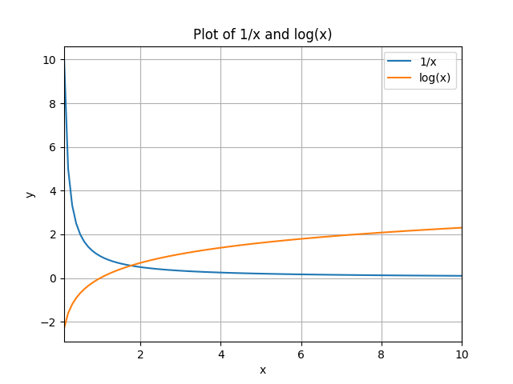
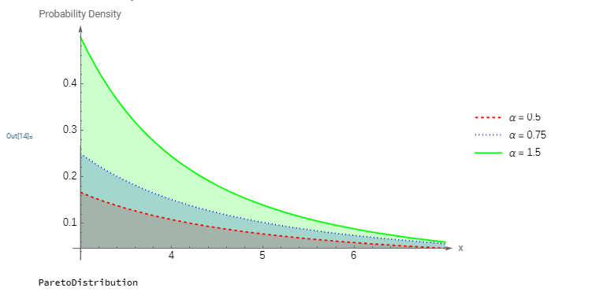
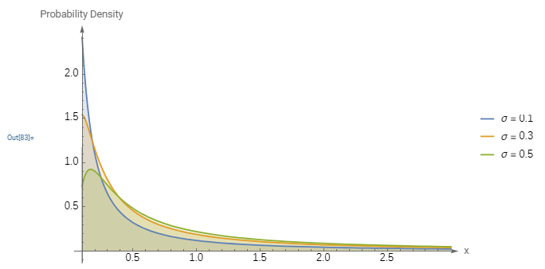
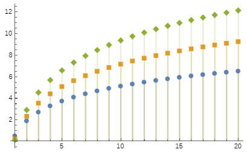
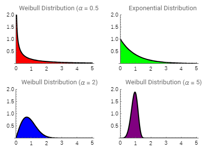
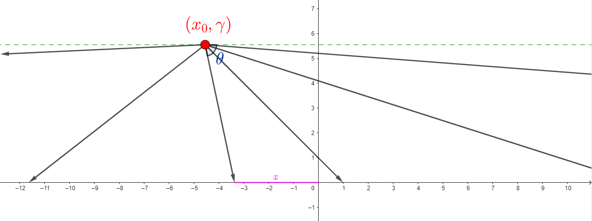
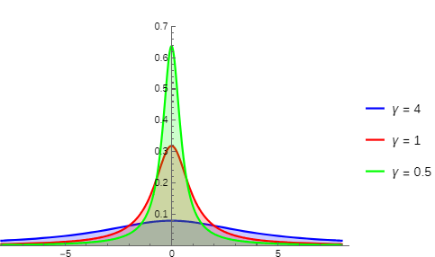
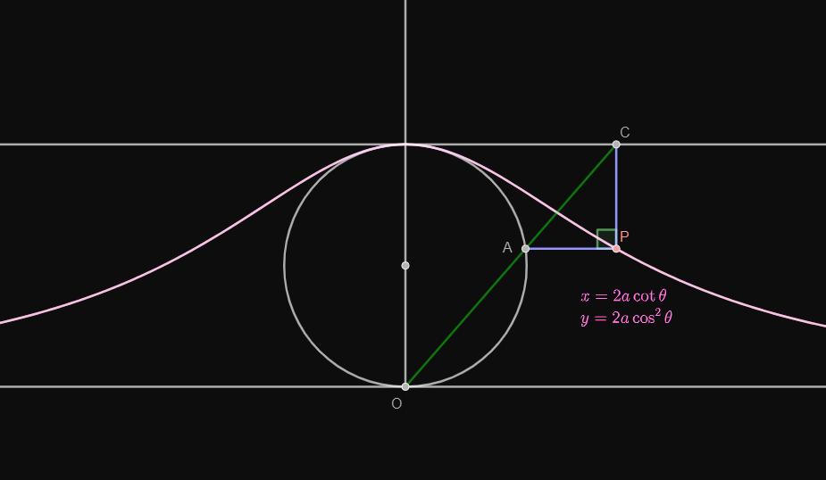

### **NOTES ON STATISTICS, PROBABILITY and MATHEMATICS**

<a href="http://rinterested.github.io/statistics/index.html">
</a>

---

### Power Law Distributions:

---

From [Wolfram alpha](http://mathworld.wolfram.com/RandomNumber.html),

The pdf of the power law is

$$f_X(x) =C x^\alpha, x \in [x_0, x_1]$$
and the normalization constant can be determined by considering that $f_X(x)$ has to integrate to 1:

$$\int_{x_0}^{x_1} f_X(x)dx= C \frac{[x^{\alpha+1}]_{x_0}^{x_1}}{\alpha+1}=1$$
and hence,

$$C=\frac{\alpha+1}{x_1^{\alpha+1}- x_0^{\alpha+1}}.$$

However, notice that in [other sources](https://en.wikipedia.org/wiki/Power_law#Power-law_probability_distributions), the **negative value of alpha** is explicit in the equations. For instance:


$$p(x)=\frac{\alpha - 1}{x_{\mathrm{min}}}\left(\frac{x}{x_{\mathrm{min}}} \right)^{-\alpha}$$

From pag 4 of [this article by M. E. J. Newman]((http://www-personal.umich.edu/~mejn/courses/2006/cmplxsys899/powerlaws.pdf)), the majority of power law distributions occurring in nature $2\leq \alpha \leq 3.$

The cumulative probability distribution is

$$F_X(x) = \Pr(X <x)=\int_{x_0}^x C x^\alpha dx =\frac{C}{\alpha+1}\left(x^{\alpha+1}-x_0^{\alpha+1  }\right)$$

If $Y\sim U[0,1]$ and by the [probability integral transform
](https://en.wikipedia.org/wiki/Inverse_transform_sampling),

$$y\equiv \frac{C}{\alpha+1} \left(x^{\alpha+1}-x_0^{\alpha+1} \right)$$

So $y=g(x)$ with inverse

$$X = \left( \frac{\alpha+1}{C}y + x_0^{\alpha+1}    \right)^{1/{\alpha+1}}$$


and replacing $C$

$$X = \left[ (x_1^{\alpha+1}-x_0^{\alpha+1})y + x_0^{\alpha+1}    \right]^{1/{\alpha+1}}$$

and $X\sim L(x),$ i.e. it is distributed following a power law.

Note that it is different from page 3 of [this document](https://drive.google.com/file/d/0Bwl-HpVJ_5PeUWliQ2F0OUo3NVE/view?usp=sharing).

Plotting a power law distribution in log-log will result in a line:

$$f_X(x)= C\, x^{-\alpha}$$

$$\log(f_X(x))=\log C + -\alpha\, \log x$$

with slope $-\alpha$

In R

```{r, warning=F, fig.width=4, fig.height=4}
x1 = 5
x0 = 0.1     # It can't be zero; otherwise X^0^(neg) is 1/0.
alpha = -2.5  # It has to be negative.
set.seed(123)
y = runif(1e5)
x = ((x1^(alpha+1) - x0^(alpha+1))*y + x0^(alpha+1))^(1/(alpha+1))
summary(x)
hist(x, xlim = c(0,1), ylim = c(0,12), border=F, col=rgb(0,0,0.8,.5), 
     breaks=200, 
     cex.main=.7, cex.lab=.7, prob=T,
     main="Power law")
lines(density(x), col=4, lwd=1)
lines(density(x, adjust=2), lty="dotted", col="turquoise", lwd=2)
h = hist(x, prob=T, breaks=40, plot=F)
plot(h$count, log="xy", type='l', lwd=1, lend=2, xlab="", ylab="", main="Density in logarithmic scale")
```

The number of samples in the bins becomes small towards the right of the plot, leading to statistical fluctuations, and the noisy right tails.

If we hadn't generated these data synthetically, and were looking at $x$ as empirical data from an experiment, we could try to fit a power law distribution with the package `igraph` and the function`power.law.fit()`. 

---

**INTUITION**: Power-law distributions are the **inverse function** $f(x) = 1/x$ turned into a distribution. This provides a lot of insight into what they are trying to express: The frequency or probability is inversely proportional to the magnitude of the effect. 

In terms of the magnitude of the effects it is good to remember that the integral of the inverse function is the logarithmic function $\int \frac 1 x = \log x \; + \;c$:



which immediately explains why if we draw samples from a Pareto distribution, and we sort them in decreasing order, the cumulative sum of the overall effect will be explained by the most massive events, following the $80/20$ Pareto principle. As it is the case in the $\log(x)$ function, there is a rapid ascent, and a plateau afterwards, such that, although the function goes to infinity, it does so at a very slow rate:

```{r setup, include=FALSE} 
knitr::opts_chunk$set(warning = FALSE, message = FALSE) 
```

```{R, fig.width = 5, fig.height = 4}
library(EnvStats)
library(ggplot2)
library(ggthemes)
# Generate a Pareto distribution with location 1 and shape 1
set.seed(123); n <- 1000; data <- rpareto(n, location = 1, shape = 1)
# Calculate cumulative sum and proportion
cum_effect <- cumsum(sort(data, decreasing = TRUE))
cum_prop <- cum_effect / sum(data)
# Create a data frame for plotting
df <- data.frame(
  index = 1:length(data),
  percentage = 1:length(data)/ length(data) * 100,
  cum_prop = cum_prop
)
# Plot the cumulative proportion
ggplot(df, aes(x = percentage, y = cum_prop)) +
  geom_line() +
  geom_hline(yintercept = 0.8, linetype = "dashed") +
  geom_vline(xintercept = 20, linetype = "dashed") +
  theme_fivethirtyeight() +
    theme(plot.title = element_text(size = 14),
        axis.title.x = element_text(size = 10),
        axis.title.y = element_text(size = 10)) +
  labs(
    x = "Percentage of samples (decreasing order magnitude)",
    y = "Overall effect (%)",
    title = "Pareto Principle - Extreme events dominate"
  )
```


##### **Power-law distributions:**

1. Zeta distribution
2. Lévy distribution
3. Lévy skew alpha-stable distribution
4. Pareto distribution
5. Zipf-Mandelbrot law
6. Infinitely divisible distribution

---

#### Pareto distribution:

$$f_X(x) = \frac{\alpha \, x^\alpha_m}{x^{\alpha+1}}$$

with support $x\in [x_m, +\infty),$ and $x_m>0$ and $\alpha>0$ corresponding to shape parameters. The parameter $\alpha$ is called the tail index, or the Pareto index when discussing distribution of wealth.

When plotted on linear axes, the distribution assumes the familiar J-shaped curve which approaches each of the orthogonal axes asymptotically. All segments of the curve are self-similar (subject to appropriate scaling factors). When plotted in a log-log plot, the distribution is represented by a straight line.

Here is a plot of the *Pareto distribution* with minimum value parameter $k = 3$ and shape parameter $\alpha =\{0.5,0.75, 1.5\}$ in Mathematica:

```
Plot[Table[ PDF[ParetoDistribution[3, \[Alpha]], x], {\[Alpha], {.5, .75, 1.5}}] // Evaluate, 
{x, 3, 3 + 4}, 
Filling -> Axis, 
PlotLegends -> {"\[Alpha] = 0.5", "\[Alpha] = 0.75", "\[Alpha] = 1.5"}, 
PlotRange -> All, AxesLabel -> {"x", "Probability Density"}, 
AxesStyle -> Arrowheads[0.02], PlotStyle -> {Directive[Dashed, Red], 
Directive[Dotted, Blue], 
Directive[Solid, Green]}, 
LabelStyle -> Directive[FontSize -> 14],
ImageSize -> 600]
```



#### Lévy distribution

Compare it to the **Lévy distribution**, and notice how as the dispersion parameter $\sigma$ decreases, the pdf adopts the shape of $1/x$

```
(* Define the location and scale parameters *)
mu = 0;
sigma = 1;

(* Create a table of Lévy distributions with different scale parameters *)
levyDistTable = Table[LevyDistribution[mu, sigma*\[Alpha]], {\[Alpha], {0.1, 0.3, 0.5}}];

(* Plot the probability density functions (PDFs) *)
Plot[Table[PDF[levyDist, x], {levyDist, levyDistTable}] // Evaluate,
     {x, 0.1, 3},
     Filling -> Axis,
     PlotLegends -> {"\[Sigma] = 0.1", "\[Sigma] = 0.3", "\[Sigma] = 0.5"},
     PlotRange -> All,
     AxesLabel -> {"x", "Probability Density"},
     AxesStyle -> Arrowheads[0.02],
     PlotStyle -> ColorFunction -> "BrightBands",
     LabelStyle -> Directive[FontSize -> 14],
     ImageSize -> 600]
```



As stated in Wikipedia the tail of the Lévy distribution exhibits power-law characteristics, and hence, "the Lévy distribution is not just heavy-tailed but also fat-tailed".

> **Heavy-tailed distributions**: These distributions have tails that decay slower than an exponential function. This means that there's a higher probability of observing extreme values compared to a normal distribution. 

> **Fat-tailed distributions**: This is a more specific subset of heavy-tailed distributions. They exhibit a power-law decay in their tails, meaning the probability of extreme events decreases at a slower rate than a simple exponential decay.

The Levy distribution has a heavier tail than the Pareto distribution, meaning it assigns more probability to extreme values. In general, both the Lévy and Pareto distributions are known for their heavy tails, but the Lévy distribution is famed for its exceptionally heavy tails. The Levy distribution is more skewed to the right than the Pareto distribution. If your data is highly skewed, the Levy distribution may be a better fit.

Applications:

1. Spectroscopy: van der Waals profile 
2. Geomagnetic Reversals: frequency of geomagnetic reversals
3. Photon Path Length: The length of the path followed by a photon in a turbid medium 
4. Finance: describe stock price movements and other market behaviors.
5. Physics: Ibehavior of particles in turbulent flows.

#### Zipf Distribution:

From [here](https://iopscience.iop.org/article/10.1088/1742-6596/1113/1/012007/pdf):

> Zipf theorised that the distribution of word use was due
to tendency to communicate efficiently with least effort. Hence, the principle of least effort is
also known as Zipf’s Law. Based on the principle of least effort, it is human nature to want
the greatest outcome at the least amount of work. And Zipf showed that useful behaviors were
performed frequently. Frequent behaviors became quicker and easier to perform over time.

The Zipf distribution is a discrete distribution also known as Estoup distribution. From [here](https://scholarwolf.unr.edu/server/api/core/bitstreams/4e9d63b9-b185-49c4-9064-d072b296e433/content): 

> According to Mitzenmacher (2004), “the first known attribution of the power law distribution of word frequencies appears to be due to Estoup in 1916”. This is noted by Rousseau (2002), where he indicated that Zipf made reference to Estoup in his very first publication on the relative frequency of words. The Estoup distribution,
unlike the other discrete power law distributions seen thus far, exists only in truncated form since the harmonic series is not convergent (Z¨ornig and Altmann, 1995).

The Zipf distribution has support is the set of positive integers $\{1, 2, 3, \dots, n\}$. This **finite support** is the main difference with the **zeta distribution**. The pdf of the Zipf PMF has two parameters, $s$, a positive real number, which determines the decay of the tail, and $n$, a positive integer. [Here is the PMF](https://en.wikipedia.org/wiki/Zipf%27s_law#Formal_definition):


$$P(k; s, n) = \frac{1}{k^{s}H_{n,s}}$$

Notice that we have $1/x$ normalized with the $n,s$-th **generalized harmonic number**:

$$H_{n,s}=\sum_{k=1}^n \frac 1{k^s}$$
Here is the plot of the Zipf distribution with support ranging to $n=10$ and varying shape parameter:

```
DiscretePlot[
 Table[PDF[ZipfDistribution[10,\[Rho]], k], {\[Rho], {.1, 1, 2}}] // 
  Evaluate, {k, 0, 10}, PlotRange -> All, PlotMarkers -> Automatic]
```


#### Zeta distribution:

As anticipated, the zeta distribution has support $k \in \{1,2,\dots\}$, and it is also a discrete probability distribution, in fact referred to as the discrete Pareto distribution.

The PMF is only dependent on the parameter $s$, and the [PMF is](https://en.wikipedia.org/wiki/Zeta_distribution):

$$P(X = k; s) = \frac{1}{k^{s}\zeta(s)}$$

where we encounter the **Riemann zeta function**:

$$\zeta(s)=\sum_{k =1}^\infty \frac 1{k^s}$$
The plot looks pretty much like the Zipf distribution:

```
DiscretePlot[
 Table[PDF[ZipfDistribution[\[Rho]], k], {\[Rho], {1, 2, 3}}] // 
  Evaluate, {k, 0, 20}, PlotRange -> All, PlotMarkers -> Automatic]
```

and it can be seen presented as the $-\log(\cdot)$ of the PMF as in:

```
DiscretePlot[
 Table[-Log@PDF[ZipfDistribution[\[Rho]], k], {\[Rho], {1, 2, 3}}] // 
  Evaluate, {k, 0, 20}, PlotRange -> All, PlotMarkers -> Automatic]
```



---

#### [Subexponential distributions](https://rigorandrelevance.wordpress.com/2013/12/05/catastrophes-conspiracies-and-subexponential-distributions-part-i/):

There are three important subclasses of heavy-tailed distributions: the fat-tailed distributions, the long-tailed distributions and the subexponential distributions. In practice, all commonly used heavy-tailed distributions belong to the subexponential class.


---
 
##### **Heavy-tailed distributions:**

All commonly used heavy-tailed distributions are subexponential. From [Wikipedia](https://en.wikipedia.org/wiki/Heavy-tailed_distribution#:~:text=In%20probability%20theory%2C%20heavy%2Dtailed,they%20have%20heavier%20tails%20than):

> In probability theory, **heavy-tailed distributions** are probability distributions whose tails are not exponentially bounded: that is, they have heavier tails than the exponential distribution. In many applications it is the right tail of the distribution that is of interest, but a distribution may have a heavy left tail, or both tails may be heavy.
>
> There are three important subclasses of heavy-tailed distributions: the **fat-tailed distributions**, the **long-tailed distributions**, and the **subexponential distributions**. In practice, all commonly used heavy-tailed distributions belong to the subexponential class, introduced by Jozef Teugels.

**One-tailed:**

1. Pareto
2. Log-normal
3. Lévy distribution
4. Weibull distribution
5. Burr distribution
6. Log-gamma distribution
7. Fréchet distribution (notice that the Gumbel is not in the list)
8. q-Gaussian distribution
9. Log-Cauchy distribution ("super heavy tail" - heavier than Pareto)

**Two-tailed:**

10. Cauchy
11. Stable distributions (except for the Gaussian) - Cauchy, Lévy and Lommel
12. Student t distribution
13. Skew lognormal cascade distribution

> In probability theory, a distribution is said to be stable if a linear combination of two independent random variables with this distribution has the same distribution, up to location and scale parameters. A random variable is said to be stable if its distribution is stable. The stable distribution family is also sometimes referred to as the Lévy alpha-stable distribution.

#### Weibull distribution:

Like the exponential, it models time between events. However, the Weibull is more flexible:

The exponential distribution models situations where events occur continuously and independently at a **constant average rate.** It's memoryless, whereas the Weibull is not memoryless.

The Weibull distribution generalizes the exponential by introducing a shape parameter. If the shape parameter is $1$, it behaves exactly like the exponential. If it's less than $1$, it models decreasing failure rates over time, as in the Lindy effect, significant "infant mortality", or defective items failing early and the failure rate decreasing over time, negative word of mouth. A shape parameter than $1$ captures increasing failure rates, such as "aging process" and positive word of mouth.



#### Fréchet distribution:

Fisher-Tippet theorem:

> Let $X_1,X_2,\dots, X_n$ be iid rvs. If there exist constants $a_n > 0$ and $b_n\in \mathbb R,$ and some distribution $G,$ such that

$$\frac{M_n - b_n}{a_n}\to G,$$

Then $G$ belongs to one of the three extreme value distribution types:

1. Fréchet: $$\Phi_\alpha(x)=\begin{cases}0,&& x\leq 0\\e^{-x^{-\alpha}},&& x>0\end{cases}$$

2. Weilbull $$\Psi_\alpha(x)=\begin{cases}e^{-x^\alpha}&& x\leq 0\\1,&& x>0\end{cases}$$
3. Gumbel $$\Lambda(x)=e^{-e^{-x}}$$

The Fréchet is a heavy-tailed distribution:

```
Plot[Table[
   PDF[FrechetDistribution[\[Alpha], 1.2], 
    x], {\[Alpha], {1/2, 1, 2}}] // Evaluate, {x, .1, 3}, 
 Filling -> Axis]
```


However, the Gumbel it is not heavy-tailed, and it's use in EVT has to to with the "block maxima" approach, which involves dividing the data into blocks and modeling the maximum or minimum value within each block. The Gumbel distribution is often used for this purpose, even if the underlying data distribution is not heavy-tailed.

#### Cauchy distribution:

The standard Cauchy distribution is the same as the **Student's t-distribution with one degree of freedom**.

It can be thought of as kicking a ball from a point on the $x,y$-plane towards the $x$-axis at a random angle, and determining the point in the $x$-axis the ball hits:



Mathematically this can be simulated choosing randomly from a uniform $[0,1]$ and transforming the value, such that

$$x = \tan\left(\pi (u -\frac 12) \right)$$
with $x_o$ and $\gamma$ being the location and scale parameters. So if we fix the $x_0$ value to $x_0=0$ and we change the scale parameter, the tails will be heavier, the farther away the $\gamma$ parameter positions $(x_0,\gamma)$:



The ratio of two normal random variables follows a Cauchy.

It is the canonical example of a "pathological" distribution with undefined moments.

Some fun facts are explained in [this](https://youtu.be/ZcbWjD6HA_s?si=CdDrjfTzET6kCAMj) and [this](https://youtu.be/ZGgYxtExJ98?si=IDpGbIXILyjZFNfK) videos, including the connection to the curve **the witch of Agnesi**, described in [Wikipedia](https://en.wikipedia.org/wiki/Witch_of_Agnesi):



[Geogebra project](https://www.geogebra.org/m/kz3nxhgp) by Gillermo Bautista.

The equation for the Witch of Agnesi curve is

$$y = \frac{8a^3 }{ x^2 + 4a^2}$$

while the pdf of the Cauchy distribution is

$$f_X(x)=\frac{1}{\pi\gamma \left(1 + (\frac{x-x_0}{\gamma})^2\right)}=\frac{\gamma}{\pi \left((x - x_0)^2 + \gamma^2 \right) }$$

The witch of Agnesi is a scale and shifted version of the Cauchy pdf.

The applications of the Cauchy include:

1. Statistical Modeling:

Outlier Detection: The Cauchy distribution is often used to model outliers or extreme values in data sets, as it has a longer tail than the normal distribution.

Robust Regression: Due to its robustness to outliers, the Cauchy distribution can be used in robust regression models to minimize the impact of extreme data points.

2. Physics and Engineering

Lorentzian Line Shape: In spectroscopy, the Lorentzian line shape, which is directly related to the Cauchy distribution, is used to model the spectral lines of atoms and molecules.

Photon Scattering: The Cauchy distribution can be used to model the scattering of photons in certain materials.

3. Finance and Economics

Risk Modeling: The Cauchy distribution can be used to model extreme financial events, such as market crashes or financial crises, due to its heavy-tailed nature.  

Value at Risk (VaR): The Cauchy distribution can be used to calculate VaR, a measure of financial risk, as it can capture the potential for extreme losses. 

4. Signal Processing

Noise Modeling: The Cauchy distribution can be used to model certain types of noise in signal processing applications, such as impulsive noise.

5. Other Applications

Reliability Engineering: The Cauchy distribution can be used to model the lifetime of components or systems that are prone to failures caused by extreme events.

Environmental Science: The Cauchy distribution can be used to model extreme weather events or environmental phenomena.  


#### Log-Cauchy distribution:

A log-Cauchy distribution is a probability distribution of a random variable whose logarithm is distributed in accordance with a Cauchy distribution. If $X$ is a random variable with a Cauchy distribution, then $Y = \exp(X)$ has a log-Cauchy distribution.


---

##### **Subexponential distributions:**

From these [CalTech notes](http://users.cms.caltech.edu/~adamw/papers/2013-SIGMETRICS-heavytails.pdf)...


Exponential distributions are not subexponential!

```{r}

x1 = 5
x0 = 0.07     # It can't be zero; otherwise X^0^(neg) is 1/0.
alpha = -2.5  # It has to be negative.

set.seed(123)
y = runif(1e5)
x = ((x1^(alpha+1) - x0^(alpha+1))*y + x0^(alpha+1))^(1/(alpha+1))

par(mfrow = c(1,2))

hist(x, xlim = c(0,1), border=F, col=2, breaks=80, 
     cex.main=.7, cex.lab=.7, ylim= c(0,12000),
     main="Power law")
abline(v=.4, lty=2)

y = rexp(1e5, rate = 15)
hist(y, breaks=20, xlim = c(0,1), ylim= c(0,12000),border=F, col=2, cex.main=.7, cex.lab=.7,
     main="Exponential")
abline(v=.4, lty=2)
```

These distributions can be intuitively approximated through these heuristics:

1. The principle of the single big jump

2. Many mice and a few elephants

3. The catastophe principle (versus the conspiracy principle of light tailed distributions).

    E.g. the sum up the estimated cost of the damages from each hurricane during a given year is unexpectedly large.  It is probably not because there were a lot of hurricanes that caused larger than typical amounts of damage.The catastrophe principle for heavy-tailed distributions tells us that the most likely reason that the sum is unexpectedly large is because there was one hurricane that caused an extremely large amount of damage.  In fact, we should expect that there was one hurricane that caused nearly all of the damage caused during the year, i.e., there was a catastrophe.

Mathematically,

A distribution $F$ on the positive half-line is subexponential if

$$\overline{F^{*n}}(x) \sim n\,\bar F(x), x \to \infty$$

The probabilistic interpretation of this is that, for a sum of $\displaystyle n$ independent random variables $\displaystyle X_{1},\ldots ,X_{n}$  with common distribution $\displaystyle F$,

$$\displaystyle \Pr[X_{1}+\cdots +X_{n}>x]\sim \Pr[\max(X_{1},\ldots ,X_{n})>x]\quad {\text{as }}x\to \infty .$$

---

#### CONNECTION POWERLAW AND LOGNORMAL:

Not all highly right-skewed distributions follow the power law. The log-normal distribution can have very similar plots.

From [this source](http://www.uvm.edu/pdodds/teaching/courses/2013-01UVM-300/docs/2013-01UVM-300lognormals-flat.pdf)

The log-normal is seen as a result of multiplying random variables, as much as adding random variables result in a normal distribution (central limit theorem).

The log-normal (or lognormal) distribution is a continuous probability distribution of a random variable whose logarithm is normally distributed. It is a subexponential distribution, $\text{Lognormal}(\mu,\sigma^2)$ with pdf,

$$f_X(x) =\frac{1}{x\sqrt{2\pi \sigma^2}}\,\exp\left[{-\frac{(\ln x-\mu)^2}{2\sigma^2}}\right]$$

Derivation from the normal:

$$f_X(x) =\frac{1}{\sqrt{2\pi \sigma^2}}\,\exp\left[{-\frac{( x-\mu)^2}{2\sigma^2}}\right]$$

If we look at it as a change of variables, the Jacobian will account for $\frac{1}{x}$ as we apply the chain rule, $\frac{d}{dx}\ln x= \frac{1}{x}.$


In base $10$ the pdf is

$$f_X(x) =\frac{\log_{10}(e)}{10^x\sqrt{2\pi \sigma^2}}\,\exp\left[{-\frac{( x-\mu)^2}{2\sigma^2}}\right]$$

If we start off with

$$f_X(x) =\frac{1}{y\ln(10)\sqrt{2\pi \sigma^2}}\,\exp\left[{-\frac{( \log_{10}(y)-\mu)^2}{2\sigma^2}}\right]$$

because $d/dx \log_{10}(y) = \frac{1}{y \ln(10)}.$ Now, since $\ln(10)=\frac{\log_{10}(10)}{\log_{10}(e)}=\frac{1}{\log_{10}e},$

$$f_X(x) =\frac{\log_{10}(e)}{y\sqrt{2\pi \sigma^2}}\,\exp\left[{-\frac{( \log_{10}(y)-\mu)^2}{2\sigma^2}}\right]$$

If we substitute $y = 10^x,$

$$f_X(x) =\frac{\log_{10}(e)}{10^x\sqrt{2\pi \sigma^2}}\,\exp\left[{-\frac{( x-\mu)^2}{2\sigma^2}}\right]$$

In the log-log plots, the log-normal will assume a shifted and inverted parabola:

$$\log\left(f_X(x)\right) =\log\left\{\frac{\exp\left[{-\frac{(\ln x-\mu)^2}{2\sigma^2}}\right]}{x\sqrt{2\pi \sigma^2}}\right\}$$

$$\begin{align}
\log\left(f_X(x)\right) &=\log\left\{\exp\left[{-\frac{(\ln x-\mu)^2}{2\sigma^2}}\right]\right\}- \log \left\{x\sqrt{2\pi \sigma^2}\right\}\\[2ex]
&=-\frac{(\ln x-\mu)^2}{2\sigma^2}- \log \left\{x\sqrt{2\pi \sigma^2}\right\}
\end{align}$$

```{r, warning=F, fig.width=5}
set.seed(1)
x = rlnorm(1e5)
x = x[x < 10]
plot(density(x), log="xy", type="l", xlim=c(.03, 8), col = 4, lwd = 2,
     main="Log-normal distribution")
```

which in the downsloping part can simulate a line as in the power law plotted in log-log.

Actually the lognormal plotted in log-log form is linear when the $\sigma$ value is high:

```{r, warning=F, fig.width=5}
set.seed(1)
x = rlnorm(1e5, 0, 10)
x = x[x < 10]
plot(density(x), log="xy", type="l", xlim=c(.03, 8), col = 4, lwd = 2,
     main="Log-normal distribution")
```


---
<a href="http://rinterested.github.io/statistics/index.html">Home Page</a>

**NOTE: These are tentative notes on different topics for personal use - expect mistakes and misunderstandings.**