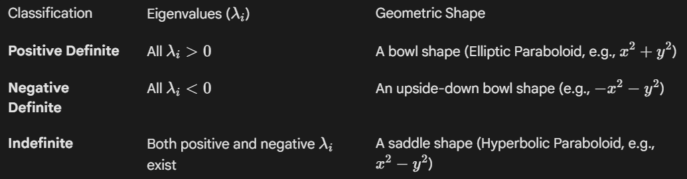
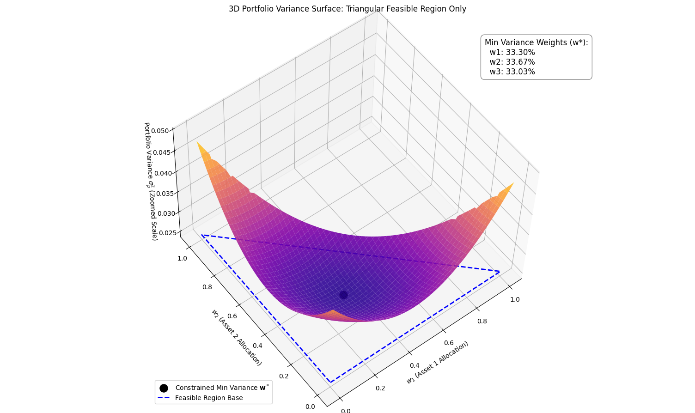

### **NOTES ON STATISTICS, PROBABILITY and MATHEMATICS**

<a href="http://rinterested.github.io/statistics/index.html">
</a>

---

### Quadratic Forms and constrained optimization:

---

A quadratic form is a polynomial where every term has a total degree of exactly two.

Quadratic forms are fundamental mathematical objects that simplify the study of second-degree polynomials in multiple variables and have widespread applications across various fields of science, engineering, and pure mathematics.

The primary power of quadratic forms in linear algebra is that any such form, $q(\mathbf{x})$, can be written compactly using a symmetric matrix $A$:$$q(\mathbf{x}) = \mathbf{x}^T A \mathbf{x}$$

To convert a two-variable polynomial to the form \(x^{T}Ax\), you first write the polynomial in terms of the quadratic form \(q(x,y)=ax^{2}+bxy+cy^{2}\) and define the vector \(x=\left[\begin{matrix}x\\ y\end{matrix}\right]\). Then, you construct the symmetric matrix \(A\) where the coefficients are placed on the matrix: the coefficient of \(x^{2}\) (\(a\)) goes on the diagonal, the coefficient of \(y^{2}\) (\(c\)) goes on the diagonal, and the coefficient of the \(xy\) term (\(b\)) is split and placed above and below the main diagonal \(b/2\) and \(b/2\):

$$\begin{bmatrix}x & y\end{bmatrix}\begin{bmatrix}a& b/2\\b/2 & b\end{bmatrix}\begin{bmatrix}x\\y\end{bmatrix}=ax^2 + bxy + cx^2$$
The structure of the matrix $A$ can be simplified using orthogonal diagonalization, which eliminates the "cross-product" terms (like $xy$) in the polynomial. This simplification allows for easy analysis of the form's essential properties.

Since the matrix $A$ representing the quadratic form can always be chosen to be symmetric, the Spectral Theorem guarantees it can be orthogonally diagonalized.This means there exists an orthogonal matrix $P$ (where $P^T = P^{-1}$) and a diagonal matrix $D$ such that:$$A = P D P^T$$The columns of $P$ are the orthonormal eigenvectors of $A$.The diagonal entries of $D$ are the eigenvalues ($\lambda_1, \lambda_2, \dots$) of $A$.

We introduce a change of variables from the old coordinates $\mathbf{x}$ to new coordinates $\mathbf{y}$:$$\mathbf{x} = P \mathbf{y}$$Since $P$ is an orthogonal matrix, this transformation is simply a rotation (and possibly a reflection) of the coordinate axes. The new $\mathbf{y}$ axes are aligned with the eigenvectors of $A$.

Substituting $\mathbf{x} = P \mathbf{y}$ back into the quadratic form:$$\begin{align*} q(\mathbf{x}) &= (P \mathbf{y})^T A (P \mathbf{y}) \\ &= \mathbf{y}^T P^T A P \mathbf{y} \\ &= \mathbf{y}^T (P^T A P) \mathbf{y} \end{align*}$$Since $A = P D P^T$, we have $P^T A P = D$.$$\therefore q(\mathbf{x}) = \mathbf{y}^T D \mathbf{y}$$When written out in terms of the new coordinates $\mathbf{y} = [y_1, y_2, \dots, y_n]^T$ and the eigenvalues $\lambda_i$, the form is:$$q(\mathbf{y}) = \lambda_1 y_1^2 + \lambda_2 y_2^2 + \dots + \lambda_n y_n^2$$This new expression has no cross-product terms, making it much easier to classify and analyze the quadratic form's properties.

The diagonal form is useful because the signs of the eigenvalues ($\lambda_i$) immediately tell you about the shape and behavior of the function $q(\mathbf{x})$:



This classification is vital for tasks like optimization, where determining the nature of a critical point (a maximum, minimum, or saddle point) depends entirely on the signs of the Hessian matrix's eigenvalues.


---

#### APPLICATIONS:

---

##### Geometry:

Quadratic forms are essential for describing and classifying quadric surfaces in analytic geometry, such as:
 - Ellipsoids (football shape)
 - Hyperboloids (saddle shape)
 - Paraboloids (bowl shape)
 
 For example, the distance squared from the origin in $\mathbb{R}^n$ is a simple quadratic form: $q(x_1, \dots, x_n) = x_1^2 + x_2^2 + \dots + x_n^2$.
 
 
##### Physics:

They model physical phenomena where energy or stability depends quadratically on state variables:

Potential Energy: The potential energy of a mechanical system (like springs) near an equilibrium point is often modeled by a quadratic form of the displacements.

Dynamics and Stability: They are used to analyze the stability of dynamic systems.

##### Statistics:

In multivariate statistics, quadratic forms appear in:

The definition of the covariance matrix, which describes the spread and correlation of data.

Methods like Principal Component Analysis (PCA), which relies on diagonalizing the covariance matrix (a quadratic form) to find the main directions of variance in the data.

##### Number Theory and Differential Geometry:

Connection to Pell's equation: Solving a general quadratic Diophantine equation can often be reduced to solving a Pell's equation (like \(p^{2}-Ds^{2}=1\)). The discriminant of the quadratic form, which is \(b^{2}-4ac\) for a form like \(ax^{2}+bxy+cy^{2}\), plays a key role in this reduction.

Both the first and second Gauss's fundamental forms of Gauss are quadratic forms. The first fundamental form is a quadratic form on the tangent plane that measures intrinsic properties like length and area, while the second fundamental form is also a quadratic form that measures how the surface curves in the ambient space (extrinsic curvature). 

##### Optimization & Calculus:

In multivariable calculus and optimization, quadratic forms are crucial:

The Hessian matrix of a multivariable function's second partial derivatives is used to form a quadratic form.

Analyzing this quadratic form helps determine if a critical point is a local minimum (positive definite form), a local maximum (negative definite form), or a saddle point (indefinite form). This is the multivariable equivalent of the second derivative test.

An excellent example of optimization in economics using a quadratic form is the Minimization of Portfolio Risk in modern financial theory (Markowitz Portfolio Theory).

An example would be minimizing the variance (risk) of a portfolio, which is naturally expressed as a quadratic form.

A portfolio is a collection of $n$ assets (stocks, bonds, etc.). Let $\mathbf{w}$ be a column vector representing the weights (proportion of the total investment) assigned to each asset:$$\mathbf{w} = \begin{pmatrix} w_1 \\ w_2 \\ \vdots \\ w_n \end{pmatrix}$$The total risk of the portfolio is measured by its variance ($\sigma_P^2$). This variance is a quadratic form defined by the covariance matrix of the asset returns.$$\sigma_P^2 = Q(\mathbf{w}) = \mathbf{w}^T \mathbf{\Sigma} \mathbf{w}$$Matrix $\mathbf{A}$ is the Covariance Matrix ($\mathbf{\Sigma}$): This $n \times n$ symmetric matrix contains the variances of individual assets on the diagonal ($\sigma_i^2$) and the covariances ($\sigma_{ij}$) between different assets on the off-diagonals.$$\mathbf{\Sigma} = \begin{pmatrix} \sigma_1^2 & \sigma_{12} & \dots \\ \sigma_{21} & \sigma_2^2 & \dots \\ \vdots & \vdots & \ddots \end{pmatrix}$$

An excellent example of optimization in economics using a quadratic form is the Minimization of Portfolio Risk in modern financial theory (Markowitz Portfolio Theory). This problem involves minimizing the variance (risk) of a portfolio, which is naturally expressed as a quadratic form.1. The Quadratic Form for Portfolio RiskA portfolio is a collection of $n$ assets (stocks, bonds, etc.). Let $\mathbf{w}$ be a column vector representing the weights (proportion of the total investment) assigned to each asset:$$\mathbf{w} = \begin{pmatrix} w_1 \\ w_2 \\ \vdots \\ w_n \end{pmatrix}$$The total risk of the portfolio is measured by its variance ($\sigma_P^2$). This variance is a quadratic form defined by the covariance matrix of the asset returns.$$\sigma_P^2 = Q(\mathbf{w}) = \mathbf{w}^T \mathbf{\Sigma} \mathbf{w}$$Matrix $\mathbf{A}$ is the Covariance Matrix ($\mathbf{\Sigma}$): This $n \times n$ symmetric matrix contains the variances of individual assets on the diagonal ($\sigma_i^2$) and the covariances ($\sigma_{ij}$) between different assets on the off-diagonals.$$\mathbf{\Sigma} = \begin{pmatrix} \sigma_1^2 & \sigma_{12} & \dots \\ \sigma_{21} & \sigma_2^2 & \dots \\ \vdots & \vdots & \ddots \end{pmatrix}$$2. The Optimization ProblemThe fundamental optimization problem is to find the portfolio weights $\mathbf{w}$ that result in the lowest possible risk ($\sigma_P^2$) for a given level of expected return ($R_{target}$).The problem is typically set up as a constrained quadratic optimization: Minimize $\quad Q(\mathbf{w}) = \mathbf{w}^T \mathbf{\Sigma} \mathbf{w}$: minimize risk / variance subject to target return constraint: $\quad \mathbf{w}^T \mathbf{R} = R_{target} \quad$ (Achieve a specific expected return) and budget constraint: $\quad \mathbf{w}^T \mathbf{1} = 1 \quad$ (Weights must sum to 100% of the budget) where:$\mathbf{R}$ is the vector of expected returns for each asset.$\mathbf{1}$ is a vector of ones.

Because the objective function ($\mathbf{w}^T \mathbf{\Sigma} \mathbf{w}$) is a convex quadratic form (since $\mathbf{\Sigma}$ is positive-definite, or at least positive semi-definite), this problem can be efficiently solved using methods from quadratic programming.The solution yields a set of optimal portfolios that form the efficient frontier—the set of portfolios that offer the highest expected return for a defined level of risk. This framework is central to portfolio management.

The minimization of portfolio risk, which is expressed as the quadratic form $\mathbf{w}^T \mathbf{\Sigma} \mathbf{w}$ subject to linear constraints, is solved using methods from Quadratic Programming (QP). These involve:

Lagrange Multipliers (Analytic Method) For smaller, unconstrained, or simple-constraint problems, the classical method of Lagrange Multipliers is used to find the optimal portfolio weights ($\mathbf{w}$). The method transforms the constrained optimization problem into a larger, unconstrained problem by introducing one Lagrange multiplier ($\lambda$) for each constraint.For the portfolio problem (minimizing risk subject to a target return and budget constraint), you set up a Lagrangian function $L$.You then take the partial derivatives of $L$ with respect to the weight vector ($\mathbf{w}$) and the multipliers ($\lambda$'s) and set them all to zero. This yields a system of linear equations that, when solved, directly provide the optimal weights $\mathbf{w}$.

Numerical Solvers (Computational Method): For real-world portfolios with hundreds or thousands of assets, which often include additional constraints (e.g., no short-selling, minimum/maximum asset weight limits), the system is too complex for analytic solution, and numerical optimization algorithms are required.Active Set Methods: These are traditional methods that iteratively identify the set of constraints that are "active" (satisfied exactly) at the solution and solve a sub-problem for that set. They are highly efficient for problems with a moderate number of variables.Interior-Point Methods: These are modern, highly robust methods that approach the optimal solution from the interior of the feasible region defined by the constraints. They tend to be faster for very large-scale problems.

In both methods, the quadratic form $\mathbf{w}^T \mathbf{\Sigma} \mathbf{w}$ is essential because it is a convex function (since the covariance matrix $\mathbf{\Sigma}$ is positive semi-definite). The convexity guarantees that any local minimum found by the solver is also the global minimum, making the optimization problem well-behaved and ensuring reliable solutions.




```
import numpy as np
import cvxpy as cp
import pandas as pd
import matplotlib.pyplot as plt
from mpl_toolkits.mplot3d import Axes3D

# --- 1. Define Input Data for 3 Assets ---
N = 3

def generate_random_psd_matrix(n_assets):
    M = np.random.rand(n_assets, n_assets)
    M_sym = M + M.T
    random_psd = M_sym + n_assets * np.eye(n_assets)
    return random_psd

n_assets = 3
synthetic_sigma = generate_random_psd_matrix(n_assets)
Sigma = synthetic_sigma / 100

# --- 2. Portfolio Optimization (Minimum Variance) ---
w_opt = cp.Variable(N)
portfolio_variance = cp.quad_form(w_opt, Sigma)
objective = cp.Minimize(portfolio_variance)
constraints = [cp.sum(w_opt) == 1, w_opt >= 0]
problem = cp.Problem(objective, constraints)
min_variance = problem.solve()
min_w = w_opt.value
min_std_dev = np.sqrt(min_variance)

# --- 3. Eigen-Decomposition (for printing) ---
eigenvalues, eigenvectors = np.linalg.eig(Sigma)
idx = eigenvalues.argsort()[::-1] 
eigenvalues = eigenvalues[idx]
eigenvectors = eigenvectors[:,idx]
P = eigenvectors

# --- 4. Variance Function and Grid Creation ---
def variance_function(w1, w2, Sigma_mat):
    w3 = 1 - w1 - w2
    W_stacked = np.stack([w1, w2, w3], axis=0) 
    portfolio_variance_grid = np.einsum('i...,im,m...', W_stacked, Sigma_mat, W_stacked)
    return portfolio_variance_grid

W1 = np.linspace(0, 1, 100)
W2 = np.linspace(0, 1, 100)
W1, W2 = np.meshgrid(W1, W2)

# Calculate Z for the entire square domain first
Z_full = variance_function(W1, W2, Sigma)

# ----------------------------------------------------
# --- 5. ENFORCING THE TRIANGULAR REGION WITH NaN ---
# ----------------------------------------------------

# Define the masking condition (outside the feasible region)
mask = W1 + W2 > 1

# Apply the NaN filter: where mask is True, set Z to NaN. Otherwise, keep Z_full value.
Z = np.where(mask, np.nan, Z_full)

# Find the maximum variance *within the feasible region* (ignoring NaN)
max_z_in_feasible_region = np.nanmax(Z) 

# Set Z-axis limits
z_limit_min = min_variance * 0.95 
z_limit_max = max_z_in_feasible_region * 1.05 

# --- 6. Generate 3D Plot with Enhanced Scaling ---

fig = plt.figure(figsize=(14, 10))
ax = fig.add_subplot(111, projection='3d')

# Plot the Quadratic Form (Variance Surface)
ax.plot_surface(W1, W2, Z, 
                cmap='plasma', alpha=0.9, edgecolor='none',
                vmin=z_limit_min, vmax=z_limit_max)

# Set Z-axis limits to zoom in on the feasible region's variance range
ax.set_zlim(z_limit_min, z_limit_max) 

# Plot the Minimum Variance Point (Constrained Solution)
ax.scatter(min_w[0], min_w[1], min_variance+1e-6, 
           color='black', marker='o', s=150, label=r'Constrained Min Variance $\mathbf{w}^*$')

# Plot the Feasible Region Base at Z = min_variance
ax.plot([0, 1, 0, 0], [0, 0, 1, 0], 
        [min_variance, min_variance, min_variance, min_variance], 
        color='blue', linestyle='--', linewidth=2, label='Feasible Region Base')


opt_weights_text = (
    f"Min Variance Weights (w*):\n"
    f"  w1: {min_w[0]:.2%}\n"
    f"  w2: {min_w[1]:.2%}\n"
    f"  w3: {min_w[2]:.2%}"
)

ax.text2D(0.85, 0.85, opt_weights_text, 
          transform=ax.transAxes, # Crucial: Uses 2D axes coordinates (0.85, 0.85)
          fontsize=12, 
          bbox=dict(boxstyle="round,pad=0.5", fc="white", alpha=0.9, ec="gray"))


# Set labels and title
ax.set_xlabel(r'$w_1$ (Asset 1 Allocation)')
ax.set_ylabel(r'$w_2$ (Asset 2 Allocation)')
ax.set_zlabel(r'Portfolio Variance $\sigma_p^2$ (Zoomed Scale)')
ax.set_title('3D Portfolio Variance Surface: Triangular Feasible Region Only')

# Set view angle for better visualization
ax.view_init(elev=20, azim=130)
ax.legend(loc='lower left', bbox_to_anchor=(0.0, 0.0))

plt.tight_layout()
plt.show()
```


---
<a href="http://rinterested.github.io/statistics/index.html">Home Page</a>

**NOTE: These are tentative notes on different topics for personal use - expect mistakes and misunderstandings.**
