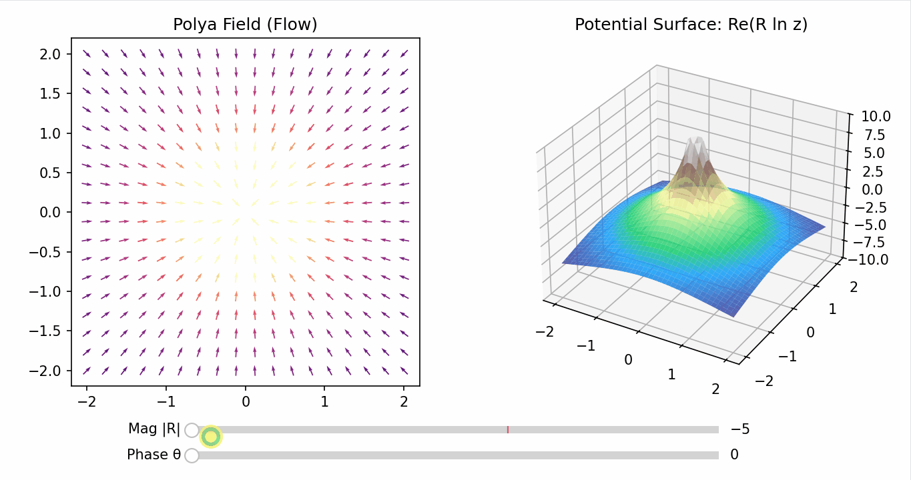
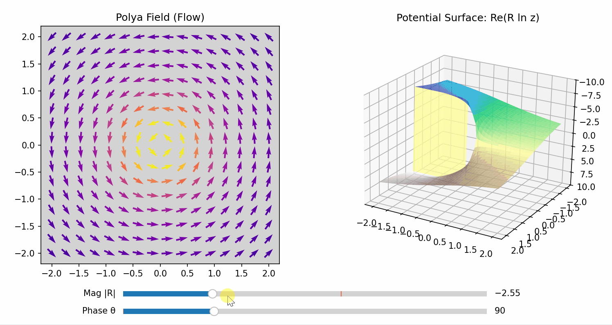
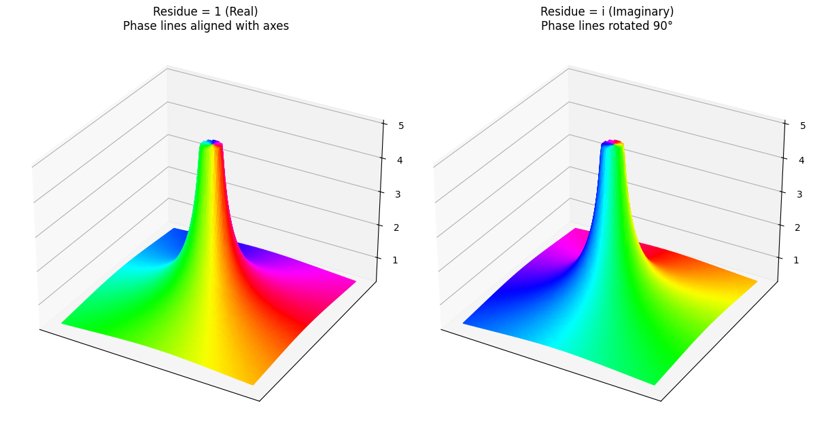
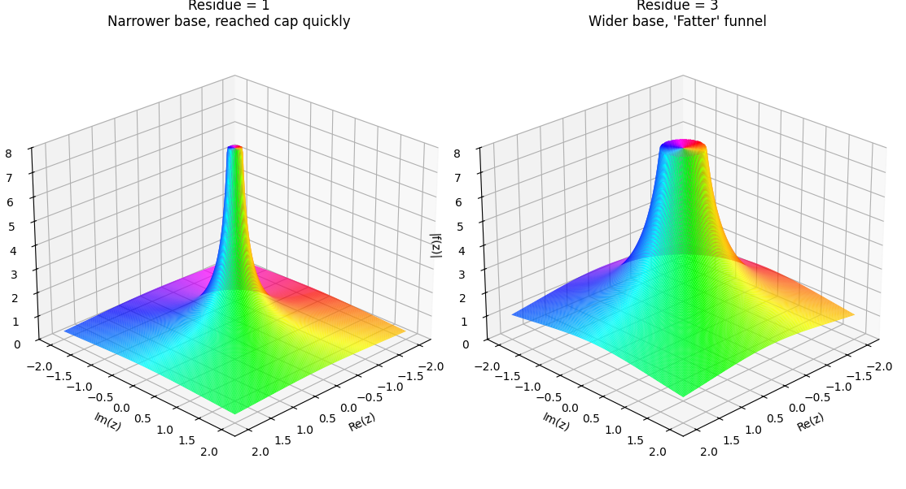
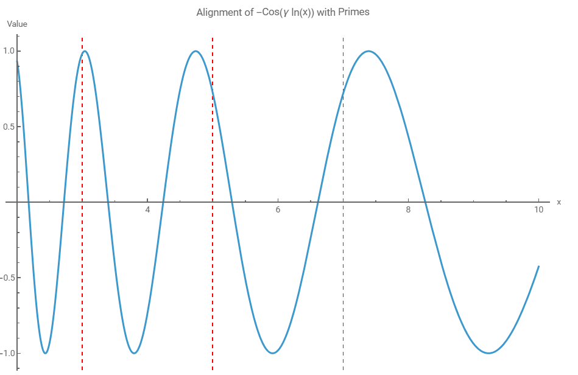
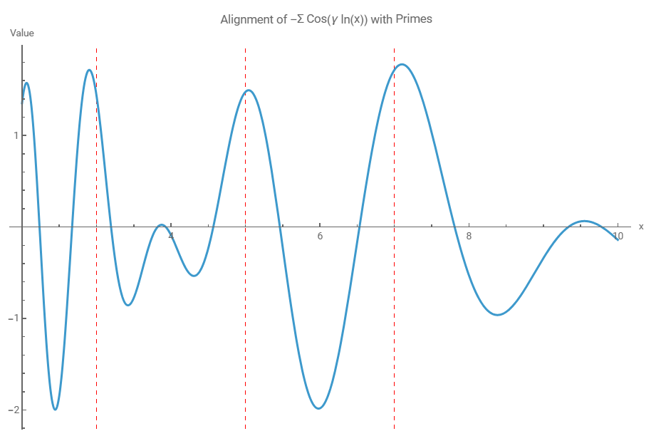
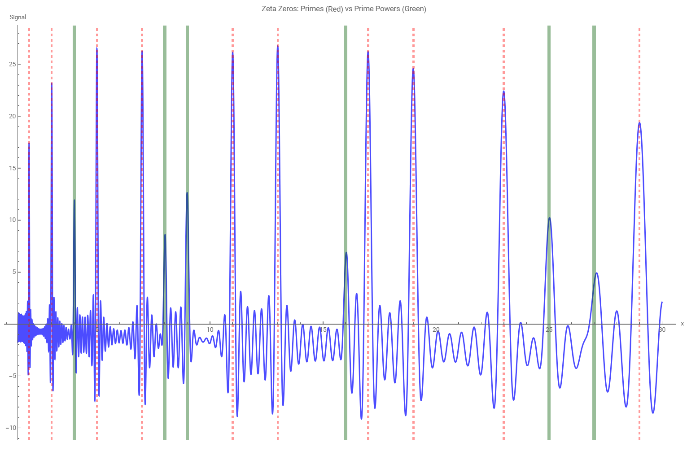
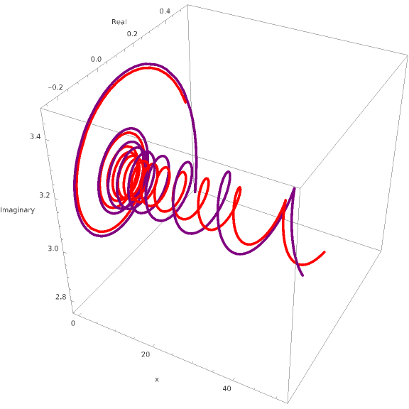
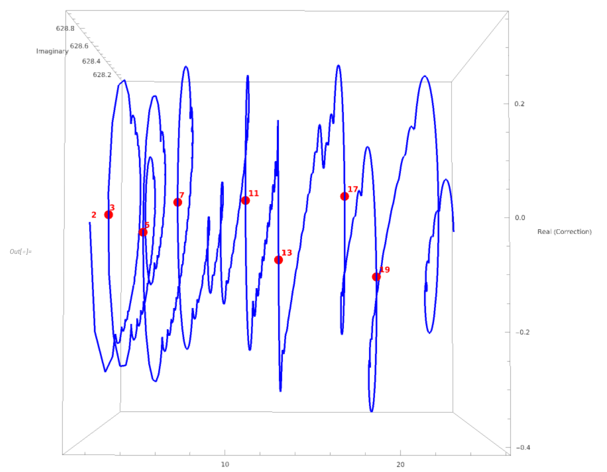
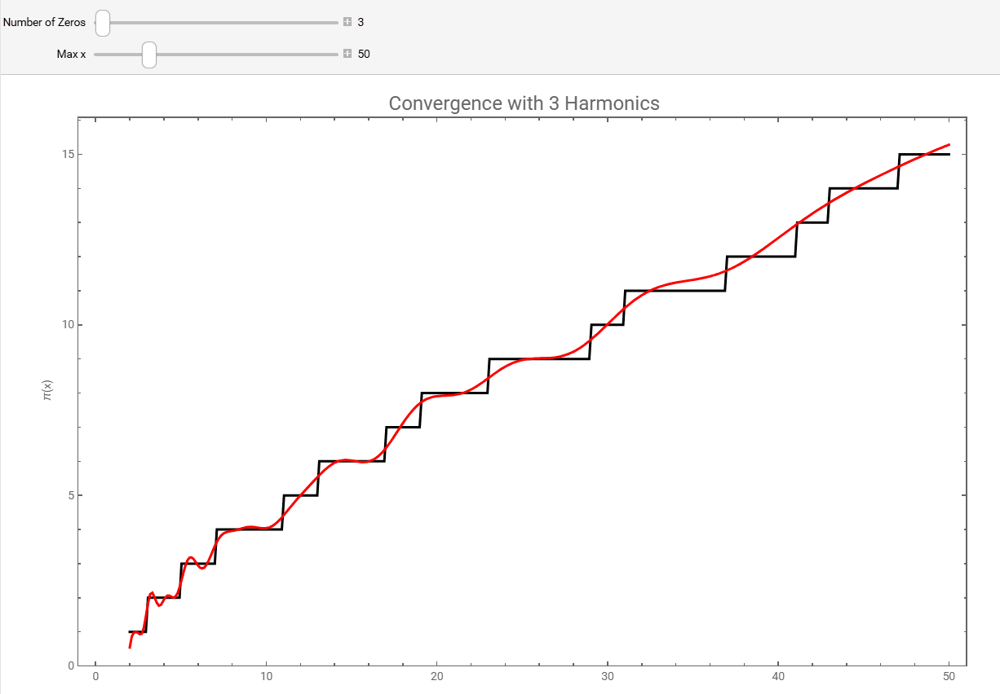

### **NOTES ON STATISTICS, PROBABILITY and MATHEMATICS**

---

### Complex Integration review:

---

The term Residue ($Res$) refers specifically to the coefficient $a_{-1}$ in the Laurent series:

$$f(z) = \dots + \frac{a_{-2}}{(z-a)^2} + \frac{a_{-1}}{(z-a)} + a_0 + a_1(z-a) + \dots$$

The integral of the entire function is $2\pi i \times a_{-1}$. The reason the total result isn't always $2\pi i$ is that the "strength" of the singularity ($a_{-1}$) can vary.

- Case A: $f(z) = \frac{1}{z}$. The coefficient $a_{-1}$ is 1. Integral = $1 \times 2\pi i = 2\pi i$.

- Case B: $f(z) = \frac{5}{z}$. The coefficient $a_{-1}$ is 5. Integral = $5 \times 2\pi i = 10\pi i$.

You can think of the $2\pi i$ as the fundamental unit of "winding" around a point. The Residue is simply a scaling factor that tells you how much of that fundamental "winding" behavior the specific function possesses at that point. 

In the example plotted, the function $$f(z) = \frac{R}{z}$$ has a single pole at the origin. 

The integration along a curve in the complex plane can be visualized via **Pólya vector fields**. Take the function $\overline{f(z)}$ with a single pole at the origin. Pólya fields allow visualization of complex integration as physical flow: The *flux* (lines coming out of the center) is controlled by the real part of $R$ - the residue of the function. The *circulation* (spinning around the center) is controlled by the Imaginary part of $R$.

If you have a velocity field $\vec{V} = (U, V)$, a velocity potential $\Phi$ is a function such that:

$$U = \frac{\partial \Phi}{\partial x} \quad \text{and} \quad V = \frac{\partial \Phi}{\partial y}$$

To find the potential of $f(z) = \frac{R}{z}$, we integrate the function

$$\Omega(z) = \int f(z) dz = R \ln(z)$$

to obtain the complex potential. Since it’s complex, it has two parts: $\Omega(z) = \Phi + i\Psi$

The *potential* is the real part, $\Phi$. Its contours are lines of constant "effort. "$\Psi$, the imaginary part is the stream function. Its contours are the actual paths the fluid follows. The potential effectively "stores" the history of the residue. When you have a pure vortex ($R=i$), the potential is $\Phi = -\arg(z)$. If you start at an angle of $0^\circ$ and walk in a full circle to $360^\circ$ in the 2D Field, you are back where you started - you see no change. But in the 3D potential surface, you have climbed from height $0$ to height $-2\pi$. The potential is what reveals that the origin isn't just a point on a flat map — it is a singularity that has "twisted" the geometry of the space around it. To the right of the plot below, the potential is reproduced as a 3D plot. 

If the residue is purely real, $\theta = 0$, you have a source or sink in the 2d Pólya field and a symmetric hill in 3D. The potential is $= \text{Re}(1 \cdot (\ln|z| + i\arg(z))) = \ln|z|$, and there is no $\arg(z)$. This is why the 3D surface is a symmetric "volcano." It doesn't spiral because the "imaginary height" is ignored.

---

---

If the residue is purely imaginary, the potential $= \text{Re}(i \cdot (\ln|z| + i\arg(z))) = -\arg(z)$. Now the height depends entirely on the angle. This is the helicoid.

---

In 3D, a "logarithmic spiral" would be a surface that is both a volcano *and* a staircase at the same time ($R = 1 + i$). This is called a conic helicoid.

---

#### The Residue: Equivalence between real and complex analysis

##### Potential function:

To compare the complex and real computations, we begin with the potential, which describes the "energy." A potential must satisfy Laplace’s Equation $(\nabla^2 \Phi = 0)$, meaning the system is in equilibrium, or in other words, the function is harmonic. In 2D, complex analysis is the "natural language" for these potentials because any analytic function $\Omega(z) = \Phi + i\Psi$ automatically provides two "harmonic conjugates" that satisfy Laplace's equation. We require analytic functions because their smoothness guarantees the existence of a complex derivative, which represents the physical flow field.

The classical example is the logarithmic potential, the most important function in complex analysis. Its importance stems from the fact that in a Laurent expansion of any complex function, the $1/z$ term is the "lone survivor" of integration. While all other powers ($z^n$) have standard power-rule antiderivatives that vanish around a closed loop, the $1/z$ term integrates to $\ln(z)$, leaving behind the residue.: 

$$\Omega(z) = \ln(z)$$ 
To see why this works, we write $z$ in polar form ($r e^{i\theta}$), which gives us 

$$\Omega(z)=\ln(r e^{i\theta}) = \ln r + i\theta$$ 

This splits into two distinct physical maps:

- The real sink potential: 

$$\Phi(x,y) = \ln\sqrt{x^2+y^2}$$

This represents a pit shape.

- The imaginary vortex potential: 

$$\Psi(x,y) = \theta = \arctan(y/x)$$ 

This represents the "spiral staircase" shape.

The complex pair: 

$$\Omega(z) = \ln(z) = \ln|z| + i\theta$$ 

The math demands these two partners. If you try to use the potential $\ln|z|$ without its partner $i\theta$, the function ceases to be analytic.In this context, analyticity is the first-principles requirement: it ensures that the complex derivative $\Omega'(z)$ exists and is unique at every point. Geometrically, this is tantamount to saying the mapping is conformal (angle-preserving). While we may not always care about the preservation of angles for their own sake, we care deeply about the derivative — the field — and that derivative only exists if the potential $(\Phi)$ and the stream function $(\Psi)$ are in perfect sync. Without this 'analytical' partnership, the 'slope' of the potential would vary depending on your direction of approach, making it impossible to define a single, consistent physical flow field.

##### Vector field: 

In physics, we don't just look at the energy (scalar field); we also look at the vector field (the flow). 

The field is the derivative of the potential.

The real field (gradient): 

Taking the gradient 

$$\nabla \Phi = \left( \frac{\partial \Phi}{\partial x}, \frac{\partial \Phi}{\partial y} \right)$$ 

gives us the physical velocity vectors $\vec{V}$.

- Deriving the sink field (the pit): Starting with 

$$\Phi = \ln\sqrt{x^2+y^2} = \frac{1}{2}\ln(x^2+y^2)$$ 

we apply the chain rule:

$$\frac{\partial \Phi}{\partial x} = \frac{1}{2} \cdot \frac{1}{x^2+y^2} \cdot 2x = \frac{x}{x^2+y^2}$$

$$\frac{\partial \Phi}{\partial y} = \frac{1}{2} \cdot \frac{1}{x^2+y^2} \cdot 2y = \frac{y}{x^2+y^2}$$

This resulting field, 

$$\vec{V}_{\text{sink}} = \left( \frac{x}{x^2+y^2}, \frac{y}{x^2+y^2} \right)$$ 

is a radial field. Because the components are proportional to $x$ and $y$, the vectors point directly toward (or away from) the origin, like spokes on a wheel.

- Deriving the vortex field (the staircase): Starting with 

$$\Psi = \theta = \arctan(y/x)$$ 

we use the derivative rule 

$$\frac{d}{du}\arctan(u) = \frac{1}{1+u^2}$$

$$\frac{\partial \Psi}{\partial x} = \frac{1}{1+(y/x)^2} \cdot \left(-\frac{y}{x^2}\right) = \frac{x^2}{x^2+y^2} \cdot \left(-\frac{y}{x^2}\right) = \frac{-y}{x^2+y^2}$$
$$\frac{\partial \Psi}{\partial y} = \frac{1}{1+(y/x)^2} \cdot \left(\frac{1}{x}\right) = \frac{x^2}{x^2+y^2} \cdot \left(\frac{1}{x}\right) = \frac{x}{x^2+y^2}$$

This resulting field, 

$$\vec{V}_{\text{vortex}} = \left( \frac{-y}{x^2+y^2}, \frac{x}{x^2+y^2} \right)$$ 

is a circulation field. Note that the dot product with the position vector $(x,y)$ is zero: $x(-y) + y(x) = 0$. This mathematically proves that the flow is always perpendicular to the radius: it travels in perfect circles.

Complex Field: The "magic" of complex analysis is that the derivative of the complex potential $\Omega(z) = \ln(z)$ captures both of these derivations simultaneously:

$$f(z) = \Omega'(z) = \frac{1}{z}$$

Expanding this gives

$$\frac{1}{z} = \frac{1}{x+iy} \cdot \frac{x-iy}{x-iy} = \frac{x}{x^2+y^2} - i\frac{y}{x^2+y^2}$$

In complex calculus, we define $f(z) = u + iv$. However, if you want to perform a line integral that represents work or flux, the standard complex multiplication $f(z)\,dz$ doesn't naturally match the dot product $\vec{V} \cdot d\vec{r}$ unless you flip the sign of the imaginary part. By defining the physical velocity as the Pólya vector, $\vec{V} = \bar{f}(z)$, we create a bridge: The real part of the integral becomes the circulation (work). The imaginary part of the integral becomes the flux (Flow across the boundary).

Let's see how the complex function $1/z$ "packages" the two physical fields we derived earlier (the sink and the vortex). Starting with the algebraic expansion:

$$f(z) = \frac{1}{z} = \frac{x}{x^2+y^2} + i\left( \frac{-y}{x^2+y^2} \right)$$

Now, let's look at what happens when we multiply this by a residue $R = a + bi$. This residue acts as a "tuner" for the machinery:

- Case A: The pure sink ($R = 1$): The field is $f(z) = \frac{1}{z}$. When we write $f(z) = u + iv$, we are saying:$u = \frac{x}{x^2+y^2}$ and $v = \frac{-y}{x^2+y^2}$. The Pólya conjugate rule simply says: "To get the physical velocity vector $\vec{V}$, take the real part as your $x$-component and negative of the imaginary part as your $y$-component."

$$\vec{V} = (u, -v)$$
So, for $f(z) = \frac{1}{z}$:

$$\vec{V} = \left( \text{Re}\left(\frac{1}{z}\right), -\text{Im}\left(\frac{1}{z}\right) \right) = \left( \frac{x}{x^2+y^2}, -\left[ \frac{-y}{x^2+y^2} \right] \right) = \left( \frac{x}{x^2+y^2}, \frac{y}{x^2+y^2} \right)$$

Why the "$-v$" sign? You might wonder why we have to flip the sign of the $y$-component. It’s because of how complex multiplication works compared to the dot product. If you integrate a field $f(z)$ along a path $dz = dx + i dy$:

$$f(z)dz = (u + iv)(dx + idy) = \underbrace{(u\,dx - v\,dy)}_{\text{Real Part}} + i\underbrace{(v\,dx + u\,dy)}_{\text{Imaginary Part}}$$

Now look at the Real Part: $(u\,dx - v\,dy)$. If we want this to represent the physical work $\vec{V} \cdot d\vec{r} = V_x dx + V_y dy$, we have to force the components to match:$V_x = u$ and $V_y = -v$. By using $\vec{V} = (u, -v)$, the real part of the complex integral automatically becomes the line integral of the velocity field.

We get the pure radial field. The real part of the complex function handled the $x$-velocity, and the imaginary part (after conjugation) handled the $y$-velocity.

- Case B: The pure vortex ($R = i$): The field is 

$$f(z) = \frac{i}{z} = i \left( \frac{x-iy}{x^2+y^2} \right) = \frac{y}{x^2+y^2} + i \frac{x}{x^2+y^2}$$

Applying the Pólya conjugate $\vec{V} = (u, -v)$:

$$\vec{V} = \left( \frac{y}{x^2+y^2}, -\frac{x}{x^2+y^2} \right)$$

We get the pure circulation field.

When you have a general residue $R = a + bi$, you aren't just doing two separate math problems. You are describing a spiral sink.

$$\vec{V}_{total} = a(\text{Radial Field}) + b(\text{Circular Field})$$

By integrating $f(z) = \frac{a+bi}{z}$, the residue theorem uses the imaginary unit $i$ as a sorting mechanism. It multiplies the radial component by $i$ (turning it into flux). It multiplies the circular component by $i^2 = -1$ (turning it into real work / circulation).

We use the Pólya Conjugate rule $\vec{V} = (u, -v)$ on the combined function:

$$f(z) = \frac{a+bi}{z} = (a+bi)\left[ \frac{x-iy}{x^2+y^2} \right]$$

Multiplying this out:

$$f(z) = \frac{(ax + by) + i(bx - ay)}{x^2+y^2}$$

Now, apply the conjugate $\vec{V} = (u, -v)$:

$$\vec{V}_{total} = \left( \frac{ax + by}{x^2+y^2}, \frac{ay - bx}{x^2+y^2} \right)$$

If you rearrange this, you see exactly the two fields we derived earlier acting in unison:

$$\vec{V}_{total} = a \underbrace{\left( \frac{x}{r^2}, \frac{y}{r^2} \right)}_{\text{Radial Sink}} + b \underbrace{\left( \frac{y}{r^2}, -\frac{x}{r^2} \right)}_{\text{Circular Vortex}}$$

---

##### Measuring Flux and Circulation:

When we integrate around a closed loop (like the unit circle), we measure the "strength" of the machinery hidden at the origin. 

Flux (Real Analysis): We integrate the gradient across the line. $\oint \vec{V} \cdot \vec{n} \, ds = 2\pi$. This tells us how much "water" is crossing the circle from the "Volcano" source.

Circulation (Real Analysis): We integrate the "Work" along the line. $\oint \vec{V} \cdot d\vec{r} = 2\pi$. This measures the "strength of the spin" from the "Staircase" vortex.

##### The Residue:

The complex residue $R = a + bi$ is the controller. In physics (like fluid flow or electromagnetism), the residue is often seen as the strength of a source or sink. If the residue is zero, there’s no net "stuff" being generated inside your loop. If the residue is a specific value, it tells you exactly how much "flow" is radiating out from that singularity. The residue acts as a data compression tool. It ignores all the infinite complexity of the higher-order terms ($1/z^2, 1/z^3$, etc.) because they don't contribute to the global loop, and it distills the essence of that singularity into a single number.In a single sentence: The residue is the scaling factor that tells you how much the $1/z$ "winding" behavior is present in your specific function at that specific point.

In complex integration, the residue is the "DNA" of the singularity, and the integral is the "measurement" of its influence.When we calculate $\oint \frac{R}{z} dz$, we are effectively asking the field: "How much do you push me along the path (Work), and how much do you push through the boundary (Flux)?

The distributive property of $i$ performs a beautiful physical sorting. When you solve a complex integral $\oint f(z) dz$, the residue theorem tells you that the answer is always:

$$\text{Integral} = 2\pi i \times (\text{Sum of Residues})$$

If your residue $R$ is a complex number $a + bi$, the multiplication $2\pi i(a + bi)$ is the step where you distribute the imaginary unit. Before the multiplication: You have $a$ and $b$ sitting side-by-side as coefficients of a Laurent expansion. They are "static" descriptions of the singularity strength. During the multiplication, the $i$ from the formula "hits" the $a$ and the $bi$. After the multiplication, the result is a single complex number where the real part is now the circulation and the imaginary part is the flux. If you were performing this calculation "by hand" in vector calculus, you would have to do two separate, difficult integrals: For Flux: $\int (u n_x + v n_y) ds$ For Circulation: $\int (u dx + v dy).$ In complex analysis, you skip those. You find $R$ (the residue), and the moment you multiply it by $2\pi i$, you have effectively solved both of those real-world integrals simultaneously.

When you perform the multiplication $2\pi i (a + bi)$, the algebra forces a physical separation:

$$2\pi i(a + bi) = 2\pi (ai + bi^2) = 2\pi (ai - b) = -2\pi b + i(2\pi a)$$

Let's look at why these two results represent completely different physical realities:

- The real result $-2\pi b$ (circulation): The real part of a complex contour integral measures the work done by the field along the path. This is the circulation. It comes from the Imaginary Residue ($bi$). Because an imaginary residue creates a vortex (a "staircase"), and the path around a vortex is always pushing you in the direction of your travel, the result is "real Work. The negative sign is a convention of the direction of the spin relative to the counter-clockwise path. 

- The imaginary result $i(2\pi a)$ (Flux): The imaginary part of a complex contour integral measures the flow crossing through the path. This is the Flux. It comes from the Real Residue ($a$). A real residue creates a source/sink (a "pit"). As you walk around the circle, the "water" is moving perpendicular to you (crossing the line). In the language of complex integration, this "lateral" movement is captured by the imaginary component.

$$\oint \frac{a+bi}{z} dz = \underbrace{-2\pi b}_{\text{Circulation}} + i \underbrace{(2\pi a)}_{\text{Flux}}$$

A Real Residue ($a$): Creates the symmetric dip and causes Flux. In the complex integral, this results in a purely imaginary value ($2\pi a i$).

An Imaginary Residue ($bi$): Creates the spiral staircase and causes circulation. In the complex integral, the $i$ from the residue hits the $i$ from the formula ($2\pi i \cdot bi$), resulting in a purely real value ($-2\pi b$).

##### Green's and theorems:

While Green's Theorem in real analysis relates loop integrals to the divergence/curl inside, the "residue" remains a complex-realm superstar: Topology: In complex analysis, you can deform a loop however you want; as long as you don't cross a pole, the integral is constant. In real analysis, this requires the field to be strictly "conservative." Selection: In complex analysis, $1/z$ is the only power that yields a non-zero loop integral. It perfectly "picks out" the singularity. The complex "package": Complex analysis treats the source and the vortex as a single analytic unit. It calculates the "pump" (flux) and the "fan" (circulation) at once.

The Pólya fields can be seen as a specialized tool that collapses the multi-step vector calculus of Green’s and Stokes' into a single operation of complex algebra. In standard vector calculus, you have two different types of integrals for a vector field $\vec{V} = (P, Q)$: 

In real vector calculus, for a field $\vec{V} = (u, -v)$, the two forms are: 

- The tangential form (circulation/work). This measures how much the field "pushes" along the path. It relates the line integral to the curl (rotation) inside.

$$\oint_C (u \, dx - v \, dy) = \iint_D \left( \frac{\partial (-v)}{\partial x} - \frac{\partial u}{\partial y} \right) dA$$

In complex analysis, this becomes the real part of the integral. 

- The normal form (flux/divergence). This measures how much the field "crosses" the boundary. It relates the line integral to the divergence (expansion) inside.

$$\oint_C (u \, dy + v \, dx) = \iint_D \left( \frac{\partial u}{\partial x} + \frac{\partial (-v)}{\partial y} \right) dA$$

In complex analysis, this becomes the imaginary part of the integral.

By using the Pólya vector field $\vec{V} = \overline{f(z)}$, we "complexify" the field into a single analytic function $f(z) = u + iv$. When you perform a complex contour integral, something remarkable happens:

$$\oint f(z) \, dz = \oint (u + iv)(dx + i \, dy) = \underbrace{\oint (u \, dx - v \, dy)}_{\text{Work/Circulation}} + i \underbrace{\oint (v \, dx + u \, dy)}_{\text{Flux}}$$

The complex integral simultaneously calculates the Work and the Flux. It essentially runs Stokes' Theorem and Green's Theorem at the same time and stores the results in the real and imaginary parts.

---

The residue is different from the number of rainbows around a pole (**Winding Number or Index**), which depend on the order of the Laurent series. The "number of rainbows" depicted in the phase portrait is determined by the highest negative power in the Laurent series (the order $m$). If the series starts at $1/z^5$, there will be 5 rainbows. However, the integral doesn't care about those 5 rainbows: it only cares about the "strength" of the specific $1/z$ component. You can have a "6-rainbow" pole (Order 6) that has a Residue of 0. Geometrically, this looks like a massive, sharp explosion of color and magnitude, but if you walk around it, you land back on the "ground floor. Contrarily, one can have a "1-rainbow" pole (Order 1) with a Residue of 10. This looks much "blunter" visually, but it moves you up 10 floors of the staircase in a single lap. 

The **steepness of a pole** is determined by two distinct factors working in tandem: the order ($m$) and the magnitude of the Coefficient ($|a_{-m}|$). To visualize this, think of the order as the "shape" of the mountain and the coefficient as the "zoom" or "scaling factor. The order of the pole (the highest negative power in the Laurent series) is the most powerful driver of steepness. It determines how fast the function approaches infinity as you get closer to the center ($r \to 0$). 

- Order 1 ($1/r$): The slope is relatively gentle. If you halve your distance to the center, the height doubles. 
- Order 2 ($1/r^2$): The slope is much steeper. Halving the distance quadruples the height. 
- Order 10 ($1/r^{10}$): This is a "needle" pole. Halving the distance increases the height by a factor of $1,024$. As the order $m$ increases, the base of the pole stays "flat" on the floor for much longer, and then it explodes upward with violent speed at the very last moment. This creates the "Dirac-like" needle.

---

---

###### Order versus residue:

- Imaginary residue:

Side-by-side comparison of $f(z) = 1/z$ (Residue = 1) and $g(z) = i/z$ (Residue = $i$). The colors "twist" while the geometry remains the same.

---

---

- Real residue:

Residue magnitude and the Order affect how the pole looks, but they change the "geometry of the slope" in different ways:

1. Order ($n$) controls the "curvature" (Sharpness): As the order increases (from $1/z$ to $1/z^2$ to $1/z^3$), the spike becomes "sharper" near the center. It stays flat for longer as you approach the pole, then shoots up much more violently. A high-order pole looks like a needle; a low-order pole looks like a gentle volcano.
2. Residue ($|a_{-1}|$) controls the "scale" (volume): For a fixed order (let's say order 1), the residue is simply a multiplier. If you double the residue, you double the height of the surface at every single point. This makes the "tent" look fatter because the points that were previously at height 1 are now at height 2.

---

---

Look at the footprint of the mountain on the $Re(z)/Im(z)$ plane. For $Res=3$, the mountain occupies much more area because the function $|3/z|$ stays "higher" for a longer distance from the center than $|1/z|$.Steepness: While both poles go to infinity, the larger residue reaches any given "height" (like the $z=8$ cap) much further out from the center. This creates the visual effect of a "fatter" or more substantial spike.Color Consistency: Because both residues are real and positive, the color cycles (rainbows) start and end at the exact same angular positions on both mountains. Only the "size" of the mountain has changed, not its orientation.

Positive Real Residue ($Res > 0$): The colors are in their "standard" orientation. For example, the color representing the positive real direction (often red) points along the positive x-axis.Negative 

Real Residue ($Res < 0$): The colors are rotated by exactly $180^{\circ}$ ($\pi$ radians). This is because $-1 = e^{i\pi}$.

Magnitude: The absolute value of the real residue scales the vertical "tent" of the pole. A larger real residue makes the spike taller and wider at the base

### The Logarithmic Integral funtion:

---

$\text{Li}(x)$: The **offset logarithmic integral function** is

$$\text{Li}(x) = \int_2^x \frac{dt}{\log t}dt = \text{li}(x) - \text{li}(2) $$

while the **logarithmic integral function** is 

$$\text{li}(x) = \int_0^x \frac{dt}{\log t}dt$$

The logarithmic integral is important in number theory, appearing in estimates of the number of prime numbers less than a given value. For example, the prime number theorem states that:

$$\pi (x)\sim \operatorname{li} (x)$$

where $\pi (x)$ denotes the number of primes smaller than or equal to $x$.

the logarithmic integral function, $\text{Li}(x),$ is a significantly more accurate approximation for the prime-counting function, $π(x),$ than 

$$\pi(x) =\frac{x}{\ln(x)}$$ 

though both are asymptotically equivalent (meaning their ratio approaches 1 as x goes to infinity). $\text{Li}(x)$ provides a much tighter fit for smaller $x$ and its error, $π(x) -\text{Li}(x),$ oscillates around zero, while the error for $x/\ln(x),$ $π(x) - x/\ln(x),$ grows unboundedly, making $x/\ln(x)$ an underestimate that gets progressively worse in absolute terms. 

---

### Riemann Explicit Formula:

---

In the most common current formulation it is:

$$\psi(x) = x - \sum_{\rho} \frac{x^\rho}{\rho} - \ln(2\pi) - \frac{1}{2}\ln(1-x^{-2})$$

---

#### Motivation and development:

Before Riemann, mathematicians like Gauss could only estimate the number of primes using the Prime Number Theorem: $\pi(x) \approx \text{Li}(x)$. Riemann's formula changed this estimate into an equality by adding a "correction" term.

This link was inspired by Fourier series. Riemann himself was a master of Fourier analysis; his Habilitationsschrift (the thesis required to become a professor) was titled "On the representability of a function by a trigonometric series." He used this expertise to bridge the gap between discrete prime numbers and continuous analytic functions.

The explicit formula creates a bridge between two worlds, much like a Fourier Transform: On the one hand, the prime numbers: these are the "events" or "spikes" in the data. On the other hand, the zeros of the zeta function: These act like the "frequencies" or "harmonics." 

Let's take a look at the approximation already visible using the first non-trivial zero and the explicit function:

---

---

the peaks seem to approximately align with the first primes. The function, $-\cos(\gamma \ln(x))$, carries a negative sign because it is just the first summand in the term $-\sum_{\rho} \frac{x^\rho}{\rho}$ over the zeros of the zeta function $\rho$ in the expression above. The first non-trivial zero is $\rho_1 = \frac{1}{2} + i\gamma$, where $\gamma \approx 14.1347$. Therefore, $x^\rho = x^{1/2} \cdot x^{i\gamma}$. Using the identity $x^{i\gamma} = e^{i\gamma \ln(x)}$, we can apply Euler's Formula:

$$e^{i\gamma \ln(x)} = \color{blue}{\cos(\gamma \ln(x))} + i \sin(\gamma \ln(x))$$

And let's now see what happens using the first two zeros:

---

---

Aha! The approximation tightens considerably for these first prime numbers!

After $100$ zeros the correspondence primes-peaks is uncanny, and, in addition, less prominent peaks are apparent to match the powers of primes:

---

---

The reason prime powers $p^k$ appear as "harmonics" alongside the base primes $p$ is baked directly into Euler’s Product Formula. When Euler proved that the sum over all integers equals the product over all primes:$$\zeta(s) = \sum_{n=1}^\infty \frac{1}{n^s} = \prod_{p \text{ prime}} \left( 1 - \frac{1}{p^s} \right)^{-1}$$He used the formula for a geometric series to expand each factor in the product:$$\left( 1 - \frac{1}{p^s} \right)^{-1} = 1 + \frac{1}{p^s} + \frac{1}{p^{2s}} + \frac{1}{p^{3s}} + \dots$$The Origin of the PowersWhen you take the logarithm of the Zeta function (which is necessary to bridge the product to a sum that we can then differentiate to find the zeros), the powers emerge naturally:Logarithm of the Product: $\ln(\zeta(s)) = \sum_{p} -\ln(1 - p^{-s})$Taylor Expansion: Using the expansion $-\ln(1-x) = x + \frac{x^2}{2} + \frac{x^3}{3} + \dots$, we get:$$\ln(\zeta(s)) = \sum_{p} \left( \frac{1}{p^s} + \frac{1}{2p^{2s}} + \frac{1}{3p^{3s}} + \dots \right)$$Every term in that expansion represents a prime power. When we differentiate this to find the "spikes" (which leads to the von Mangoldt function $\Lambda(n)$), we find that the Zeta function essentially "sees" a prime power $p^k$ as a smaller echo of the original prime $p$.

---

The big idea is to sum the harmonics, with the real part of the sum refining the $\pi(x)$ function. Here is the 3D representation of two harmonics:

Similarly, the following plot shows the first primes and the corresponding first $25$ harmonics:

Notice that the primes don't sit at the peaks of the wave; they sit on the steepest part of the upstroke. There is a very specific mathematical reason for this involving the Derivative. The "velocity" of the prime counting function $\pi(x)$ is a step function. Its derivative (the "Prime Density") is a series of Dirac Delta functions—infinite spikes at every prime and zero everywhere else. When you add up the harmonics $\text{Li}(x^\rho)$, you are trying to reconstruct those sharp steps. A "Peak" in a wave is where the slope is zero (flat). An "upstroke" is where the slope is maximum. If you want to create a vertical jump at $x=2$, you don't need the wave to be "high" there; you need the wave to be rising as fast as possible at that exact moment. Further, ecause you are using a finite number of zeros (even 200), you are seeing a "Fourier-like" approximation of a step. In a Fourier series for a square wave the middle of the jump is where the approximation crosses the "average" value (often near zero in the oscillation).The peak actually occurs after the jump has already happened (this is called the Gibbs Phenomenon). 

The formula for the "density of Primes" is roughly:$$\text{Density}(x) = 1 - \sum_{\rho} x^{\rho-1}$$ At a prime number, the phases of all those $x^\rho$ terms align such that they create a massive negative spike in the density formula, which, when subtracted, creates the positive jump in the counting function. In the 3D spiral, this alignment of phases causes the "braid" to swing through the center of its rotation with maximum velocity. That "swing through the center" is exactly the upstroke from negative to positive.4. There is also a subtle shift because of the $\text{Li}$ function itself. $\text{Li}(x)$ is defined as an integral. The "peaks" of the integrand always correspond to the "steepest slopes" of the result. The zero-Crossing of the harmonic $\text{Li}(x^\rho)$ is effectively where the "energy" of that harmonic is at its maximum "push" upward.

In standard Fourier analysis, the waves are of the form $\sin(nx)$. The frequency $n$ is constant. But in Riemann's Explicit Formula, the terms look like $x^\rho$, where $\rho = \frac{1}{2} + i\gamma$. If we write this out using Euler's formula, we get:

$$x^{\frac{1}{2} + i\gamma} = x^{1/2} \cdot e^{i\gamma \ln x} = \sqrt{x} \left( \cos(\gamma \ln x) + i\sin(\gamma \ln x) \right)$$

$$x^{\rho} = \underbrace{\sqrt{x}}_{\text{Amplitude}} \cdot \underbrace{(\cos(\gamma \ln x) + i\sin(\gamma \ln x))}_{\text{Phase/Oscillation}}$$
The $\sqrt{x}$ (amplitude) tells us how "loud" the harmonic is. As $x$ increases, the fluctuations in the prime distribution actually grow in size at a rate of $\sqrt{x}$. The $\gamma \ln x$ is the "angle" of the wave. Because $\gamma$ is a large constant (the first is $\approx 14.13$), the wave spins around the origin. Because it depends on $\ln x$, the spinning slows down as $x$ gets larger. The simplified version of Riemann’s Explicit Formula for the prime-counting function 

$$\psi(x) = x - \sum_{\rho} \frac{x^\rho}{\rho} - \text{constant terms}$$

We look specifically at the real part (since we are counting real primes):

$$\text{Term contribution} \approx \frac{\sqrt{x} \cos(\gamma \ln x)}{\gamma}$$

Each zero $\gamma$ contributes a "wave" to the total count. If you add up thousands of these waves, a miracle occurs: Destructive Interference. In places where there are no primes, the waves from different zeros ($\gamma_1, \gamma_2, \gamma_3...$) all have different phases and cancel each other out, leaving a flat line. At the exact location of a prime number, the phases of all these logarithmic spirals align perfectly. They constructively interfere to create a sharp "jump" in the graph.

Mathematicians often describe the relationship between prime numbers and the zeros of the Zeta function as a duality, specifically a Fourier-like duality.

If the primes are the "atoms" of the number system, the zeros of the Zeta function are the "harmonics" or the "spectrum" of those atoms.

The Hilbert-Pólya conjecture proposed that the zeros of the Zeta function are actually eigenvalues of some physical system (likely a chaotic one). The Fourier harmonics integer-spaced. The Riemann "Harmonics", $\cos(\gamma_n \ln x)$ are chaotic but deterministic, where $\gamma_n$ is the imaginary part of the $n$-th zero. 

Just as a violin's sound is the sum of its harmonics, the "signal" of the prime numbers is the sum of the frequencies provided by these zeros. The reason the Riemann Hypothesis is so important is directly related to the quality of this "sound": If the zeros all lie on the critical line ($Re(s) = 1/2$), all these harmonics have the same "volume" relative to each other as they propagate. They are in perfect balance.If a zero were off the line, that specific harmonic would eventually "drown out" the others or disappear, meaning the distribution of primes would be significantly more lopsided than it actually is.

---

The explicit formula is a specific equation that expresses the distribution of prime numbers in terms of the non-trivial zeros ($\rho$) of the Riemann zeta function $\zeta(s)$.

Just as a Fourier series decomposes a complex signal into simple sine waves, Riemann’s formula decomposes the distribution of primes into a sum of "oscillations" determined by the zeros of the Zeta function. If you add up more and more terms (zeros), the approximation of the prime-counting function becomes increasingly sharp:

Riemann’s explicit formula for the prime-counting function $\pi(x)$ is one of the most profound results in number theory. It shows that the number of primes up to $x$ is not just an approximation, but an **exact sum** determined by the complex zeros of the Riemann zeta function. Because $\pi(x)$ is a step function with sharp jumps at every prime, expressing it directly is mathematically difficult. 

Riemann first derived the **auxiliary formula**, $J(x)$, and then used that to build the formula for $\pi(x)$. The explicit formula is the result: a mathematical bridge that connects prime numbers directly to the zeros of the zeta function. The Auxiliary Function (specifically the **Riemann-Siegel auxiliary function**) is a tool—used primarily to calculate the zeta function's values and locate those zeros.

This function is also known as **Riemann prime-power counting function**: a "weighted" version of the standard prime-counting function $\pi(x)$. While $\pi(x)$ counts only primes with a weight of $1,$ this function counts primes with a weight of $1,$ prime squares with a weight of $1/2$, prime cubes with $1/3$, and so on. Another notation for the same function is $J(x)$. This is the notation most commonly used in modern textbooks (such as H.M. Edwards' book Riemann's Zeta Function). Because $\Pi$ is also the symbol for a product, modern mathematicians often prefer $J(x)$.

When Riemann wrote his 1859 paper, he was looking for a formula for $\pi(x)$ as the prime power counting function $\Pi(x) = J(x)$. In this version, $\text{Li}(x)$ is the dominant term. Riemann's full explicit formula for the prime power counting function $\Pi(x)$ is:

$$\Pi(x) = \text{Li}(x) - \sum_{\rho} \text{Li}(x^\rho) - \ln(2) + \int_{x}^{\infty} \frac{dt}{t(t^2-1)\ln(t)}$$

$\text{Li}(x)$: This is the "smooth part." It represents the average or expected number of primes (the general trend of prime distribution). The sum $(\sum_{\rho})$ is the contribution of the oscillations. The oscillatory part (the sum over zeta zeros) adds the "wiggles" or jumps that perfectly align with the locations of prime numbers. Each $\text{Li}(x^\rho)$ term uses a zero ($\rho$) of the zeta function to "correct" the smooth estimate and make it look like a step function. 

$\sum_{\rho} \text{Li}(x^\rho)$ is the sum over the non-trivial zeros $\rho$ of the zeta function. This term creates the "oscillations" that align with prime numbers. $-\ln 2$ is a constant adjustment. The integral term accounts for the "trivial" zeros of the zeta function at $-2, -4, -6, \dots$

While $\pi(x)$ only counts primes ($2, 3, 5, \dots$), $\Pi(x)$ counts prime powers ($2, 3, 4, 5, 7, 8, 9, \dots$) with a specific weight. 

The function is defined by the following sum over prime powers $p^n \le x$:$$J(x) = \sum_{p^n \le x} \frac{1}{n}$$ Alternatively, it can be written in terms of the standard prime-counting function $\pi(x)$:

$$J(x) = \pi(x) + \frac{1}{2}\pi(x^{1/2}) + \frac{1}{3}\pi(x^{1/3}) + \frac{1}{4}\pi(x^{1/4}) + \dots$$

The connection between the zeta function and primes starts with the Euler Product:

$$\zeta(s) = \prod_{p} \frac{1}{1-p^{-s}}$$

When you take the logarithm of both sides (to turn that product into a sum), you get:

$$\ln \zeta(s) = \sum_{p} \sum_{n=1}^{\infty} \frac{1}{n} p^{-ns}$$

This sum is exactly what leads to $\Pi(x)$. Differentiating with respect to $s$, on the left, we use the chain rule: $\frac{d}{ds} \ln(f(s)) = \frac{f'(s)}{f(s)}$. On the right, we differentiate $p^{-ns}$ with respect to $s$, which is $-n \ln(p) p^{-ns}$.

$$\frac{\zeta'(s)}{\zeta(s)} = \sum_{p} \sum_{n=1}^{\infty} \frac{-n \ln p}{n p^{ns}}$$

The $n$ in the numerator and denominator cancel out, leaving us with:

$$\frac{\zeta'(s)}{\zeta(s)} = -\sum_{p, n} \frac{\ln p}{p^{ns}}$$
The sum on the right involves the **von Mangoldt function**, denoted as $\Lambda(n)$. This function is equal to $\ln p$ if $n$ is a power of a prime ($p^k$), and $0$ otherwise. 

The von Mangoldt function, $\Lambda(n)$, is defined as:$$\Lambda(n) = \begin{cases} \ln p & \text{if } n = p^k \text{ for some prime } p \text{ and integer } k \ge 1, \\ 0 & \text{otherwise.} \end{cases}$$The values for the first nine positive integers are:$$0, \ln 2, \ln 3, \ln 2, \ln 5, 0, \ln 7, \ln 2, \ln 3, \dots$$

So, the formula can be rewritten as:

$$\frac{\zeta'(s)}{\zeta(s)} = -\sum_{n=1}^{\infty} \frac{\Lambda(n)}{n^s}$$ 
By studying the poles of $\frac{\zeta'(s)}{\zeta(s)}$ (which occur at the zeros of the Zeta function), Riemann was able to extract precise information about how primes are distributed across the number line.

The RHS is the logarithmic derivatives.In complex analysis, there is a fundamental rule: if a function $f(s)$ has a zero of multiplicity $m$ at a point $\rho$, then its logarithmic derivative $\frac{f'(s)}{f(s)}$ will automatically have a simple pole at $\rho$ with a residue exactly equal to $m$.

To understand why the zeros of the Zeta function ($\zeta(s)$) turn into poles for its logarithmic derivative ($\frac{\zeta'(s)}{\zeta(s)}$), we need to look at how complex functions behave near their roots. In complex analysis, a pole is essentially a point where a function "blows up" to infinity. A zero is where the function hits zero. When you take the derivative of a function and divide by the original function, you are creating a "detector" for those zeros. Imagine $\zeta(s)$ has a zero at a point $\rho$ with multiplicity $m$. This means near $s = \rho$, the function looks like: $$\zeta(s) \approx (s - \rho)^m \cdot g(s)$$ (where $g(s)$ is just some other non-zero function). If we take the derivative $\zeta'(s)$ using the product rule: $$\zeta'(s) \approx m(s - \rho)^{m-1} g(s) + (s - \rho)^m g'(s)$$ Now, if we look at the ratio $\frac{\zeta'(s)}{\zeta(s)}$: $$\frac{\zeta'(s)}{\zeta(s)} \approx \frac{m(s - \rho)^{m-1} g(s) + (s - \rho)^m g'(s)}{(s - \rho)^m g(s)}$$ $$\frac{\zeta'(s)}{\zeta(s)} \approx \frac{m}{s - \rho} + \frac{g'(s)}{g(s)}$$ The result: At the exact spot where $\zeta(s)$ was zero ($s = \rho$), the function $\frac{\zeta'(s)}{\zeta(s)}$ now has a simple pole with a "strength" (residue) equal to $m$.

Because $\frac{\zeta'(s)}{\zeta(s)}$ has poles at the zeros of $\zeta(s)$, Riemann could use the Residue Theorem. If you integrate this function along a vertical line, the integral "picks up" a contribution from every pole (zero) it passes. The pole at $s=1$ (where $\zeta$ blows up) gives the main trend of the primes. The poles at the zeros $\rho$ give the "fluctuations": $-\sum \frac{x^\rho}{\rho}$. This is why we say the zeros "control" the primes. Each zero acts like a frequency in a giant Fourier series that builds the prime-staircase. If the Riemann Hypothesis is true, all these frequencies are "tuned" perfectly (all have $Re(s) = 1/2$), meaning the primes are distributed as regularly as possible.

Riemann used a technique called a **Perron integral** (complex inversion). He integrated the logarithmic derivative along a vertical line in the complex plane. This resulted in his famous Explicit Formula:$$J(x) = \text{li}(x) - \sum_{\rho} \text{li}(x^\rho) - \ln 2 + \int_x^{\infty} \frac{dt}{t(t^2-1)\ln t}$$

If we only wanted to count the pure primes ($2, 3, 5, 7...$) and ignore the powers, the math actually becomes messier. The "harmonics" of the zeros naturally want to build the $J(x)$ staircase. To get the pure $\pi(x)$ staircase, you have to use Möbius Inversion to manually "subtract" out the harmonics of the primes (the squares, cubes, etc.).

$$\pi(x) = J(x) - \frac{1}{2}J(x^{1/2}) - \frac{1}{3}J(x^{1/3}) \dots$$
This formula literally says: "Take the total harmonic signal ($J$) and strip away the overtones ($1/2, 1/3$) to find the fundamental notes (the primes)."

However, $J(x)=\Pi(x)$ mirrors the structure of the zeta function perfectly. What exactly is $\Pi(x)$?Instead of jumping by $1$ at every prime, $\Pi(x)$ jumps by:$1$ at every prime $p$$1/2$ at every square of a prime 2$p^2$$1/3$ at every cube of a prime 3$p^3$And so on.

The sum above can be rearranged to group terms by their value:

$$\ln \zeta(s) = \sum_{p} \left( p^{-s} + \frac{1}{2}p^{-2s} + \frac{1}{3}p^{-3s} + \dots \right)$$

If we imagine a function $\Pi(x)$ that is a step function, we can write the sum above as a Stieltjes integral. We are scanning across the number line from $1$ to $\infty$, and every time we hit a prime or a prime power, we add a specific amount to our total. At every prime $p$ (like $2, 3, 5, 7$), the function $\Pi(x)$ jumps by $1$. At every prime square $p^2$ (like $4, 9, 25$), it jumps by $1/2$. At every prime cube $p^3$ (like $8, 27$), it jumps by $1/3$. 

Because of this "jump" structure, we can define $\Pi(x)$ as the sum of all these fractional steps:

$$\Pi(x) = \sum_{p^n \le x} \frac{1}{n}$$
This is equivalent to saying:

$$\Pi(x) = \pi(x) + \frac{1}{2}\pi(x^{1/2}) + \frac{1}{3}\pi(x^{1/3}) + \dots$$ 

The link between the sum and the function is the integral:

$$\ln \zeta(s) = s \int_{1}^{\infty} \Pi(x) x^{-s-1} dx$$

This is a **Mellin Transform**. It tells us that $\ln \zeta(s)$ is essentially the "frequency domain" version of the prime-counting function $\Pi(x)$. When Riemann wanted to find an explicit formula for $\Pi(x)$, he used a technique called **Perron’s Formula (an inverse Mellin transform)**. This allowed him to "un-integrate" the zeta function to get back to the step function. Because the logarithm of the zeta function has poles and zeros, those poles and zeros become the terms in the explicit formula (like $\text{Li}(x)$ and the sum over $\rho$).

While $J(x)$ (or $\Pi(x)$) is easier to use when working with the Zeta function, we usually want to know the actual number of primes, $\pi(x)$. You can invert that series using the Möbius function $\mu(n)$:

$$\pi(x) = \sum_{n=1}^{\infty} \frac{\mu(n)}{n} J(x^{1/n})$$

Where $\mu(n)$ takes a value of $1$ if $n=1$; $(-1)^k$ if $n$ is a product of $k$ distinct primes; or $0$ if $n$ has a squared prime factor.

The expression for $\pi(x)$ would be:

$$\pi(x) = \sum_{n=1}^\infty \frac{\mu(n)}{n} \left( \text{Li}(x^{1/n}) - \sum_{\rho} \text{Li}(x^{\rho/n}) - \ln 2 + \int_{x^{1/n}}^\infty \frac{dt}{t(t^2-1)\ln t} \right)$$

where $\mu(n)$ is the Möbius function:

For any positive integer $n$, the value of $\mu(n)$ is determined as follows: It has a value of $+1$ if $n$ is square-free and has an even number of prime factors. The value is $-1$ if $n$ is square-free and has an odd number of prime factors. The Möbius function $\mu(n)$ is defined to be $0$ for numbers that are not square-free (meaning they are divisible by $p^2$ for some prime $p$).

---

#### The Chebyshev function:

---

While Riemann's original formula for $\Pi(x)$ is beautiful, it involves complex integrals $(\text{Li})$ and prime powers in a way that is difficult to manipulate for certain proofs. 

The standard prime-counting function $\pi(x)$ is a "staircase" where every step has a height of $1$. Riemann's $\Pi(x)$ is a staircase where the step at $p^n$ has a height of $1/n$.The Chebyshev function $\psi(x)$ is a staircase where the step at $p^n$ has a height of $\ln p$. Why $\ln p$? Because of the logarithmic derivative. In calculus, $\frac{d}{ds} \ln \zeta(s) = \frac{\zeta'(s)}{\zeta(s)}$. When you expand this as a series, you get:

$$-\frac{\zeta'(s)}{\zeta(s)} = \sum_{n=1}^{\infty} \Lambda(n) n^{-s}$$

Here, $\Lambda(n)$ is the von Mangoldt function, which is $\ln p$ if $n$ is a prime power and $0$ otherwise. The $\psi(x)$ function is simply the sum of these weights.

The **Chebyshev function** $\psi(x)$ is:

$$\psi(x) = x - \sum_{\rho} \frac{x^\rho}{\rho} - \ln(2\pi) - \frac{1}{2}\ln(1-x^{-2})$$

---
<a href="http://rinterested.github.io/statistics/index.html">Home Page</a>

**NOTE: These are tentative notes on different topics for personal use - expect mistakes and misunderstandings.**
