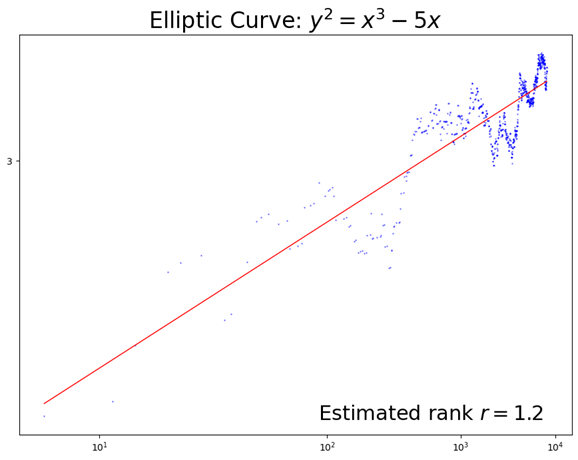

### **NOTES ON STATISTICS, PROBABILITY and MATHEMATICS**

<a href="http://rinterested.github.io/statistics/index.html">
</a>

---


### The Logarithmic Integral funtion:

---

$\text{Li}(x)$: The **offset logarithmic integral function** is

$$\text{Li}(x) = \int_2^x \frac{dt}{\log t}dt = \text{li}(x) - \text{li}(2) $$

while the **logarithmic integral function** is 

$$\text{li}(x) = \int_0^x \frac{dt}{\log t}dt$$

The logarithmic integral is important in number theory, appearing in estimates of the number of prime numbers less than a given value. For example, the prime number theorem states that:

$$\pi (x)\sim \operatorname{li} (x)$$

where $\pi (x)$ denotes the number of primes smaller than or equal to $x$.

the logarithmic integral function, $\text{Li}(x),$ is a significantly more accurate approximation for the prime-counting function, $π(x),$ than 

$$\pi(x) =\frac{x}{\ln(x)}$$ 

though both are asymptotically equivalent (meaning their ratio approaches 1 as x goes to infinity). $\text{Li}(x)$ provides a much tighter fit for smaller $x$ and its error, $π(x) -\text{Li}(x),$ oscillates around zero, while the error for $x/\ln(x),$ $π(x) - x/\ln(x),$ grows unboundedly, making $x/\ln(x)$ an underestimate that gets progressively worse in absolute terms. 


---

### Riemann Explicit Formula:

---

In the most common current formulation it is:

$$\psi(x) = x - \sum_{\rho} \frac{x^\rho}{\rho} - \ln(2\pi) - \frac{1}{2}\ln(1-x^{-2})$$

---

#### Motivation and development:

Before Riemann, mathematicians like Gauss could only estimate the number of primes using the Prime Number Theorem: $\pi(x) \approx \text{Li}(x)$. Riemann's formula changed this estimate into an equality by adding a "correction" term.

This link was inspired by Fourier series. Riemann himself was a master of Fourier analysis; his Habilitationsschrift (the thesis required to become a professor) was titled "On the representability of a function by a trigonometric series." He used this expertise to bridge the gap between discrete prime numbers and continuous analytic functions.

The explicit formula creates a bridge between two worlds, much like a Fourier Transform: On the one hand, the prime numbers: these are the "events" or "spikes" in the data. On the other hand, the zeros of the zeta function: These act like the "frequencies" or "harmonics." 

Let's take a look at the approximation already visible using the first non-trivial zero and the explicit function:

---


---

the peaks seem to approximately align with the first primes. The function, $-\cos(\gamma \ln(x))$, carries a negative sign because it is just the first summand in the term $-\sum_{\rho} \frac{x^\rho}{\rho}$ over the zeros of the zeta function $\rho$ in the expression above. The first non-trivial zero is $\rho_1 = \frac{1}{2} + i\gamma$, where $\gamma \approx 14.1347$. Therefore, $x^\rho = x^{1/2} \cdot x^{i\gamma}$. Using the identity $x^{i\gamma} = e^{i\gamma \ln(x)}$, we can apply Euler's Formula:

$$e^{i\gamma \ln(x)} = \color{blue}{\cos(\gamma \ln(x))} + i \sin(\gamma \ln(x))$$

And let's now see what happens using the first two zeros:

---


---

Aha! The approximation tightens considerably for these first prime numbers!

After $100$ zeros the correspondence primes-peaks is uncanny, and, in addition, less prominent peaks are apparent to match the powers of primes:

---


---

The reason prime powers $p^k$ appear as "harmonics" alongside the base primes $p$ is baked directly into Euler’s Product Formula. When Euler proved that the sum over all integers equals the product over all primes:$$\zeta(s) = \sum_{n=1}^\infty \frac{1}{n^s} = \prod_{p \text{ prime}} \left( 1 - \frac{1}{p^s} \right)^{-1}$$He used the formula for a geometric series to expand each factor in the product:$$\left( 1 - \frac{1}{p^s} \right)^{-1} = 1 + \frac{1}{p^s} + \frac{1}{p^{2s}} + \frac{1}{p^{3s}} + \dots$$The Origin of the PowersWhen you take the logarithm of the Zeta function (which is necessary to bridge the product to a sum that we can then differentiate to find the zeros), the powers emerge naturally:Logarithm of the Product: $\ln(\zeta(s)) = \sum_{p} -\ln(1 - p^{-s})$Taylor Expansion: Using the expansion $-\ln(1-x) = x + \frac{x^2}{2} + \frac{x^3}{3} + \dots$, we get:$$\ln(\zeta(s)) = \sum_{p} \left( \frac{1}{p^s} + \frac{1}{2p^{2s}} + \frac{1}{3p^{3s}} + \dots \right)$$Every term in that expansion represents a prime power. When we differentiate this to find the "spikes" (which leads to the von Mangoldt function $\Lambda(n)$), we find that the Zeta function essentially "sees" a prime power $p^k$ as a smaller echo of the original prime $p$.

---

The big idea is to sum the harmonics, with the real part of the sum refining the $\pi(x)$ function. Here is the 3D representation of two harmonics:

---


---

Similarly, the following plot shows the first primes and the corresponding first $25$ harmonics:

---


---

Notice that the primes don't sit at the peaks of the wave; they sit on the steepest part of the upstroke. There is a very specific mathematical reason for this involving the Derivative. The "velocity" of the prime counting function $\pi(x)$ is a step function. Its derivative (the "Prime Density") is a series of Dirac Delta functions—infinite spikes at every prime and zero everywhere else. When you add up the harmonics $\text{Li}(x^\rho)$, you are trying to reconstruct those sharp steps. A "Peak" in a wave is where the slope is zero (flat). An "upstroke" is where the slope is maximum. If you want to create a vertical jump at $x=2$, you don't need the wave to be "high" there; you need the wave to be rising as fast as possible at that exact moment. Further, ecause you are using a finite number of zeros (even 200), you are seeing a "Fourier-like" approximation of a step. In a Fourier series for a square wave the middle of the jump is where the approximation crosses the "average" value (often near zero in the oscillation).The peak actually occurs after the jump has already happened (this is called the Gibbs Phenomenon). 

The formula for the "density of Primes" is roughly:$$\text{Density}(x) = 1 - \sum_{\rho} x^{\rho-1}$$ At a prime number, the phases of all those $x^\rho$ terms align such that they create a massive negative spike in the density formula, which, when subtracted, creates the positive jump in the counting function. In the 3D spiral, this alignment of phases causes the "braid" to swing through the center of its rotation with maximum velocity. That "swing through the center" is exactly the upstroke from negative to positive.4. There is also a subtle shift because of the $\text{Li}$ function itself. $\text{Li}(x)$ is defined as an integral. The "peaks" of the integrand always correspond to the "steepest slopes" of the result. The zero-Crossing of the harmonic $\text{Li}(x^\rho)$ is effectively where the "energy" of that harmonic is at its maximum "push" upward.

In standard Fourier analysis, the waves are of the form $\sin(nx)$. The frequency $n$ is constant. But in Riemann's Explicit Formula, the terms look like $x^\rho$, where $\rho = \frac{1}{2} + i\gamma$. If we write this out using Euler's formula, we get:

$$x^{\frac{1}{2} + i\gamma} = x^{1/2} \cdot e^{i\gamma \ln x} = \sqrt{x} \left( \cos(\gamma \ln x) + i\sin(\gamma \ln x) \right)$$

$$x^{\rho} = \underbrace{\sqrt{x}}_{\text{Amplitude}} \cdot \underbrace{(\cos(\gamma \ln x) + i\sin(\gamma \ln x))}_{\text{Phase/Oscillation}}$$
The $\sqrt{x}$ (amplitude) tells us how "loud" the harmonic is. As $x$ increases, the fluctuations in the prime distribution actually grow in size at a rate of $\sqrt{x}$. The $\gamma \ln x$ is the "angle" of the wave. Because $\gamma$ is a large constant (the first is $\approx 14.13$), the wave spins around the origin. Because it depends on $\ln x$, the spinning slows down as $x$ gets larger. The simplified version of Riemann’s Explicit Formula for the prime-counting function 

$$\psi(x) = x - \sum_{\rho} \frac{x^\rho}{\rho} - \text{constant terms}$$

We look specifically at the real part (since we are counting real primes):

$$\text{Term contribution} \approx \frac{\sqrt{x} \cos(\gamma \ln x)}{\gamma}$$

Each zero $\gamma$ contributes a "wave" to the total count. If you add up thousands of these waves, a miracle occurs: Destructive Interference. In places where there are no primes, the waves from different zeros ($\gamma_1, \gamma_2, \gamma_3...$) all have different phases and cancel each other out, leaving a flat line. At the exact location of a prime number, the phases of all these logarithmic spirals align perfectly. They constructively interfere to create a sharp "jump" in the graph.

Mathematicians often describe the relationship between prime numbers and the zeros of the Zeta function as a duality, specifically a Fourier-like duality.

If the primes are the "atoms" of the number system, the zeros of the Zeta function are the "harmonics" or the "spectrum" of those atoms.

The Hilbert-Pólya conjecture proposed that the zeros of the Zeta function are actually eigenvalues of some physical system (likely a chaotic one). The Fourier harmonics integer-spaced. The Riemann "Harmonics", $\cos(\gamma_n \ln x)$ are chaotic but deterministic, where $\gamma_n$ is the imaginary part of the $n$-th zero. 

Just as a violin's sound is the sum of its harmonics, the "signal" of the prime numbers is the sum of the frequencies provided by these zeros. The reason the Riemann Hypothesis is so important is directly related to the quality of this "sound": If the zeros all lie on the critical line ($Re(s) = 1/2$), all these harmonics have the same "volume" relative to each other as they propagate. They are in perfect balance.If a zero were off the line, that specific harmonic would eventually "drown out" the others or disappear, meaning the distribution of primes would be significantly more lopsided than it actually is.

---

The explicit formula is a specific equation that expresses the distribution of prime numbers in terms of the non-trivial zeros ($\rho$) of the Riemann zeta function $\zeta(s)$.

Just as a Fourier series decomposes a complex signal into simple sine waves, Riemann’s formula decomposes the distribution of primes into a sum of "oscillations" determined by the zeros of the Zeta function. If you add up more and more terms (zeros), the approximation of the prime-counting function becomes increasingly sharp:


Riemann’s explicit formula for the prime-counting function $\pi(x)$ is one of the most profound results in number theory. It shows that the number of primes up to $x$ is not just an approximation, but an **exact sum** determined by the complex zeros of the Riemann zeta function. Because $\pi(x)$ is a step function with sharp jumps at every prime, expressing it directly is mathematically difficult. 

Riemann first derived the **auxiliary formula**, $J(x)$, and then used that to build the formula for $\pi(x)$. The explicit formula is the result: a mathematical bridge that connects prime numbers directly to the zeros of the zeta function. The Auxiliary Function (specifically the **Riemann-Siegel auxiliary function**) is a tool—used primarily to calculate the zeta function's values and locate those zeros.

This function is also known as **Riemann prime-power counting function**: a "weighted" version of the standard prime-counting function $\pi(x)$. While $\pi(x)$ counts only primes with a weight of $1,$ this function counts primes with a weight of $1,$ prime squares with a weight of $1/2$, prime cubes with $1/3$, and so on. Another notation for the same function is $J(x)$. This is the notation most commonly used in modern textbooks (such as H.M. Edwards' book Riemann's Zeta Function). Because $\Pi$ is also the symbol for a product, modern mathematicians often prefer $J(x)$.

When Riemann wrote his 1859 paper, he was looking for a formula for $\pi(x)$ as the prime power counting function $\Pi(x) = J(x)$. In this version, $\text{Li}(x)$ is the dominant term. Riemann's full explicit formula for the prime power counting function $\Pi(x)$ is:

$$\Pi(x) = \text{Li}(x) - \sum_{\rho} \text{Li}(x^\rho) - \ln(2) + \int_{x}^{\infty} \frac{dt}{t(t^2-1)\ln(t)}$$

$\text{Li}(x)$: This is the "smooth part." It represents the average or expected number of primes (the general trend of prime distribution). The sum $(\sum_{\rho})$ is the contribution of the oscillations. The oscillatory part (the sum over zeta zeros) adds the "wiggles" or jumps that perfectly align with the locations of prime numbers. Each $\text{Li}(x^\rho)$ term uses a zero ($\rho$) of the zeta function to "correct" the smooth estimate and make it look like a step function. 

$\sum_{\rho} \text{Li}(x^\rho)$ is the sum over the non-trivial zeros $\rho$ of the zeta function. This term creates the "oscillations" that align with prime numbers. $-\ln 2$ is a constant adjustment. The integral term accounts for the "trivial" zeros of the zeta function at $-2, -4, -6, \dots$

While $\pi(x)$ only counts primes ($2, 3, 5, \dots$), $\Pi(x)$ counts prime powers ($2, 3, 4, 5, 7, 8, 9, \dots$) with a specific weight. 

The function is defined by the following sum over prime powers $p^n \le x$:$$J(x) = \sum_{p^n \le x} \frac{1}{n}$$ Alternatively, it can be written in terms of the standard prime-counting function $\pi(x)$:

$$J(x) = \pi(x) + \frac{1}{2}\pi(x^{1/2}) + \frac{1}{3}\pi(x^{1/3}) + \frac{1}{4}\pi(x^{1/4}) + \dots$$


The connection between the zeta function and primes starts with the Euler Product:

$$\zeta(s) = \prod_{p} \frac{1}{1-p^{-s}}$$

When you take the logarithm of both sides (to turn that product into a sum), you get:

$$\ln \zeta(s) = \sum_{p} \sum_{n=1}^{\infty} \frac{1}{n} p^{-ns}$$

This sum is exactly what leads to $\Pi(x)$. Differentiating with respect to $s$, on the left, we use the chain rule: $\frac{d}{ds} \ln(f(s)) = \frac{f'(s)}{f(s)}$. On the right, we differentiate $p^{-ns}$ with respect to $s$, which is $-n \ln(p) p^{-ns}$.

$$\frac{\zeta'(s)}{\zeta(s)} = \sum_{p} \sum_{n=1}^{\infty} \frac{-n \ln p}{n p^{ns}}$$

The $n$ in the numerator and denominator cancel out, leaving us with:

$$\frac{\zeta'(s)}{\zeta(s)} = -\sum_{p, n} \frac{\ln p}{p^{ns}}$$
The sum on the right involves the **von Mangoldt function**, denoted as $\Lambda(n)$. This function is equal to $\ln p$ if $n$ is a power of a prime ($p^k$), and $0$ otherwise. 

The von Mangoldt function, $\Lambda(n)$, is defined as:$$\Lambda(n) = \begin{cases} \ln p & \text{if } n = p^k \text{ for some prime } p \text{ and integer } k \ge 1, \\ 0 & \text{otherwise.} \end{cases}$$The values for the first nine positive integers are:$$0, \ln 2, \ln 3, \ln 2, \ln 5, 0, \ln 7, \ln 2, \ln 3, \dots$$


So, the formula can be rewritten as:

$$\frac{\zeta'(s)}{\zeta(s)} = -\sum_{n=1}^{\infty} \frac{\Lambda(n)}{n^s}$$ 
By studying the poles of $\frac{\zeta'(s)}{\zeta(s)}$ (which occur at the zeros of the Zeta function), Riemann was able to extract precise information about how primes are distributed across the number line.

The RHS is the logarithmic derivatives.In complex analysis, there is a fundamental rule: if a function $f(s)$ has a zero of multiplicity $m$ at a point $\rho$, then its logarithmic derivative $\frac{f'(s)}{f(s)}$ will automatically have a simple pole at $\rho$ with a residue exactly equal to $m$.

To understand why the zeros of the Zeta function ($\zeta(s)$) turn into poles for its logarithmic derivative ($\frac{\zeta'(s)}{\zeta(s)}$), we need to look at how complex functions behave near their roots. In complex analysis, a pole is essentially a point where a function "blows up" to infinity. A zero is where the function hits zero. When you take the derivative of a function and divide by the original function, you are creating a "detector" for those zeros. Imagine $\zeta(s)$ has a zero at a point $\rho$ with multiplicity $m$. This means near $s = \rho$, the function looks like: $$\zeta(s) \approx (s - \rho)^m \cdot g(s)$$ (where $g(s)$ is just some other non-zero function). If we take the derivative $\zeta'(s)$ using the product rule: $$\zeta'(s) \approx m(s - \rho)^{m-1} g(s) + (s - \rho)^m g'(s)$$ Now, if we look at the ratio $\frac{\zeta'(s)}{\zeta(s)}$: $$\frac{\zeta'(s)}{\zeta(s)} \approx \frac{m(s - \rho)^{m-1} g(s) + (s - \rho)^m g'(s)}{(s - \rho)^m g(s)}$$ $$\frac{\zeta'(s)}{\zeta(s)} \approx \frac{m}{s - \rho} + \frac{g'(s)}{g(s)}$$ The result: At the exact spot where $\zeta(s)$ was zero ($s = \rho$), the function $\frac{\zeta'(s)}{\zeta(s)}$ now has a simple pole with a "strength" (residue) equal to $m$.

Because $\frac{\zeta'(s)}{\zeta(s)}$ has poles at the zeros of $\zeta(s)$, Riemann could use the Residue Theorem. If you integrate this function along a vertical line, the integral "picks up" a contribution from every pole (zero) it passes. The pole at $s=1$ (where $\zeta$ blows up) gives the main trend of the primes. The poles at the zeros $\rho$ give the "fluctuations": $-\sum \frac{x^\rho}{\rho}$. This is why we say the zeros "control" the primes. Each zero acts like a frequency in a giant Fourier series that builds the prime-staircase. If the Riemann Hypothesis is true, all these frequencies are "tuned" perfectly (all have $Re(s) = 1/2$), meaning the primes are distributed as regularly as possible.

Riemann used a technique called a **Perron integral** (complex inversion). He integrated the logarithmic derivative along a vertical line in the complex plane. This resulted in his famous Explicit Formula:$$J(x) = \text{li}(x) - \sum_{\rho} \text{li}(x^\rho) - \ln 2 + \int_x^{\infty} \frac{dt}{t(t^2-1)\ln t}$$

If we only wanted to count the pure primes ($2, 3, 5, 7...$) and ignore the powers, the math actually becomes messier. The "harmonics" of the zeros naturally want to build the $J(x)$ staircase. To get the pure $\pi(x)$ staircase, you have to use Möbius Inversion to manually "subtract" out the harmonics of the primes (the squares, cubes, etc.).

$$\pi(x) = J(x) - \frac{1}{2}J(x^{1/2}) - \frac{1}{3}J(x^{1/3}) \dots$$
This formula literally says: "Take the total harmonic signal ($J$) and strip away the overtones ($1/2, 1/3$) to find the fundamental notes (the primes)."

However, $J(x)=\Pi(x)$ mirrors the structure of the zeta function perfectly. What exactly is $\Pi(x)$?Instead of jumping by $1$ at every prime, $\Pi(x)$ jumps by:$1$ at every prime $p$$1/2$ at every square of a prime 2$p^2$$1/3$ at every cube of a prime 3$p^3$And so on.

The sum above can be rearranged to group terms by their value:

$$\ln \zeta(s) = \sum_{p} \left( p^{-s} + \frac{1}{2}p^{-2s} + \frac{1}{3}p^{-3s} + \dots \right)$$

If we imagine a function $\Pi(x)$ that is a step function, we can write the sum above as a Stieltjes integral. We are scanning across the number line from $1$ to $\infty$, and every time we hit a prime or a prime power, we add a specific amount to our total. At every prime $p$ (like $2, 3, 5, 7$), the function $\Pi(x)$ jumps by $1$. At every prime square $p^2$ (like $4, 9, 25$), it jumps by $1/2$. At every prime cube $p^3$ (like $8, 27$), it jumps by $1/3$. 

Because of this "jump" structure, we can define $\Pi(x)$ as the sum of all these fractional steps:

$$\Pi(x) = \sum_{p^n \le x} \frac{1}{n}$$
This is equivalent to saying:

$$\Pi(x) = \pi(x) + \frac{1}{2}\pi(x^{1/2}) + \frac{1}{3}\pi(x^{1/3}) + \dots$$ 

The link between the sum and the function is the integral:

$$\ln \zeta(s) = s \int_{1}^{\infty} \Pi(x) x^{-s-1} dx$$

This is a **Mellin Transform**. It tells us that $\ln \zeta(s)$ is essentially the "frequency domain" version of the prime-counting function $\Pi(x)$. When Riemann wanted to find an explicit formula for $\Pi(x)$, he used a technique called **Perron’s Formula (an inverse Mellin transform)**. This allowed him to "un-integrate" the zeta function to get back to the step function. Because the logarithm of the zeta function has poles and zeros, those poles and zeros become the terms in the explicit formula (like $\text{Li}(x)$ and the sum over $\rho$).

While $J(x)$ (or $\Pi(x)$) is easier to use when working with the Zeta function, we usually want to know the actual number of primes, $\pi(x)$. You can invert that series using the Möbius function $\mu(n)$:

$$\pi(x) = \sum_{n=1}^{\infty} \frac{\mu(n)}{n} J(x^{1/n})$$

Where $\mu(n)$ takes a value of $1$ if $n=1$; $(-1)^k$ if $n$ is a product of $k$ distinct primes; or $0$ if $n$ has a squared prime factor.

The expression for $\pi(x)$ would be:

$$\pi(x) = \sum_{n=1}^\infty \frac{\mu(n)}{n} \left( \text{Li}(x^{1/n}) - \sum_{\rho} \text{Li}(x^{\rho/n}) - \ln 2 + \int_{x^{1/n}}^\infty \frac{dt}{t(t^2-1)\ln t} \right)$$

where $\mu(n)$ is the Möbius function:

For any positive integer $n$, the value of $\mu(n)$ is determined as follows: It has a value of $+1$ if $n$ is square-free and has an even number of prime factors. The value is $-1$ if $n$ is square-free and has an odd number of prime factors. The Möbius function $\mu(n)$ is defined to be $0$ for numbers that are not square-free (meaning they are divisible by $p^2$ for some prime $p$).

---

#### The Chebyshev function:

---

While Riemann's original formula for $\Pi(x)$ is beautiful, it involves complex integrals $(\text{Li})$ and prime powers in a way that is difficult to manipulate for certain proofs. 

The standard prime-counting function $\pi(x)$ is a "staircase" where every step has a height of $1$. Riemann's $\Pi(x)$ is a staircase where the step at $p^n$ has a height of $1/n$.The Chebyshev function $\psi(x)$ is a staircase where the step at $p^n$ has a height of $\ln p$. Why $\ln p$? Because of the logarithmic derivative. In calculus, $\frac{d}{ds} \ln \zeta(s) = \frac{\zeta'(s)}{\zeta(s)}$. When you expand this as a series, you get:

$$-\frac{\zeta'(s)}{\zeta(s)} = \sum_{n=1}^{\infty} \Lambda(n) n^{-s}$$

Here, $\Lambda(n)$ is the von Mangoldt function, which is $\ln p$ if $n$ is a prime power and $0$ otherwise. The $\psi(x)$ function is simply the sum of these weights.

The **Chebyshev function** $\psi(x)$ is:

$$\psi(x) = x - \sum_{\rho} \frac{x^\rho}{\rho} - \ln(2\pi) - \frac{1}{2}\ln(1-x^{-2})$$

### Random matrices:

---

```{r, echo=FALSE}
# ---------------------------------------------------------
# Random Matrix Theory: GUE Spacings (Gaudin Distribution)
# ---------------------------------------------------------

# 1. Parameters
n <- 2000 # Increased size for better statistics

# 2. Generate a Random Complex Hermitian Matrix (GUE)
# We create a random complex matrix and add it to its conjugate transpose
M <- matrix(complex(real = rnorm(n^2), imaginary = rnorm(n^2)), nrow = n)
#all(Mod(M - t(Conj(M))) < 1e-10)
H <- (M + t(Conj(M))) / 2
#all(Mod(H - t(Conj(H))) < 1e-10)

# 3. Extract and Sort Eigenvalues
ev <- sort(Re(eigen(H, only.values = TRUE)$values))
differ <- diff(ev)
hist(ev, breaks=40, border=F, col='navyblue', main='Eigenvalues distribution - semicircle law')
#hist(differ, breaks=100)

# 4. Smooth Unfolding 
# We use a smooth spline to capture the 'trend' (Wigner Semicircle) 
# without erasing the local random fluctuations.
# This maps the eigenvalues to a range where the average spacing is 1.
smooth_map <- smooth.spline(ev, 1:n, df = 50) # df=50 keeps the curve smooth
unfolded_ev <- predict(smooth_map, ev)$y

# 5. Calculate Spacings
spacings <- diff(unfolded_ev)

# Ensure the mean spacing is exactly 1 (Crucial for the Gaudin formula)
spacings <- spacings / mean(spacings)

# 6. Define the Gaudin Distribution (Wigner Surmise for GUE, beta=2)
gaudin_pdf <- function(s) {
  (32 / pi^2) * (s^2) * exp(-(4 / pi) * s^2)
}

# 7. Visualization
# We use 'freq = FALSE' to ensure the y-axis is 'Density' not 'Count'
hist(spacings, breaks = 70, freq = FALSE, 
     xlim = c(0, 3.5), ylim = c(0, 1.2),
     main = "Empirical GUE Spacings vs. Gaudin PDF",
     xlab = "Normalized Spacing (s)", 
     col = "tan", border = "white")

# Plot the Empirical Density (the blue dashed line)
# This should now be asymmetrical and follow the red curve
lines(density(spacings), col = "blue", lwd = 2, lty = 2)

# Plot the Theoretical Gaudin Curve (the red line)
s_vals <- seq(0, 4, length.out = 200)
lines(s_vals, gaudin_pdf(s_vals), col = "red", lwd = 3)

legend("topright", 
       legend = c("Matrix Spacings (Hist)", "Empirical Density", "Gaudin PDF (Theory)"),
       col = c("tan", "blue", "red"), 
       lwd = c(8, 2, 3), lty = c(1, 2, 1),
       bg = "white")
```

---

The [Gaudin](https://en.wikipedia.org/wiki/Michel_Gaudin_(physicist)) distribution 
is an example of the Wigner-Dyson distribution family. The Wigner-Dyson distribution familyt refers to the general class of distributions arising from Random Matrix Theory (RMT). It is defined by the Dyson Index ($\beta$), which dictates the symmetry of the system ((GOE): Real Symmetric matrices. (Weak repulsion) - $\beta=1$; (GUE): Complex Hermitian matrices - $\beta=2$; or (GSE): Quaternionic matrices. (Strongest repulsion) - $\beta=4$). The Gaudin distribution is a specific member of that family. Specifically, it refers to the limiting spacing distribution for the Gaussian Unitary Ensemble (GUE) where $\beta=2$.

The general formula (the Wigner Surmise) pdf appears in [Wikipedia](https://en.wikipedia.org/wiki/Wigner_surmise) 

$$f(s) = \frac{\pi s}{2}\,e^{s^2/4}$$

However, the article goes on to state that the corresponding result for complex hermitian matrices

$$f(s) = \frac{32\,s^2}{\pi^2}\,e^{-4s^2/\pi}$$


The Gaudin distribution is a name often given specifically to the $\beta=2$ case (complex matrices), but GOE (Real Matrices): $f(s) = \frac{\pi s}{2} e^{-\frac{\pi s^2}{4}}$ it has $s^1$. 

The power of $s$ (whether it is $s^1, s^2, \dots$) tells you how hard the buses push each other away. In the GOE (Real numbers), the repulsion is "linear." In the GUE (Complex numbers/Zeta Zeros), the repulsion is "quadratic."

$s^2$ is the power law: As the distance $s$ goes to 0, the probability $\Pr(s)$ drops to zero rapidly. It's the "force" keeping zeros apart. It is the equivalent of buses spacing each other in the paper [*The statistical properties of the city transport in Cuernavaca (Mexico) and Random matrix ensembles* by Milan Krbálek  and Petr Seba](https://arxiv.org/pdf/nlin/0001015).

$\exp(-s^2)$ The Gaussian tail: Prevents the gaps from getting too large. It "pulls" the system back together so the buses don't drift miles apart.

$\pi^2$ is part of the normalization constant (and connect to $\zeta(2)$)

Technically, this is an incredibly good approximation (accurate to within about 1%). However, the true Gaudin distribution for an infinite matrix ($N \to \infty$) is actually defined using a **Fredholm Determinant** of the **sine Kernel**. It doesn't have a simple elementary formula, which is why the authors of the Mexico bus paper use this version.

If we normalize the imaginary parts of the zeta zeros $\gamma_n$ so that their average spacing is $1$, the probability of finding the next zero at a distance $s$ is given by the Gaudin distribution $p(s)$.

While the Gaudin distribution $p(s)$ tells you the distance to the very next zero / bus (nearest neighbor), the pair correlation function $R_2(x)$ tells you the probability of finding any bus at a distance $x$ from your current position. For the Riemann Zeta zeros and the GUE, this function takes the remarkably simple form:

$$R_2(x) = 1 - \left( \frac{\sin(\pi x)}{\pi x} \right)^2$$
This formula is composed of two competing parts that describe the "social distancing" of the zeros: The number $1$ represents "perfect randomness" (Poisson). If the zeros didn't care about each other at all, the probability of finding another zero at distance $x$ would be constant (1). The sine kernel term $\left( \frac{\sin(\pi x)}{\pi x} \right)^2$ is the "interference" term. It subtracts from the probability, creating a "hole" or a "dip" around your current position. The term $\frac{\sin(\pi x)}{\pi x}$ is the Sinc function. It appears here because of the Fourier Transform.

In Random Matrix Theory, we assume the eigenvalues (or zeros) are confined to a specific energy range (like the Wigner Semicircle). When you take the "echo" or the Fourier Transform of a sharp block of energy, you get a sinc function. It represents the "limit" of how much information or "density" can be packed into a linear space. If you stand on a Zeta zero and look down the line, at $x \to 0$, the term $\frac{\sin(\pi x)}{\pi x}$ goes to $1$. Therefore, $R_2(x) = 1 - 1 = 0$. This is the hard repulsion. You will almost never find another zero sitting right on top of you. At $x = 1, 2, 3...$, the $\sin(\pi x)$ part becomes zero. At these exact integer distances, $R_2(x) = 1$. The "repulsion" momentarily vanishes, and the probability of finding a neighbor is at its peak. As $x \to \infty$, the sine term decays away, and $R_2(x)$ settles to $1$. Far away, the zeros "forget" about your existence and the distribution looks random again.


---

The Gaudin distribution for consecutive zeros is much more complex. It is defined using a Fredholm determinant of the sine kernel:

$$p(s) = \frac{d^2}{ds^2} \text{det}(I - K_s)$$

where $K_s$ is an operator with the kernel 

$$K(x, y) = \frac{\sin \pi(x-y)}{\pi(x-y)}$$ 

In the $N \to \infty$ limit, the probability of finding a gap of size $s$ is the second derivative of the probability that an interval $(0, s)$ contains zero eigenvalues. This "gap probability" $E(0; s)$ is defined as:

$$E(0; s) = \det(I - K_s)$$

where $K_s$ is an operator acting on the interval $(0, s)$ with the Sine Kernel: 

$$K(x,y) = \frac{\sin(\pi(x-y))}{\pi(x-y)}$$

```{r, echo=F}
# 1. Define the Sine Kernel function
sine_kernel <- function(x, y) {
  if (abs(x - y) < 1e-10) return(1) # Limit as x -> y
  return(sin(pi * (x - y)) / (pi * (x - y)))
}

# 2. Function to calculate E(0; s) - The probability of a hole of size s
# This uses the Nyström method with n_grid points
E0 <- function(s, n_grid = 100) {
  if (s == 0) return(1)
  
  # Create a grid of points from 0 to s
  nodes <- seq(0, s, length.out = n_grid)
  step <- nodes[2] - nodes[1]
  
  # Create the discretized Kernel matrix K
  # We use the mid-point rule or simple quadrature
  K <- matrix(0, nrow = n_grid, ncol = n_grid)
  for (i in 1:n_grid) {
    for (j in 1:n_grid) {
      K[i, j] <- sine_kernel(nodes[i], nodes[j]) * step
    }
  }
  
  # E(0; s) = det(I - K)
  return(det(diag(n_grid) - K))
}

# 3. Calculate the True Gaudin PDF p(s)
# p(s) is the second derivative of E0(s). 
# We calculate this numerically using finite differences.
s_vals <- seq(0, 3, by = 0.05)
e0_vals <- sapply(s_vals, E0)

# Numerical second derivative: p(s) = d^2/ds^2 E0(s)
ds <- 0.05
p_s_true <- diff(diff(e0_vals)) / (ds^2)
s_plot <- s_vals[2:(length(s_vals)-1)]

# 4. Plotting against your previous matrix data
# (Assuming 'spacings' from the previous GUE code is in memory)
hist(spacings, breaks=50, freq=FALSE, col="gray90", border="white", main="Exact Gaudin vs Matrix Spacings")
lines(s_plot, p_s_true, col="darkblue", lwd=3) # The True Determinant result
```


#### The RH and the BSD (Birch and Swinnerton-Dyer conjecture):

In the early 1960s, Bryan Birch and Peter Swinnerton-Dyer used a primitive computer (the EDSAC 2) to calculate data for thousands of curves. They weren't looking at complex $L$-functions yet; they were just counting points modulo $p$.1. They calculated a product $\prod \frac{N_p}{p}$ for all primes $p$ up to a limit $X$:

$$P(X) = \prod_{p \le X} \frac{N_p}{p}$$

Where $N_p$ is the number of points on the curve modulo $p$.

When they plotted $\log(P(X))$ against $\log(\log X)$, they noticed a startling linear relationship. The slope of that line appeared to be exactly the Rank ($r$) of the elliptic curve. 

---



---


If the Rank is 0: The product $P(X)$ stays relatively constant or grows very slowly. The slope is effectively 0. If the Rank is 1, the curve has infinitely many rational points. These "global" points put a sort of "pressure" on the "local" point counts, making $N_p$ slightly larger than $p$ on average. This causes $P(X)$ to grow like $\log(X)$, creating a slope of 1. If the Rank is the "pressure" is doubled, and the slope of the log-log plot becomes 2. Mathematically, they realized that this product $P(X)$ was essentially a "truncated" version of the Euler product for the $L$-function at the point $s=1$. The "slope" they saw in the data was the computer-age equivalent of seeing the order of the zero at $s=1$. Specifically:

$$P(X) \sim C \cdot (\log X)^r$$
As $X$ goes to infinity, this behavior is what "forces" the analytical $L$-function to have a zero of order $r$.

```{r, echo=F}
# Install the package if you haven't: install.packages("primes")
library(primes)

# 1. Modular Exponentiation Helper
pow_mod <- function(base, exp, mod) {
  res <- 1
  base <- base %% mod
  while (exp > 0) {
    if (exp %% 2 == 1) res <- (res * base) %% mod
    base <- (base * base) %% mod
    exp <- floor(exp / 2)
  }
  return(res)
}

# 2. Function to count points N_p
count_points <- function(p, A, B) {
  if (p == 2) return(2) 
  x <- 0:(p-1)
  rhs <- (x^3 + A*x + B) %% p
  n_points <- 1 
  for (val in rhs) {
    if (val == 0) {
      n_points <- n_points + 1
    } else {
      if (pow_mod(val, (p-1)/2, p) == 1) n_points <- n_points + 2
    }
  }
  return(n_points)
}

# 3. Parameters
max_p_val <- 3000
p_list <- generate_primes(min = 2, max = max_p_val) # Corrected argument

# 4. Calculate for Rank 0 Curve: y^2 = x^3 - x
A0 <- -1; B0 <- 0
n_list0 <- sapply(p_list, count_points, A=A0, B=B0)
log_prod0 <- log(cumprod(n_list0 / p_list))

# 5. Calculate for Rank 1 Curve: y^2 = x^3 - 2
A1 <- 0; B1 <- -2
n_list1 <- sapply(p_list, count_points, A=A1, B=B1)
log_prod1 <- log(cumprod(n_list1 / p_list))

# 6. Plotting
log_log_x <- log(log(p_list))

plot(log_log_x, log_prod1, type="l", col="red", lwd=2, ylim=c(min(log_prod0), max(log_prod1)),
     xlab="log(log(X))", ylab="log( Product(N_p / p) )",
     main="The BSD Heuristic: Slope = Rank")
lines(log_log_x, log_prod0, col="blue", lwd=2)
legend("topleft", legend=c("Rank 1 (y^2 = x^3 - 2)", "Rank 0 (y^2 = x^3 - x)"), 
       col=c("red", "blue"), lwd=2)
grid()
```

The BSD conjecture was originally motivated by a heuristic similar to the one used in the Prime Number Theorem (which is closely tied to RH): The RH relates the "local" density of primes to the "global" behavior of the zeta function. The BSD relates "local" data—the number of solutions to an equation modulo $p$ (denoted $N_p$)—to the "global" rank of the curve (the number of infinite-order rational points).

Both conjectures are part of a broader "L-function paradigm" in modern number theory. They both seek to connect analytic data (the behavior of a complex function) with arithmetic/geometric data (integers or rational points).

In 1982, mathematician Dorian Goldfeld showed that the original version of the BSD conjecture (which describes the growth of solutions modulo $p$) is so powerful that it implies the Generalized Riemann Hypothesis (GRH) for the L-function $L(E, s)$ associated with the elliptic curve (Kuo & Murty, 2005).

While BSD doesn't prove the original RH, a strong version of BSD implies the Generalized Riemann Hypothesis (GRH) for that specific curve's L-function.In 1982, mathematician Dorian Goldfeld showed that if the BSD conjecture is true, then the $L$-function of the elliptic curve must satisfy the Riemann Hypothesis (meaning all its non-trivial zeros lie on the critical line $Re(s) = 1/2$). In fact, BSD is considered "stricter" than RH. If you prove the BSD formula, you’ve essentially proved that the zeros are so well-behaved that they satisfy the RH requirement by default.

Central to the BSD is the $L$-function. Think of an $L$-function as a musical chord. Each prime $p$ provides a single note ($a_p$). If the curve has many rational points, the "notes" across all primes will have a specific harmony or pattern.By multiplying these notes together into a global $L$-function, we are looking for the "resonance" of the curve.The BSD conjecture says: if the curve has "infinite" points (high rank), the $L$-function will "resonate" so strongly at the center ($s=1$) that it creates a hole (a zero).

The zeros of the $L$-function act like the "frequencies" of the curve. In a Fourier Transform, you decompose a complex signal into simple sine waves. In number theory, the "signal" is the distribution of the points ($N_p$) on the elliptic curve. The "frequencies" are the imaginary parts of the zeros ($\gamma$) of the $L$-function $L(E, s)$.If you know all the zeros, you can "play them back" (sum them up) to reconstruct the exact number of points $N_p$ for any prime $p$. If the zeros were slightly different, the points on the curve would have to be distributed differently.2. The "Interference Pattern" and the RankThe BSD conjecture is interested in a very specific type of interference. Usually, zeros are scattered along the critical line ($Re(s) = 1/2$). However, the BSD conjecture focuses on the "central point" $s = 1$. If the curve has a high rank (many rational points), it creates a massive "dip" in the $L$-function's value at $s=1$. You can think of the rank as a measurement of how many zeros have "piled up" or forced the function to vanish at that specific spot.Just as a noise-canceling headphone uses interference to create silence (a zero in sound), the rational points on the curve create an "arithmetic interference" that forces the $L$-function to be zero at $s=1$.

For the Riemann Hypothesis, the equivalent of $s=1$ is the central point $s = 1/2$.The reason they have different numbers ($1$ vs. $1/2$) is simply a matter of how the functions are traditionally normalized. If you "shift" the functions so their symmetry is identical, they are doing exactly the same thing. Every $L$-function has a critical strip where its most important behavior happens, and a critical line right down the middle of that strip. For the Riemann Zeta (1$\zeta$) the critical strip is between 2$0$ and 3$1$.4 The center is $s = 1/2$. For the elliptic curve $L$-function ($L_E$), the critical strip is between $0$ and $2$. The center is 5$s = 1$. In both cases, this point is the "mirror" of the function. A Functional Equation relates the values on one side of the center to the values on the other side. For RH, the equation relates $\zeta(s)$ to $\zeta(1-s)$. For BSD, the equation relates $L(E, s)$ to $L(E, 2-s)$. Because of this symmetry, any information at the center is "doubly reinforced." The center is where all the "interference" from the prime numbers or curve points meets in perfect balance.

For RH, the primes are already "there." We know what they are (2, 3, 5, ...). The zeros at $1/2 + it$ are used to explain the distribution (the "noise") of those primes. For BSD, the rational points are hidden. We don't even know if there are five points or five billion. The $L$-function's behavior at $s=1$ tells us the quantity (the Rank), but it doesn't give us the "GPS coordinates" of the points themselves.

Just like in RH, the zeros off the center ($1 + it$) do contain information. They describe the "fluctuations" of $N_p$ (the number of points modulo $p$). If you wanted to reconstruct the exact count of points modulo every single prime $p$ without actually looking at the curve, you would indeed need the full "spectrum" of zeros along the line $Re(s) = 1$. This is the Explicit Formula for Elliptic Curves:

$$\sum_{p < X} a_p \approx -\sum_{\gamma} \frac{X^{1/2 + i\gamma}}{1/2 + i\gamma}$$

The zeros $\gamma$ act as the frequencies that reconstruct the sequence of $a_p$ values. The reason we obsess over $s=1$ is because of a unique property of Elliptic Curves called the Mordell-Weil Theorem. It proves that all rational points on a curve can be generated by a finite set of "base points. If the rank is $r$, there are $r$ seed points. By adding these points to themselves using the "tangent and secant" method, you can create every other rational point on the curve. Because of this geometric structure, we don't need a Fourier series to find "where" the points are in the same way we do for primes. We just need to know how many "seed points" to look for. Once the $L$-function tells us "The Rank is 2," we know there are exactly two independent seeds, and we can use other algorithms (like Birch's Algorithm or Heegner points) to go find them.

The "Full" BSD ConjectureThe BSD isn't just about the rank. The Full BSD Formula actually uses other parts of the L-function's "shape" near $s=1$ to describe the "density" of the points:

$$\frac{L^{(r)}(E, 1)}{r!} = \frac{\Omega_E \cdot \text{Reg}_E \cdot S \cdot \prod c_p}{|E(\mathbb{Q})_{tor}|^2}$$

$\text{Reg}_E$ (The Regulator): This term is built from the "heights" (complexity) of the rational points.It tells us how "spread out" the points are on the curve. So, while the order of the zero gives you the Rank, the coefficient (how steep the curve is as it leaves the zero) tells you about the physical size and distribution of those points.

##### L function construction in the BSD conjecture:

To understand how the $L$-function of an elliptic curve is constructed, it helps to look at it as a "counting machine" that tracks how many points the curve has over different finite fields.The construction follows three main steps: local counting, forming local factors, and combining them into a global product.

1. Local Counting: 

The "Trace of Frobenius"For every prime $p$, we look at the elliptic curve $E$ modulo $p$ (denoted $E(\mathbb{F}_p)$). We count the number of points $N_p$ on the curve, including the point at infinity.We then define an integer $a_p$, which measures the "error" or deviation of $N_p$ from the expected value of $p+1$ points:$$a_p = p + 1 - N_p$$This $a_p$ is known as the trace of Frobenius. Hasse's Theorem guarantees that this value is always small: $|a_p| \le 2\sqrt{p}$.

2. The Local Euler Factors

For each prime, we build a small "local" function $L_p(s)$. The shape of this function depends on whether the curve remains "well-behaved" (good reduction) or becomes singular (bad reduction) when viewed modulo $p$:Good Reduction: For almost all primes, the curve remains a smooth elliptic curve modulo $p$. The factor is a quadratic:$$L_p(s) = \left( 1 - a_p p^{-s} + p^{1-2s} \right)^{-1}$$Bad Reduction: For a few "bad" primes (where the curve develops a cusp or a node), the factor simplifies:Multiplicative reduction: $L_p(s) = (1 - a_p p^{-s})^{-1}$, where $a_p = 1$ or $-1$.Additive reduction: $L_p(s) = 1$ (no factor).

3. The Global Euler Product

Finally, we multiply all these local factors together to get the global $L$-function:$$L(E, s) = \prod_{p} L_p(s)$$When you expand this product, you get a Dirichlet series of the form $\sum_{n=1}^{\infty} a_n n^{-s}$. This is exactly the same structure as the Riemann Zeta function, $\zeta(s) = \prod_p (1 - p^{-s})^{-1}$, except the coefficients $a_n$ are determined by the geometry of the elliptic curve rather than just being 1.


---
<a href="http://rinterested.github.io/statistics/index.html">Home Page</a>

**NOTE: These are tentative notes on different topics for personal use - expect mistakes and misunderstandings.**
